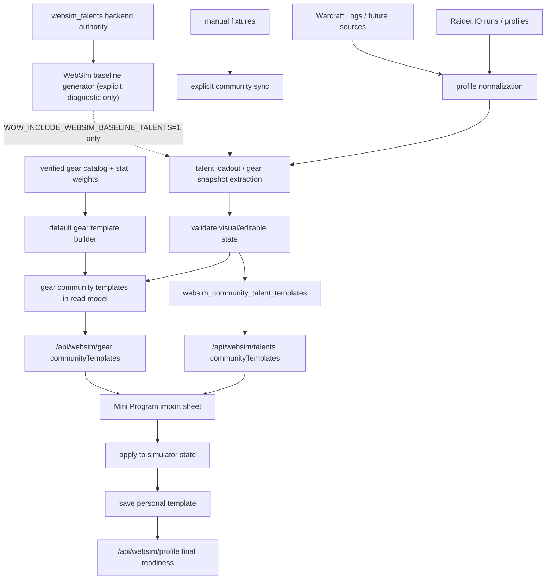

# 社区模板导入全链路 Runbook

> 适用范围：社区天赋模板、社区装备模板、Raider.IO / WCL / manual fixtures / WebSim baseline 诊断来源、PostgreSQL-only 入库、`communityTemplates` read model、前端导入 sheet、个人模板保存、`/api/websim/profile` 最终校验、health 和回滚。
> 最后更新：2026-07-04 CST。

本文是“导入社区天赋 / 装备推荐”的执行手册。它不重新定义天赋树规则，也不重新定义装备 catalog；这两部分分别由 [全职业天赋模拟全链路 Runbook](talent-simulation-full-chain-runbook.md) 和 [装备模拟全链路 Runbook](gear-simulation-full-chain-runbook.md) 负责。本文只管外部或派生模板如何进入推荐、展示、应用和保存链路。

## 总原则

- Source honesty：Raider.IO / WCL 是真实玩家样本；manual fixture 是开发/测试种子；WebSim baseline 是后端 authority 生成的诊断模板。生产线上天赋模板库只保留真实社区高端玩家来源，不得把 baseline 冒充成社区玩家样本。
- Backend authority：模板能否可视化、可编辑、可保存、可提交 SimC，最终都以后端 validator / serializer 为准。
- Consumer-only frontend：前端只展示和应用后端返回的 `communityTemplates`，不跨专精补模板，不猜装备槽位，不拼 SimC profile line。
- Hero-balanced slots：天赋模板展示按当前 `classKey + specKey` 收敛，每个专精固定返回 2 个英雄天赋槽位；每个英雄天赋最多 1 条真实社区 `verified` 模板，缺样本时返回 `pending_collection` 待采集槽位。
- Fail-closed import：无法解析成当前 WebSim 节点或 canonical gear snapshot 的模板不能标为可编辑；raw import code 只能走 SimC-only / external 路径。
- No talent fallback inventory：真实社区样本不足时，线上天赋模板库不再用 `websim_baseline` 填补当前库存；公开 read model 只用 `pending_collection` 暴露待采集槽位。`websim_baseline` 只允许显式设置 `WOW_INCLUDE_WEBSIM_BASELINE_TALENTS=1` 后用于本地/诊断。
- Default gear fallback：真实社区装备样本不足时，允许用 `default_template` 为每个 expected spec 生成 1 条装备兜底；它只来自 verified 当前赛季 catalog 和 verified `mplus_mixed_route` 绿字权重，不冒充真实社区样本，不宣称 BiS。
- No implicit writes：`GET /api/websim/talents`、`GET /api/websim/gear`、`/api/data/health` 都不得触发外部同步或 DB 写入。
- Approval gate：下载、远端刷新、生产 DB 写入、部署和外部数据落盘都需要 owner 明确批准。

## 端到端链路



关键点：

- 社区模板是推荐输入，不是规则真相。
- 天赋可编辑模板必须有 `websimExportCode` 和 `talentState.selectedNodes`。
- 装备可编辑模板必须能映射到 canonical slots 和结构化 `gearBySlot / enhancementBySlot`。
- baseline 只保留为本地/诊断能力，不代表线上库存、BiS、排行榜、玩家样本或强度结论。
- `default_template` 只解决“装备模拟可导入起点”，不代表真实玩家样本、社区强度或毕业配装。

## 来源与可信边界

| 来源 | 用途 | 可标为 verified 的条件 | 不可做的事 |
| --- | --- | --- | --- |
| Raider.IO profile / run | 真实玩家天赋和装备样本 | class/spec/hero/scenario 可归属；structured loadout 或 gear snapshot 可解析；去重后仍有可执行字段 | 不能把 profile API 的装备属性当成生产属性来源 |
| Warcraft Logs | 高质量战斗样本证据层和后续模板来源 | v2 OAuth 凭据可用、授权边界清楚、样本窗口可追踪；`wcl_exact_template` 必须能从 combatantinfo 确认同一模板签名，`wcl_character_supported` 只能说明同角色/同专精/相近时间窗有战斗记录支持 | 缺凭据或缺抽取能力时不得伪造 WCL 模板；只有同角色 WCL 记录但不能证明同一套天赋时，不得包装成 exact template |
| Manual fixture | 仅限本地开发 / 测试夹具 | 只有显式设置 `WOW_INCLUDE_MANUAL_FIXTURES=1` 时参与同步；带 source/status/checkedAt；能通过后端 validator | 不能进入生产默认同步、线上治理库存或小程序当前推荐列表 |
| WebSim baseline | 显式本地/诊断模板 | 只有显式设置 `WOW_INCLUDE_WEBSIM_BASELINE_TALENTS=1` 时参与同步；当前 `websim_talents` 能生成三树满点状态，且 `encode_websim_talents` 返回 encoded | 不能进入生产默认同步、线上治理库存或小程序当前推荐列表；不能参与玩家强度结论 |
| Default gear template | 缺真实装备模板专精的可导入兜底 | 16 个 canonical 装备槽完整、候选均为当前赛季 compatible + SimC-ready + verified variant，且 serializer 能生成 16 行 | 不能显示为 Raider.IO/WCL；不能使用 `source_reference`、partial、错季或缺绿字权重候选 |
| SimC raw `talents=` code | SimC-only external 输入 | class/spec 已知，raw code 保留原样，profile serializer 可 fail-closed | 不能强行反解到 WebSim 可视化节点 |
| 前端临时状态 | 交互预览 | 只作为待校验输入提交 | 不能作为可信模板或 SimC profile |

## 天赋导入契约

### 入库

`sync_community_talent_templates` 是唯一显式入库入口，当前默认来源：

- `raiderio`
- `warcraftlogs`

`manual_fixture` 已退为测试专用来源，仅在显式设置 `WOW_INCLUDE_MANUAL_FIXTURES=1` 时用于本地/测试同步，不属于生产当前模板来源。
`websim_baseline` 已退为本地/诊断专用来源，仅在显式设置 `WOW_INCLUDE_WEBSIM_BASELINE_TALENTS=1` 时用于本地/测试同步，不属于生产当前模板来源；生产 PG 同步会把 active `websim_baseline` 行标记过期。

Raider.IO 模板入库时必须在 PG writer 侧重新执行同一套 WebSim 校验，不能只信任上游 `status=verified` 或原始导入码字段。若 profile 当前 `talentLoadout.loadoutSpecId` 与 run roster 的 `classKey/specKey` 不一致，说明 Raider.IO profile-current 天赋属于角色当前另一专精，不属于本 run roster 的当前模板库存；新 Raider.IO payload 生成和 PG source 汇总都必须跳过该样本，只在 source warnings 记录诊断，不能写成 active blocked 模板。PG writer 仍保留同一 mismatch blocker 作为兜底，避免旧缓存或绕过 source 过滤的路径退化为冗长的 `unknown structured talent entry`。若 structured loadout 无法映射当前 `websim_talents` authority，或 `encode_websim_talents` 失败，必须把 `payload.blockers/errors/talentLoadoutParse/talentEncoding` 暴露给 admin gate，不能退化为“来源状态 blocked”。

每条模板入库前必须经过：

1. `normalize_community_talent_template`
2. structured loadout 解析到 WebSim 节点，或保留 raw external code
3. `encode_websim_talents`
4. signature 去重和 source refs 归并
5. `status=verified|blocked`

社区天赋同步的线上报告流水线必须保持可诊断分段：目标矩阵 -> 来源采集 -> 候选归档 -> 模板抽取 -> class/spec/hero 归属校验 -> authority 编码校验 -> 晋级/去重 -> coverage report。`sync_state.community_talent_templates.coverageMatrix` 固定以 40 专精 x 每专精 2 个英雄天赋槽位为目标矩阵；每个 slot 输出 `verified` / `pending_collection` / `blocked` / `skipped` 状态。`pending_collection` 只表示缺真实社区样本，不是错误；`blocked` 必须带 `stage` 和具体原因，例如 `source_collection`、`template_extraction`、`class_spec_hero_validation`、`authority_validation` 或 `authority_encoding`。

Raider.IO / WCL 等 source summary 必须分 source 输出 `candidateCount`、`verifiedCount`、`blockedCount`、`skippedCount`、`warningCount`、`errorCount`、`warnings`、`errors`、`gaps` 和 `blocked`。profile-current 专精不匹配属于 source inventory 阶段的 `skipped` warning，不得写成 active blocked 模板；缺 WCL combatantinfo/report 抽取能力属于 `template_extraction` gap。

80 个英雄槽位的采集路径以目标矩阵驱动，而不是只依赖全局高分榜自然覆盖。Raider.IO 可在 owner 批准后跨 `cn/tw/kr/us/eu` 等 region 扩采，但每条候选与最终模板必须保留 region、profile URL、run source 和 checkedAt provenance；跨区只扩大真实玩家样本池，不改变 `class/spec/hero` 精确归属、authority 编码校验、晋级去重和 fail-closed 语义。目标槽位没有真实样本或横向证据不足时仍保持 `pending_collection`，不得用其他 region、其他 hero 或系统生成模板强行补齐。

Raider.IO source payload 必须暴露 `targetMatrix`，按 class/spec 记录 `attemptedRunCount`、`profileCount`、`runDetailSnapshotCount`、`candidateCount` 和 `nextAction`，让补采队列从“全局 Top runs 自然出现了哪些职业”转为“每个专精还缺哪些真实样本”。当前同步器已接入 Raider.IO 网页 JSON 专精榜目标池：`GET https://raider.io/api/mythic-plus/rankings/specs?season=...&region=...&class=...&spec=...&page=...&pageSize=...`，由 `WOW_RAIDERIO_SPEC_RANKING_ENABLED=1` 显式开启，默认 `region=world`，并通过 `WOW_RAIDERIO_SPEC_RANKING_PAGES`、`WOW_RAIDERIO_SPEC_RANKING_PAGE_SIZE`、`WOW_RAIDERIO_SPEC_RANKING_RUNS_PER_CHARACTER` 控制采样预算。该端点只作为真实高分角色和 run id 发现入口；由于榜单行里的角色当前专精可能已经切换，模板本体仍必须优先取对应 run-detail 的 `talentLoadout` 结构化快照，再由 WebSim authority 校验 class/spec/hero 和编码。端点漂移、抽取失败、无 run-detail 或 authority 不匹配时只能进入 `errors` / `blocked` / `pending_collection`，不得退回全局 Top 角色池、不得用 profile-current 跨专精、不得跨 hero 借码。

WCL 证据只参与候选排序和来源说明，不绕过 WebSim authority。模板 payload 中的证据字段固定为：

- `rioEvidence`：Raider.IO run/profile/run-detail provenance、key 层数、样本量等。
- `wclEvidence`：`tier`、report/code、combatantinfo/template signature、冲突原因和归一化战斗表现。
- `evidenceTier`：`wcl_exact_template` > `wcl_character_supported` > `wcl_missing`，`wcl_conflict` / `wcl_blocked` 不得晋级为背书。
- `qualityScore`：已归一化后的质量分，只能在同 tier 或相邻候选中作为排序依据，不能直接用裸 DPS/HPS/承伤量。
- `promotionReason`：说明为什么该候选成为当前 class/spec/hero 的 promoted winner。

同一 `class/spec/hero` 晋级排序必须先看 WebSim 校验结果，再看 WCL evidence tier，再看归一化质量分、签名支持数、key 层数、样本量和更新时间。没有 WCL 记录的 Raider.IO 模板可以保持 `verified`，但必须显示为 Raider.IO-only / `wcl_missing`，优先级低于 WCL-backed 候选；最终文案应使用“证据排序推荐模板”或“WCL 背书模板”，不得把 WCL-supported 包装成绝对权威模板。

显式启用 `websim_baseline` 时的额外要求：

- 按当前 `WOW_CLASSES` 遍历 expected specs。
- 每个 spec 只生成默认 hero tree 的 1 条 baseline。
- 通过后端 authority 贪心选点，active 点数达到 `class=34 / spec=34 / hero=13`。
- hero granted root 不计入 purchased SimC line，但必须计入 active 点数。
- 任一树无法点满或 encoding 失败时，该 spec 的 baseline 为 blocked，不进入展示。
- 默认生产同步不得加载该来源；旧 active baseline 行必须过期，不得继续作为小程序可见模板。

### 读取

`GET /api/websim/talents` 必须：

- 只读 DB，不触发 sync。
- 按 `class_key + spec_key` 查询。
- DB 查询只消费 `status=verified` 的真实模板；read model 允许为缺口补 `pending_collection` 诊断槽位。
- 先按 talent signature 去重，再按公开展示身份去重。
- 按当前请求的 `hero` 优先排序两个英雄天赋槽位，其余英雄随后。
- 每个英雄天赋只返回 1 条真实样本，Raider.IO/WCL 等真实样本按 `canApplyVisual/maxKeyLevel/sampleCount/updatedAt` 优先；生产默认不返回 baseline 兜底。
- 缺真实社区样本的英雄天赋必须返回 `status=sourceStatus=pending_collection` 的待采集槽位，`canApplyVisual=false` 且 `canUseInSimc=false`。

公开展示身份至少包含：

- `sourceKey`
- `playerId` 或可见名称
- `classKey`
- `specKey`
- `heroKey`
- `scenarioKey`

### 前端

前端可以：

- 展示可编辑模板。
- 应用 `websimExportCode` 到当前天赋树。
- 如果模板目标 class/spec/hero 不同，先切换树再应用。

前端不能：

- 自行扩大到其他专精模板。
- 对 raw external code 伪造可编辑节点。
- 把 baseline 文案写成社区玩家样本。
- 绕过 `talentReadiness` 保存可执行模板。

## 装备导入契约

装备模板继续由 `/api/websim/gear` 输出 `communityTemplates`，并遵守装备模拟 Runbook 的 source / variant / mod-option 门禁。

### 默认装备模板

`sync_community_gear_templates` 的装备阶段顺序是：

1. 归档真实样本 / SimC preset 装备模板。
2. 读取 verified 当前赛季 gear catalog、verified `mplus_mixed_route` stat weight cache、武器规则和 mod option catalog。
3. 生成 `sourceKey=default_template`、`sourceName=默认模板` 的兜底模板。
4. 运行 `merge_websim_gear_enhancements` 和 SimC gear line serializer。
5. dedupe、入库、输出 health / run summary。

默认装备模板生成门禁：

- `status=complete` 只要求 16 个 canonical 装备槽完整且 serializer 可执行。
- 宝石、附魔、美化、`crafted_stats` 属于独立 `enhancementReadiness`，不得影响 16 槽完整性的定义。
- 缺绿字权重、缺 verified 当前赛季候选、候选为 `source_reference` / partial / blocked / 错季、武器规则失败或 serializer 失败时，不生成默认模板。
- blocker 必须写入 sync run 的 `gear.defaultTemplates.blockers`，包含 class/spec、原因、缺失槽位和补齐路径。
- 评分使用“装等护栏 + 绿字权重”：装等跨档保护高装等，同档或接近装等内按副属性权重排序。
- 饰品必须补满两槽，但 `templateEvidence.warnings` 必须说明 `trinket effects are not optimized`。
- 坦克、治疗、增辉等非纯 DPS 专精可用 M+ mixed-route 权重做副属性排序，但必须说明这不是生存、治疗量或团队收益最优结论。

默认模板证据审计口径：

- `/api/data/health` 只读输出 `community_templates.details.templateEvidenceAudit`；审计不得触发 Raider.IO/WCL/SimC/LLM，不写库，也不改变 `community_templates` 既有红绿语义。
- `defaultGear` 是默认装备模板证据链：只把 `mplus_mixed_route` stat weight 作为解锁门禁；`mplus_single_boss` 和 `mplus_aoe_pack` 只可作为旁路诊断，不阻断默认模板。
- `defaultGear.matrix[*].firstBlockingGate` 只能指向 `statWeightGate`、`gearCandidateGate`、`enhancementGate` 或 `serializerGate`；前置未通过时，后续 gate 必须是 `not_reached`，若审计旁路观察到了候选槽位状态，只能放入 `diagnostic`。
- `defaultGear.statWeightBlockerMatrix` 是 owner-facing 的紧凑矩阵，只能包含 spec、status、原因分类、聚合 counts 和 `nextAction`，不得输出玩家 URL、完整 profile、secret 或可直接执行的危险命令。
- `realCommunityGear` 只统计 Raider.IO/WCL/SimC preset/observed profile 等真实装备样本；`default_template` 不得填平真实社区装备样本缺口。
- `communityTalent` 必须以真实社区天赋模板为线上库存口径；`websim_baseline` 只可作为显式本地/诊断线索，不能填平真实社区天赋样本缺口。
- `sourceDependencies.warcraftlogs.status` 只作为独立 source dependency 展示，不复制成 40 个 spec blocker；`missing_credentials` 表示 key 未配置，`partial` 可表示 v2 OAuth 已配置但缺 report evidence / combatantinfo 抽取。
- 审计 status 语义固定：`passed` = 实际检查并通过；`blocked` = 实际检查并确定阻断；`partial` = 有证据但不足以解锁；`not_reached` = builder 因前置 blocker 没走到该层；`diagnostic` = 审计旁路观察线索，不等于 builder 已通过。

噬灭 DH DungeonSlice 边界：

- 只有 stat weight profile 生成、且同时满足 `classKey=demonhunter`、`specKey=devourer`、`scenarioKey=mplus_mixed_route`、`fight_style=DungeonSlice` 时，才允许追加当前 SimC 接受的 `demonhunter.enable_dungeon_slice=1`。
- 追加项必须进入 stat weight payload 的 `validation.forcedOptions`，并与 `validation.simcBuild` 一起保留为审计证据。
- 玩家 SimC 模板任务、`/api/websim/profile`、默认装备模板 serializer、非噬灭 DH、非 mixed-route 场景都不得自动追加该选项。
- 如果 SimC 仍失败、没有成功 profile、权重不是 `verified`、或 forced option 未出现在 stat weight validation，默认装备模板必须继续 blocked。

装备导入必须：

- 只应用当前 class/spec 可用的 canonical slot。
- 保留 `gearBySlot` 与 `enhancementBySlot` 结构化快照。
- 对 observed-only、source-reference、partial variant 明确阻断或降级。
- 最终由 `merge_websim_gear_enhancements` 和 `/api/websim/profile` 重新校验。

装备导入不能：

- 直接信任 Raider.IO/WCL 装备属性。
- 把缺 `bonus_id/gem_id/enchant_id/crafted_stats` 的展示候选保存为 SimC-ready。
- 前端按装备名、slot 文案或 item id 猜可执行字段。
- 把 `default_template` 包装成真实社区样本、排行榜推荐或 BiS 结论。

## 2026-06-29 生产验收快照

- `wow-stat-weights-sync.service` 与 `wow-community-template-sync.service` 已在云端完成，退出状态均为 `0`。
- 最新 stat-weight run：`acceptedCount=18`、`blockedCount=102`、`specCount=40`、`scenarioCount=3`、`raiderioStatus=synced`。
- `demonhunter:devourer + mplus_mixed_route` 已不再卡 DungeonSlice：`simcSuccessCount=3`、`simcErrorCount=0`、`forcedOptions=["demonhunter.enable_dungeon_slice=1"]`、`simcBuild=16b061b2d928`。
- 噬灭仍未解锁默认模板，因为 stat weight 状态是 `partial`，当前 blocker 是 LLM 翻译 guard：`translation_blocked: unexpected_llm_numbers: 37.19, 27.19`。
- `/api/data/health` 仍显示默认装备模板 `coveredSpecCount=0/40`；owner-facing top blockers 为 `stat_weight_blocked=34`、`stat_weight_partial=3`、`missing_simc_ready_gear_candidates=1`、`simc_dungeon_slice_disabled=1`（Vengeance）和 `translation_guard=1`（Devourer）。
- 噬灭的后续 `gearCandidateGate` 仍只作为 `diagnostic` 展示：当前可观察到 16 槽里 4 槽有 SimC-ready candidate，缺 `neck/back/wrist/waist/legs/feet/finger1/finger2/trinket1/trinket2/main_hand/off_hand`，但 builder 因 stat weight 前置未通过，所以该层必须保持 `not_reached`。

## 版本初期门禁待讨论

- 当前实现仍保持 fail-closed：缺 verified 证据时不生成默认装备模板，不把 `default_template` 冒充真实社区样本，不把 partial/stat diagnostic 包装成强结论。
- 但赛季或大版本初期，Raider.IO/WCL 样本、SimC-ready gear candidate、stat weights、talent catalog 可能天然不足；若所有用户可见能力都只认 `verified`，会造成大面积空白。
- 本轮已确认：这个担忧合理且有必要进入后续设计。强结论仍应 hard gate，尤其是 verified 默认装备模板、真实社区样本、BiS 和代表性样本；但页面存在、低风险浏览、可编辑起点和 owner 诊断不应天然等同于强结论。
- 后续讨论方向记录在 `docs/roadmap/ideas.md`：把门禁对象从“页面或能力是否存在”调整为“声明强度是否成立”，并考虑 `verified`、`provisional`、`diagnostic`、`blocked` readiness tiers。该方向尚未改变本 runbook 的默认模板解锁门禁。

## 2026-07-03 社区天赋覆盖矩阵生产快照与复测记录

- 热部署命令：`WOW_DEPLOY_SKIP_BOOTSTRAP=1 WOW_DEPLOY_START_ASYNC_SYNCS=0 ./server/deploy_lighthouse.sh`；部署脚本返回 `/health` OK，且没有自动启动长同步任务。
- 生产 runtime 确认：`wow-backend.service` 与 `wow-community-template-sync.service` 均为 `WOW_DATABASE_RUNTIME=postgres_only`；unit/env 未配置 `WOW_NEWS_DB` 或 SQLite runtime fallback。
- PostgreSQL 备份：`/opt/wow-mini-program/backups/community-template-coverage-20260703T133641Z/wow_test.dump`。
- 手动同步：`wow-community-template-sync.service` 本轮 `ExecStart` 退出 `status=0/SUCCESS`；`journalctl -u wow-community-template-sync` 本轮无 traceback；`syncRunId=pg-community-template-2026-07-03T133654z0000`。
- 旧 PG-only 同步缺口：2026-07-03 21:52 CST 的 `wow-community-template-sync.service` 只重投影旧 `cache.raiderio_cache`，本地墙钟 `6.806s`，新 `syncRunId=pg-community-template-2026-07-03T135228z0000`，coverage 数字未变化；根因是 PG-only `sync_community_template_cache_postgres()` 没有先刷新 Raider.IO，`sync_raiderio_cache_postgres()` 也只是重存旧 PG payload。
- 真实刷新复测：修复 PG-only Raider.IO refresh 后热部署，备份 `/opt/wow-mini-program/backups/community-template-real-refresh-20260703T140433Z/wow_test.dump`，2026-07-03 22:04 CST 手动启动 `wow-community-template-sync.service`，本地墙钟 `155.698s`，systemd `ExecMainStartTimestamp=22:04:32` / `ExecMainExitTimestamp=22:07:07`，服务 CPU time `6.988s`；新 `syncRunId=pg-community-template-2026-07-03T140432z0000`。Raider.IO cache 刷新到 `checkedAt=2026-07-03T14:04:32+00:00`，`runCount=500`、`profileCount=47`、`communityTemplates=41`，active 天赋模板变为 `40 verified / 1 blocked`，hero slot coverage 变为 `15 verified / 64 pending_collection / 1 blocked`；唯一 blocked 为 `warlock:demonology:diabolist`，原因 `authority_encoding: class talent points exceed cap: 35/34`。
- 晋级库存 + Raider.IO run-detail 复测：修复 active 表仍展示候选池的问题后，PG writer 只把每个 `class/spec/hero` 的 promoted winner 保持 active，候选池和横向比较证据留在 `validatedTemplates` 与 coverage matrix；Raider.IO source 额外抓取官方 `/api/v1/mythic-plus/run-details` 的 run-time `character.talentLoadout`，优先于 profile-current。2026-07-03 22:42:06 CST 手动启动 `wow-community-template-sync.service`，22:46:01 CST 结束，墙钟耗时 `235s`，systemd `Result=success`、`ExecMainStatus=0`、CPU time `9.214s`；本轮 `journalctl` 无 traceback。备份 `/opt/wow-mini-program/backups/community-template-promotion-rundetail-20260703T144152Z/wow_test.dump`，大小 `8208344` bytes；新 `syncRunId=pg-community-template-2026-07-03T144206z0000`。
- 晋级库存复测结果：active `templates.total=20 / verified=19 / blocked=1`；全部来自 Raider.IO，不含 `websim_baseline`、`manual_fixture` 或基础天赋目录来源。后台 `domain=talents` 返回 `20` 条当前模板；死亡骑士只剩 `1` 条 active verified（邪 DK / `rider_of_the_apocalypse`），不再显示 4 条天启邪候选。
- 晋级库存复测 Coverage matrix：`schemaRevision=community-talent-coverage-matrix-v1`，`totalSpecCount=40`，`totalHeroSlotCount=80`，`verifiedHeroSlotCount=19`，`pendingCollectionHeroSlotCount=60`，`blockedHeroSlotCount=1`，`completeSpecCount=1`，`partialSpecCount=17`；`warlock:demonology:diabolist` blocked，stage 为 `authority_encoding`，原因 `class talent points exceed cap: 35/34`。
- 晋级库存复测 Source summary：Raider.IO `candidateCount=47 / verifiedCount=46 / blockedCount=1 / skippedCount=0`，run-detail 覆盖 `requestedRunCount=21 / talentSnapshotCount=105`，基础样本 `runCount=500 / profileCount=47 / communityTemplates=47`；Warcraft Logs `candidateCount=0 / verifiedCount=0 / blockedCount=0 / errorCount=1`，当前 gap stage 为 `template_extraction`，原因是 v2 credentials 已配置但仍缺 combatantinfo 模板/report 抽取。
- 跨区全量采集复测：按 `WOW_RAIDERIO_REGIONS=cn,tw,kr,us,eu`、`WOW_RAIDERIO_RUN_DETAIL_LIMIT=240`、`WOW_RAIDERIO_RUN_DETAIL_LIMIT_PER_SPEC=4`、`WOW_RAIDERIO_COMMUNITY_TEMPLATE_LIMIT=240` 热部署后，备份 `/opt/wow-mini-program/backups/community-template-target-matrix-20260703T152127Z/wow_test.dump`（`8687944` bytes），2026-07-03 23:21:39 CST 手动启动 `wow-community-template-sync.service`，23:34:05 CST 结束，systemd 墙钟耗时 `746s`，`Result=success`、`ExecMainStatus=0`、CPU time `31.289s`；本轮 `journalctl` traceback 计数 `0`。新 `syncRunId=pg-community-template-2026-07-03T152139z0000`。
- 跨区复测天赋库存：active 表为 Raider.IO `32 verified / 1 blocked`；不含 `websim_baseline`、`manual_fixture` 或基础目录来源。覆盖从上一轮 `19 verified / 60 pending / 1 blocked` 提升到 `32 verified / 47 pending / 1 blocked`，新增 `13` 个 verified hero slot。
- 跨区复测 Coverage matrix：`totalSpecCount=40`，`totalHeroSlotCount=80`，`verifiedHeroSlotCount=32`，`pendingCollectionHeroSlotCount=47`，`blockedHeroSlotCount=1`，`completeSpecCount=4`，`partialSpecCount=24`。唯一 blocked slot 仍为 `warlock:demonology:diabolist`，stage 为 `authority_encoding`，原因 `class talent points exceed cap: 35/34`。
- 跨区复测 Source summary：Raider.IO `candidateCount=109 / verifiedCount=104 / blockedCount=5 / skippedCount=0`，`runCount=2500`，`profileCount=102`，`regions=["cn","tw","kr","us","eu"]`，run-detail 覆盖 `requestedRunCount=72 / talentSnapshotCount=359`，`specCoverage.coveredSpecCount=29`；Warcraft Logs `candidateCount=0 / verifiedCount=0 / blockedCount=0 / errorCount=1`，当前 gap stage 仍为 `template_extraction`，原因是 v2 credentials 已配置但仍缺 combatantinfo 模板/report 抽取。
- 跨区复测 region coverage：`cn=500 runs / 19 specs`，`tw=500 runs / 18 specs`，`kr=500 runs / 18 specs`，`us=500 runs / 21 specs`，`eu=500 runs / 16 specs`。2500 条高分 runs 后仍完全没出现在 run roster 的专精为 `deathknight:blood`、`demonhunter:havoc`、`druid:balance`、`druid:restoration`、`evoker:devastation`、`mage:fire`、`monk:windwalker`、`priest:holy`、`warlock:affliction`、`warlock:destruction`、`warrior:protection`。
- 跨区复测公网 smoke：`/health=200`、`/api/data/health=200`、`/admin/gates=200`；公开 40 专精矩阵检查结果为 `specs=40 / badLength=0 / verifiedSlots=32 / pendingSlots=48 / blockedSlots=0`，说明每个专精都稳定返回 2 个槽位，blocked 诊断不作为可导入模板暴露。死亡骑士当前为 `frost/deathbringer=verified`、`unholy/rider_of_the_apocalypse=verified`，`blood/deathbringer`、`blood/sanlayn`、`frost/rider_of_the_apocalypse`、`unholy/sanlayn` 保持 `pending_collection`，且均无 baseline/manual fixture。
- 阻断修复与分段 metrics 复测：`warlock:demonology:diabolist` 的真实 Raider.IO 候选为 `35/34/13` 点数；生成 SimC profile 后当前 `/opt/wow-simc/current/simc` 返回 `0`，说明旧阻断根因是后端 authority cap 仍按 `class=34` 校验，而不是上游伪造或错误 hero。已把 authority cap override 精确收敛到 `warlock:demonology -> class=35`，其它专精继续使用默认 `34/34/13`。
- 当前最新 per-spec ranking + structured run-detail 上线：部署命令仍为 `WOW_DEPLOY_SKIP_BOOTSTRAP=1 WOW_DEPLOY_START_ASYNC_SYNCS=0 ./server/deploy_lighthouse.sh`；生产 service 已开启 `WOW_RAIDERIO_SPEC_RANKING_ENABLED=1`、`WOW_RAIDERIO_SPEC_RANKING_REGIONS=world`、`WOW_RAIDERIO_SPEC_RANKING_PAGES=2`、`WOW_RAIDERIO_RUN_DETAIL_LIMIT=1400`、`WOW_RAIDERIO_RUN_DETAIL_LIMIT_PER_SPEC=32`、`WOW_RAIDERIO_TALENT_LOADOUT_LIMIT_PER_SPEC=24`。上线前备份 `/opt/wow-mini-program/backups/community-template-structured-run-detail-fix-20260704T012105Z/wow_test.dump`（`17099035` bytes），首次同步验证覆盖从 `33 verified / 47 pending public` 提升到 `53 verified / 27 pending public`。随后修复 verified active record 继承 blocked `sourceRefs.status` 的后台证据展示问题，备份 `/opt/wow-mini-program/backups/community-template-source-ref-fix-20260704T014537Z/wow_test.dump`（`23231448` bytes），重新同步刷新 PG active rows。
- 当前最新同步结果：2026-07-04 09:45:49 CST 手动启动 `wow-community-template-sync.service`，10:01:53 CST 结束，`Result=success`、`ExecMainStatus=0`、systemd CPU time `2min 49.093s`、memory peak `2.4G`、swap peak `1.1G`、本轮 `journalctl` traceback 计数 `0`。新 `syncRunId=pg-community-template-2026-07-04T014549z0000`，`stageTimings.totalDurationSeconds=963.478`。
- 当前最新 stage timings：`raiderio_runs=58.972s`（5 regions / 40 pages / 800 global runs）、`raiderio_spec_rankings=121.931s`（40 specs / 80 requests / 4000 characters / 3991 runs）、`raiderio_run_details=367.681s`（975 requested runs / 4836 talent snapshots）、`raiderio_base_profiles=213.424s`（960 profiles）、`raiderio_static=3.127s`、`raiderio_sync=769.658s`、`source_collection=807.568s`、`candidate_extraction=0.015s`（957 source candidates）、`validation_promotion_db_write=155.077s`（957 candidates / 57 promoted / 53 verified / 4 blocked）、`gear_template_sync=0.667s`、`coverage_report=0.015s`（80 slots / 53 verified / 23 pending / 4 blocked）和 `sync_state_write=0.063s`。
- 当前最新 Source summary：Raider.IO `candidateCount=957 / verifiedCount=883 / blockedCount=74 / skippedCount=0 / errorCount=0`，`runCount=4065`，`profileCount=960`，`regions=["cn","tw","kr","us","eu"]`，`specCoverage.coveredSpecCount=40`，target matrix `attemptedRunCount=7720 / verifiedHeroSlotCount=53 / pendingCollectionHeroSlotCount=23 / blockedHeroSlotCount=4`，run-detail 覆盖 `requestedRunCount=975 / talentSnapshotCount=4836`；Warcraft Logs `candidateCount=0 / verifiedCount=0 / blockedCount=0 / errorCount=1`，仍是 `template_extraction` gap，原因是 v2 credentials 已配置但缺 combatantinfo 模板/report 抽取。
- 当前最新库存与 coverage：active/promoted 天赋库存为 Raider.IO `53 verified / 4 blocked`，不含 `websim_baseline`、`manual_fixture`、`talent_tree`、fallback 或跨 hero 借码；PG `bad_source=0`，verified active records 的 `source_refs_json` 状态一致性检查 `verified_ref_mismatch=0`。coverage matrix 为 `totalSpecCount=40`、`totalHeroSlotCount=80`、`coveredHeroSlotCount=53`、`pendingCollectionHeroSlotCount=23`、`blockedHeroSlotCount=4`、`partiallyCoveredSpecCount=21`。公开消费路径把 4 个 blocked 也 fail-closed 成不可执行的 `pending_collection`，所以小程序 API 矩阵是 `53 verified / 27 pending_collection`。
- 当前最新公网、消费矩阵与后台 gates：`/health=200`、`/api/data/health=200`、`/admin/gates=200`；`/api/data/health` overall 仍为 `partial`，`talent_catalog` 为 `57 total / 53 verified / 4 blocked`，`community_templates` 为 `80 hero slots / 53 covered / 23 pending / 4 blocked`。公开 40 个 `/api/websim/talents?class=...&spec=...` payload 合计 `80` 个 `communityTemplates`，状态分布 `53 verified / 27 pending_collection`，`bad=[]`、`badApply=[]`、`suspicious=[]`；每个专精固定 2 槽，非 verified 槽位 `canApplyVisual=false` 且 `canUseInSimc=false`。admin gates API `domain=talents` 返回 `57` 条 records，状态 `53 verified / 4 blocked`，来源均为 Raider.IO，`evidenceTier=wcl_missing`；verified records 全部 `visibleToMiniProgram=true`，blocked records 全部不可见，`verifiedRefMismatches=0`。
- 当前 latest blocked root causes：`druid:restoration:keeper_of_the_grove` 来自 Raider.IO run-detail `Tigercat / loadoutSpecId=105 / heroSubTreeId=22`，阻断为 `template_extraction: missing WebSim talent state or external talents import code`；`warlock:affliction:soul_harvester` 来自 `Microlock / loadoutSpecId=265 / heroSubTreeId=57`，`warlock:destruction:hellcaller` 来自 `丶周杰伦灬 / loadoutSpecId=267 / heroSubTreeId=58`，`warlock:destruction:diabolist` 来自 `Ziggychomp / loadoutSpecId=267 / heroSubTreeId=59`，三者均为 `authority_encoding: class talent points exceed cap: 35/34`。这些 blocked 不进入公开可导入模板，只作为 gates/health 诊断。
- 当前缺口：公开待采集 `27` 槽，其中 `23` 是没有 verified/blocked active winner 的真实样本覆盖缺口，另 `4` 是上述 blocked 诊断。缺口列表：`deathknight:frost:rider_of_the_apocalypse`、`deathknight:unholy:sanlayn`、`demonhunter:vengeance:aldrachi_reaver`、`demonhunter:devourer:void_scarred`、`druid:guardian:druid_of_the_claw`、`druid:restoration:keeper_of_the_grove`、`druid:restoration:wildstalker`、`evoker:augmentation:chronowarden`、`hunter:survival:sentinel`、`mage:arcane:sunfury`、`mage:fire:frostfire`、`monk:brewmaster:shado_pan`、`monk:mistweaver:master_of_harmony`、`monk:windwalker:conduit_of_the_celestials`、`paladin:holy:lightsmith`、`paladin:protection:templar`、`paladin:retribution:herald_of_the_sun`、`priest:discipline:voidweaver`、`priest:shadow:archon`、`rogue:outlaw:fatebound`、`rogue:subtlety:deathstalker`、`shaman:restoration:farseer`、`warlock:affliction:hellcaller`、`warlock:affliction:soul_harvester`、`warlock:demonology:soul_harvester`、`warlock:destruction:hellcaller`、`warlock:destruction:diabolist`。
- 下一步：继续按 pending/blocked slot 做 hero-aware 深挖，而不再扩大无差别全局 Top；优先补齐 “有 per-spec 样本但缺目标 hero” 的长尾槽位，增加按 run-detail `heroSubTreeId` 分类后的二次翻页/region 预算；同时修复非恶魔术 warlock `35/34` cap 或确认其当前版本 authority 规则，补齐 restoration druid/monk 等 unknown structured nodes 到 WebSim authority；WCL 侧落地 combatantinfo/report extraction 后再把 `wcl_missing` 升级为 `wcl_exact_template` / `wcl_character_supported`，不得用 baseline、manual fixture、系统生成模板或跨 hero 借码填平。
- Gap-fill 深挖上线：2026-07-04 后续热部署新增 `WOW_RAIDERIO_SPEC_RANKING_GAP_FILL_ENABLED=1`、`WOW_RAIDERIO_SPEC_RANKING_GAP_FILL_PAGES=3`、`WOW_RAIDERIO_SPEC_RANKING_GAP_FILL_PAGE_SIZE=50`，并把 WebSim authority 的 warlock class cap override 扩展到 affliction / demonology / destruction 三专精的当前 `35/34/13` 规则。上线前备份 `/opt/wow-mini-program/backups/community-template-gap-fill-20260704T022709Z/wow_test.dump`（`23243088` bytes），手动运行 `wow-community-template-sync.service` 于 10:27:25 CST 启动、10:48:26 CST 结束，`Result=success`、`ExecMainStatus=0`、CPU time `189.092s`、memory peak `2453540864`、swap peak `0`、journal traceback `0`。
- Gap-fill stage timings：`stageTimings.totalDurationSeconds=1260.074`；base `raiderio_runs=49.929s`（5 regions / 40 pages / 800 runs）、base `raiderio_spec_rankings=118.575s`（40 specs / 80 requests / 4000 characters / 3991 runs）、base `raiderio_run_details=414.268s`（975 requested / 4836 snapshots）；gap-fill 只对缺第二 heroSubTree 的 `17` 个 spec 追加 `51` 个 spec-ranking requests（page 2-4），得到 `2539` runs / `2550` characters，再抓 `544` 个 gap run-detail、`2679` 个 snapshots；最终 `raiderio_base_profiles=205.177s`（960 profiles）、`validation_promotion_db_write=158.034s`（955 candidates / 57 promoted / 56 verified / 1 blocked）。
- Gap-fill Source summary：Raider.IO raw cache `runCount=6143`、`profileCount=960`、`communityTemplates=955`、source summary `candidateCount=955 / verifiedCount=929 / blockedCount=26 / skippedCount=0 / errorCount=0`，run-detail 总覆盖 `requestedRunCount=1519 / talentSnapshotCount=7515`；Warcraft Logs 仍 `candidateCount=0 / errorCount=1`，当前仍是缺 combatantinfo/report extraction 的 `template_extraction` gap，所有 public/admin records 的 evidence tier 仍为 `wcl_missing`。
- Gap-fill 库存、public matrix 与 admin gates：PG 未过期库存为 Raider.IO `56 verified / 1 blocked`，`bad_source=0`、`verified_ref_mismatch=0`；公开 `/api/websim/talents` 40 专精矩阵合计 `80` 个槽位，状态 `56 verified / 24 pending_collection`，`bad=[]`、`badApply=[]`、`suspicious=[]`，非 verified 均 `canApplyVisual=false` 且 `canUseInSimc=false`。`/health=200`、`/api/data/health=200`、`/admin/gates=200`；admin gates API `domain=talents` 返回 `57` records，`56 verified / 1 blocked`，来源均为 Raider.IO，verified 全部可见，blocked 不可见。Warlock 先前 3 个 `35/34` blocked 已解除并晋级/消费：`affliction:soul_harvester`、`destruction:hellcaller`、`destruction:diabolist` 均已 verified。
- Gap-fill 后最新缺口：公开待采集 `24` 槽，其中 `23` 是无 verified/blocked winner 的真实样本覆盖缺口，`1` 是 blocked 诊断。唯一 blocked 为 `druid:restoration:keeper_of_the_grove`，原因仍是 `template_extraction: missing WebSim talent state or external talents import code`。剩余 public pending 槽位：`deathknight:frost:rider_of_the_apocalypse`、`deathknight:unholy:sanlayn`、`demonhunter:vengeance:aldrachi_reaver`、`demonhunter:devourer:void_scarred`、`druid:guardian:druid_of_the_claw`、`druid:restoration:keeper_of_the_grove`、`druid:restoration:wildstalker`、`evoker:augmentation:chronowarden`、`hunter:survival:sentinel`、`mage:arcane:sunfury`、`mage:fire:frostfire`、`monk:brewmaster:shado_pan`、`monk:mistweaver:master_of_harmony`、`monk:windwalker:conduit_of_the_celestials`、`paladin:holy:lightsmith`、`paladin:protection:templar`、`paladin:retribution:herald_of_the_sun`、`priest:discipline:voidweaver`、`priest:shadow:archon`、`rogue:outlaw:fatebound`、`rogue:subtlety:deathstalker`、`shaman:restoration:farseer`、`warlock:affliction:hellcaller`、`warlock:demonology:soul_harvester`。

## 2026-07-04 hero-aware run-detail deep gap-fill v2 生产证据

- 本轮变更：run-detail candidate selection 改为 heroSubTree-aware，优先保留未覆盖的 `(spec, heroSubTreeId)`；已经携带完整 run-detail `talentLoadout` snapshot 的 run 不再重复消耗 run-detail 预算；gap-fill 深度从 page 2-4 扩展到 page 2-9，只对缺第二 heroSubTree 的 spec 追加采样。
- 热部署命令：`WOW_DEPLOY_SKIP_BOOTSTRAP=1 WOW_DEPLOY_START_ASYNC_SYNCS=0 ./server/deploy_lighthouse.sh`；上线前备份 `/opt/wow-mini-program/backups/community-template-run-detail-hero-aware-20260704T033411Z/wow_test.dump`（`23398084` bytes）。
- 手动同步：2026-07-04 11:34:24 CST 启动 `wow-community-template-sync.service`，11:58:45 CST 结束；`Result=success`、`ExecMainStatus=0`、CPU time `185.924s`、`journalctl` 本轮 traceback 计数 `0`；`syncRunId=pg-community-template-2026-07-04T033424z0000`。
- Stage timings：`stageTimings.totalDurationSeconds=1459.45`；base `raiderio_runs=58.887s`（800 runs）、base `raiderio_spec_rankings=116.818s`（80 requests / 4000 characters / 3993 runs）、base `raiderio_run_details=372.541s`（975 requested / 4836 snapshots）；gap-fill 对 `17` 个 spec 追加 `136` 个 spec-ranking requests（page 2-9），得到 `6800` characters / `6772` runs，再抓 `544` 个 gap run-detail、`2681` 个 snapshots；`candidate_extraction=0.013s`（951 candidates），`validation_promotion_db_write=151.515s`（69 promoted / 69 verified / 0 blocked）。
- Source summary：Raider.IO raw cache `runCount=9627`、`profileCount=960`、`communityTemplates=951`，source summary `candidateCount=951 / verifiedCount=946 / blockedCount=5`，target matrix 为 `69 verified / 11 pending_collection`；Warcraft Logs 仍为 `candidateCount=0 / wclEvidenceCount=0 / errorCount=1`，原因仍是缺 combatantinfo/report template extraction，本轮所有 promoted template 的 WCL 证据层仍为 `wcl_missing`。
- 库存、public matrix 与 admin gates：PG 未过期库存为 Raider.IO `69 verified / 0 blocked`，`bad_source=0`、`verified_ref_mismatch=0`。公开 40 专精 `/api/websim/talents` 合计 `80` 个 `communityTemplates`，状态 `69 verified / 11 pending_collection`，`bad=[]`、`badApply=[]`、`suspicious=[]`；非 verified 均 `canApplyVisual=false` 且 `canUseInSimc=false`，没有 `baseline`、`manual_fixture`、`fallback`、`stale`、`expired` 或跨 hero 借码。`/health=200`、`/api/data/health=200`、`/admin/gates=200`；admin gates API `domain=talents` 返回 `69` records，状态全部 `verified`，来源全部 Raider.IO，verified 全部可见。
- 当前剩余 public pending 槽位：`deathknight:unholy:sanlayn`、`druid:guardian:druid_of_the_claw`、`evoker:augmentation:chronowarden`、`hunter:survival:sentinel`、`monk:mistweaver:master_of_harmony`、`monk:windwalker:conduit_of_the_celestials`、`paladin:protection:templar`、`priest:discipline:voidweaver`、`rogue:outlaw:fatebound`、`shaman:restoration:farseer`、`warlock:demonology:soul_harvester`。
- 剩余缺口判断：9 个槽位在 page 2-9 的 Raider.IO 高分专精榜仍只观察到同专精主流 heroSubTree；`evoker:augmentation:chronowarden` 和 `paladin:protection:templar` 有 ranking/run 层 heroSubTree 线索，但未形成可通过 WebSim authority 的目标 hero 模板。继续填满 80 需要 WCL combatantinfo/report extraction 或更深的 Raider.IO 长尾采集；不能用 baseline、manual fixture、系统生成模板或跨 hero 借码补齐。

## 2026-07-04 missing_slots 只补未完成槽位 + active 去重生产证据

- 本轮变更：`sync_community_template_cache_postgres(mode="missing_slots")` 会先读取当前 80 槽 coverage，只把未 `verified` 的 `class/spec/hero` 槽位转成目标专精池；刷新期间临时设置 `WOW_RAIDERIO_RUN_PAGES=0` 和 `WOW_RAIDERIO_SPEC_RANKING_TARGET_SPECS=<target specs>`，避免每次补全都全量重跑全局 Top runs。PG writer 允许 `target_slot_ids`，只过期目标槽位中被替换的旧行；同时新增 active slot housekeeping，按 `class/spec/hero` 保留 1 条 active winner，其余重复 active 行 expire。
- 69 -> 77 覆盖推进摘要：区域 gap-fill 与两轮 `missing_slots` 后，公开矩阵从 `69 verified / 11 pending_collection` 推进到 `77 verified / 3 pending_collection / 0 blocked`。关键备份与运行包括 `/opt/wow-mini-program/backups/community-template-regional-gapfill-20260704T095826Z/wow_test.dump`（`24126631` bytes）、`/opt/wow-mini-program/backups/community-template-missing-slots-before-20260704T103847Z/wow_test.dump`（`24163836` bytes）、`/opt/wow-mini-program/backups/community-template-missing-slots-4-before-20260704T110138Z/wow_test.dump`（`15592502` bytes）和 `/opt/wow-mini-program/backups/community-template-missing-slots-3-before-20260704T112645Z/wow_test.dump`（`15577104` bytes）。这些轮次继续保持 `bad_source=0`，无 baseline/manual fixture/fallback/cross-hero。
- active 去重修复：补全后发现 PG active 行为 `80 verified records / 77 distinct slots`，重复槽位为 `druid:guardian:elunes_chosen`、`rogue:subtlety:trickster`、`warlock:affliction:soul_harvester`。热部署 active-slot housekeeping 后，先备份 `/opt/wow-mini-program/backups/community-template-active-slot-dedupe-20260704T114743Z/wow_test.dump`（`14669489` bytes），再按同一排序规则只 expire 重复行，实际 `expired=3`。
- 最新 targeted refresh：再次备份 `/opt/wow-mini-program/backups/community-template-missing-slots-refresh-before-20260704T114856Z/wow_test.dump`（`14669218` bytes），启动 transient `wow-community-template-sync-missing-refresh-194930.service`，2026-07-04 19:49:30 CST 开始、19:59:42 CST 结束，`Result=success`、`ExecMainStatus=0`、systemd CPU time `14.726s`、memory peak `340.7M`、swap peak `0`、journal traceback `0`；`syncRunId=pg-community-template-2026-07-04T114930z0000`，`stageTimings.totalDurationSeconds=612.101`。
- 最新 targeted stage timings：`source_collection=610.925s`，`targetMode=missing_slots`，`targetSlotCount=3`，`targetSpecCount=3`；base `raiderio_spec_rankings=16.96s`（3 specs / 6 requests / 300 characters / 300 runs），base `raiderio_run_details=37.401s`（70 requested / 344 snapshots）；gap-fill page 2-7 为 `90 requests / 4478 runs / 144 run-details / 709 snapshots`；extra page 66-71 为 `70 requests / 3292 runs / 144 run-details / 710 snapshots`；extra page 98-103 对 1 spec 为 `20 requests / 899 runs / 48 run-details / 236 snapshots`；`raiderio_base_profiles=22.047s`（72 profiles），`candidate_extraction=0.001s`（0 candidates），`validation_promotion_db_write=0.023s`（77 promoted / 77 verified / 0 blocked），`coverage_report=0.168s`。
- 最新验收：PG active 为 Raider.IO `77 verified / 0 blocked`，`bad_source=0`，distinct slot `77`，无重复 active slot。`/api/data/health` 为 `templates.total=77 / verified=77 / blocked=0`，coverage matrix 为 `80 hero slots / 77 verified / 3 pending_collection / 0 blocked`。公开 40 专精 `/api/websim/talents` 合计 `80` 个 `communityTemplates`，状态 `77 verified / 3 pending_collection`，`bad=[]`、`badApply=[]`、`suspicious=[]`；非 verified 均 `source=pending_collection`、`canApplyVisual=false`。`/health=200`、`/admin/gates=200`；admin gates API `domain=talents` 返回 `77` records、全部 `verified`、无重复 target。
- 当前剩余 public pending 槽位：`deathknight:unholy:sanlayn`、`mage:arcane:sunfury`、`monk:mistweaver:master_of_harmony`。本轮只跑这 3 个目标槽位，Raider.IO target matrix `attemptedRunCount=8969`，但 `candidate_extraction=0`，表示仍没有可通过 WebSim authority 的真实目标 hero 模板；Warcraft Logs 仍为 `template_extraction` gap，v2 credentials 已配置但缺 combatantinfo/template seed/report 抽取。继续填满 80 需要落地 WCL combatantinfo/report extraction 或继续更深、更贵的 Raider.IO 长尾采集，不得用 baseline、manual fixture、系统生成模板或跨 hero 借码补齐。

## 2026-07-04 Raider.IO import-code hero selector 补齐 80/80 生产证据

- 根因复盘：最后的 `deathknight:unholy:sanlayn` 不是缺 Raider.IO 职业专精定向入口；`/api/mythic-plus/rankings/specs` 可以按 `class/spec` 拉专精榜，但 Raider.IO 不提供 hero 服务端过滤。此前榜单行的 `talentLoadoutText` 只作为 raw Blizzard import code 留存，不能进入 WebSim authority 的结构化节点校验；run-detail 暴露的 `heroSubTreeId` 又会出现旧快照或跨 spec 误导，所以会错过真实 San'layn 或误判 Rider。
- 本轮变更：新增 Blizzard talent import code 解码，按 SimC `trait_data.inc` 的 nodeId 顺序解析 version、spec、tree hash、selected、rank 和 choice bits，恢复结构化 `loadout`；Raider.IO spec-ranking 行现在会用目标 `class/spec` 解码 raw import code，并以 selector node 精确识别 hero。DK Unholy selector 为 `nodeId=99820`，`entryId=123321` 对应 `sanlayn`，`entryId=123322` 对应 `rider_of_the_apocalypse`。晋级仍只经过 WebSim authority class/spec/hero 精确匹配、解析和编码，不允许 `websim_baseline`、`manual_fixture`、`talent_tree`、fallback 或跨 hero 借码。
- 只读发现证据：使用 Raider.IO world Unholy 专精榜定向搜索，`pageSize=100`，在 page `10` 命中 rank `1100`、score `4124.75` 的角色 `落花超颖`（CN Silver Hand，`/characters/cn/silver-hand/落花超颖`）；榜单 raw import code 解码为 `selector={"nodeId":99820,"entryId":123321,"heroSubTreeId":31,"heroKey":"sanlayn"}`，`loadoutCount=78`，相关 run 包含 keystoneRunId `35343052`、`37312506`、`36216838`。同一修复也验证了此前误判样本会被正确解码为 `rider_of_the_apocalypse`，不再假阳性成 San'layn。
- 生产执行：热部署使用 `WOW_DEPLOY_SKIP_BOOTSTRAP=1 WOW_DEPLOY_START_ASYNC_SYNCS=0 ./server/deploy_lighthouse.sh`；上线前备份 `/opt/wow-mini-program/backups/community-template-dk-sanlayn-import-before-20260704T142307Z/wow_test.dump`（`10856944` bytes），备份 unit `wow-pg-backup-dk-sanlayn-20260704T142307Z.service` 成功。随后启动 transient `wow-community-template-sync-dk-sanlayn-import-2224.service`，只跑 `missing_slots` 窄窗口，目标专精 `deathknight:unholy`，`WOW_RAIDERIO_RUN_PAGES=0`、`WOW_RAIDERIO_SPEC_RANKING_PAGES=12`、`WOW_RAIDERIO_SPEC_RANKING_PAGE_SIZE=100`、`WOW_RAIDERIO_RUN_DETAIL_LIMIT=0`、`WOW_RAIDERIO_PROFILE_LIMIT=1`。
- 同步结果：`syncRunId=pg-community-template-2026-07-04T142328z0000`，`status=completed`，`stageTimings.totalDurationSeconds=103.285`，systemd runtime `1min 43.520s`，CPU `6.666s`，journal traceback `0`。本轮 Raider.IO spec ranking 为 `12 requests / 1200 characters / 1191 runs`，profile fetch `1`，run-detail `0`；`candidate_extraction=0.001s`（1 candidate），`validation_promotion_db_write=0.243s`（80 promoted / 80 verified / 0 blocked），`coverage_report=0.134s`。`sourceStatus=partial` 仅来自 WCL 证据依赖仍 partial，不影响 Raider.IO verified 模板的公开门禁。
- 验收结果：`/health=200`、`/admin/gates=200`；`/api/data/health` 社区天赋为 `templates.total=80 / verified=80 / blocked=0`，coverage 为 `totalHeroSlotCount=80 / verifiedHeroSlotCount=80 / pendingCollectionHeroSlotCount=0 / blockedHeroSlotCount=0`，`pendingHeroSlots=[]`、`blockedHeroSlots=[]`。公开 40 专精 `/api/websim/talents` 合计 `80` 个 `communityTemplates`，状态全部 `verified`，来源 Raider.IO `78` + Warcraft Logs exact `2`，证据层 `wcl_missing=78` + `wcl_exact_template=2`，`badLength=[]`、`badApply=[]`、`suspicious=[]`；`deathknight:unholy:sanlayn` 为 Raider.IO verified，sourceUrl 指向上述 CN Silver Hand 角色，`canApplyVisual=true` 且 `canUseInSimc=true`。
- 后台 gates 一致性：同步后 `/admin/gates` talents records 为 `80 records / 80 verified / visible=80 / duplicateTargets=[] / badSources=[]`。同时修复 records 状态映射：`talents/community_talent_template` 的 record status 以模板本体 `status` 为准，WCL exact 模板即使 `sourceStatus=partial` 也显示 `verified/visible`；`sourceStatus` 仍保留来源依赖状态用于审计。

## 2026-07-04 80 槽补齐全路径复盘

这次 80 槽上线不是一次同步跑满，而是逐层拆清“缺样本、错归因、authority 阻断、读模型不一致、采集预算浪费”后收敛出来的路径：

1. 覆盖矩阵先行：把目标从“数据库里有多少模板”改成固定 `40 specs x 2 hero slots`，每槽输出 `verified / pending_collection / blocked / skipped`、stage、root cause 和 `nextAction`。这一步把黑盒 count 变成了可执行队列。
2. PG-only 真刷新：修复 `sync_community_template_cache_postgres()` 只重投影旧 PG cache、不刷新 Raider.IO payload 的问题；否则同步会很快成功但 coverage 不变。
3. Promoted winner 语义：active 库存从“候选池全写入”收敛为每个 `class/spec/hero` 只保留 1 条 active winner，候选和横向比较留在 sync state / source refs，避免后台看到多个同槽候选误判为已覆盖。
4. Run-detail 优先：Raider.IO profile-current 会被角色切专精污染；真实 run 的 `character.talentLoadout` 优先级高于 profile 当前状态，profile-current 专精不匹配只进入 source warning / skipped。
5. 跨区扩大样本：`cn/tw/kr/us/eu` 扩大真实玩家样本池，但仍按 `class/spec/hero` 精确晋级，不用跨区或跨 hero 借码。
6. Authority blocker 修复：`warlock:*` 当前版本存在 `35/34/13` 点数形态，经过 SimC 实测后只在对应专精加 cap override；blocked 被当作 authority 规则漂移诊断，而不是用假模板绕过。
7. Per-spec 目标池：主路径从全局 Top runs 改为 Raider.IO `/api/mythic-plus/rankings/specs` 职业专精榜，按目标专精发现高分角色和 run id。全局 Top 只会偏向国家队池，越到长尾越浪费。
8. Hero-aware deep gap-fill：用 run-detail `heroSubTreeId` 做二段缺口判断，只对缺第二 hero 的 spec 追加翻页、region 和 run-detail 预算。
9. Missing-slots 窄刷新：每次同步先读当前 coverage，只对未 verified 槽位设置 `WOW_RAIDERIO_SPEC_RANKING_TARGET_SPECS`，关闭全局 run 主路径，并只过期被替换的目标槽位。
10. Active-slot 去重：补齐后发现 `80 verified records / 77 distinct slots`，通过 PG writer active housekeeping 按 `class/spec/hero` 只保留一个 active winner。
11. WCL 补长尾：`mage:arcane:sunfury` 和 `monk:mistweaver:master_of_harmony` 通过 `wcl_exact_template` 进入 verified；WCL 只提供证据层和 exact template 来源，不替代 WebSim authority。
12. Import-code selector 收尾：最后的 DK San'layn 不是没有 Raider.IO 定向搜索，而是专精榜 raw `talentLoadoutText` 没有被解码。补上 Blizzard import code 解码后，直接从榜单 selector `entryId=123321` 精确识别 `sanlayn`，最终 `80/80`。

最终稳定路径应当固定为：coverage matrix 读当前缺口 -> `missing_slots` 生成目标 spec/hero 队列 -> Raider.IO per-spec ranking 抽 raw import code / run id -> 本地解码 import selector 并必要时抓 run-detail -> WebSim authority 精确验证 class/spec/hero 和编码 -> WCL 证据分层排序 -> 每槽 promoted winner 入库 -> public matrix/admin gates/health 三面对账。

## 后续优化方向：查漏补缺

- 把 import-code 解码前置为第一优先级。对 Raider.IO spec-ranking 行先解 raw import code、判定 hero selector、class/spec 和基础 loadout 完整性；只有 raw code 缺失或解码失败时再花预算抓 run-detail/profile。最后一槽证明这条路径比深翻 run-detail 更便宜。
- 让 `missing_slots` 变成可续跑游标队列。每个 `class/spec/hero/region/page` 记录 `lastScannedPage`、`lastCandidateRank`、`lastObservedHero`、`stopReason`、`nextBudget`，下一轮从未扫描窗口继续，而不是重复 page 2-7、66-71、98-103 这类手工窗口。
- 按 hero 稀有度自适应分配预算。先用前 N 页的 selector 分布估计目标 hero 出现概率；主流 hero 足够覆盖后立即停止，稀有 hero 才追加深页、跨 region 或 run-detail。预算应该跟 pending slot 绑定，而不是跟 spec 平均分配。
- 建立候选拒绝缓存。对已经解码过但 hero 不匹配、authority 编码失败、class/spec 不匹配或 source 已过期的 `profileUrl/importCode/runId` 写入短期 reject cache，避免下一次补缺重复验证同一无效样本。
- 把 WCL exact/support 接成补缺第二通道。Raider.IO 找到真实角色后，WCL 只对 pending slot 角色做 report/combatantinfo 抽取；`wcl_exact_template` 可直接竞争同槽 winner，`wcl_character_supported` 只做排序加权，`wcl_missing` 不阻断 Raider.IO verified。
- admin gates 应默认按 slot 汇总。records 继续保留模板 UUID 明细，但 owner 首屏应先按 `class/spec/hero` 显示 `winner / candidates / reject reasons / nextAction`，这样能第一眼看到“哪个槽没满、为什么没满、下一步扫哪里”。
- 固化一键验收脚本。把本轮手工跑的 `/api/data/health`、40 专精 `/api/websim/talents`、admin gates records、bad source / duplicate slot / canApply 检查沉淀成一个只读命令，作为每次 community-template sync 后的标准 smoke。
- 保持 fail-closed 但减少无效等待。`pending_collection` 继续表示真实样本缺口，不用 baseline/manual fixture/fallback 补；优化目标不是放松门禁，而是更快定位真实样本或更早确认“这个窗口找不到，下一步该换 WCL/region/depth”。

## Health 和验收

`/api/data/health` 的 `community_templates.details` 至少确认：

- `templates.total / verified / blocked`
- `sources.raiderio / warcraftlogs`；只有显式本地/诊断启用时才允许出现 `websim_baseline`
- `scanCoverage.totalSpecCount`
- `scanCoverage.coveredSpecCount`
- `scanCoverage.missingSpecs`
- `coverageMatrix.schemaRevision`
- `coverageMatrix.totalSpecCount / totalHeroSlotCount`
- `coverageMatrix.verifiedHeroSlotCount / pendingCollectionHeroSlotCount / blockedHeroSlotCount`
- `coverageMatrix.rows`
- `coverageMatrix.pendingHeroSlots / blockedHeroSlots / partialSpecs`
- `coverageMatrix.sourceSummary.raiderio / warcraftlogs`
- `dedupedCount`
- `hiddenDuplicateCount`
- `templateRevision`
- `gearTemplates`
- `realCommunityGearTemplates.coveredSpecCount`
- `realCommunityGearTemplates.missingSpecs`
- `defaultGearTemplates.coveredSpecCount`
- `defaultGearTemplates.missingSpecs`
- `defaultGearTemplates.blockers`
- `defaultGearTemplates.topBlockers`
- `defaultGearTemplates.lastSyncRun`
- `templateEvidenceAudit.schemaRevision`
- `templateEvidenceAudit.defaultGear.summary / matrix / statWeightBlockerMatrix`
- `templateEvidenceAudit.realCommunityGear.summary / matrix`
- `templateEvidenceAudit.communityTalent.summary / matrix`
- `templateEvidenceAudit.sourceDependencies.warcraftlogs`

上线验收必须跑：

```text
/health
/api/data/health
/api/websim/talents?class=deathknight&spec=unholy&hero=rider_of_the_apocalypse
/api/websim/talents?class=mage&spec=arcane&hero=spellslinger
/api/websim/talents?class=mage&spec=frost&hero=frostfire
/api/websim/gear?class=mage&spec=frost&compact=1
```

天赋 40 专精矩阵必须检查：

- `specsChecked == 40`
- 每个 expected spec 都返回稳定 payload，即使当前真实社区模板数为 0。
- 每个 spec 的 `communityTemplates.length == 2`，分别对应该专精的 2 个英雄天赋槽位。
- `pending_collection` 是真实社区样本覆盖缺口，必须进入 health / roadmap / owner 诊断口径；不能用 `websim_baseline`、`manual_fixture`、基础天赋目录或系统生成保底模板填平。
- 返回的 verified 模板不能跨职业、跨专精或跨英雄树；pending 槽位必须绑定缺样本的目标英雄天赋。
- 返回的模板不能有重复公开身份。
- 每条可编辑模板的 `websimExportCode` 可被 `/api/talents/validate` 编码。
- 生产默认 payload 和后台当前模板记录不得包含 `websim_baseline`、`manual_fixture` 或 `talent_tree` 基础目录。

装备矩阵必须检查：

- 当前 40 spec 的 `/api/websim/gear?compact=1` 可返回 payload。
- `communityTemplates` 不含跨职业 / 跨专精不兼容模板。
- `default_template` 若出现，必须带 `scenarioKey`、`enhancementReadiness`、`statWeightRevision`、`gearCatalogRevision` 和 `templateEvidence`。
- 缺证据专精必须出现在 `gear.defaultTemplates.missingSpecs` / blockers，而不是静默缺失。
- 可应用模板仍由 serializer 返回 `profileReadiness`。

## 只读审计 SQL

```sql
select source_key, source_status, status, count(*)
from cache.websim_community_talent_templates
where expires_at is null or expires_at > now()
group by source_key, source_status, status
order by source_key, source_status, status;

select class_key, spec_key, count(*) as verified_count
from cache.websim_community_talent_templates
where status = 'verified'
  and (expires_at is null or expires_at > now())
group by class_key, spec_key
order by class_key, spec_key;

select class_key, spec_key, source_key, count(*) as template_count
from cache.websim_community_talent_templates
where status = 'verified'
  and (expires_at is null or expires_at > now())
group by class_key, spec_key, source_key
order by class_key, spec_key, source_key;

select class_key, spec_key, hero_key, count(*) as active_count
from cache.websim_community_talent_templates
where status = 'verified'
  and (expires_at is null or expires_at > now())
group by class_key, spec_key, hero_key
having count(*) > 1
order by active_count desc, class_key, spec_key, hero_key;

select id, class_key, spec_key, hero_key, source_key, status, payload_json #>> '{baseline,complete}' as baseline_complete
from cache.websim_community_talent_templates
where source_key = 'websim_baseline'
  and (expires_at is null or expires_at > now())
order by class_key, spec_key;

select class_key, spec_key, source_key, source_name, status, ready_slot_count,
       payload_json #>> '{scenarioKey}' as scenario_key,
       payload_json #>> '{templateEvidence,statWeightRevision}' as stat_weight_revision
from cache.websim_community_gear_templates
where source_key = 'default_template'
  and (expires_at is null or expires_at > now())
order by class_key, spec_key;
```

## 刷新和发布顺序

1. 确认 owner 已批准外部刷新、生产写库和部署。
2. 备份当前 runtime 相关数据库：当前 `WOW_DATABASE_RUNTIME=postgres_only` 指向的 PostgreSQL target；如需读取历史 SQLite 迁移源，也先复制 SQLite 文件并记录路径。SQLite 备份不作为线上 fallback。
3. 先确认天赋和装备 authority 当前 health。
4. 显式运行社区模板同步：真实样本 / SimC preset 归档 -> 默认装备模板生成 -> dedupe -> health/run summary。
5. 只读审计 source/status/count。
6. 跑 40 专精天赋矩阵，确认真实社区模板覆盖、缺口、去重和错误专精情况；缺真实样本时记录 coverage gap，不用 baseline 兜底。
7. 跑装备 import smoke，并确认 `defaultGearTemplates` 覆盖或 blocker。
8. 代码热部署。
9. 公网 `/health` 和 `/api/data/health`。
10. 抽样小程序关键接口。
11. 把备份路径、模板计数、coverage 和 blockers 写回 roadmap。

## 回滚

- 代码回滚：回滚 `server/websim_payload.py`、前端 import sheet 相关文件和文档链接，然后热部署。
- DB 回滚：停止服务，按写入实际落点恢复 PostgreSQL 备份，重启服务，再跑 `/health` 和 `/api/data/health`。历史 SQLite 备份只能用于重新迁移或离线比对。
- 数据局部回滚：如旧同步或显式诊断误把 `websim_baseline` / `manual_fixture` 写回当前库存，可把对应 active 模板标记过期并重建 `community_talent_templates` sync state；执行前仍需备份。
