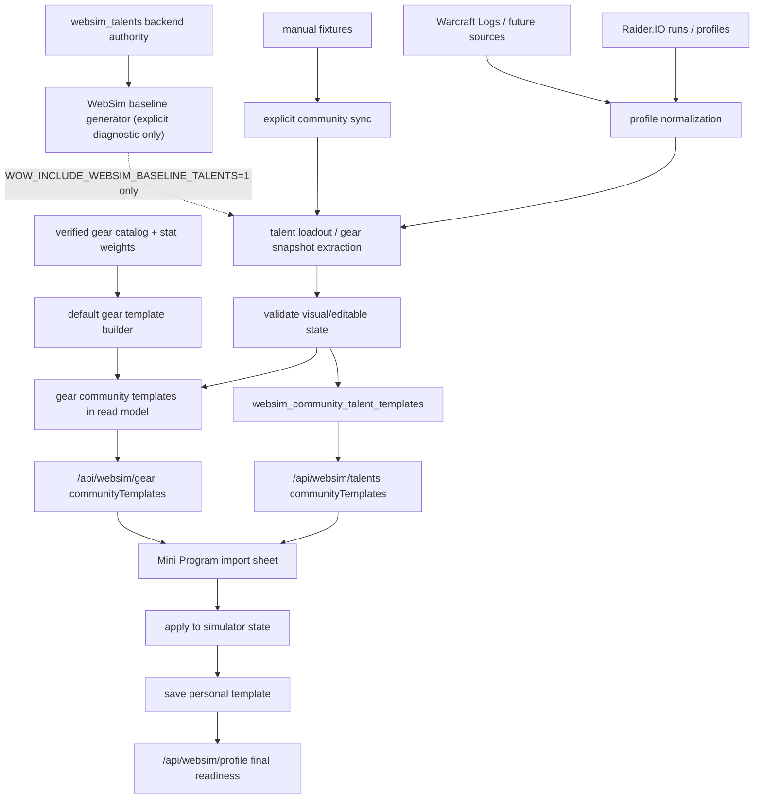

# 社区模板导入全链路 Runbook

> 适用范围：社区天赋模板、社区装备模板、Raider.IO / WCL / manual fixtures / WebSim baseline 诊断来源、PostgreSQL-only 入库、`communityTemplates` read model、前端导入 sheet、个人模板保存、`/api/websim/profile` 最终校验、health 和回滚。
> 最后更新：2026-07-04 CST。

本文是“导入社区天赋 / 装备推荐”的执行手册。它不重新定义天赋树规则，也不重新定义装备 catalog；这两部分分别由 [全职业天赋模拟全链路 Runbook](talent-simulation-full-chain-runbook.md) 和 [装备模拟全链路 Runbook](gear-simulation-full-chain-runbook.md) 负责。本文只管外部或派生模板如何进入推荐、展示、应用和保存链路。

## 总原则

- Source honesty：Raider.IO / WCL 是真实玩家样本；manual fixture 是开发/测试种子；WebSim baseline 是后端 authority 生成的诊断模板。生产线上天赋模板库只保留真实社区高端玩家来源，不得把 baseline 冒充成社区玩家样本。
- Backend authority：模板能否可视化、可编辑、可保存、可提交 SimC，最终都以后端 validator / serializer 为准。
- Consumer-only frontend：前端只展示和应用后端返回的 `communityTemplates`，不跨专精补模板，不猜装备槽位，不拼 SimC profile line。
- Hero-balanced slots：天赋模板展示按当前 `classKey + specKey` 收敛，每个专精固定返回 2 个英雄天赋槽位；每个英雄天赋最多 1 条真实社区 `verified` 模板，缺样本时返回 `pending_collection` 待采集槽位。
- Fail-closed import：无法解析成当前 WebSim 节点或 canonical gear snapshot 的模板不能标为可编辑；raw import code 只能走 SimC-only / external 路径。
- No talent fallback inventory：真实社区样本不足时，线上天赋模板库不再用 `websim_baseline` 填补当前库存；公开 read model 只用 `pending_collection` 暴露待采集槽位。`websim_baseline` 只允许显式设置 `WOW_INCLUDE_WEBSIM_BASELINE_TALENTS=1` 后用于本地/诊断。
- Default gear fallback：真实社区装备样本不足时，允许用 `default_template` 为每个 expected spec 生成 1 条装备兜底；它只来自 verified 当前赛季 catalog 和 verified `mplus_mixed_route` 绿字权重，不冒充真实社区样本，不宣称 BiS。
- No implicit writes：`GET /api/websim/talents`、`GET /api/websim/gear`、`/api/data/health` 都不得触发外部同步或 DB 写入。
- Approval gate：下载、远端刷新、生产 DB 写入、部署和外部数据落盘都需要 owner 明确批准。

## 端到端链路



关键点：

- 社区模板是推荐输入，不是规则真相。
- 天赋可编辑模板必须有 `websimExportCode` 和 `talentState.selectedNodes`。
- 装备可编辑模板必须能映射到 canonical slots 和结构化 `gearBySlot / enhancementBySlot`。
- baseline 只保留为本地/诊断能力，不代表线上库存、BiS、排行榜、玩家样本或强度结论。
- `default_template` 只解决“装备模拟可导入起点”，不代表真实玩家样本、社区强度或毕业配装。

## 来源与可信边界

| 来源 | 用途 | 可标为 verified 的条件 | 不可做的事 |
| --- | --- | --- | --- |
| Raider.IO profile / run | 真实玩家天赋和装备样本 | class/spec/hero/scenario 可归属；structured loadout 或 gear snapshot 可解析；去重后仍有可执行字段 | 不能把 profile API 的装备属性当成生产属性来源 |
| Warcraft Logs | 高质量战斗样本证据层和后续模板来源 | v2 OAuth 凭据可用、授权边界清楚、样本窗口可追踪；`wcl_exact_template` 必须能从 combatantinfo 确认同一模板签名，`wcl_character_supported` 只能说明同角色/同专精/相近时间窗有战斗记录支持 | 缺凭据或缺抽取能力时不得伪造 WCL 模板；只有同角色 WCL 记录但不能证明同一套天赋时，不得包装成 exact template |
| Manual fixture | 仅限本地开发 / 测试夹具 | 只有显式设置 `WOW_INCLUDE_MANUAL_FIXTURES=1` 时参与同步；带 source/status/checkedAt；能通过后端 validator | 不能进入生产默认同步、线上治理库存或小程序当前推荐列表 |
| WebSim baseline | 显式本地/诊断模板 | 只有显式设置 `WOW_INCLUDE_WEBSIM_BASELINE_TALENTS=1` 时参与同步；当前 `websim_talents` 能生成三树满点状态，且 `encode_websim_talents` 返回 encoded | 不能进入生产默认同步、线上治理库存或小程序当前推荐列表；不能参与玩家强度结论 |
| Default gear template | 缺真实装备模板专精的可导入兜底 | 16 个 canonical 装备槽完整、候选均为当前赛季 compatible + SimC-ready + verified variant，且 serializer 能生成 16 行 | 不能显示为 Raider.IO/WCL；不能使用 `source_reference`、partial、错季或缺绿字权重候选 |
| SimC raw `talents=` code | SimC-only external 输入 | class/spec 已知，raw code 保留原样，profile serializer 可 fail-closed | 不能强行反解到 WebSim 可视化节点 |
| 前端临时状态 | 交互预览 | 只作为待校验输入提交 | 不能作为可信模板或 SimC profile |

## 天赋导入契约

### 入库

`sync_community_talent_templates` 是唯一显式入库入口，当前默认来源：

- `raiderio`
- `warcraftlogs`

`manual_fixture` 已退为测试专用来源，仅在显式设置 `WOW_INCLUDE_MANUAL_FIXTURES=1` 时用于本地/测试同步，不属于生产当前模板来源。
`websim_baseline` 已退为本地/诊断专用来源，仅在显式设置 `WOW_INCLUDE_WEBSIM_BASELINE_TALENTS=1` 时用于本地/测试同步，不属于生产当前模板来源；生产 PG 同步会把 active `websim_baseline` 行标记过期。

Raider.IO 模板入库时必须在 PG writer 侧重新执行同一套 WebSim 校验，不能只信任上游 `status=verified` 或原始导入码字段。若 profile 当前 `talentLoadout.loadoutSpecId` 与 run roster 的 `classKey/specKey` 不一致，说明 Raider.IO profile-current 天赋属于角色当前另一专精，不属于本 run roster 的当前模板库存；新 Raider.IO payload 生成和 PG source 汇总都必须跳过该样本，只在 source warnings 记录诊断，不能写成 active blocked 模板。PG writer 仍保留同一 mismatch blocker 作为兜底，避免旧缓存或绕过 source 过滤的路径退化为冗长的 `unknown structured talent entry`。若 structured loadout 无法映射当前 `websim_talents` authority，或 `encode_websim_talents` 失败，必须把 `payload.blockers/errors/talentLoadoutParse/talentEncoding` 暴露给 admin gate，不能退化为“来源状态 blocked”。

每条模板入库前必须经过：

1. `normalize_community_talent_template`
2. structured loadout 解析到 WebSim 节点，或保留 raw external code
3. `encode_websim_talents`
4. signature 去重和 source refs 归并
5. `status=verified|blocked`

社区天赋同步的线上报告流水线必须保持可诊断分段：目标矩阵 -> 来源采集 -> 候选归档 -> 模板抽取 -> class/spec/hero 归属校验 -> authority 编码校验 -> 晋级/去重 -> coverage report。`sync_state.community_talent_templates.coverageMatrix` 固定以 40 专精 x 每专精 2 个英雄天赋槽位为目标矩阵；每个 slot 输出 `verified` / `pending_collection` / `blocked` / `skipped` 状态。`pending_collection` 只表示缺真实社区样本，不是错误；`blocked` 必须带 `stage` 和具体原因，例如 `source_collection`、`template_extraction`、`class_spec_hero_validation`、`authority_validation` 或 `authority_encoding`。

Raider.IO / WCL 等 source summary 必须分 source 输出 `candidateCount`、`verifiedCount`、`blockedCount`、`skippedCount`、`warningCount`、`errorCount`、`warnings`、`errors`、`gaps` 和 `blocked`。profile-current 专精不匹配属于 source inventory 阶段的 `skipped` warning，不得写成 active blocked 模板；缺 WCL combatantinfo/report 抽取能力属于 `template_extraction` gap。

80 个英雄槽位的采集路径以目标矩阵驱动，而不是只依赖全局高分榜自然覆盖。Raider.IO 可在 owner 批准后跨 `cn/tw/kr/us/eu` 等 region 扩采，但每条候选与最终模板必须保留 region、profile URL、run source 和 checkedAt provenance；跨区只扩大真实玩家样本池，不改变 `class/spec/hero` 精确归属、authority 编码校验、晋级去重和 fail-closed 语义。目标槽位没有真实样本或横向证据不足时仍保持 `pending_collection`，不得用其他 region、其他 hero 或系统生成模板强行补齐。

Raider.IO source payload 必须暴露 `targetMatrix`，按 class/spec 记录 `attemptedRunCount`、`profileCount`、`runDetailSnapshotCount`、`candidateCount` 和 `nextAction`，让补采队列从“全局 Top runs 自然出现了哪些职业”转为“每个专精还缺哪些真实样本”。当前同步器已接入 Raider.IO 网页 JSON 专精榜目标池：`GET https://raider.io/api/mythic-plus/rankings/specs?season=...&region=...&class=...&spec=...&page=...&pageSize=...`，由 `WOW_RAIDERIO_SPEC_RANKING_ENABLED=1` 显式开启，默认 `region=world`，并通过 `WOW_RAIDERIO_SPEC_RANKING_PAGES`、`WOW_RAIDERIO_SPEC_RANKING_PAGE_SIZE`、`WOW_RAIDERIO_SPEC_RANKING_RUNS_PER_CHARACTER` 控制采样预算。该端点只作为真实高分角色和 run id 发现入口；由于榜单行里的角色当前专精可能已经切换，模板本体仍必须优先取对应 run-detail 的 `talentLoadout` 结构化快照，再由 WebSim authority 校验 class/spec/hero 和编码。端点漂移、抽取失败、无 run-detail 或 authority 不匹配时只能进入 `errors` / `blocked` / `pending_collection`，不得退回全局 Top 角色池、不得用 profile-current 跨专精、不得跨 hero 借码。

WCL 证据只参与候选排序和来源说明，不绕过 WebSim authority。模板 payload 中的证据字段固定为：

- `rioEvidence`：Raider.IO run/profile/run-detail provenance、key 层数、样本量等。
- `wclEvidence`：`tier`、report/code、combatantinfo/template signature、冲突原因和归一化战斗表现。
- `evidenceTier`：`wcl_exact_template` > `wcl_character_supported` > `wcl_missing`，`wcl_conflict` / `wcl_blocked` 不得晋级为背书。
- `qualityScore`：已归一化后的质量分，只能在同 tier 或相邻候选中作为排序依据，不能直接用裸 DPS/HPS/承伤量。
- `promotionReason`：说明为什么该候选成为当前 class/spec/hero 的 promoted winner。

同一 `class/spec/hero` 晋级排序必须先看 WebSim 校验结果，再看 WCL evidence tier，再看归一化质量分、签名支持数、key 层数、样本量和更新时间。没有 WCL 记录的 Raider.IO 模板可以保持 `verified`，但必须显示为 Raider.IO-only / `wcl_missing`，优先级低于 WCL-backed 候选；最终文案应使用“证据排序推荐模板”或“WCL 背书模板”，不得把 WCL-supported 包装成绝对权威模板。

显式启用 `websim_baseline` 时的额外要求：

- 按当前 `WOW_CLASSES` 遍历 expected specs。
- 每个 spec 只生成默认 hero tree 的 1 条 baseline。
- 通过后端 authority 贪心选点，active 点数达到 `class=34 / spec=34 / hero=13`。
- hero granted root 不计入 purchased SimC line，但必须计入 active 点数。
- 任一树无法点满或 encoding 失败时，该 spec 的 baseline 为 blocked，不进入展示。
- 默认生产同步不得加载该来源；旧 active baseline 行必须过期，不得继续作为小程序可见模板。

### 读取

`GET /api/websim/talents` 必须：

- 只读 DB，不触发 sync。
- 按 `class_key + spec_key` 查询。
- DB 查询只消费 `status=verified` 的真实模板；read model 允许为缺口补 `pending_collection` 诊断槽位。
- 先按 talent signature 去重，再按公开展示身份去重。
- 按当前请求的 `hero` 优先排序两个英雄天赋槽位，其余英雄随后。
- 每个英雄天赋只返回 1 条真实样本，Raider.IO/WCL 等真实样本按 `canApplyVisual/maxKeyLevel/sampleCount/updatedAt` 优先；生产默认不返回 baseline 兜底。
- 缺真实社区样本的英雄天赋必须返回 `status=sourceStatus=pending_collection` 的待采集槽位，`canApplyVisual=false` 且 `canUseInSimc=false`。

公开展示身份至少包含：

- `sourceKey`
- `playerId` 或可见名称
- `classKey`
- `specKey`
- `heroKey`
- `scenarioKey`

### 前端

前端可以：

- 展示可编辑模板。
- 应用 `websimExportCode` 到当前天赋树。
- 如果模板目标 class/spec/hero 不同，先切换树再应用。

前端不能：

- 自行扩大到其他专精模板。
- 对 raw external code 伪造可编辑节点。
- 把 baseline 文案写成社区玩家样本。
- 绕过 `talentReadiness` 保存可执行模板。

## 装备导入契约

装备模板继续由 `/api/websim/gear` 输出 `communityTemplates`，并遵守装备模拟 Runbook 的 source / variant / mod-option 门禁。

### 默认装备模板

`sync_community_gear_templates` 的装备阶段顺序是：

1. 归档真实样本 / SimC preset 装备模板。
2. 读取 verified 当前赛季 gear catalog、verified `mplus_mixed_route` stat weight cache、武器规则和 mod option catalog。
3. 生成 `sourceKey=default_template`、`sourceName=默认模板` 的兜底模板。
4. 运行 `merge_websim_gear_enhancements` 和 SimC gear line serializer。
5. dedupe、入库、输出 health / run summary。

默认装备模板生成门禁：

- `status=complete` 只要求 16 个 canonical 装备槽完整且 serializer 可执行。
- 宝石、附魔、美化、`crafted_stats` 属于独立 `enhancementReadiness`，不得影响 16 槽完整性的定义。
- 缺绿字权重、缺 verified 当前赛季候选、候选为 `source_reference` / partial / blocked / 错季、武器规则失败或 serializer 失败时，不生成默认模板。
- blocker 必须写入 sync run 的 `gear.defaultTemplates.blockers`，包含 class/spec、原因、缺失槽位和补齐路径。
- 评分使用“装等护栏 + 绿字权重”：装等跨档保护高装等，同档或接近装等内按副属性权重排序。
- 饰品必须补满两槽，但 `templateEvidence.warnings` 必须说明 `trinket effects are not optimized`。
- 坦克、治疗、增辉等非纯 DPS 专精可用 M+ mixed-route 权重做副属性排序，但必须说明这不是生存、治疗量或团队收益最优结论。

默认模板证据审计口径：

- `/api/data/health` 只读输出 `community_templates.details.templateEvidenceAudit`；审计不得触发 Raider.IO/WCL/SimC/LLM，不写库，也不改变 `community_templates` 既有红绿语义。
- `defaultGear` 是默认装备模板证据链：只把 `mplus_mixed_route` stat weight 作为解锁门禁；`mplus_single_boss` 和 `mplus_aoe_pack` 只可作为旁路诊断，不阻断默认模板。
- `defaultGear.matrix[*].firstBlockingGate` 只能指向 `statWeightGate`、`gearCandidateGate`、`enhancementGate` 或 `serializerGate`；前置未通过时，后续 gate 必须是 `not_reached`，若审计旁路观察到了候选槽位状态，只能放入 `diagnostic`。
- `defaultGear.statWeightBlockerMatrix` 是 owner-facing 的紧凑矩阵，只能包含 spec、status、原因分类、聚合 counts 和 `nextAction`，不得输出玩家 URL、完整 profile、secret 或可直接执行的危险命令。
- `realCommunityGear` 只统计 Raider.IO/WCL/SimC preset/observed profile 等真实装备样本；`default_template` 不得填平真实社区装备样本缺口。
- `communityTalent` 必须以真实社区天赋模板为线上库存口径；`websim_baseline` 只可作为显式本地/诊断线索，不能填平真实社区天赋样本缺口。
- `sourceDependencies.warcraftlogs.status` 只作为独立 source dependency 展示，不复制成 40 个 spec blocker；`missing_credentials` 表示 key 未配置，`partial` 可表示 v2 OAuth 已配置但缺 report evidence / combatantinfo 抽取。
- 审计 status 语义固定：`passed` = 实际检查并通过；`blocked` = 实际检查并确定阻断；`partial` = 有证据但不足以解锁；`not_reached` = builder 因前置 blocker 没走到该层；`diagnostic` = 审计旁路观察线索，不等于 builder 已通过。

噬灭 DH DungeonSlice 边界：

- 只有 stat weight profile 生成、且同时满足 `classKey=demonhunter`、`specKey=devourer`、`scenarioKey=mplus_mixed_route`、`fight_style=DungeonSlice` 时，才允许追加当前 SimC 接受的 `demonhunter.enable_dungeon_slice=1`。
- 追加项必须进入 stat weight payload 的 `validation.forcedOptions`，并与 `validation.simcBuild` 一起保留为审计证据。
- 玩家 SimC 模板任务、`/api/websim/profile`、默认装备模板 serializer、非噬灭 DH、非 mixed-route 场景都不得自动追加该选项。
- 如果 SimC 仍失败、没有成功 profile、权重不是 `verified`、或 forced option 未出现在 stat weight validation，默认装备模板必须继续 blocked。

装备导入必须：

- 只应用当前 class/spec 可用的 canonical slot。
- 保留 `gearBySlot` 与 `enhancementBySlot` 结构化快照。
- 对 observed-only、source-reference、partial variant 明确阻断或降级。
- 最终由 `merge_websim_gear_enhancements` 和 `/api/websim/profile` 重新校验。

装备导入不能：

- 直接信任 Raider.IO/WCL 装备属性。
- 把缺 `bonus_id/gem_id/enchant_id/crafted_stats` 的展示候选保存为 SimC-ready。
- 前端按装备名、slot 文案或 item id 猜可执行字段。
- 把 `default_template` 包装成真实社区样本、排行榜推荐或 BiS 结论。

## 2026-06-29 生产验收快照

- `wow-stat-weights-sync.service` 与 `wow-community-template-sync.service` 已在云端完成，退出状态均为 `0`。
- 最新 stat-weight run：`acceptedCount=18`、`blockedCount=102`、`specCount=40`、`scenarioCount=3`、`raiderioStatus=synced`。
- `demonhunter:devourer + mplus_mixed_route` 已不再卡 DungeonSlice：`simcSuccessCount=3`、`simcErrorCount=0`、`forcedOptions=["demonhunter.enable_dungeon_slice=1"]`、`simcBuild=16b061b2d928`。
- 噬灭仍未解锁默认模板，因为 stat weight 状态是 `partial`，当前 blocker 是 LLM 翻译 guard：`translation_blocked: unexpected_llm_numbers: 37.19, 27.19`。
- `/api/data/health` 仍显示默认装备模板 `coveredSpecCount=0/40`；owner-facing top blockers 为 `stat_weight_blocked=34`、`stat_weight_partial=3`、`missing_simc_ready_gear_candidates=1`、`simc_dungeon_slice_disabled=1`（Vengeance）和 `translation_guard=1`（Devourer）。
- 噬灭的后续 `gearCandidateGate` 仍只作为 `diagnostic` 展示：当前可观察到 16 槽里 4 槽有 SimC-ready candidate，缺 `neck/back/wrist/waist/legs/feet/finger1/finger2/trinket1/trinket2/main_hand/off_hand`，但 builder 因 stat weight 前置未通过，所以该层必须保持 `not_reached`。

## 版本初期门禁待讨论

- 当前实现仍保持 fail-closed：缺 verified 证据时不生成默认装备模板，不把 `default_template` 冒充真实社区样本，不把 partial/stat diagnostic 包装成强结论。
- 但赛季或大版本初期，Raider.IO/WCL 样本、SimC-ready gear candidate、stat weights、talent catalog 可能天然不足；若所有用户可见能力都只认 `verified`，会造成大面积空白。
- 本轮已确认：这个担忧合理且有必要进入后续设计。强结论仍应 hard gate，尤其是 verified 默认装备模板、真实社区样本、BiS 和代表性样本；但页面存在、低风险浏览、可编辑起点和 owner 诊断不应天然等同于强结论。
- 后续讨论方向记录在 `docs/roadmap/ideas.md`：把门禁对象从“页面或能力是否存在”调整为“声明强度是否成立”，并考虑 `verified`、`provisional`、`diagnostic`、`blocked` readiness tiers。该方向尚未改变本 runbook 的默认模板解锁门禁。

## 2026-07-03 社区天赋覆盖矩阵生产快照与复测记录

- 热部署命令：`WOW_DEPLOY_SKIP_BOOTSTRAP=1 WOW_DEPLOY_START_ASYNC_SYNCS=0 ./server/deploy_lighthouse.sh`；部署脚本返回 `/health` OK，且没有自动启动长同步任务。
- 生产 runtime 确认：`wow-backend.service` 与 `wow-community-template-sync.service` 均为 `WOW_DATABASE_RUNTIME=postgres_only`；unit/env 未配置 `WOW_NEWS_DB` 或 SQLite runtime fallback。
- PostgreSQL 备份：`/opt/wow-mini-program/backups/community-template-coverage-20260703T133641Z/wow_test.dump`。
- 手动同步：`wow-community-template-sync.service` 本轮 `ExecStart` 退出 `status=0/SUCCESS`；`journalctl -u wow-community-template-sync` 本轮无 traceback；`syncRunId=pg-community-template-2026-07-03T133654z0000`。
- 旧 PG-only 同步缺口：2026-07-03 21:52 CST 的 `wow-community-template-sync.service` 只重投影旧 `cache.raiderio_cache`，本地墙钟 `6.806s`，新 `syncRunId=pg-community-template-2026-07-03T135228z0000`，coverage 数字未变化；根因是 PG-only `sync_community_template_cache_postgres()` 没有先刷新 Raider.IO，`sync_raiderio_cache_postgres()` 也只是重存旧 PG payload。
- 真实刷新复测：修复 PG-only Raider.IO refresh 后热部署，备份 `/opt/wow-mini-program/backups/community-template-real-refresh-20260703T140433Z/wow_test.dump`，2026-07-03 22:04 CST 手动启动 `wow-community-template-sync.service`，本地墙钟 `155.698s`，systemd `ExecMainStartTimestamp=22:04:32` / `ExecMainExitTimestamp=22:07:07`，服务 CPU time `6.988s`；新 `syncRunId=pg-community-template-2026-07-03T140432z0000`。Raider.IO cache 刷新到 `checkedAt=2026-07-03T14:04:32+00:00`，`runCount=500`、`profileCount=47`、`communityTemplates=41`，active 天赋模板变为 `40 verified / 1 blocked`，hero slot coverage 变为 `15 verified / 64 pending_collection / 1 blocked`；唯一 blocked 为 `warlock:demonology:diabolist`，原因 `authority_encoding: class talent points exceed cap: 35/34`。
- 晋级库存 + Raider.IO run-detail 复测：修复 active 表仍展示候选池的问题后，PG writer 只把每个 `class/spec/hero` 的 promoted winner 保持 active，候选池和横向比较证据留在 `validatedTemplates` 与 coverage matrix；Raider.IO source 额外抓取官方 `/api/v1/mythic-plus/run-details` 的 run-time `character.talentLoadout`，优先于 profile-current。2026-07-03 22:42:06 CST 手动启动 `wow-community-template-sync.service`，22:46:01 CST 结束，墙钟耗时 `235s`，systemd `Result=success`、`ExecMainStatus=0`、CPU time `9.214s`；本轮 `journalctl` 无 traceback。备份 `/opt/wow-mini-program/backups/community-template-promotion-rundetail-20260703T144152Z/wow_test.dump`，大小 `8208344` bytes；新 `syncRunId=pg-community-template-2026-07-03T144206z0000`。
- 晋级库存复测结果：active `templates.total=20 / verified=19 / blocked=1`；全部来自 Raider.IO，不含 `websim_baseline`、`manual_fixture` 或基础天赋目录来源。后台 `domain=talents` 返回 `20` 条当前模板；死亡骑士只剩 `1` 条 active verified（邪 DK / `rider_of_the_apocalypse`），不再显示 4 条天启邪候选。
- 晋级库存复测 Coverage matrix：`schemaRevision=community-talent-coverage-matrix-v1`，`totalSpecCount=40`，`totalHeroSlotCount=80`，`verifiedHeroSlotCount=19`，`pendingCollectionHeroSlotCount=60`，`blockedHeroSlotCount=1`，`completeSpecCount=1`，`partialSpecCount=17`；`warlock:demonology:diabolist` blocked，stage 为 `authority_encoding`，原因 `class talent points exceed cap: 35/34`。
- 晋级库存复测 Source summary：Raider.IO `candidateCount=47 / verifiedCount=46 / blockedCount=1 / skippedCount=0`，run-detail 覆盖 `requestedRunCount=21 / talentSnapshotCount=105`，基础样本 `runCount=500 / profileCount=47 / communityTemplates=47`；Warcraft Logs `candidateCount=0 / verifiedCount=0 / blockedCount=0 / errorCount=1`，当前 gap stage 为 `template_extraction`，原因是 v2 credentials 已配置但仍缺 combatantinfo 模板/report 抽取。
- 跨区全量采集复测：按 `WOW_RAIDERIO_REGIONS=cn,tw,kr,us,eu`、`WOW_RAIDERIO_RUN_DETAIL_LIMIT=240`、`WOW_RAIDERIO_RUN_DETAIL_LIMIT_PER_SPEC=4`、`WOW_RAIDERIO_COMMUNITY_TEMPLATE_LIMIT=240` 热部署后，备份 `/opt/wow-mini-program/backups/community-template-target-matrix-20260703T152127Z/wow_test.dump`（`8687944` bytes），2026-07-03 23:21:39 CST 手动启动 `wow-community-template-sync.service`，23:34:05 CST 结束，systemd 墙钟耗时 `746s`，`Result=success`、`ExecMainStatus=0`、CPU time `31.289s`；本轮 `journalctl` traceback 计数 `0`。新 `syncRunId=pg-community-template-2026-07-03T152139z0000`。
- 跨区复测天赋库存：active 表为 Raider.IO `32 verified / 1 blocked`；不含 `websim_baseline`、`manual_fixture` 或基础目录来源。覆盖从上一轮 `19 verified / 60 pending / 1 blocked` 提升到 `32 verified / 47 pending / 1 blocked`，新增 `13` 个 verified hero slot。
- 跨区复测 Coverage matrix：`totalSpecCount=40`，`totalHeroSlotCount=80`，`verifiedHeroSlotCount=32`，`pendingCollectionHeroSlotCount=47`，`blockedHeroSlotCount=1`，`completeSpecCount=4`，`partialSpecCount=24`。唯一 blocked slot 仍为 `warlock:demonology:diabolist`，stage 为 `authority_encoding`，原因 `class talent points exceed cap: 35/34`。
- 跨区复测 Source summary：Raider.IO `candidateCount=109 / verifiedCount=104 / blockedCount=5 / skippedCount=0`，`runCount=2500`，`profileCount=102`，`regions=["cn","tw","kr","us","eu"]`，run-detail 覆盖 `requestedRunCount=72 / talentSnapshotCount=359`，`specCoverage.coveredSpecCount=29`；Warcraft Logs `candidateCount=0 / verifiedCount=0 / blockedCount=0 / errorCount=1`，当前 gap stage 仍为 `template_extraction`，原因是 v2 credentials 已配置但仍缺 combatantinfo 模板/report 抽取。
- 跨区复测 region coverage：`cn=500 runs / 19 specs`，`tw=500 runs / 18 specs`，`kr=500 runs / 18 specs`，`us=500 runs / 21 specs`，`eu=500 runs / 16 specs`。2500 条高分 runs 后仍完全没出现在 run roster 的专精为 `deathknight:blood`、`demonhunter:havoc`、`druid:balance`、`druid:restoration`、`evoker:devastation`、`mage:fire`、`monk:windwalker`、`priest:holy`、`warlock:affliction`、`warlock:destruction`、`warrior:protection`。
- 跨区复测公网 smoke：`/health=200`、`/api/data/health=200`、`/admin/gates=200`；公开 40 专精矩阵检查结果为 `specs=40 / badLength=0 / verifiedSlots=32 / pendingSlots=48 / blockedSlots=0`，说明每个专精都稳定返回 2 个槽位，blocked 诊断不作为可导入模板暴露。死亡骑士当前为 `frost/deathbringer=verified`、`unholy/rider_of_the_apocalypse=verified`，`blood/deathbringer`、`blood/sanlayn`、`frost/rider_of_the_apocalypse`、`unholy/sanlayn` 保持 `pending_collection`，且均无 baseline/manual fixture。
- 阻断修复与分段 metrics 复测：`warlock:demonology:diabolist` 的真实 Raider.IO 候选为 `35/34/13` 点数；生成 SimC profile 后当前 `/opt/wow-simc/current/simc` 返回 `0`，说明旧阻断根因是后端 authority cap 仍按 `class=34` 校验，而不是上游伪造或错误 hero。已把 authority cap override 精确收敛到 `warlock:demonology -> class=35`，其它专精继续使用默认 `34/34/13`。
- 当前最新 per-spec ranking + structured run-detail 上线：部署命令仍为 `WOW_DEPLOY_SKIP_BOOTSTRAP=1 WOW_DEPLOY_START_ASYNC_SYNCS=0 ./server/deploy_lighthouse.sh`；生产 service 已开启 `WOW_RAIDERIO_SPEC_RANKING_ENABLED=1`、`WOW_RAIDERIO_SPEC_RANKING_REGIONS=world`、`WOW_RAIDERIO_SPEC_RANKING_PAGES=2`、`WOW_RAIDERIO_RUN_DETAIL_LIMIT=1400`、`WOW_RAIDERIO_RUN_DETAIL_LIMIT_PER_SPEC=32`、`WOW_RAIDERIO_TALENT_LOADOUT_LIMIT_PER_SPEC=24`。上线前备份 `/opt/wow-mini-program/backups/community-template-structured-run-detail-fix-20260704T012105Z/wow_test.dump`（`17099035` bytes），首次同步验证覆盖从 `33 verified / 47 pending public` 提升到 `53 verified / 27 pending public`。随后修复 verified active record 继承 blocked `sourceRefs.status` 的后台证据展示问题，备份 `/opt/wow-mini-program/backups/community-template-source-ref-fix-20260704T014537Z/wow_test.dump`（`23231448` bytes），重新同步刷新 PG active rows。
- 当前最新同步结果：2026-07-04 09:45:49 CST 手动启动 `wow-community-template-sync.service`，10:01:53 CST 结束，`Result=success`、`ExecMainStatus=0`、systemd CPU time `2min 49.093s`、memory peak `2.4G`、swap peak `1.1G`、本轮 `journalctl` traceback 计数 `0`。新 `syncRunId=pg-community-template-2026-07-04T014549z0000`，`stageTimings.totalDurationSeconds=963.478`。
- 当前最新 stage timings：`raiderio_runs=58.972s`（5 regions / 40 pages / 800 global runs）、`raiderio_spec_rankings=121.931s`（40 specs / 80 requests / 4000 characters / 3991 runs）、`raiderio_run_details=367.681s`（975 requested runs / 4836 talent snapshots）、`raiderio_base_profiles=213.424s`（960 profiles）、`raiderio_static=3.127s`、`raiderio_sync=769.658s`、`source_collection=807.568s`、`candidate_extraction=0.015s`（957 source candidates）、`validation_promotion_db_write=155.077s`（957 candidates / 57 promoted / 53 verified / 4 blocked）、`gear_template_sync=0.667s`、`coverage_report=0.015s`（80 slots / 53 verified / 23 pending / 4 blocked）和 `sync_state_write=0.063s`。
- 当前最新 Source summary：Raider.IO `candidateCount=957 / verifiedCount=883 / blockedCount=74 / skippedCount=0 / errorCount=0`，`runCount=4065`，`profileCount=960`，`regions=["cn","tw","kr","us","eu"]`，`specCoverage.coveredSpecCount=40`，target matrix `attemptedRunCount=7720 / verifiedHeroSlotCount=53 / pendingCollectionHeroSlotCount=23 / blockedHeroSlotCount=4`，run-detail 覆盖 `requestedRunCount=975 / talentSnapshotCount=4836`；Warcraft Logs `candidateCount=0 / verifiedCount=0 / blockedCount=0 / errorCount=1`，仍是 `template_extraction` gap，原因是 v2 credentials 已配置但缺 combatantinfo 模板/report 抽取。
- 当前最新库存与 coverage：active/promoted 天赋库存为 Raider.IO `53 verified / 4 blocked`，不含 `websim_baseline`、`manual_fixture`、`talent_tree`、fallback 或跨 hero 借码；PG `bad_source=0`，verified active records 的 `source_refs_json` 状态一致性检查 `verified_ref_mismatch=0`。coverage matrix 为 `totalSpecCount=40`、`totalHeroSlotCount=80`、`coveredHeroSlotCount=53`、`pendingCollectionHeroSlotCount=23`、`blockedHeroSlotCount=4`、`partiallyCoveredSpecCount=21`。公开消费路径把 4 个 blocked 也 fail-closed 成不可执行的 `pending_collection`，所以小程序 API 矩阵是 `53 verified / 27 pending_collection`。
- 当前最新公网、消费矩阵与后台 gates：`/health=200`、`/api/data/health=200`、`/admin/gates=200`；`/api/data/health` overall 仍为 `partial`，`talent_catalog` 为 `57 total / 53 verified / 4 blocked`，`community_templates` 为 `80 hero slots / 53 covered / 23 pending / 4 blocked`。公开 40 个 `/api/websim/talents?class=...&spec=...` payload 合计 `80` 个 `communityTemplates`，状态分布 `53 verified / 27 pending_collection`，`bad=[]`、`badApply=[]`、`suspicious=[]`；每个专精固定 2 槽，非 verified 槽位 `canApplyVisual=false` 且 `canUseInSimc=false`。admin gates API `domain=talents` 返回 `57` 条 records，状态 `53 verified / 4 blocked`，来源均为 Raider.IO，`evidenceTier=wcl_missing`；verified records 全部 `visibleToMiniProgram=true`，blocked records 全部不可见，`verifiedRefMismatches=0`。
- 当前 latest blocked root causes：`druid:restoration:keeper_of_the_grove` 来自 Raider.IO run-detail `Tigercat / loadoutSpecId=105 / heroSubTreeId=22`，阻断为 `template_extraction: missing WebSim talent state or external talents import code`；`warlock:affliction:soul_harvester` 来自 `Microlock / loadoutSpecId=265 / heroSubTreeId=57`，`warlock:destruction:hellcaller` 来自 `丶周杰伦灬 / loadoutSpecId=267 / heroSubTreeId=58`，`warlock:destruction:diabolist` 来自 `Ziggychomp / loadoutSpecId=267 / heroSubTreeId=59`，三者均为 `authority_encoding: class talent points exceed cap: 35/34`。这些 blocked 不进入公开可导入模板，只作为 gates/health 诊断。
- 当前缺口：公开待采集 `27` 槽，其中 `23` 是没有 verified/blocked active winner 的真实样本覆盖缺口，另 `4` 是上述 blocked 诊断。缺口列表：`deathknight:frost:rider_of_the_apocalypse`、`deathknight:unholy:sanlayn`、`demonhunter:vengeance:aldrachi_reaver`、`demonhunter:devourer:void_scarred`、`druid:guardian:druid_of_the_claw`、`druid:restoration:keeper_of_the_grove`、`druid:restoration:wildstalker`、`evoker:augmentation:chronowarden`、`hunter:survival:sentinel`、`mage:arcane:sunfury`、`mage:fire:frostfire`、`monk:brewmaster:shado_pan`、`monk:mistweaver:master_of_harmony`、`monk:windwalker:conduit_of_the_celestials`、`paladin:holy:lightsmith`、`paladin:protection:templar`、`paladin:retribution:herald_of_the_sun`、`priest:discipline:voidweaver`、`priest:shadow:archon`、`rogue:outlaw:fatebound`、`rogue:subtlety:deathstalker`、`shaman:restoration:farseer`、`warlock:affliction:hellcaller`、`warlock:affliction:soul_harvester`、`warlock:demonology:soul_harvester`、`warlock:destruction:hellcaller`、`warlock:destruction:diabolist`。
- 下一步：继续按 pending/blocked slot 做 hero-aware 深挖，而不再扩大无差别全局 Top；优先补齐 “有 per-spec 样本但缺目标 hero” 的长尾槽位，增加按 run-detail `heroSubTreeId` 分类后的二次翻页/region 预算；同时修复非恶魔术 warlock `35/34` cap 或确认其当前版本 authority 规则，补齐 restoration druid/monk 等 unknown structured nodes 到 WebSim authority；WCL 侧落地 combatantinfo/report extraction 后再把 `wcl_missing` 升级为 `wcl_exact_template` / `wcl_character_supported`，不得用 baseline、manual fixture、系统生成模板或跨 hero 借码填平。
- Gap-fill 深挖上线：2026-07-04 后续热部署新增 `WOW_RAIDERIO_SPEC_RANKING_GAP_FILL_ENABLED=1`、`WOW_RAIDERIO_SPEC_RANKING_GAP_FILL_PAGES=3`、`WOW_RAIDERIO_SPEC_RANKING_GAP_FILL_PAGE_SIZE=50`，并把 WebSim authority 的 warlock class cap override 扩展到 affliction / demonology / destruction 三专精的当前 `35/34/13` 规则。上线前备份 `/opt/wow-mini-program/backups/community-template-gap-fill-20260704T022709Z/wow_test.dump`（`23243088` bytes），手动运行 `wow-community-template-sync.service` 于 10:27:25 CST 启动、10:48:26 CST 结束，`Result=success`、`ExecMainStatus=0`、CPU time `189.092s`、memory peak `2453540864`、swap peak `0`、journal traceback `0`。
- Gap-fill stage timings：`stageTimings.totalDurationSeconds=1260.074`；base `raiderio_runs=49.929s`（5 regions / 40 pages / 800 runs）、base `raiderio_spec_rankings=118.575s`（40 specs / 80 requests / 4000 characters / 3991 runs）、base `raiderio_run_details=414.268s`（975 requested / 4836 snapshots）；gap-fill 只对缺第二 heroSubTree 的 `17` 个 spec 追加 `51` 个 spec-ranking requests（page 2-4），得到 `2539` runs / `2550` characters，再抓 `544` 个 gap run-detail、`2679` 个 snapshots；最终 `raiderio_base_profiles=205.177s`（960 profiles）、`validation_promotion_db_write=158.034s`（955 candidates / 57 promoted / 56 verified / 1 blocked）。
- Gap-fill Source summary：Raider.IO raw cache `runCount=6143`、`profileCount=960`、`communityTemplates=955`、source summary `candidateCount=955 / verifiedCount=929 / blockedCount=26 / skippedCount=0 / errorCount=0`，run-detail 总覆盖 `requestedRunCount=1519 / talentSnapshotCount=7515`；Warcraft Logs 仍 `candidateCount=0 / errorCount=1`，当前仍是缺 combatantinfo/report extraction 的 `template_extraction` gap，所有 public/admin records 的 evidence tier 仍为 `wcl_missing`。
- Gap-fill 库存、public matrix 与 admin gates：PG 未过期库存为 Raider.IO `56 verified / 1 blocked`，`bad_source=0`、`verified_ref_mismatch=0`；公开 `/api/websim/talents` 40 专精矩阵合计 `80` 个槽位，状态 `56 verified / 24 pending_collection`，`bad=[]`、`badApply=[]`、`suspicious=[]`，非 verified 均 `canApplyVisual=false` 且 `canUseInSimc=false`。`/health=200`、`/api/data/health=200`、`/admin/gates=200`；admin gates API `domain=talents` 返回 `57` records，`56 verified / 1 blocked`，来源均为 Raider.IO，verified 全部可见，blocked 不可见。Warlock 先前 3 个 `35/34` blocked 已解除并晋级/消费：`affliction:soul_harvester`、`destruction:hellcaller`、`destruction:diabolist` 均已 verified。
- Gap-fill 后最新缺口：公开待采集 `24` 槽，其中 `23` 是无 verified/blocked winner 的真实样本覆盖缺口，`1` 是 blocked 诊断。唯一 blocked 为 `druid:restoration:keeper_of_the_grove`，原因仍是 `template_extraction: missing WebSim talent state or external talents import code`。剩余 public pending 槽位：`deathknight:frost:rider_of_the_apocalypse`、`deathknight:unholy:sanlayn`、`demonhunter:vengeance:aldrachi_reaver`、`demonhunter:devourer:void_scarred`、`druid:guardian:druid_of_the_claw`、`druid:restoration:keeper_of_the_grove`、`druid:restoration:wildstalker`、`evoker:augmentation:chronowarden`、`hunter:survival:sentinel`、`mage:arcane:sunfury`、`mage:fire:frostfire`、`monk:brewmaster:shado_pan`、`monk:mistweaver:master_of_harmony`、`monk:windwalker:conduit_of_the_celestials`、`paladin:holy:lightsmith`、`paladin:protection:templar`、`paladin:retribution:herald_of_the_sun`、`priest:discipline:voidweaver`、`priest:shadow:archon`、`rogue:outlaw:fatebound`、`rogue:subtlety:deathstalker`、`shaman:restoration:farseer`、`warlock:affliction:hellcaller`、`warlock:demonology:soul_harvester`。

## 2026-07-04 hero-aware run-detail deep gap-fill v2 生产证据

- 本轮变更：run-detail candidate selection 改为 heroSubTree-aware，优先保留未覆盖的 `(spec, heroSubTreeId)`；已经携带完整 run-detail `talentLoadout` snapshot 的 run 不再重复消耗 run-detail 预算；gap-fill 深度从 page 2-4 扩展到 page 2-9，只对缺第二 heroSubTree 的 spec 追加采样。
- 热部署命令：`WOW_DEPLOY_SKIP_BOOTSTRAP=1 WOW_DEPLOY_START_ASYNC_SYNCS=0 ./server/deploy_lighthouse.sh`；上线前备份 `/opt/wow-mini-program/backups/community-template-run-detail-hero-aware-20260704T033411Z/wow_test.dump`（`23398084` bytes）。
- 手动同步：2026-07-04 11:34:24 CST 启动 `wow-community-template-sync.service`，11:58:45 CST 结束；`Result=success`、`ExecMainStatus=0`、CPU time `185.924s`、`journalctl` 本轮 traceback 计数 `0`；`syncRunId=pg-community-template-2026-07-04T033424z0000`。
- Stage timings：`stageTimings.totalDurationSeconds=1459.45`；base `raiderio_runs=58.887s`（800 runs）、base `raiderio_spec_rankings=116.818s`（80 requests / 4000 characters / 3993 runs）、base `raiderio_run_details=372.541s`（975 requested / 4836 snapshots）；gap-fill 对 `17` 个 spec 追加 `136` 个 spec-ranking requests（page 2-9），得到 `6800` characters / `6772` runs，再抓 `544` 个 gap run-detail、`2681` 个 snapshots；`candidate_extraction=0.013s`（951 candidates），`validation_promotion_db_write=151.515s`（69 promoted / 69 verified / 0 blocked）。
- Source summary：Raider.IO raw cache `runCount=9627`、`profileCount=960`、`communityTemplates=951`，source summary `candidateCount=951 / verifiedCount=946 / blockedCount=5`，target matrix 为 `69 verified / 11 pending_collection`；Warcraft Logs 仍为 `candidateCount=0 / wclEvidenceCount=0 / errorCount=1`，原因仍是缺 combatantinfo/report template extraction，本轮所有 promoted template 的 WCL 证据层仍为 `wcl_missing`。
- 库存、public matrix 与 admin gates：PG 未过期库存为 Raider.IO `69 verified / 0 blocked`，`bad_source=0`、`verified_ref_mismatch=0`。公开 40 专精 `/api/websim/talents` 合计 `80` 个 `communityTemplates`，状态 `69 verified / 11 pending_collection`，`bad=[]`、`badApply=[]`、`suspicious=[]`；非 verified 均 `canApplyVisual=false` 且 `canUseInSimc=false`，没有 `baseline`、`manual_fixture`、`fallback`、`stale`、`expired` 或跨 hero 借码。`/health=200`、`/api/data/health=200`、`/admin/gates=200`；admin gates API `domain=talents` 返回 `69` records，状态全部 `verified`，来源全部 Raider.IO，verified 全部可见。
- 当前剩余 public pending 槽位：`deathknight:unholy:sanlayn`、`druid:guardian:druid_of_the_claw`、`evoker:augmentation:chronowarden`、`hunter:survival:sentinel`、`monk:mistweaver:master_of_harmony`、`monk:windwalker:conduit_of_the_celestials`、`paladin:protection:templar`、`priest:discipline:voidweaver`、`rogue:outlaw:fatebound`、`shaman:restoration:farseer`、`warlock:demonology:soul_harvester`。
- 剩余缺口判断：9 个槽位在 page 2-9 的 Raider.IO 高分专精榜仍只观察到同专精主流 heroSubTree；`evoker:augmentation:chronowarden` 和 `paladin:protection:templar` 有 ranking/run 层 heroSubTree 线索，但未形成可通过 WebSim authority 的目标 hero 模板。继续填满 80 需要 WCL combatantinfo/report extraction 或更深的 Raider.IO 长尾采集；不能用 baseline、manual fixture、系统生成模板或跨 hero 借码补齐。

## 2026-07-04 missing_slots 只补未完成槽位 + active 去重生产证据

- 本轮变更：`sync_community_template_cache_postgres(mode="missing_slots")` 会先读取当前 80 槽 coverage，只把未 `verified` 的 `class/spec/hero` 槽位转成目标专精池；刷新期间临时设置 `WOW_RAIDERIO_RUN_PAGES=0` 和 `WOW_RAIDERIO_SPEC_RANKING_TARGET_SPECS=<target specs>`，避免每次补全都全量重跑全局 Top runs。PG writer 允许 `target_slot_ids`，只过期目标槽位中被替换的旧行；同时新增 active slot housekeeping，按 `class/spec/hero` 保留 1 条 active winner，其余重复 active 行 expire。
- 69 -> 77 覆盖推进摘要：区域 gap-fill 与两轮 `missing_slots` 后，公开矩阵从 `69 verified / 11 pending_collection` 推进到 `77 verified / 3 pending_collection / 0 blocked`。关键备份与运行包括 `/opt/wow-mini-program/backups/community-template-regional-gapfill-20260704T095826Z/wow_test.dump`（`24126631` bytes）、`/opt/wow-mini-program/backups/community-template-missing-slots-before-20260704T103847Z/wow_test.dump`（`24163836` bytes）、`/opt/wow-mini-program/backups/community-template-missing-slots-4-before-20260704T110138Z/wow_test.dump`（`15592502` bytes）和 `/opt/wow-mini-program/backups/community-template-missing-slots-3-before-20260704T112645Z/wow_test.dump`（`15577104` bytes）。这些轮次继续保持 `bad_source=0`，无 baseline/manual fixture/fallback/cross-hero。
- active 去重修复：补全后发现 PG active 行为 `80 verified records / 77 distinct slots`，重复槽位为 `druid:guardian:elunes_chosen`、`rogue:subtlety:trickster`、`warlock:affliction:soul_harvester`。热部署 active-slot housekeeping 后，先备份 `/opt/wow-mini-program/backups/community-template-active-slot-dedupe-20260704T114743Z/wow_test.dump`（`14669489` bytes），再按同一排序规则只 expire 重复行，实际 `expired=3`。
- 最新 targeted refresh：再次备份 `/opt/wow-mini-program/backups/community-template-missing-slots-refresh-before-20260704T114856Z/wow_test.dump`（`14669218` bytes），启动 transient `wow-community-template-sync-missing-refresh-194930.service`，2026-07-04 19:49:30 CST 开始、19:59:42 CST 结束，`Result=success`、`ExecMainStatus=0`、systemd CPU time `14.726s`、memory peak `340.7M`、swap peak `0`、journal traceback `0`；`syncRunId=pg-community-template-2026-07-04T114930z0000`，`stageTimings.totalDurationSeconds=612.101`。
- 最新 targeted stage timings：`source_collection=610.925s`，`targetMode=missing_slots`，`targetSlotCount=3`，`targetSpecCount=3`；base `raiderio_spec_rankings=16.96s`（3 specs / 6 requests / 300 characters / 300 runs），base `raiderio_run_details=37.401s`（70 requested / 344 snapshots）；gap-fill page 2-7 为 `90 requests / 4478 runs / 144 run-details / 709 snapshots`；extra page 66-71 为 `70 requests / 3292 runs / 144 run-details / 710 snapshots`；extra page 98-103 对 1 spec 为 `20 requests / 899 runs / 48 run-details / 236 snapshots`；`raiderio_base_profiles=22.047s`（72 profiles），`candidate_extraction=0.001s`（0 candidates），`validation_promotion_db_write=0.023s`（77 promoted / 77 verified / 0 blocked），`coverage_report=0.168s`。
- 最新验收：PG active 为 Raider.IO `77 verified / 0 blocked`，`bad_source=0`，distinct slot `77`，无重复 active slot。`/api/data/health` 为 `templates.total=77 / verified=77 / blocked=0`，coverage matrix 为 `80 hero slots / 77 verified / 3 pending_collection / 0 blocked`。公开 40 专精 `/api/websim/talents` 合计 `80` 个 `communityTemplates`，状态 `77 verified / 3 pending_collection`，`bad=[]`、`badApply=[]`、`suspicious=[]`；非 verified 均 `source=pending_collection`、`canApplyVisual=false`。`/health=200`、`/admin/gates=200`；admin gates API `domain=talents` 返回 `77` records、全部 `verified`、无重复 target。
- 当前剩余 public pending 槽位：`deathknight:unholy:sanlayn`、`mage:arcane:sunfury`、`monk:mistweaver:master_of_harmony`。本轮只跑这 3 个目标槽位，Raider.IO target matrix `attemptedRunCount=8969`，但 `candidate_extraction=0`，表示仍没有可通过 WebSim authority 的真实目标 hero 模板；Warcraft Logs 仍为 `template_extraction` gap，v2 credentials 已配置但缺 combatantinfo/template seed/report 抽取。继续填满 80 需要落地 WCL combatantinfo/report extraction 或继续更深、更贵的 Raider.IO 长尾采集，不得用 baseline、manual fixture、系统生成模板或跨 hero 借码补齐。

## 2026-07-04 Raider.IO import-code hero selector 补齐 80/80 生产证据

- 根因复盘：最后的 `deathknight:unholy:sanlayn` 不是缺 Raider.IO 职业专精定向入口；`/api/mythic-plus/rankings/specs` 可以按 `class/spec` 拉专精榜，但 Raider.IO 不提供 hero 服务端过滤。此前榜单行的 `talentLoadoutText` 只作为 raw Blizzard import code 留存，不能进入 WebSim authority 的结构化节点校验；run-detail 暴露的 `heroSubTreeId` 又会出现旧快照或跨 spec 误导，所以会错过真实 San'layn 或误判 Rider。
- 本轮变更：新增 Blizzard talent import code 解码，按 SimC `trait_data.inc` 的 nodeId 顺序解析 version、spec、tree hash、selected、rank 和 choice bits，恢复结构化 `loadout`；Raider.IO spec-ranking 行现在会用目标 `class/spec` 解码 raw import code，并以 selector node 精确识别 hero。DK Unholy selector 为 `nodeId=99820`，`entryId=123321` 对应 `sanlayn`，`entryId=123322` 对应 `rider_of_the_apocalypse`。晋级仍只经过 WebSim authority class/spec/hero 精确匹配、解析和编码，不允许 `websim_baseline`、`manual_fixture`、`talent_tree`、fallback 或跨 hero 借码。
- 只读发现证据：使用 Raider.IO world Unholy 专精榜定向搜索，`pageSize=100`，在 page `10` 命中 rank `1100`、score `4124.75` 的角色 `落花超颖`（CN Silver Hand，`/characters/cn/silver-hand/落花超颖`）；榜单 raw import code 解码为 `selector={"nodeId":99820,"entryId":123321,"heroSubTreeId":31,"heroKey":"sanlayn"}`，`loadoutCount=78`，相关 run 包含 keystoneRunId `35343052`、`37312506`、`36216838`。同一修复也验证了此前误判样本会被正确解码为 `rider_of_the_apocalypse`，不再假阳性成 San'layn。
- 生产执行：热部署使用 `WOW_DEPLOY_SKIP_BOOTSTRAP=1 WOW_DEPLOY_START_ASYNC_SYNCS=0 ./server/deploy_lighthouse.sh`；上线前备份 `/opt/wow-mini-program/backups/community-template-dk-sanlayn-import-before-20260704T142307Z/wow_test.dump`（`10856944` bytes），备份 unit `wow-pg-backup-dk-sanlayn-20260704T142307Z.service` 成功。随后启动 transient `wow-community-template-sync-dk-sanlayn-import-2224.service`，只跑 `missing_slots` 窄窗口，目标专精 `deathknight:unholy`，`WOW_RAIDERIO_RUN_PAGES=0`、`WOW_RAIDERIO_SPEC_RANKING_PAGES=12`、`WOW_RAIDERIO_SPEC_RANKING_PAGE_SIZE=100`、`WOW_RAIDERIO_RUN_DETAIL_LIMIT=0`、`WOW_RAIDERIO_PROFILE_LIMIT=1`。
- 同步结果：`syncRunId=pg-community-template-2026-07-04T142328z0000`，`status=completed`，`stageTimings.totalDurationSeconds=103.285`，systemd runtime `1min 43.520s`，CPU `6.666s`，journal traceback `0`。本轮 Raider.IO spec ranking 为 `12 requests / 1200 characters / 1191 runs`，profile fetch `1`，run-detail `0`；`candidate_extraction=0.001s`（1 candidate），`validation_promotion_db_write=0.243s`（80 promoted / 80 verified / 0 blocked），`coverage_report=0.134s`。`sourceStatus=partial` 仅来自 WCL 证据依赖仍 partial，不影响 Raider.IO verified 模板的公开门禁。
- 验收结果：`/health=200`、`/admin/gates=200`；`/api/data/health` 社区天赋为 `templates.total=80 / verified=80 / blocked=0`，coverage 为 `totalHeroSlotCount=80 / verifiedHeroSlotCount=80 / pendingCollectionHeroSlotCount=0 / blockedHeroSlotCount=0`，`pendingHeroSlots=[]`、`blockedHeroSlots=[]`。公开 40 专精 `/api/websim/talents` 合计 `80` 个 `communityTemplates`，状态全部 `verified`，来源 Raider.IO `78` + Warcraft Logs exact `2`，证据层 `wcl_missing=78` + `wcl_exact_template=2`，`badLength=[]`、`badApply=[]`、`suspicious=[]`；`deathknight:unholy:sanlayn` 为 Raider.IO verified，sourceUrl 指向上述 CN Silver Hand 角色，`canApplyVisual=true` 且 `canUseInSimc=true`。
- 后台 gates 一致性：同步后 `/admin/gates` talents records 为 `80 records / 80 verified / visible=80 / duplicateTargets=[] / badSources=[]`。同时修复 records 状态映射：`talents/community_talent_template` 的 record status 以模板本体 `status` 为准，WCL exact 模板即使 `sourceStatus=partial` 也显示 `verified/visible`；`sourceStatus` 仍保留来源依赖状态用于审计。

## 2026-07-04 80 槽补齐全路径复盘

这次 80 槽上线不是一次同步跑满，而是逐层拆清“缺样本、错归因、authority 阻断、读模型不一致、采集预算浪费”后收敛出来的路径：

1. 覆盖矩阵先行：把目标从“数据库里有多少模板”改成固定 `40 specs x 2 hero slots`，每槽输出 `verified / pending_collection / blocked / skipped`、stage、root cause 和 `nextAction`。这一步把黑盒 count 变成了可执行队列。
2. PG-only 真刷新：修复 `sync_community_template_cache_postgres()` 只重投影旧 PG cache、不刷新 Raider.IO payload 的问题；否则同步会很快成功但 coverage 不变。
3. Promoted winner 语义：active 库存从“候选池全写入”收敛为每个 `class/spec/hero` 只保留 1 条 active winner，候选和横向比较留在 sync state / source refs，避免后台看到多个同槽候选误判为已覆盖。
4. Run-detail 优先：Raider.IO profile-current 会被角色切专精污染；真实 run 的 `character.talentLoadout` 优先级高于 profile 当前状态，profile-current 专精不匹配只进入 source warning / skipped。
5. 跨区扩大样本：`cn/tw/kr/us/eu` 扩大真实玩家样本池，但仍按 `class/spec/hero` 精确晋级，不用跨区或跨 hero 借码。
6. Authority blocker 修复：`warlock:*` 当前版本存在 `35/34/13` 点数形态，经过 SimC 实测后只在对应专精加 cap override；blocked 被当作 authority 规则漂移诊断，而不是用假模板绕过。
7. Per-spec 目标池：主路径从全局 Top runs 改为 Raider.IO `/api/mythic-plus/rankings/specs` 职业专精榜，按目标专精发现高分角色和 run id。全局 Top 只会偏向国家队池，越到长尾越浪费。
8. Hero-aware deep gap-fill：用 run-detail `heroSubTreeId` 做二段缺口判断，只对缺第二 hero 的 spec 追加翻页、region 和 run-detail 预算。
9. Missing-slots 窄刷新：每次同步先读当前 coverage，只对未 verified 槽位设置 `WOW_RAIDERIO_SPEC_RANKING_TARGET_SPECS`，关闭全局 run 主路径，并只过期被替换的目标槽位。
10. Active-slot 去重：补齐后发现 `80 verified records / 77 distinct slots`，通过 PG writer active housekeeping 按 `class/spec/hero` 只保留一个 active winner。
11. WCL 补长尾：`mage:arcane:sunfury` 和 `monk:mistweaver:master_of_harmony` 通过 `wcl_exact_template` 进入 verified；WCL 只提供证据层和 exact template 来源，不替代 WebSim authority。
12. Import-code selector 收尾：最后的 DK San'layn 不是没有 Raider.IO 定向搜索，而是专精榜 raw `talentLoadoutText` 没有被解码。补上 Blizzard import code 解码后，直接从榜单 selector `entryId=123321` 精确识别 `sanlayn`，最终 `80/80`。

最终稳定路径应当固定为：coverage matrix 读当前缺口 -> `missing_slots` 生成目标 spec/hero 队列 -> Raider.IO per-spec ranking 抽 raw import code / run id -> 本地解码 import selector 并必要时抓 run-detail -> WebSim authority 精确验证 class/spec/hero 和编码 -> WCL 证据分层排序 -> 每槽 promoted winner 入库 -> public matrix/admin gates/health 三面对账。

## 后续优化方向：查漏补缺

- 把 import-code 解码前置为第一优先级。对 Raider.IO spec-ranking 行先解 raw import code、判定 hero selector、class/spec 和基础 loadout 完整性；只有 raw code 缺失或解码失败时再花预算抓 run-detail/profile。最后一槽证明这条路径比深翻 run-detail 更便宜。
- 让 `missing_slots` 变成可续跑游标队列。每个 `class/spec/hero/region/page` 记录 `lastScannedPage`、`lastCandidateRank`、`lastObservedHero`、`stopReason`、`nextBudget`，下一轮从未扫描窗口继续，而不是重复 page 2-7、66-71、98-103 这类手工窗口。
- 按 hero 稀有度自适应分配预算。先用前 N 页的 selector 分布估计目标 hero 出现概率；主流 hero 足够覆盖后立即停止，稀有 hero 才追加深页、跨 region 或 run-detail。预算应该跟 pending slot 绑定，而不是跟 spec 平均分配。
- 建立候选拒绝缓存。对已经解码过但 hero 不匹配、authority 编码失败、class/spec 不匹配或 source 已过期的 `profileUrl/importCode/runId` 写入短期 reject cache，避免下一次补缺重复验证同一无效样本。
- 把 WCL exact/support 接成补缺第二通道。Raider.IO 找到真实角色后，WCL 只对 pending slot 角色做 report/combatantinfo 抽取；`wcl_exact_template` 可直接竞争同槽 winner，`wcl_character_supported` 只做排序加权，`wcl_missing` 不阻断 Raider.IO verified。
- admin gates 应默认按 slot 汇总。records 继续保留模板 UUID 明细，但 owner 首屏应先按 `class/spec/hero` 显示 `winner / candidates / reject reasons / nextAction`，这样能第一眼看到“哪个槽没满、为什么没满、下一步扫哪里”。
- 固化一键验收脚本。把本轮手工跑的 `/api/data/health`、40 专精 `/api/websim/talents`、admin gates records、bad source / duplicate slot / canApply 检查沉淀成一个只读命令，作为每次 community-template sync 后的标准 smoke。
- 保持 fail-closed 但减少无效等待。`pending_collection` 继续表示真实样本缺口，不用 baseline/manual fixture/fallback 补；优化目标不是放松门禁，而是更快定位真实样本或更早确认“这个窗口找不到，下一步该换 WCL/region/depth”。

## Health 和验收

`/api/data/health` 的 `community_templates.details` 至少确认：

- `templates.total / verified / blocked`
- `sources.raiderio / warcraftlogs`；只有显式本地/诊断启用时才允许出现 `websim_baseline`
- `scanCoverage.totalSpecCount`
- `scanCoverage.coveredSpecCount`
- `scanCoverage.missingSpecs`
- `coverageMatrix.schemaRevision`
- `coverageMatrix.totalSpecCount / totalHeroSlotCount`
- `coverageMatrix.verifiedHeroSlotCount / pendingCollectionHeroSlotCount / blockedHeroSlotCount`
- `coverageMatrix.rows`
- `coverageMatrix.pendingHeroSlots / blockedHeroSlots / partialSpecs`
- `coverageMatrix.sourceSummary.raiderio / warcraftlogs`
- `dedupedCount`
- `hiddenDuplicateCount`
- `templateRevision`
- `gearTemplates`
- `realCommunityGearTemplates.coveredSpecCount`
- `realCommunityGearTemplates.missingSpecs`
- `defaultGearTemplates.coveredSpecCount`
- `defaultGearTemplates.missingSpecs`
- `defaultGearTemplates.blockers`
- `defaultGearTemplates.topBlockers`
- `defaultGearTemplates.lastSyncRun`
- `templateEvidenceAudit.schemaRevision`
- `templateEvidenceAudit.defaultGear.summary / matrix / statWeightBlockerMatrix`
- `templateEvidenceAudit.realCommunityGear.summary / matrix`
- `templateEvidenceAudit.communityTalent.summary / matrix`
- `templateEvidenceAudit.sourceDependencies.warcraftlogs`

上线验收必须跑：

```text
/health
/api/data/health
/api/websim/talents?class=deathknight&spec=unholy&hero=rider_of_the_apocalypse
/api/websim/talents?class=mage&spec=arcane&hero=spellslinger
/api/websim/talents?class=mage&spec=frost&hero=frostfire
/api/websim/gear?class=mage&spec=frost&compact=1
```

天赋 40 专精矩阵必须检查：

- `specsChecked == 40`
- 每个 expected spec 都返回稳定 payload，即使当前真实社区模板数为 0。
- 每个 spec 的 `communityTemplates.length == 2`，分别对应该专精的 2 个英雄天赋槽位。
- `pending_collection` 是真实社区样本覆盖缺口，必须进入 health / roadmap / owner 诊断口径；不能用 `websim_baseline`、`manual_fixture`、基础天赋目录或系统生成保底模板填平。
- 返回的 verified 模板不能跨职业、跨专精或跨英雄树；pending 槽位必须绑定缺样本的目标英雄天赋。
- 返回的模板不能有重复公开身份。
- 每条可编辑模板的 `websimExportCode` 可被 `/api/talents/validate` 编码。
- 生产默认 payload 和后台当前模板记录不得包含 `websim_baseline`、`manual_fixture` 或 `talent_tree` 基础目录。

装备矩阵必须检查：

- 当前 40 spec 的 `/api/websim/gear?compact=1` 可返回 payload。
- `communityTemplates` 不含跨职业 / 跨专精不兼容模板。
- `default_template` 若出现，必须带 `scenarioKey`、`enhancementReadiness`、`statWeightRevision`、`gearCatalogRevision` 和 `templateEvidence`。
- 缺证据专精必须出现在 `gear.defaultTemplates.missingSpecs` / blockers，而不是静默缺失。
- 可应用模板仍由 serializer 返回 `profileReadiness`。

## 只读审计 SQL

```sql
select source_key, source_status, status, count(*)
from cache.websim_community_talent_templates
where expires_at is null or expires_at > now()
group by source_key, source_status, status
order by source_key, source_status, status;

select class_key, spec_key, count(*) as verified_count
from cache.websim_community_talent_templates
where status = 'verified'
  and (expires_at is null or expires_at > now())
group by class_key, spec_key
order by class_key, spec_key;

select class_key, spec_key, source_key, count(*) as template_count
from cache.websim_community_talent_templates
where status = 'verified'
  and (expires_at is null or expires_at > now())
group by class_key, spec_key, source_key
order by class_key, spec_key, source_key;

select class_key, spec_key, hero_key, count(*) as active_count
from cache.websim_community_talent_templates
where status = 'verified'
  and (expires_at is null or expires_at > now())
group by class_key, spec_key, hero_key
having count(*) > 1
order by active_count desc, class_key, spec_key, hero_key;

select id, class_key, spec_key, hero_key, source_key, status, payload_json #>> '{baseline,complete}' as baseline_complete
from cache.websim_community_talent_templates
where source_key = 'websim_baseline'
  and (expires_at is null or expires_at > now())
order by class_key, spec_key;

select class_key, spec_key, source_key, source_name, status, ready_slot_count,
       payload_json #>> '{scenarioKey}' as scenario_key,
       payload_json #>> '{templateEvidence,statWeightRevision}' as stat_weight_revision
from cache.websim_community_gear_templates
where source_key = 'default_template'
  and (expires_at is null or expires_at > now())
order by class_key, spec_key;
```

## 刷新和发布顺序

1. 确认 owner 已批准外部刷新、生产写库和部署。
2. 备份当前 runtime 相关数据库：当前 `WOW_DATABASE_RUNTIME=postgres_only` 指向的 PostgreSQL target；如需读取历史 SQLite 迁移源，也先复制 SQLite 文件并记录路径。SQLite 备份不作为线上 fallback。
3. 先确认天赋和装备 authority 当前 health。
4. 显式运行社区模板同步：真实样本 / SimC preset 归档 -> 默认装备模板生成 -> dedupe -> health/run summary。
5. 只读审计 source/status/count。
6. 跑 40 专精天赋矩阵，确认真实社区模板覆盖、缺口、去重和错误专精情况；缺真实样本时记录 coverage gap，不用 baseline 兜底。
7. 跑装备 import smoke，并确认 `defaultGearTemplates` 覆盖或 blocker。
8. 代码热部署。
9. 公网 `/health` 和 `/api/data/health`。
10. 抽样小程序关键接口。
11. 把备份路径、模板计数、coverage 和 blockers 写回 roadmap。

## 回滚

- 代码回滚：回滚 `server/websim_payload.py`、前端 import sheet 相关文件和文档链接，然后热部署。
- DB 回滚：停止服务，按写入实际落点恢复 PostgreSQL 备份，重启服务，再跑 `/health` 和 `/api/data/health`。历史 SQLite 备份只能用于重新迁移或离线比对。
- 数据局部回滚：如旧同步或显式诊断误把 `websim_baseline` / `manual_fixture` 写回当前库存，可把对应 active 模板标记过期并重建 `community_talent_templates` sync state；执行前仍需备份。
## 2026-07-05 community gear preflight deploy evidence

Status: Phase 1 is not accepted yet. Phase 2 daily incremental talent/gear refresh must remain gated.

Local verification:

- `python -m unittest tests.postgres_cache_sync_test tests.postgres_cache_store_test tests.news_backend_test tests.websim_payload_test`
- Result: `Ran 616 tests in 241.895s - OK`.
- `python -m compileall server/postgres_cache_sync.py server/postgres_cache_store.py server/news_backend.py server/websim_payload.py` exited 0.
- `git diff --check` exited 0 with only CRLF replacement warnings.

Deploy and backup:

- Normal `server/deploy_lighthouse.sh` was not runnable from this Windows host because `bash` was not on PATH and WSL is not installed.
- Files were deployed by narrow `scp` plus remote `install` to `/opt/wow-mini-program/server/`.
- PostgreSQL backup before the sync evidence run: `/opt/wow-mini-program/backups/community-gear-preflight-before-20260704T163953Z/wow_test.dump`, size `9542055` bytes.
- Backend restart after final deploy: `Sun 2026-07-05 01:10:31 CST`, `ActiveState=active`, `SubState=running`, `ExecMainStatus=0`.

Live sync evidence:

- Previous scheduled full sync failed before acceptance: `wow-community-template-sync.service` started `2026-07-04 23:59:01 CST`, failed `2026-07-05 00:39:24 CST`, `Result=oom-kill`, `ExecMainStatus=137`, memory peak `3.0G`, swap peak `241.4M`, CPU `3min 39.430s`.
- Bounded preflight write was run as transient unit `wow-community-template-sync-gear-preflight-004047.service`.
- Result: success, wall time `2.394s`, CPU `1.995s`.
- `syncRunId`: `pg-community-template-2026-07-04T164047z0000`.
- `source_collection`: `refreshRaiderio=false`, `targetMode=missing_slots`, `targetSlotCount=0`, `targetSpecCount=0`.

Live health after final deploy:

- `/health`: HTTP 200.
- `/admin/gates`: HTTP 200 via GET.
- `/api/data/health`: `overallStatus=partial`, `community_templates.status=partial`.
- Talent templates: `80 total / 80 verified / 0 partial / 0 blocked`.
- Gear display policy: `40 specs`, `80 display slots`, `community_best` and `baseline` counted separately.
- `community_best`: `0 complete / 26 partial / 14 pending / 0 blocked`.
- `baseline`: `32 available / 8 blocked`.
- Canonical slot matrix: `640 total / 162 ready / 478 missing`.
- `targetQueueCount`: `526`.

Live endpoint sample after PG route fix:

- `/api/websim/talents` sampled specs `mage:frost`, `deathknight:blood`, `druid:restoration`, `evoker:augmentation`: each returned 2 verified hero templates.
- `/api/websim/gear?compact=1` sampled specs returned one `communityTemplates` slot per spec.
- `simc_preset` now appears only in `baselineTemplates` on sampled specs, not in `communityTemplates`.
- Sample community statuses: real observed specs returned `partial`; missing real community gear returned `pending_collection`.
- All-spec endpoint sweep attempts were not usable as a pass gate in this turn: one sequential sweep stalled on slow gear responses; one curl-based sweep hit Windows GBK decoding errors on Chinese JSON. Health still provides the authoritative 40-spec/640-slot matrix above.

Blocker and next action:

- Phase 1 full community gear collection is blocked by the scheduled deep sync OOM and by incomplete real gear coverage: `0/40` complete community-best specs.
- Next action is to split the gear first-sync into bounded target-queue batches, reduce Raider.IO/profile/run-detail budgets, and continue observed gear plus SimC/Battle.net variant evidence backfill until `community_best` reaches complete coverage or every remaining gap has a stable blocker and next action.
- Do not start Phase 2 daily incremental refresh until Phase 1 acceptance passes.

## 2026-07-05 bounded community gear first-sync evidence

Status: Phase 1 remains blocked, not accepted. Phase 2 daily incremental talent/gear refresh must remain gated.

Code changes in this slice:

- Added `gear_template_first_sync` / `gear_template_targeted_refresh` detection to the PostgreSQL community-template sync.
- `gear_template_first_sync` is gear-only for template writes: it keeps the existing 80 verified talent slots read-only while collecting gear evidence.
- Added bounded Raider.IO env overrides for gear first-sync: run pages `0`, run-detail limits `0`, spec-ranking target specs from the gear preflight queue, and capped profile/backfill budgets.
- Wired PG observed-gear backfill into the sync payload as `gear.observedBackfill` with target/profile/timeout budget and stop reason.
- Updated `gear_observed_backfill.py` so PostgreSQL-only runtime honors `--target-limit`, `--profile-limit`, `--timeout-seconds`, `--simc-stats`, and `--full-profile-gear`.
- Updated `build_community_gear_templates()` to assemble real community templates from trusted `observed_profile` variants only when SimulationCraft stat evidence is present; untrusted Raider.IO-only item attributes stay partial/pending and do not become complete community gear.

Local verification:

- `python -m unittest tests.postgres_cache_sync_test.PostgresCacheSyncTest.test_observed_backfill_postgres_calls_row_writer tests.postgres_cache_sync_test.PostgresCacheSyncTest.test_observed_backfill_postgres_forwards_budget_to_store tests.postgres_cache_sync_test.PostgresCacheSyncTest.test_gear_template_first_sync_runs_backfill_without_replacing_talent_templates tests.postgres_cache_store_test.PostgresCacheStoreTest.test_build_community_gear_templates_uses_pg_profile_presets tests.postgres_cache_store_test.PostgresCacheStoreTest.test_build_community_gear_templates_uses_trusted_observed_variants`
- Result: `Ran 5 tests in 0.073s - OK`.
- `python -m unittest tests.postgres_cache_sync_test tests.postgres_cache_store_test`
- Result: `Ran 60 tests in 0.094s - OK`.
- `python -m unittest tests.postgres_cache_sync_test tests.postgres_cache_store_test tests.news_backend_test tests.websim_payload_test`
- Result: `Ran 619 tests in 272.082s - OK`.
- `python -m compileall server/postgres_cache_sync.py server/postgres_cache_store.py server/gear_observed_backfill.py server/news_backend.py server/websim_payload.py` exited 0.
- `git diff --check` exited 0 with only CRLF replacement warnings.

Deploy and backup:

- Files deployed by narrow `scp` plus remote `install`: `server/postgres_cache_sync.py`, `server/postgres_cache_store.py`, `server/gear_observed_backfill.py`.
- Backend restart after deploy: `Sun 2026-07-05 01:30:01 CST`, `ActiveState=active`, `SubState=running`, `ExecMainStatus=0`.
- Valid PostgreSQL backup before bounded first-sync runs: `/opt/wow-mini-program/backups/community-gear-first-sync-before-20260704T173051Z/wow_test.dump`, size `9560573` bytes.

Live bounded sync evidence:

- First transient run: `wow-community-template-sync-gear-first-0131.service`, success, runtime `1min 9.582s`, CPU `4.311s`, `ExecMainStatus=0`.
- First run mode: `gear_template_first_sync`, `gearTargetSpecCount=8`, Raider.IO `requestCount=8`, `profileCount=64`, run-detail limits `0`.
- First run observed backfill: `targetLimit=320`, `profileLimit=80`, `processedProfileCount=21`, `variantCount=86`, `stopReason=target_limit_reached`.
- Broader transient run: `wow-community-template-sync-gear-first-0139.service`, success, runtime `4min 2.623s`, CPU `11.254s`, `ExecMainStatus=0`.
- Final `syncRunId`: `pg-community-template-2026-07-04T174214z0000`.
- Broader run mode: `gear_template_first_sync`, `gearTargetSpecCount=40`, Raider.IO `requestCount=40`, `profileCount=240`, run-detail limits `0`.
- Broader run observed backfill: `targetLimit=2000`, `profileLimit=240`, `processedProfileCount=125`, `variantCount=360`, `stopReason=target_limit_reached`.

Final live health and endpoint evidence:

- `/health`: HTTP 200.
- `/admin/gates`: HTTP 200 via GET.
- Authenticated `/api/admin/gates/summary`: HTTP 200, `overallStatus=partial`, queue summary `1707` records with `gear_templates=55`; top blockers include `missing SimulationCraft item stats`, `missing deterministic SimC variant preset`, and `SimC JSON did not include target item stats`.
- `/api/data/health`: `overallStatus=partial`, `community_templates.status=partial`.
- Talent coverage: `80 hero slots / 80 verified / 0 pending_collection / 0 blocked`.
- Gear preflight: `40 specs`, `80 display slots`, `640 canonical slot checks`.
- Final `community_best`: `0 complete / 36 partial / 4 pending / 0 blocked`.
- Final `baseline`: `32 available / 8 blocked`.
- Final canonical slot matrix: `640 total / 158 ready / 482 missing`.
- Final `targetQueueCount`: `530`.
- Public `/api/websim/talents` all-spec sweep: `40 specs`, `80 templates`, `80 verified`, `0 pending`, `0 blocked`, no bad template counts.
- Public `/api/websim/gear?compact=1` all-spec sweep with lower concurrency: `40 specs`, `40 community slots`, `32 baseline slots`, `0 complete / 36 partial / 4 pending / 0 blocked`, no `default_template` / `baseline_template` / `simc_preset` leakage into `communityTemplates`.

Blocker and next action:

- Phase 1 cannot be accepted because real community gear completion is still `0/40`.
- The bounded path avoids the previous scheduled deep-sync OOM and makes progress from `26 partial / 14 pending` to `36 partial / 4 pending`, but complete promotion is now blocked by missing trusted SimulationCraft/Battle.net variant evidence rather than by Raider.IO profile discovery alone.
- Next implementation work must add the PG-native SimC variant probe/cache or Battle.net-backed item-instance proof path for observed variants. Do not relax the complete gate to use Raider.IO/WCL profile API attributes as production gear attributes.
- Keep Phase 2 daily incremental refresh gated until Phase 1 acceptance passes.

## 2026-07-05 PG observed gear SimC proof and guarded target sync evidence

Status: Phase 1 is improved but still not accepted. Phase 2 daily incremental talent/gear refresh remains gated.

Code changes in this slice:

- PG observed gear backfill now runs a minimal SimulationCraft profile when `WOW_COMMUNITY_GEAR_FIRST_SYNC_SIMC_STATS=1`, parses SimC JSON gear output, and promotes observed variants only when trusted SimC item stat evidence exists.
- Raider.IO profile item attributes are stripped before persistence and cannot become production gear stats.
- `websim_simc_binary()` now falls back to `WOW_SIMC_ROOT/current/simc` and `WOW_SIMC_ROOT/build/simc`, so transient sync units do not depend on PATH-only SimC discovery.
- PG gear template upserts now preserve complete community gear winners against partial downgrades.
- PG observed variant upserts now preserve verified variants against partial/statless downgrades.
- PG gear template upserts now preserve stronger partial templates when a later partial candidate has fewer ready slots.

Local verification:

- `python -m unittest tests.websim_payload_test.WebSimPayloadTest.test_websim_simc_binary_falls_back_to_default_simc_root` failed before the SimC resolver fallback and passed after it.
- `python -m unittest tests.postgres_cache_store_test.PostgresCacheStoreTest.test_replace_community_gear_templates_preserves_complete_winner_from_partial_downgrade tests.postgres_cache_store_test.PostgresCacheStoreTest.test_postgres_observed_backfill_preserves_verified_variant_from_partial_downgrade tests.postgres_cache_store_test.PostgresCacheStoreTest.test_replace_community_gear_templates_preserves_partial_with_more_ready_slots` passed after the downgrade guards.
- `python -m unittest tests.postgres_cache_store_test`: `Ran 39 tests in 0.057s - OK`.
- `python -m unittest tests.postgres_cache_sync_test`: `Ran 27 tests in 0.085s - OK`.
- `python -m unittest tests.websim_payload_test`: `Ran 348 tests in 137.960s - OK`.
- `python -m compileall server/postgres_cache_store.py server/websim_payload.py` exited 0.
- `git diff --check` exited 0 with only CRLF replacement warnings.

Deployment, restore, and backup evidence:

- Files deployed by narrow `scp` plus remote `install`: `server/postgres_cache_store.py`, `server/websim_payload.py`.
- Backend after final guard deploy: `ExecMainStartTimestamp=Sun 2026-07-05 02:45:37 CST`, `ActiveState=active`, `SubState=running`, `ExecMainStatus=0`.
- Valid backups used during the guarded reruns:
  - `/opt/wow-mini-program/backups/community-gear-first-sync-full-before-20260704T181301Z/wow_test.dump`, `9737065` bytes.
  - `/opt/wow-mini-program/backups/community-gear-first-sync-deep-before-20260704T181859Z/wow_test.dump`, `12573679` bytes.
  - `/opt/wow-mini-program/backups/community-gear-post-deep-before-restore-20260704T182911Z/wow_test.dump`, `14451693` bytes.
  - `/opt/wow-mini-program/backups/community-gear-guarded-deep-before-20260704T183015Z/wow_test.dump`, `14221765` bytes.
  - `/opt/wow-mini-program/backups/community-gear-targeted-deeper-before-20260704T183623Z/wow_test.dump`, `14449394` bytes.
  - `/opt/wow-mini-program/backups/community-gear-post-targeted-before-restore-20260704T184550Z/wow_test.dump`, `17154950` bytes.
- Scoped table restores were used only to undo downgrade-test sync runs before rerunning with stricter guards. Restored tables: `cache.websim_community_gear_templates`, `cache.websim_gear_variants`, `cache.websim_gear_mod_options`.

Final guarded sync evidence:

- Final unit: `wow-community-template-sync-gear-targeted-guarded-0246.service`.
- Systemd result: `success`, exit `code=exited/status=0`, runtime `8min 13.520s`, CPU `3min 6.556s`, memory peak `969.9M`, swap peak `0B`.
- Final `syncRunId`: `pg-community-template-2026-07-04T184617z0000`.
- Mode: `gear_template_first_sync`.
- Raider.IO spec rankings: `29` target specs, `145` requests, `7250` characters, `7225` runs, `0` errors.
- Base profiles: `928` candidates, `928` profiles, `8` workers, `0` errors.
- Observed backfill: `targetLimit=24000`, `profileLimit=928`, `processedProfileCount=928`, `variantCount=5092`, `verifiedCount=4144`, `partialCount=948`, `blockedCount=523`, `simcProfileCount=928`, `simcResolvedProfileCount=781`, `simcResolvedSlotCount=12014`, `stopReason=completed_cached_payload_window`.

Final live health and endpoint evidence:

- `/health`: HTTP 200.
- `/api/data/health`: HTTP 200, `status=partial`.
- `/admin/gates`: HTTP 200 workbench page.
- Authenticated `/api/admin/gates/summary`: HTTP 200, `overallStatus=partial`, queue summary `2573` records with `gear_templates=47`; top blockers include `missing SimulationCraft item stats`, `missing deterministic SimC variant preset`, and `SimC JSON did not include target item stats`.
- Authenticated `/api/admin/gates/records?domain=gear_templates`: HTTP 200, `20` gate records, `2 verified / 18 blocked`.
- Authenticated `/api/admin/gates/queue?limit=80`: HTTP 200.
- Public `/api/websim/talents` all-spec sweep: `40` specs, `80` templates, `80 verified`, no bad template counts, no non-verified apply flags.
- Public `/api/websim/gear?compact=1` all-spec sweep: `40` specs, `12 complete / 28 partial` community gear slots, `203` missing community slots, no complete template has missing slots, and no complete community template leaks `default_template`, `baseline_template`, `simc_preset`, or `source_reference`.
- Public baseline gear sweep: `32` specs expose a baseline template (`18 complete / 14 partial`), and `8` specs still have no baseline template: `druid:restoration`, `evoker:preservation`, `evoker:augmentation`, `monk:mistweaver`, `paladin:holy`, `priest:discipline`, `priest:holy`, `shaman:restoration`.

Final coverage:

- Talent coverage: `80 hero slots / 80 verified / 0 pending / 0 blocked`.
- Gear `community_best`: `40 specs / 12 complete / 28 partial / 0 pending / 0 blocked`.
- Gear `baseline`: `40 specs / 32 available / 8 blocked`.
- Gear canonical slot matrix: `640 total / 437 ready / 203 missing`.
- Complete community gear specs: `deathknight:frost`, `demonhunter:havoc`, `demonhunter:vengeance`, `demonhunter:devourer`, `druid:balance`, `evoker:devastation`, `evoker:augmentation`, `hunter:marksmanship`, `hunter:survival`, `mage:frost`, `rogue:subtlety`, `shaman:elemental`.

Blocker and next action:

- Phase 1 cannot be accepted because real community gear completion is still `12/40`, baseline is still `32/40`, and the 640-slot matrix still has `203` missing slots.
- Remaining blockers are now explicit and fail-closed: missing SimulationCraft item stats, missing deterministic SimC variant presets, SimC JSON without target item stats, missing off-hand/slot samples, and unsupported healer/support SimulationCraft profile resolution.
- Next action is to continue targeted variant proof, add Battle.net Game Data item-instance proof where SimC cannot resolve observed healer/support profiles, and build baseline templates for the 8 blocked healer/support specs.
- Do not start Phase 2 daily incremental refresh until Phase 1 acceptance passes.

## 2026-07-05 blocked baseline display-slot read-model deploy

Status: Phase 1 is improved but still not accepted. Phase 2 daily incremental talent/gear refresh remains gated.

Code changes in this slice:

- Added a compact-safe `baseline_blocked` gear template placeholder for specs with no baseline template.
- The placeholder is a baseline display slot only: `status=blocked`, `sourceStatus=blocked`, `canApplyGear=false`, `readySlotCount=0`, all `16` canonical slots missing, and top-level `blockers` / `nextAction` survive compact payload stripping.
- PG and legacy WebSim gear read models both add the placeholder only after baseline selection returns no real `simc_preset` / `default_template` / `baseline_template` candidate.
- No database rows are written by this read-model patch, and no sync/backfill service was started.

Local verification:

- RED: `python -m unittest tests.postgres_cache_store_test.PostgresCacheStoreTest.test_websim_gear_keeps_cached_read_model_when_pg_season_is_stale` first failed with `0 != 1` because `baselineTemplates` was empty.
- RED: the same test then failed with `None != ['No baseline gear template is available for this spec.']` until the compact-safe blocker fields were added.
- GREEN: the focused test passed after the read-model patch.
- `python -m unittest tests.postgres_cache_store_test`: `Ran 39 tests in 0.055s - OK`.
- `python -m unittest tests.postgres_cache_sync_test`: `Ran 27 tests in 0.076s - OK`.
- `python -m unittest tests.websim_payload_test`: `Ran 348 tests in 125.181s - OK`.
- `python -m compileall server/postgres_cache_store.py server/websim_payload.py` exited 0.
- `git diff --check` exited 0 with only CRLF replacement warnings.

Deployment evidence:

- Hot deploy used the existing `server/deploy_lighthouse.sh` path with `WOW_DEPLOY_SKIP_BOOTSTRAP=1` and `WOW_DEPLOY_START_ASYNC_SYNCS=0`.
- Deploy script smoke returned `/health` OK and reported `Deployment complete: http://124.223.51.33`.
- Backend after deploy: `ExecMainStartTimestamp=Sun 2026-07-05 03:21:05 CST`, `ActiveState=active`, `SubState=running`, `Result=success`, `ExecMainStatus=0`, `NRestarts=0`.
- No new PostgreSQL backup was created in this slice because the deployed patch is read-only. Latest guarded sync data backup evidence remains the 2026-07-05 backup set above, including `/opt/wow-mini-program/backups/community-gear-post-targeted-before-restore-20260704T184550Z/wow_test.dump`, `17154950` bytes.
- Latest data sync evidence remains `syncRunId=pg-community-template-2026-07-04T184617z0000`; no new sync run was started.

Live health and admin evidence:

- `/health`: HTTP 200.
- `/api/data/health`: HTTP 200, `overallStatus=partial`.
- `/admin/gates`: HTTP 200 workbench page via GET.
- Authenticated `/api/admin/gates/summary`: HTTP 200, `overallStatus=partial`, queue summary `2573` records with `gear_templates=47`.
- Authenticated `/api/admin/gates/records?domain=talents`: HTTP 200, `80` records, `80 verified`.
- Authenticated `/api/admin/gates/records?domain=gear_templates`: HTTP 200, `79` records, `32 verified / 47 blocked`, visibility `32 visible / 47 hidden`.
- Authenticated `/api/admin/gates/queue?limit=80`: HTTP 200, `80` returned.
- Health `gearTemplatePreflight.scanRunId=pg-community-template-2026-07-04T184617z0000`.
- Health real community gear summary remains `40 specs / 12 covered / 28 missing+partial / 0 blocked`.
- Health baseline source summary remains `40 specs / 32 available / 8 blocked`.

Public endpoint evidence:

- Public `/api/websim/talents` all-spec sweep: `40` specs, `80` templates, `80 verified`, no bad template counts, no bad non-verified apply flags.
- Public `/api/websim/gear?compact=1&mode=initial` curl-based all-spec sweep: `40` specs, `40` community slots, `40` baseline slots, `bad=[]`.
- Gear `community_best`: `12 complete / 28 partial / 0 pending / 0 blocked`.
- Gear baseline display slots: `18 complete / 14 partial / 8 blocked`.
- Gear baseline sources: `32 simc_preset / 8 baseline_blocked`.
- Gear canonical slot matrix from public community templates: `640 total / 437 ready / 203 missing`.
- The `8` public blocked baseline placeholders are `druid:restoration`, `evoker:augmentation`, `evoker:preservation`, `monk:mistweaver`, `paladin:holy`, `priest:discipline`, `priest:holy`, `shaman:restoration`.
- No complete community template has missing slots, and no community template leaks `default_template`, `baseline_template`, `simc_preset`, `source_reference`, `manual_fixture`, `fallback`, `websim_baseline`, or `baseline_blocked`.

Blocker and next action:

- This closes the public baseline display-slot omission: every spec now has one baseline display slot in `/api/websim/gear`, either an available baseline template or a blocked placeholder.
- Phase 1 still cannot be accepted because real community gear completion remains `12/40`, the community 640-slot matrix still has `203` missing slots, and `8` baseline source templates are still blocked behind explicit placeholder states.
- Next action remains targeted variant proof plus Battle.net item-instance proof for specs SimC cannot resolve, and then real baseline template construction for the `8` blocked healer/support baseline specs.
- Do not start Phase 2 daily incremental refresh until Phase 1 acceptance passes.

## 2026-07-05 two-hand/ranged off-hand occupancy read-model deploy

Status: Phase 1 is improved but still not accepted. Phase 2 daily incremental talent/gear refresh remains gated.

Code changes in this slice:

- Added read-model canonical-slot coverage for trusted main-hand templates that occupy the off-hand slot without emitting a fake `off_hand=` SimC gear line.
- Item-level `weaponType` evidence wins when present (`two_hand_main_hand` / `ranged_main_hand`).
- For persisted observed rows that do not carry `weaponType`, only mandatory spec equipment modes can occupy off-hand: `two_hand`, `two_hand_agi`, and `ranged`.
- The PostgreSQL gear read path normalizes non-baseline community rows with this coverage rule while preserving persisted template IDs and leaving baseline display rows untouched.
- No database writes, syncs, or backfills were started by this patch.

Local verification:

- RED/GREEN focused builder test: `tests.websim_payload_test.WebSimPayloadTest.test_community_gear_template_counts_two_hand_main_hand_as_offhand_occupied`.
- RED/GREEN persisted-row test: `tests.postgres_cache_store_test.PostgresCacheStoreTest.test_gear_read_model_counts_two_hand_main_hand_as_offhand_occupied`.
- Regression for mixed community/baseline rows: `tests.postgres_cache_store_test.PostgresCacheStoreTest.test_gear_read_model_splits_pg_community_and_baseline_templates`.
- Compact payload ID regression: `tests.websim_payload_test.WebSimPayloadTest.test_websim_gear_compact_payload_prunes_raw_candidate_payloads`.
- `python -m unittest tests.websim_payload_test`: `Ran 349 tests in 102.662s - OK`.
- `python -m unittest tests.postgres_cache_store_test`: `Ran 40 tests in 0.059s - OK`.
- `python -m compileall server/websim_payload.py server/postgres_cache_store.py` exited 0.
- `git diff --check` exited 0 with only CRLF replacement warnings.

Deployment evidence:

- Hot deploy used the existing `server/deploy_lighthouse.sh` path with `WOW_DEPLOY_SKIP_BOOTSTRAP=1` and `WOW_DEPLOY_START_ASYNC_SYNCS=0`.
- Deploy script smoke returned `/health` OK and reported `Deployment complete: http://124.223.51.33`.
- Backend after deploy: `ExecMainStartTimestamp=Sun 2026-07-05 03:53:11 CST`, `ActiveState=active`, `SubState=running`, `Result=success`, `ExecMainStatus=0`, `NRestarts=0`, `CPUUsageNSec=3772607000`.
- No new PostgreSQL backup was created in this slice because the deployed patch is read-only. Latest guarded sync data backup remains `/opt/wow-mini-program/backups/community-gear-post-targeted-before-restore-20260704T184550Z/wow_test.dump`, `17154950` bytes.
- Latest data sync remains `syncRunId=pg-community-template-2026-07-04T184617z0000`; no new sync run was started.

Live health and endpoint evidence:

- `/health`: HTTP 200.
- `/api/data/health`: HTTP 200, `overallStatus=partial`, `checkedAt=2026-07-04T19:58:30+00:00`.
- `/admin/gates`: HTTP 200 via GET.
- Health talent catalog: `80` community talent templates, `80 verified / 0 partial / 0 blocked`.
- Health community template matrix remains talent-verified: `40 specs`, `80 hero slots`, `80 verified`, `0 pending_collection`, `0 blocked`.
- Representative live sample before this deploy showed `deathknight:blood` as `partial`, `readySlotCount=15`, `missingSlots=off_hand`, and no `weaponType` on persisted `main_hand`.
- Representative live sample after this deploy shows `deathknight:blood` as `complete`, `sourceStatus=synced`, `readySlotCount=16`, `missingSlots=[]`, `occupiedSlots.off_hand.reason=spec_two_hand_main_hand`, and `rawString` still has no `off_hand=` line.
- Public `/api/websim/gear?compact=1&mode=initial` curl-based all-spec sweep: `40` specs checked, `bad=[]`, `errors=[]`.
- Gear `community_best`: `16 complete / 24 partial / 0 pending / 0 blocked`.
- Gear baseline display slots: `32 available / 8 blocked`.
- Gear canonical slot matrix from public community templates: `640 total / 442 ready / 198 missing`.
- Off-hand occupancy is now visible for `deathknight:blood`, `deathknight:unholy`, `druid:feral`, `druid:guardian`, and `hunter:beast_mastery`.

Blocker and next action:

- This closes the legitimate no-off-hand modeling gap for mandatory two-hand/ranged specs with trusted main-hand evidence.
- Phase 1 still cannot be accepted because real community gear completion is only `16/40`, the community 640-slot matrix still has `198` missing slots, and `8` baseline source templates remain blocked.
- Remaining public partials are now concentrated in true missing evidence: missing trinkets/rings/armor slots, hybrid/off-hand specs where off-hand cannot be inferred, and healer/support specs without enough trusted SimC/Battle.net item-instance proof.
- Continue targeted variant proof and Battle.net item-instance proof before revisiting Phase 2.

## 2026-07-05 Battle.net weapon metadata off-hand occupancy deploy

Status: Phase 1 is improved but still not accepted. Phase 2 daily incremental talent/gear refresh remains gated.

Code changes in this slice:

- The PostgreSQL gear read model now enriches community template gear items from official `cache.websim_items` metadata before recomputing canonical slot coverage.
- The enrichment is fail-closed: only rows whose payload has `_metadata.source = Battle.net Game Data API` can provide `weaponType` / `armorType` proof.
- Existing source-reference observed item payloads do not count as official weapon metadata.
- Baseline rows are still skipped by community normalization.

Local verification:

- RED/GREEN PG metadata regression: `tests.postgres_cache_store_test.PostgresCacheStoreTest.test_gear_read_model_uses_official_item_metadata_for_offhand_occupancy`.
- Existing PG off-hand and baseline regressions remained green.
- `python -m unittest tests.postgres_cache_store_test`: `Ran 41 tests in 0.071s - OK`.
- `python -m compileall server/postgres_cache_store.py` exited 0.
- `git diff --check` exited 0 with only CRLF replacement warnings.

Deployment and backup evidence:

- Hot deploy used `WOW_DEPLOY_SKIP_BOOTSTRAP=1` and `WOW_DEPLOY_START_ASYNC_SYNCS=0`; no sync/backfill service was started.
- Backup before metadata writes: `/opt/wow-mini-program/backups/community-gear-offhand-metadata-before-20260704T201043Z/wow_test.dump`, `17063366` bytes.
- Inserted official Battle.net item metadata for:
  - `193723` `Obsidian Goaltending Spire`: `Staff`.
  - `245770` `Aln'hara Cane`: `Staff`.
  - `258218` `Skybreaker's Blade`: `One-Handed Sword`.
- Final backend restart after clearing abandoned timeout-bound sweep requests: `ExecMainStartTimestamp=Sun 2026-07-05 04:18:17 CST`, `ActiveState=active`, `SubState=running`, `Result=success`, `ExecMainStatus=0`, `NRestarts=0`, `MemoryCurrent=502804480`.
- Latest data sync remains `syncRunId=pg-community-template-2026-07-04T184617z0000`; metadata writes invalidated the gear payload cache through `cache.websim_items.updated_at`.

Live health and endpoint evidence:

- `/health`: HTTP 200.
- `/api/data/health`: HTTP 200, `overallStatus=partial`, `checkedAt=2026-07-04T20:22:22+00:00`.
- `/admin/gates`: HTTP 200 via GET.
- Health talent catalog remains `80` community talent templates, `80 verified / 0 partial / 0 blocked`.
- Targeted public gear smoke:
  - `druid:restoration`: `complete`, `readySlotCount=16`, `missingSlots=[]`, `main_hand.weaponType=Staff`, no emitted `off_hand=`.
  - `monk:brewmaster`: `complete`, `readySlotCount=16`, `missingSlots=[]`, `main_hand.weaponType=Staff`, no emitted `off_hand=`.
  - `monk:windwalker`: `complete`, `readySlotCount=16`, `missingSlots=[]`, `main_hand.weaponType=Staff`, no emitted `off_hand=`.
  - `warlock:destruction`: remains `partial`, `missingSlots=chest,off_hand`, because official `main_hand.weaponType=One-Handed Sword`.
- Public `/api/websim/gear?compact=1&mode=initial` all-spec sweep at lower concurrency: `40` specs checked, `bad=[]`, `errors=[]`.
- Gear `community_best`: `19 complete / 21 partial / 0 pending / 0 blocked`.
- Gear baseline display slots: `32 available / 8 blocked`.
- Gear canonical slot matrix from public community templates: `640 total / 445 ready / 195 missing`.

Blocker and next action:

- This closes three additional legitimate no-off-hand cases through official Battle.net weapon metadata.
- Phase 1 still cannot be accepted because real community gear completion is only `19/40`, the community 640-slot matrix still has `195` missing slots, and `8` baseline source templates remain blocked.
- Remaining partials require real missing-slot evidence: trinket/ring/armor gaps, one-hand plus off-hand cases, shield/held-offhand specs, and healer/support specs without enough trusted SimC/Battle.net item proof.
- Continue targeted variant proof and Battle.net item-instance proof before starting Phase 2.

## 2026-07-05 duplicate equivalent slots and persisted coverage reconciliation

Status: Phase 1 is more honest and internally consistent, but still not accepted. Phase 2 daily incremental talent/gear refresh remains gated.

Code changes in this slice:

- Community gear template coverage now assigns distinct items from equivalent canonical slot groups into open slots, so two different observed `trinket1` or `finger1` rows can fill `trinket1/trinket2` or `finger1/finger2`.
- Duplicate item IDs are still not reused to fill both slots.
- `replace_community_gear_templates` now reconciles persisted observed-template status from each row's own stored gear items plus trusted Battle.net item metadata before returning counts.
- The reconciliation can promote stale partial rows when current slot coverage is complete, and can demote stale complete rows when their own stored gear no longer covers all 16 canonical slots.
- Complete rows remain protected from weaker partial candidates unless their stored row fails the current slot audit.
- This pass did not use baseline, source_reference, simc_preset, manual_fixture, fallback, or stale rows to fill real community coverage.

Local verification:

- RED/GREEN duplicate trinket builder regression: `tests.websim_payload_test.WebSimPayloadTest.test_community_gear_template_assigns_distinct_duplicate_trinkets_to_both_slots`.
- RED/GREEN persisted replacement regressions:
  - `test_replace_community_gear_templates_corrects_invalid_stored_complete_winner`.
  - `test_replace_community_gear_templates_reconciles_stale_complete_without_candidate`.
  - `test_replace_community_gear_templates_promotes_stale_partial_when_current_coverage_is_complete`.
- `python -m unittest tests.postgres_cache_store_test`: `Ran 44 tests in 0.076s - OK`.
- Focused websim duplicate/off-hand tests: `Ran 2 tests in 0.538s - OK`.
- `python -m compileall server/postgres_cache_store.py server/websim_payload.py` exited 0.

Deployment, backup, and write evidence:

- Hot deploys used `WOW_DEPLOY_SKIP_BOOTSTRAP=1` and `WOW_DEPLOY_START_ASYNC_SYNCS=0`.
- Final backend state after the predicate-fix deploy: `ExecMainStartTimestamp=Sun 2026-07-05 04:48:57 CST`, `ActiveState=active`, `SubState=running`, `Result=success`, `ExecMainStatus=0`, `NRestarts=0`, `CPUUsageNSec=233631914000`.
- Key backups before database writes:
  - `/opt/wow-mini-program/backups/community-gear-duplicate-slots-before-20260704T202842Z/wow_test.dump`, `17066039` bytes.
  - `/opt/wow-mini-program/backups/community-gear-recompute-predicate-fix-before-20260704T204908Z/wow_test.dump`, `17064705` bytes.
- Final recompute `runId`: `pg-community-template-recompute-predicate-fix-20260704T204925Z`.
- Final persisted observed status: `14 complete / 26 partial`.
- Targeted write results:
  - `hunter:beast_mastery`: promoted to `complete`, `readySlotCount=16`, distinct trinkets `249806` + `193701`.
  - `mage:arcane`: promoted to `complete`, `readySlotCount=16`, distinct trinkets `249346` + `250144`.
  - `mage:fire`: remains `partial`, `readySlotCount=15`, `missingSlots=trinket1`.
  - `druid:restoration` and `monk:brewmaster`: persisted rows promoted to `complete` through official Battle.net `Staff` metadata and off-hand occupancy.
  - Previously stale complete labels that failed current coverage were demoted to partial instead of remaining false positives.

Live health, admin, and endpoint evidence:

- `/health`: HTTP 200, `{"ok": true, "service": "wow-backend"}`.
- `/api/data/health`: HTTP 200, `overallStatus=partial`, `checkedAt=2026-07-04T20:53:25+00:00`.
- `/admin/gates`: HTTP 200 workbench page via GET.
- Authenticated `/api/admin/gates/summary`: HTTP 200, `overallStatus=partial`, queue summary `2571` records with `gear_templates=45`.
- Authenticated `/api/admin/gates/records?domain=talents`: HTTP 200, `80` records, `80 verified`.
- Authenticated `/api/admin/gates/records?domain=gear_templates`: HTTP 200, `79` records, `34 verified / 45 blocked`, visibility `34 visible / 45 hidden`.
- Gate source breakdown: `raiderio_observed_profile = 14 verified / 26 blocked`; `simc_preset = 20 verified / 19 blocked`.
- Authenticated `/api/admin/gates/queue?limit=80`: HTTP 200, `80` returned.
- Public `/api/websim/talents` all-spec sweep: `40` specs, `80` hero slots, `80 verified`, sources `78 Raider.IO / 2 Warcraft Logs`, no missing or unverified slots.
- Public `/api/websim/gear?compact=1&mode=initial` all-spec sweep: `40` specs checked in `203.2s`, `errors=[]`, `40` baseline display slots, and all `40` community rows use `raiderio_observed_profile`.
- Gear `community_best`: `14 complete / 26 partial / 0 pending / 0 public blocked`.
- Gear baseline display slots: `40 available as display slots` through real baseline or explicit blocked placeholder; baseline source templates still require completion behind the blocked placeholders.
- Gear canonical slot matrix from public community templates: `640 total / 419 ready / 221 missing`.
- Missing-slot totals by canonical slot: `back=14`, `chest=11`, `feet=15`, `finger1=11`, `finger2=15`, `hands=9`, `head=12`, `legs=9`, `main_hand=17`, `neck=15`, `off_hand=18`, `shoulder=10`, `trinket1=15`, `trinket2=22`, `waist=13`, `wrist=15`.

Blocker and next action:

- Phase 1 still cannot be accepted because real community gear completion is `14/40`, the community 640-slot matrix still has `221` missing slots, and baseline source-template construction still has blocked specs behind explicit placeholders.
- The drop from the earlier read-model-only `19 complete` number is intentional fail-closed cleanup: persisted/admin coverage now agrees with the current slot model instead of preserving stale complete labels.
- The next implementation lane should target missing trinket/ring/off-hand evidence and broader healer/support profile proof, then rerun the same observed-only reconciliation.
- Do not start Phase 2 daily incremental refresh until Phase 1 acceptance passes.

## 2026-07-05 untruncated observed variants and live health overlay

Status: Phase 1 improved materially, but still cannot be accepted. Phase 2 daily incremental talent/gear refresh remains gated.

Code changes in this slice:

- Removed the global `LIMIT 4000` from observed-variant template construction. Production has `7815` current observed variants across `41` class/spec buckets, so the old cap silently dropped older trusted rows before the builder could cover trinkets and other late rows.
- Added a live PostgreSQL gear-template health summary so `/api/data/health` overlays the current `cache.websim_community_gear_templates` table instead of reporting stale community-template sync-state counts after guarded replacement writes.
- The health overlay counts real observed community gear and baseline `simc_preset` rows separately; baseline/default/source-reference/manual-fixture rows still cannot complete real community coverage.
- Fixed the live helper to accept the repository's real `expected_spec_pairs()` contract (`class:spec` strings), not only tuple-shaped test data.

Local verification:

- RED/GREEN observed-builder regression: `tests.postgres_cache_store_test.PostgresCacheStoreTest.test_build_community_gear_templates_does_not_globally_truncate_observed_variants`.
- RED/GREEN health freshness regressions:
  - `tests.postgres_cache_store_test.PostgresCacheStoreTest.test_community_gear_template_live_health_summary_reads_current_rows`.
  - `tests.news_backend_test.NewsBackendTest.test_pg_only_data_health_uses_postgres_state_without_sqlite`.
- `python -m unittest tests.postgres_cache_store_test`: `Ran 46 tests in 0.065s - OK`.
- `python -m unittest tests.news_backend_test`: `Ran 212 tests in 111.101s - OK`.
- `python -m compileall server/postgres_cache_store.py server/news_backend.py` exited 0.

Deployment, backup, and write evidence:

- Hot deploys used `WOW_DEPLOY_SKIP_BOOTSTRAP=1` and `WOW_DEPLOY_START_ASYNC_SYNCS=0`; no background sync was started by deploy.
- Backup before the untruncated observed write: `/opt/wow-mini-program/backups/community-gear-untruncated-observed-before-20260704T210026Z/wow_test.dump`, `17065480` bytes.
- Dry run `pg-community-template-untruncated-observed-dry-run-20260704T210015Z`: observed builder produced `38` rows, `18 complete / 20 partial`.
- Write run `pg-community-template-untruncated-observed-write-20260704T210046Z`: `builtObserved=38`; guarded replacement returned `total=77 / verified=43 / partial=34 / blocked=0`; persisted observed rows reconciled to `23 complete / 17 partial`.
- Final backend after active-row health/admin deploy: `ExecMainStartTimestamp=Sun 2026-07-05 05:35:52 CST`, `ActiveState=active`, `SubState=running`, `Result=success`, `ExecMainStatus=0`, `NRestarts=0`.

Live health, admin, and source evidence:

- `/health`: HTTP 200.
- `/api/data/health`: HTTP 200, `overallStatus=partial`, `community_templates.status=partial`, `checkedAt=2026-07-04T21:36:19+00:00`.
- Health now reports current active gear-template table state: `gearTemplates.total=77 / verified=43 / partial=34 / blocked=0`, `lastSyncRun=pg-community-template-untruncated-observed-write-20260704T210046Z`.
- Health real community coverage now matches public/admin state: `coveredSpecCount=23`, `partialSpecCount=17`, `missingSpecCount=17`, `pendingSpecCount=0`, `blockedSpecCount=0`.
- Health canonical slot matrix: `640 total / 550 ready / 90 missing`, with `trinket2=12`, `trinket1=8`, `off_hand=7`, `back=6`, `feet=6`, `chest=5`, `finger2=5`, `legs=5`, `main_hand=5`, `neck=5`, `waist=5`, `wrist=5`, `finger1=4`, `hands=4`, `head=4`, `shoulder=4`.
- `/admin/gates`: HTTP 200 via GET.
- Authenticated `/api/admin/gates/summary`: HTTP 200, `overallStatus=partial`, queue summary `2562` records with `gear_templates=36`.
- Authenticated `/api/admin/gates/records?domain=talents&limit=200`: `80` records, `80 verified`.
- Authenticated `/api/admin/gates/records?domain=gear_templates&limit=200`: `77` active records, `43 verified / 34 blocked`.
- Direct DB source split: `raiderio_observed_profile = 23 complete / 17 partial`; `simc_preset = 20 complete / 17 partial`; two expired `simc_preset` partial rows are excluded from health/admin active counts.

Live public endpoint evidence:

- Public `/api/websim/talents` single-flight all-spec sweep from the server: `40 specs`, `80 templates`, `80 verified`, `errors=[]`, `badTemplateCounts=[]`, `badApply=[]`.
- Public `/api/websim/gear?compact=1&mode=initial` single-flight all-spec sweep from the server: `40 specs`, `40 observed community rows`, all `raiderio_observed_profile`, `23 complete / 17 partial`, `errors=[]`, `bad=[]`.
- The accepted gear sweep used single-flight localhost reads. A prior 4-way public sweep timed out after three specs and was discarded as invalid evidence rather than counted as a pass.
- Targeted improvements from the untruncated builder:
  - `mage:fire`: promoted to `complete`, `readySlotCount=16`, trinkets `250144` + `249346`.
  - `monk:windwalker`: promoted to `complete`, `readySlotCount=16`, trinkets `193701` + `250256`.
  - `shaman:elemental`: now only `feet` missing; trinkets are covered.
  - `deathknight:unholy`: still partial with `trinket2` missing.
- Remaining partial observed specs: `deathknight:frost`, `deathknight:unholy`, `demonhunter:havoc`, `demonhunter:devourer`, `evoker:preservation`, `monk:mistweaver`, `paladin:holy`, `paladin:protection`, `priest:discipline`, `priest:holy`, `rogue:assassination`, `rogue:subtlety`, `shaman:elemental`, `warlock:affliction`, `warlock:destruction`, `warrior:arms`, `warrior:fury`.

Blocker and next action:

- Phase 1 still cannot be accepted because real community gear completion is `23/40`; the 640-slot community matrix still has `90` missing slots.
- Remaining gaps are now narrower and more honest: mostly trinket/ring/off-hand/armor evidence plus healer/support specs with sparse trusted observed profiles.
- Next lane should target high-impact missing slots from the health matrix, especially `trinket2`, `trinket1`, `off_hand`, `back`, and `feet`, then rerun observed-only replacement/reconciliation.
- Do not start Phase 2 daily incremental talent/gear refresh until Phase 1 acceptance passes.

## 2026-07-05 missing-slot backfill and blocker classification

Status: Phase 1 improved materially, but still cannot be accepted by the owner. Phase 2 daily incremental talent/gear refresh remains gated.

Decision in this slice:

- Root-cause review found no remaining builder gap for the current missing-slot set.
- A strict item-table-stat fallback dry run produced `changeCount=0`; broader fallback would risk cross-spec, wrong-slot, or stale stat leakage, so the builder stayed fail-closed.
- No local code patch was made in this slice after that review; the production change was a bounded live backfill/rebuild using existing deployed code and stricter evidence accounting.

Backup and production run evidence:

- PostgreSQL backup before the write: `/opt/wow-mini-program/backups/community-gear-missing-slot-backfill-20260704T214139Z/wow_test.dump`, `17086607` bytes.
- Transient unit: `wow-community-gear-first-sync-20260704T214249Z.service`.
- Result: `success`, `code=exited/status=0`, runtime `7min 41.291s`, CPU `2min 51.204s`, memory peak `1.1G`.
- Run mode: `gear_template_first_sync`, with `WOW_COMMUNITY_GEAR_FIRST_SYNC_SIMC_STATS=1`, `WOW_COMMUNITY_GEAR_FIRST_SYNC_FULL_PROFILE_GEAR=1`, `WOW_RAIDERIO_REGIONS=cn,tw,kr,us,eu`, profile limit `900`, target limit `12000`, timeout `7200s`.
- Final `syncRunId`: `pg-community-template-2026-07-04T214249z0000`.
- Observed backfill checked at `2026-07-04T21:48:21+00:00`: `processedProfileCount=752`, `availableProfileCount=752`, `variantCount=3974`, `verifiedCount=3138`, `partialCount=836`, `blockedCount=412`, `simcProfileCount=752`, `simcResolvedProfileCount=628`, `simcResolvedSlotCount=9656`, `stopReason=target_limit_reached`.

Live health, admin, and public endpoint evidence:

- `/health`: HTTP 200.
- `/api/data/health`: HTTP 200, `overallStatus=partial`.
- `/admin/gates`: HTTP 200 via GET.
- Authenticated admin JSON endpoints returned HTTP 200 for `/api/admin/gates/summary`, `/api/admin/gates/records?domain=talents`, `/api/admin/gates/records?domain=gear_templates`, and `/api/admin/gates/queue?domain=gear_templates`.
- Talent public sweep: `40` specs, `80` templates, all `80 verified`, `bad=[]`, `badApply=[]`.
- Gear public sweep: `40` specs, `bad=[]`, `errors=[]`; all `40` community rows are `raiderio_observed_profile`.
- Gear `community_best`: `27 complete / 13 partial / 0 pending / 0 public blocked`.
- Gear baseline display slots: `27 complete / 5 partial / 8 blocked`, with sources `32 simc_preset / 8 baseline_blocked`.
- Gear community canonical slot matrix: `640 total / 577 ready / 63 missing`.
- Missing slot totals: `trinket2=9`, `off_hand=6`, `trinket1=5`, `chest=3`, `feet=4`, `finger1=3`, `finger2=4`, `hands=4`, `head=2`, `legs=2`, `main_hand=4`, `neck=4`, `shoulder=3`, `back=3`, `waist=4`, `wrist=3`.

Remaining blocker classification:

- Before this backfill, observed community gear had `23 complete / 17 partial` with `90` missing slots: `75` missing trusted SimC stats, `8` equivalent-slot distinct-item gaps, `7` no observed variant rows, and `0` possible builder gaps.
- After this backfill, observed community gear has `27 complete / 13 partial` with `63` missing slots: `54` missing trusted SimC stats, `7` equivalent-slot distinct-item gaps, `2` no observed variant rows, and `0` possible builder gaps.
- The largest remaining trusted-stat gap is healer/support SimC resolution: `holy`/`discipline` Priest, `holy` Paladin, `mistweaver` Monk, and `preservation` Evoker still need Battle.net Game Data item-instance proof or another verified stat source before they can become complete.
- The remaining equivalent-slot gaps need distinct trusted observed trinket/finger items, not duplicate reuse.
- `warlock:affliction` and `warlock:destruction` still lack observed off-hand rows and cannot infer an off-hand from one-handed main-hand evidence.

Blocker and next action:

- Phase 1 still cannot be accepted because real community gear completion is `27/40`; the 640-slot community matrix still has `63` missing slots.
- Next work should add or collect verified stat proof for the `54` statless observed rows, target the `7` paired-slot distinct-item gaps, and collect real off-hand evidence for the two Warlock specs.
- Do not relax production completion by using Raider.IO/WCL profile API attributes or cross-spec item-table stats.
- Do not start Phase 2 daily incremental talent/gear refresh until Phase 1 acceptance passes.

## 2026-07-05 preflight slot-coverage parity and targeted 13-spec sync

Status: Phase 1 improved again, but still cannot be accepted by the owner. Phase 2 daily incremental talent/gear refresh remains gated.

Code change in this slice:

- Fixed PostgreSQL community gear preflight to recompute current slot coverage from `gearItems` via the same canonical coverage helper used by the public read model.
- Stale persisted `missingSlots` no longer keep a target open when mandatory two-hand/ranged off-hand occupancy or equivalent-slot reconciliation proves the slot is covered.
- The sync scheduler now targets the real remaining community gear gap set. Before this patch, public health showed `27 complete / 13 partial / 63 missing`, while read-only preflight still queued `17` specs and `66` missing slots.
- After the patch, read-only production preflight matched public state: `27 complete / 13 partial / 63 missing`.

Local verification:

- RED regression: `tests.postgres_cache_sync_test.PostgresCacheSyncTest.test_gear_preflight_treats_mandatory_two_hand_offhand_as_covered` failed with `completeSpecCount` still `0`.
- GREEN focused pair: `python -m unittest tests.postgres_cache_sync_test.PostgresCacheSyncTest.test_gear_preflight_treats_mandatory_two_hand_offhand_as_covered tests.postgres_cache_sync_test.PostgresCacheSyncTest.test_community_postgres_sync_reports_gear_template_preflight_matrix` returned `Ran 2 tests in 0.050s - OK`.
- Full sync suite: `python -m unittest tests.postgres_cache_sync_test` returned `Ran 28 tests in 0.093s - OK`.
- `python -m compileall server/postgres_cache_sync.py` exited 0.

Deployment and backup:

- Deployed the narrow scheduler patch to `/opt/wow-mini-program/server/postgres_cache_sync.py`.
- Backend after restart: `ExecMainStartTimestamp=Sun 2026-07-05 06:10:23 CST`, `ActiveState=active`, `SubState=running`, `Result=success`, `ExecMainStatus=0`, `NRestarts=0`.
- A timer-triggered old-code sync that had started at `Sun 2026-07-05 05:59:43 CST` was stopped before the targeted run to avoid competing for the same lock and old target semantics.
- PostgreSQL backup before the targeted write: `/opt/wow-mini-program/backups/community-gear-targeted-13spec-before-20260704T221128Z/wow_test.dump`, `17329236` bytes.

Targeted production run:

- Transient unit: `wow-community-gear-targeted-13spec-20260704T221203Z.service`.
- Result: `success`, `code=exited/status=0`, runtime `7min 49.822s`, CPU `3min 7.567s`, memory peak `1.1G`, swap peak `0B`.
- Final `syncRunId`: `pg-community-template-2026-07-04T221203z0000`.
- Mode: `gear_template_first_sync`, with `13` target specs, `104` Raider.IO spec-ranking requests, `10400` characters, `10372` runs, and `900` processed profiles.
- Observed backfill: `processedProfileCount=900`, `processedItemCount=14560`, `variantCount=4355`, `verifiedCount=2249`, `partialCount=2106`, `blockedCount=514`, `simcProfileCount=900`, `simcResolvedProfileCount=528`, `simcResolvedSlotCount=8243`, `stopReason=completed_cached_payload_window`.
- Gear sync stage promoted coverage to `communityBestCompleteSpecCount=32`, `baselineAvailableSpecCount=32`, and `missingSlotCount=48`.

Live health, admin, and public endpoint evidence:

- `/health`: HTTP 200.
- `/api/data/health`: HTTP 200, `overallStatus=partial`, `community_templates.status=partial`, `lastSyncRun=pg-community-template-2026-07-04T221203z0000`.
- Health gear templates: `total=77 / verified=63 / partial=14 / blocked=0`.
- Health real community gear: `32 complete / 8 partial / 0 pending / 0 blocked`.
- Health canonical community matrix: `640 total / 592 ready / 48 missing`.
- `/admin/gates`: HTTP 200 via GET.
- Authenticated `/api/admin/gates/summary`: HTTP 200, `overallStatus=partial`.
- Authenticated admin records: talents `80 verified`; gear templates `77 records / 63 verified / 14 blocked`; gear queue `14` items.
- Public `/api/websim/talents` all-spec sweep: `40 specs / 80 templates / 80 verified`, `bad=[]`, `badApply=[]`, sources `raiderio=78 / warcraftlogs=2`.
- Public `/api/websim/gear?compact=1&mode=initial` all-spec sweep: `40 specs`, `bad=[]`, `errors=[]`, all `40` community rows from `raiderio_observed_profile`.
- Gear public `community_best`: `32 complete / 8 partial / 0 pending / 0 public blocked`.
- Gear baseline display slots: `27 complete / 5 partial / 8 blocked`, with sources `32 simc_preset / 8 baseline_blocked`.
- Remaining partial specs: `evoker:preservation`, `monk:brewmaster`, `monk:mistweaver`, `paladin:holy`, `priest:discipline`, `priest:holy`, `warlock:affliction`, `warlock:destruction`.
- Missing slot totals: `off_hand=6`, `back=4`, `hands=4`, `wrist=4`, `trinket2=4`, `feet=3`, `finger1=3`, `finger2=3`, `neck=3`, `waist=3`, `chest=2`, `head=2`, `main_hand=2`, `shoulder=2`, `trinket1=2`, `legs=1`.

Remaining blocker classification:

- Current `48` missing community slots classify as `43` observed rows missing trusted SimC stats, `3` observed off-hand rows missing trusted SimC stats while main-hand occupancy remains unproven, `2` off-hand slots with no observed row and unproven main-hand occupancy, and `0` possible builder gaps.
- The largest remaining concentration is healer/support stat proof: `monk:mistweaver`, `paladin:holy`, `priest:discipline`, `priest:holy`, and `evoker:preservation`.
- `warlock:affliction` and `warlock:destruction` still need real off-hand evidence or official metadata proving a two-hand main-hand; one-handed main-hand evidence cannot occupy `off_hand`.

Blocker and next action:

- Phase 1 still cannot be accepted because real community gear completion is `32/40`; the 640-slot community matrix still has `48` missing slots.
- Next work should target Battle.net Game Data item-instance proof or another verified stat source for the remaining statless observed rows, plus real/proven off-hand evidence for hybrid caster slots.
- Do not relax production completion by using Raider.IO/WCL profile API attributes, stale persisted missing-slot data, or cross-spec item-table stats.
- Do not start Phase 2 daily incremental talent/gear refresh until Phase 1 acceptance passes.

## 2026-07-05 final community gear acceptance and daily incremental rollout

Status: Phase 1 accepted. Phase 2 daily incremental community talent + gear refresh is online.

Code changes in the final slice:

- PostgreSQL gear-template read models now hydrate official Battle.net item metadata for template gear rows before public/admin coverage checks.
- Baseline and community template off-hand coverage now treats a trusted two-handed/ranged main-hand item as occupying `off_hand` even when the item row itself is a baseline display item.
- Daily community-template sync modes were added: `daily_incremental`, `daily_light`, `daily_targeted`, `weekly_deep`, and `season_reset_full`.
- The daily runner only queues missing/stale/blocked target work. A clean steady-state run emits a change report with `unchanged / metadata_refreshed / promoted / candidate_only / needs_review / rejected_regression / blocked / stale_winner`.
- `wow-community-template-sync.service` now runs `WOW_COMMUNITY_TEMPLATE_SYNC_MODE=daily_incremental`; `wow-community-template-sync.timer` now runs daily with randomized delay.
- `/api/data/health` exposes the daily change report from the latest community sync state.

Local verification:

- RED/GREEN daily runner tests:
  - `test_community_template_sync_uses_daily_incremental_runner_in_postgres_only_mode`
  - `test_daily_incremental_skips_gear_collection_when_preflight_has_no_targets`
  - `test_daily_incremental_runs_targeted_gear_refresh_when_preflight_has_targets`
- RED/GREEN baseline metadata regressions:
  - `test_gear_read_model_normalizes_baseline_two_hand_metadata`
  - `test_admin_gate_gear_template_records_normalizes_baseline_two_hand_metadata`
  - `test_admin_gate_queue_summary_ignores_metadata_resolved_baseline_offhand`
- Broader local suite: `python -m unittest tests.postgres_only_scripts_test tests.postgres_cache_store_test tests.postgres_cache_sync_test tests.news_backend_test.NewsBackendTest.test_pg_only_data_health_uses_postgres_state_without_sqlite tests.websim_payload_test.WebSimPayloadTest.test_community_gear_template_counts_two_hand_main_hand_as_offhand_occupied` returned `Ran 96 tests in 0.584s - OK` with the existing `server.stat_weights_payload` RuntimeWarning.
- `node --test tests/deploy-script.test.js --test-name-pattern "community template sync"` returned all 4 deploy-script tests OK.
- `python -m compileall server/community_template_sync.py server/news_backend.py server/postgres_cache_store.py server/postgres_cache_sync.py server/websim_payload.py` exited 0.

Deployment, backup, and systemd evidence:

- Initial Phase 2 backup before daily-incremental deploy: `/opt/wow-mini-program/backups/community-template-daily-incremental-before-20260704T231514Z/wow_test.dump`, `15727720` bytes.
- Final-state PostgreSQL backup after acceptance: `/opt/wow-mini-program/backups/community-template-final-accepted-20260704T235857Z/wow_test.dump`, `13043633` bytes.
- Baseline off-hand code backup: `/opt/wow-mini-program/backups/community-template-baseline-offhand-fix-20260704T234921Z/` (`postgres_cache_store.py` `208662` bytes, `websim_payload.py` `987940` bytes).
- Final backend smoke: `/health` HTTP 200, `/api/data/health` HTTP 200, `/admin/gates` HTTP 200.
- Final backend service: `wow-backend.service` active/running since `Sun 2026-07-05 07:49:36 CST`.
- Final daily incremental service run: `ExecMainStartTimestamp=Sun 2026-07-05 07:57:54 CST`, `ExecMainExitTimestamp=Sun 2026-07-05 07:58:02 CST`, wall `8s`, `Result=success`, `ExecMainStatus=0`, `CPUUsageNSec=7688656000`, `ActiveState=inactive`, `SubState=dead`.
- Timer online: next `Mon 2026-07-06 06:44:33 CST`; previous timer fire `Sun 2026-07-05 07:15:37 CST`.

Sync and health evidence:

- Final accepted sync state: `lastSyncRun=pg-community-template-2026-07-04T235754z0000`.
- Final daily change report: `scanRunId=pg-community-template-daily-incremental-2026-07-04T235754z0000`, tier `daily_targeted`, summary `unchanged=160`, `metadata_refreshed=0`, `promoted=0`, `candidate_only=0`, `needs_review=0`, `rejected_regression=0`, `blocked=0`, `stale_winner=0`.
- Change-report items: talents `no_missing_talent_slots`; gear `no_gear_template_targets`.
- Health real community gear: `coveredSpecCount=40`, `missingSpecCount=0`, `partialSpecCount=0`, `pendingSpecCount=0`, `blockedSpecCount=0`.
- Health baseline display slots: `totalSpecCount=40`, `availableSpecCount=32`, `blockedSpecCount=8`.
- Baseline blocked specs: `druid:restoration`, `evoker:preservation`, `evoker:augmentation`, `monk:mistweaver`, `paladin:holy`, `priest:discipline`, `priest:holy`, `shaman:restoration`.
- Admin gates: gear-template queue count `0`; talents records `80 / total 80`; gear-template records `77 / total 77`.

Public endpoint acceptance evidence:

- Public `/api/websim/talents` all-spec sweep: `40` specs, `talent_verified_slots=80`, `talent_pending_slots=0`, `talent_blocked_slots=0`.
- Public `/api/websim/gear?compact=1&mode=initial` all-spec sweep: `40` specs, `gear_complete=40`, `gear_pending=0`, `gear_blocked=0`, `gear_other=0`.
- Public community gear canonical matrix: `gear_ready_slots=640`, `gear_missing_slots=0`.
- Public baseline display slots: `baseline_available=32`, `baseline_blocked=8`, `baseline_other=0`.
- Public sweep guardrails: `errors=[]`, `forbidden=[]`, `slow=[]`.
- The final public sweep took `315.26s` sequentially to avoid abandoned concurrent gear requests in production.

Manual official metadata refresh:

- Two baseline display rows were still `partial` after code deploy because their main-hand item rows lacked official weapon metadata.
- Refreshed only Battle.net Game Data metadata for item `249277` (`Two-Handed Mace`) and item `249286` (`Staff`), then reran public/admin verification.
- The refresh did not complete any real community gear row by fallback; it only allowed baseline display-slot off-hand occupancy to be classified from official item metadata.

Acceptance conclusion:

- Phase 1 is accepted: community talents are `80/80 verified`, real community gear is `40/40 complete`, and the real community gear matrix is `640/640 ready`.
- Baseline remains a separate display slot and is excluded from real community coverage: `32 available`, `8 blocked`.
- No `source_reference`, `manual_fixture`, stale/expired row, default/baseline fallback, or cross-hero borrowed template entered the current real community consumer path.
- Phase 2 is online: daily incremental sync is deployed, timer-enabled, PostgreSQL-only, and currently steady-state with no target queue.

## 2026-07-05 gear-template display metadata and two-hand off-hand display patch

Status: display/read-model patch deployed after Phase 1 acceptance; Phase 2 daily incremental sync remains online.

Root cause:

- The remaining missing names/icons in the mini-program import sheet were not missing database rows. Production `cache.websim_items` already had official Battle.net Game Data metadata for the affected neck, ring, and trinket items.
- `PostgresCacheStore._official_item_metadata_by_id()` was too strict: it only returned official metadata when `item_type_metadata_from_payload()` produced `armorType`, `weaponType`, or `itemSetName`. Jewelry and trinkets often have official item class/subclass values such as localized `护甲 / 其它`, so they legitimately have no armor/weapon/set type metadata. The read model skipped their Chinese names and icons even though `_metadata.source` was `Battle.net Game Data API`.
- The visible `off_hand` gap with a staff/two-hand main hand was a frontend display-state issue. Selection and saved snapshots correctly omit `off_hand` for a two-handed main hand, but the slot row previously rendered that omitted slot as `待选择装备`.

Code changes:

- PostgreSQL template item hydration now accepts official Battle.net item metadata for display fields even when armor/weapon/set type metadata is empty. The fail-closed source gate remains: only `Battle.net Game Data API` metadata is used.
- Frontend gear slot rows synthesize a display-only `off_hand` row named `双手武器已占用` when the selected/equipped main hand is a trusted two-handed weapon and the weapon rule does not allow dual-wielding two-handers.
- The synthetic off-hand row is display-only. It does not write `off_hand` into `selectedGearBySlot`, saved gear snapshots, or SimC gear lines.

Local verification:

- RED/GREEN backend regression: `tests.postgres_cache_store_test.PostgresCacheStoreTest.test_admin_gate_gear_template_records_hydrate_official_jewelry_metadata`.
- RED/GREEN frontend regression: `gear slot rows show off hand occupied when main hand is two-handed`.
- `python -m unittest tests.postgres_cache_store_test`: `Ran 57 tests in 0.088s - OK`.
- `node --test tests/builds-page.test.js`: `101` tests passed.
- `python -m py_compile server/postgres_cache_store.py` exited 0.
- `node --check pages/builds/detail.js` exited 0.
- `git diff --check -- server/postgres_cache_store.py tests/postgres_cache_store_test.py pages/builds/detail.js tests/builds-page.test.js` exited 0 with only CRLF replacement warnings.

Deploy and live evidence:

- Backend display-metadata patch was applied as a narrow production edit to `/opt/wow-mini-program/server/postgres_cache_store.py` to avoid deploying unrelated local work-in-progress files.
- Backup before the narrow production edit: `/opt/wow-mini-program/backups/postgres-cache-store-jewelry-metadata-20260705T031701Z/postgres_cache_store.py`, `212473` bytes.
- Backend restart after deploy: `ExecMainStartTimestamp=Sun 2026-07-05 11:17:01 CST`, `ActiveState=active`, `SubState=running`, `ExecMainStatus=0`.
- `/health`: HTTP 200.
- `/admin/gates`: HTTP 200 via GET.
- Full template item metadata SQL check over active rows: `template_item_count=1209`, `missing_item_row_count=0`, `missing_display_name_count=0`, `missing_icon_count=0`.
- Public `mage:frost` gear smoke for community + baseline neck/ring/trinket rows returned `10` rows with `missing=[]`; sample fixed names include `湮灭领主的项圈`, `精工辛多雷指环`, `辛多雷希望指环`, `艾林先知的凝视`, `威厄高尔的最终凝视`, `腐沼的孢子之心`, and `唤孢者的绽放指环`, all with icons.

Acceptance conclusion:

- The Phase 1 community gear acceptance remains valid: this patch corrected display metadata hydration and frontend occupied-slot semantics without relaxing real community gear completeness gates.
- Jewelry/trinket official metadata is now display-ready even when it does not carry armor/weapon/set type metadata.
- Two-hand main-hand setups continue to save and serialize without `off_hand`, while the mini-program no longer presents that legitimate omission as a missing equipment choice.
