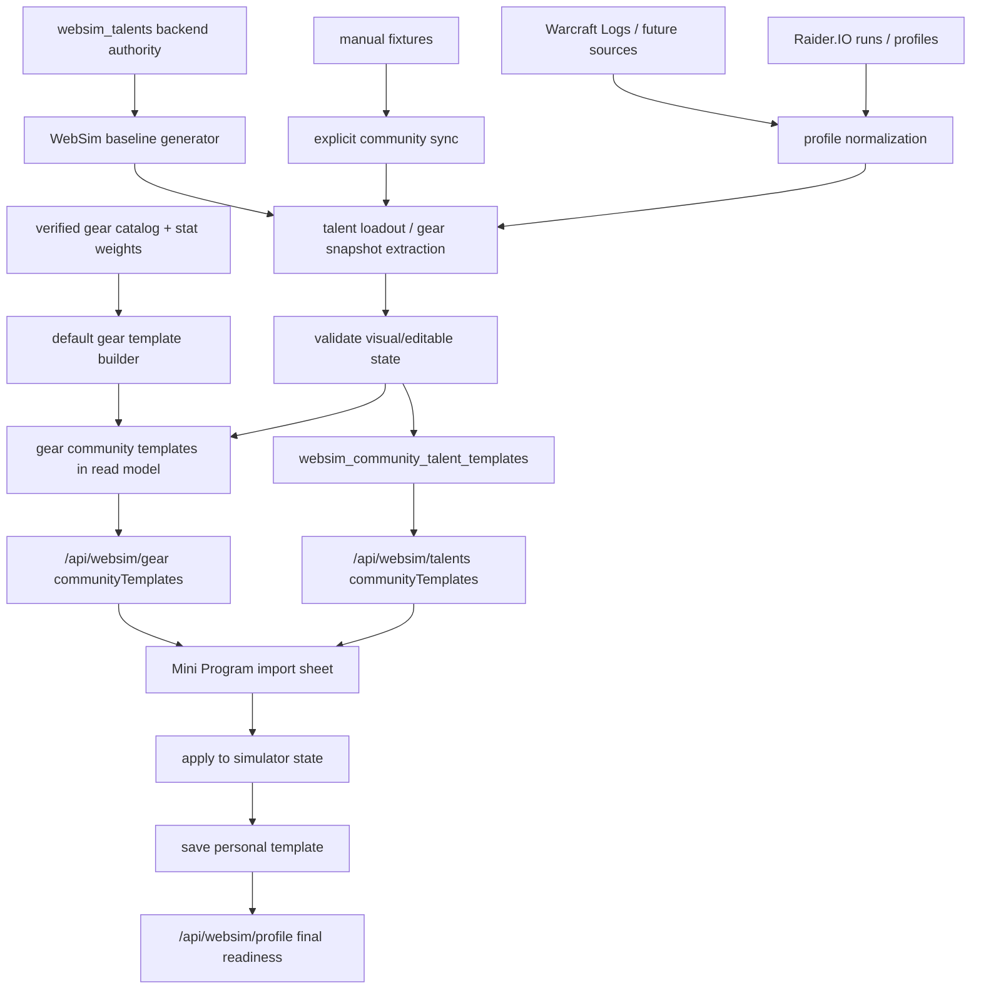

# 社区模板导入全链路 Runbook

> 适用范围：社区天赋模板、社区装备模板、Raider.IO / WCL / manual fixtures / WebSim baseline 来源、PostgreSQL-only 入库、`communityTemplates` read model、前端导入 sheet、个人模板保存、`/api/websim/profile` 最终校验、health 和回滚。
> 最后更新：2026-06-29。

本文是“导入社区天赋 / 装备推荐”的执行手册。它不重新定义天赋树规则，也不重新定义装备 catalog；这两部分分别由 [全职业天赋模拟全链路 Runbook](talent-simulation-full-chain-runbook.md) 和 [装备模拟全链路 Runbook](gear-simulation-full-chain-runbook.md) 负责。本文只管外部或派生模板如何进入推荐、展示、应用和保存链路。

## 总原则

- Source honesty：Raider.IO / WCL 是真实玩家样本；manual fixture 是开发或运营种子；WebSim baseline 是后端 authority 生成的兜底模板。不得把 baseline 冒充成社区玩家样本。
- Backend authority：模板能否可视化、可编辑、可保存、可提交 SimC，最终都以后端 validator / serializer 为准。
- Consumer-only frontend：前端只展示和应用后端返回的 `communityTemplates`，不跨专精补模板，不猜装备槽位，不拼 SimC profile line。
- Per-spec cap：天赋模板展示按当前 `classKey + specKey` 收敛，每个专精最多 3 条，不能有重复公开身份。
- Fail-closed import：无法解析成当前 WebSim 节点或 canonical gear snapshot 的模板不能标为可编辑；raw import code 只能走 SimC-only / external 路径。
- Full-spec fallback：真实社区样本不足时，允许用 `websim_baseline` 为每个 expected spec 生成 1 条可编辑天赋兜底；该兜底必须点满三棵树并通过 `encode_websim_talents`。
- Default gear fallback：真实社区装备样本不足时，允许用 `default_template` 为每个 expected spec 生成 1 条装备兜底；它只来自 verified 当前赛季 catalog 和 verified `mplus_mixed_route` 绿字权重，不冒充真实社区样本，不宣称 BiS。
- No implicit writes：`GET /api/websim/talents`、`GET /api/websim/gear`、`/api/data/health` 都不得触发外部同步或 DB 写入。
- Approval gate：下载、远端刷新、生产 DB 写入、部署和外部数据落盘都需要 owner 明确批准。

## 端到端链路



关键点：

- 社区模板是推荐输入，不是规则真相。
- 天赋可编辑模板必须有 `websimExportCode` 和 `talentState.selectedNodes`。
- 装备可编辑模板必须能映射到 canonical slots 和结构化 `gearBySlot / enhancementBySlot`。
- baseline 只解决“全职业专精有可编辑起点”，不代表 BiS、排行榜、玩家样本或强度结论。
- `default_template` 只解决“装备模拟可导入起点”，不代表真实玩家样本、社区强度或毕业配装。

## 来源与可信边界

| 来源 | 用途 | 可标为 verified 的条件 | 不可做的事 |
| --- | --- | --- | --- |
| Raider.IO profile / run | 真实玩家天赋和装备样本 | class/spec/hero/scenario 可归属；structured loadout 或 gear snapshot 可解析；去重后仍有可执行字段 | 不能把 profile API 的装备属性当成生产属性来源 |
| Warcraft Logs | 后续高质量战斗样本入口 | v2 OAuth 凭据可用、授权边界清楚、样本窗口可追踪，且 report evidence / combatantinfo 可解析成模板字段 | 缺凭据或缺抽取能力时不得伪造 WCL 模板；凭据已配置但无可解析样本时保持 `partial` |
| Manual fixture | 小范围开发和 smoke 种子 | 显式 sync 写入；带 source/status/checkedAt；能通过后端 validator | 不能由 GET 自动 bootstrap |
| WebSim baseline | 缺真实样本专精的可编辑兜底 | 当前 `websim_talents` 能生成三树满点状态，且 `encode_websim_talents` 返回 encoded | 不能显示为 Raider.IO/WCL；不能参与玩家强度结论 |
| Default gear template | 缺真实装备模板专精的可导入兜底 | 16 个 canonical 装备槽完整、候选均为当前赛季 compatible + SimC-ready + verified variant，且 serializer 能生成 16 行 | 不能显示为 Raider.IO/WCL；不能使用 `source_reference`、partial、错季或缺绿字权重候选 |
| SimC raw `talents=` code | SimC-only external 输入 | class/spec 已知，raw code 保留原样，profile serializer 可 fail-closed | 不能强行反解到 WebSim 可视化节点 |
| 前端临时状态 | 交互预览 | 只作为待校验输入提交 | 不能作为可信模板或 SimC profile |

## 天赋导入契约

### 入库

`sync_community_talent_templates` 是唯一显式入库入口，当前来源：

- `manual_fixture`
- `raiderio`
- `warcraftlogs`
- `websim_baseline`

每条模板入库前必须经过：

1. `normalize_community_talent_template`
2. structured loadout 解析到 WebSim 节点，或保留 raw external code
3. `encode_websim_talents`
4. signature 去重和 source refs 归并
5. `status=verified|blocked`

`websim_baseline` 额外要求：

- 按当前 `WOW_CLASSES` 遍历 expected specs。
- 每个 spec 只生成默认 hero tree 的 1 条 baseline。
- 通过后端 authority 贪心选点，active 点数达到 `class=34 / spec=34 / hero=13`。
- hero granted root 不计入 purchased SimC line，但必须计入 active 点数。
- 任一树无法点满或 encoding 失败时，该 spec 的 baseline 为 blocked，不进入展示。

### 读取

`GET /api/websim/talents` 必须：

- 只读 DB，不触发 sync。
- 按 `class_key + spec_key` 查询。
- 只返回 `status=verified`。
- 先按 talent signature 去重，再按公开展示身份去重。
- 每个 spec 最多返回 3 条。
- Raider.IO/WCL 等真实样本按 `maxKeyLevel/sampleCount/updatedAt` 优先；baseline 因 `maxKeyLevel=0/sampleCount=0` 只做兜底。

公开展示身份至少包含：

- `sourceKey`
- `playerId` 或可见名称
- `classKey`
- `specKey`
- `heroKey`
- `scenarioKey`

### 前端

前端可以：

- 展示可编辑模板。
- 应用 `websimExportCode` 到当前天赋树。
- 如果模板目标 class/spec/hero 不同，先切换树再应用。

前端不能：

- 自行扩大到其他专精模板。
- 对 raw external code 伪造可编辑节点。
- 把 baseline 文案写成社区玩家样本。
- 绕过 `talentReadiness` 保存可执行模板。

## 装备导入契约

装备模板继续由 `/api/websim/gear` 输出 `communityTemplates`，并遵守装备模拟 Runbook 的 source / variant / mod-option 门禁。

### 默认装备模板

`sync_community_gear_templates` 的装备阶段顺序是：

1. 归档真实样本 / SimC preset 装备模板。
2. 读取 verified 当前赛季 gear catalog、verified `mplus_mixed_route` stat weight cache、武器规则和 mod option catalog。
3. 生成 `sourceKey=default_template`、`sourceName=默认模板` 的兜底模板。
4. 运行 `merge_websim_gear_enhancements` 和 SimC gear line serializer。
5. dedupe、入库、输出 health / run summary。

默认装备模板生成门禁：

- `status=complete` 只要求 16 个 canonical 装备槽完整且 serializer 可执行。
- 宝石、附魔、美化、`crafted_stats` 属于独立 `enhancementReadiness`，不得影响 16 槽完整性的定义。
- 缺绿字权重、缺 verified 当前赛季候选、候选为 `source_reference` / partial / blocked / 错季、武器规则失败或 serializer 失败时，不生成默认模板。
- blocker 必须写入 sync run 的 `gear.defaultTemplates.blockers`，包含 class/spec、原因、缺失槽位和补齐路径。
- 评分使用“装等护栏 + 绿字权重”：装等跨档保护高装等，同档或接近装等内按副属性权重排序。
- 饰品必须补满两槽，但 `templateEvidence.warnings` 必须说明 `trinket effects are not optimized`。
- 坦克、治疗、增辉等非纯 DPS 专精可用 M+ mixed-route 权重做副属性排序，但必须说明这不是生存、治疗量或团队收益最优结论。

默认模板证据审计口径：

- `/api/data/health` 只读输出 `community_templates.details.templateEvidenceAudit`；审计不得触发 Raider.IO/WCL/SimC/LLM，不写库，也不改变 `community_templates` 既有红绿语义。
- `defaultGear` 是默认装备模板证据链：只把 `mplus_mixed_route` stat weight 作为解锁门禁；`mplus_single_boss` 和 `mplus_aoe_pack` 只可作为旁路诊断，不阻断默认模板。
- `defaultGear.matrix[*].firstBlockingGate` 只能指向 `statWeightGate`、`gearCandidateGate`、`enhancementGate` 或 `serializerGate`；前置未通过时，后续 gate 必须是 `not_reached`，若审计旁路观察到了候选槽位状态，只能放入 `diagnostic`。
- `defaultGear.statWeightBlockerMatrix` 是 owner-facing 的紧凑矩阵，只能包含 spec、status、原因分类、聚合 counts 和 `nextAction`，不得输出玩家 URL、完整 profile、secret 或可直接执行的危险命令。
- `realCommunityGear` 只统计 Raider.IO/WCL/SimC preset/observed profile 等真实装备样本；`default_template` 不得填平真实社区装备样本缺口。
- `communityTalent` 必须分开统计真实社区天赋模板和 `websim_baseline` 兜底；`websim_baseline` 可作为可编辑兜底，但不能填平真实社区天赋样本缺口。
- `sourceDependencies.warcraftlogs.status` 只作为独立 source dependency 展示，不复制成 40 个 spec blocker；`missing_credentials` 表示 key 未配置，`partial` 可表示 v2 OAuth 已配置但缺 report evidence / combatantinfo 抽取。
- 审计 status 语义固定：`passed` = 实际检查并通过；`blocked` = 实际检查并确定阻断；`partial` = 有证据但不足以解锁；`not_reached` = builder 因前置 blocker 没走到该层；`diagnostic` = 审计旁路观察线索，不等于 builder 已通过。

噬灭 DH DungeonSlice 边界：

- 只有 stat weight profile 生成、且同时满足 `classKey=demonhunter`、`specKey=devourer`、`scenarioKey=mplus_mixed_route`、`fight_style=DungeonSlice` 时，才允许追加当前 SimC 接受的 `demonhunter.enable_dungeon_slice=1`。
- 追加项必须进入 stat weight payload 的 `validation.forcedOptions`，并与 `validation.simcBuild` 一起保留为审计证据。
- 玩家 SimC 模板任务、`/api/websim/profile`、默认装备模板 serializer、非噬灭 DH、非 mixed-route 场景都不得自动追加该选项。
- 如果 SimC 仍失败、没有成功 profile、权重不是 `verified`、或 forced option 未出现在 stat weight validation，默认装备模板必须继续 blocked。

装备导入必须：

- 只应用当前 class/spec 可用的 canonical slot。
- 保留 `gearBySlot` 与 `enhancementBySlot` 结构化快照。
- 对 observed-only、source-reference、partial variant 明确阻断或降级。
- 最终由 `merge_websim_gear_enhancements` 和 `/api/websim/profile` 重新校验。

装备导入不能：

- 直接信任 Raider.IO/WCL 装备属性。
- 把缺 `bonus_id/gem_id/enchant_id/crafted_stats` 的展示候选保存为 SimC-ready。
- 前端按装备名、slot 文案或 item id 猜可执行字段。
- 把 `default_template` 包装成真实社区样本、排行榜推荐或 BiS 结论。

## 2026-06-29 生产验收快照

- `wow-stat-weights-sync.service` 与 `wow-community-template-sync.service` 已在云端完成，退出状态均为 `0`。
- 最新 stat-weight run：`acceptedCount=18`、`blockedCount=102`、`specCount=40`、`scenarioCount=3`、`raiderioStatus=synced`。
- `demonhunter:devourer + mplus_mixed_route` 已不再卡 DungeonSlice：`simcSuccessCount=3`、`simcErrorCount=0`、`forcedOptions=["demonhunter.enable_dungeon_slice=1"]`、`simcBuild=16b061b2d928`。
- 噬灭仍未解锁默认模板，因为 stat weight 状态是 `partial`，当前 blocker 是 LLM 翻译 guard：`translation_blocked: unexpected_llm_numbers: 37.19, 27.19`。
- `/api/data/health` 仍显示默认装备模板 `coveredSpecCount=0/40`；owner-facing top blockers 为 `stat_weight_blocked=34`、`stat_weight_partial=3`、`missing_simc_ready_gear_candidates=1`、`simc_dungeon_slice_disabled=1`（Vengeance）和 `translation_guard=1`（Devourer）。
- 噬灭的后续 `gearCandidateGate` 仍只作为 `diagnostic` 展示：当前可观察到 16 槽里 4 槽有 SimC-ready candidate，缺 `neck/back/wrist/waist/legs/feet/finger1/finger2/trinket1/trinket2/main_hand/off_hand`，但 builder 因 stat weight 前置未通过，所以该层必须保持 `not_reached`。

## 版本初期门禁待讨论

- 当前实现仍保持 fail-closed：缺 verified 证据时不生成默认装备模板，不把 `default_template` 冒充真实社区样本，不把 partial/stat diagnostic 包装成强结论。
- 但赛季或大版本初期，Raider.IO/WCL 样本、SimC-ready gear candidate、stat weights、talent catalog 可能天然不足；若所有用户可见能力都只认 `verified`，会造成大面积空白。
- 本轮已确认：这个担忧合理且有必要进入后续设计。强结论仍应 hard gate，尤其是 verified 默认装备模板、真实社区样本、BiS 和代表性样本；但页面存在、低风险浏览、可编辑起点和 owner 诊断不应天然等同于强结论。
- 后续讨论方向记录在 `docs/roadmap/ideas.md`：把门禁对象从“页面或能力是否存在”调整为“声明强度是否成立”，并考虑 `verified`、`provisional`、`diagnostic`、`blocked` readiness tiers。该方向尚未改变本 runbook 的默认模板解锁门禁。

## Health 和验收

`/api/data/health` 的 `community_templates.details` 至少确认：

- `templates.total / verified / blocked`
- `sources.manual_fixture / raiderio / warcraftlogs / websim_baseline`
- `scanCoverage.totalSpecCount`
- `scanCoverage.coveredSpecCount`
- `scanCoverage.missingSpecs`
- `dedupedCount`
- `hiddenDuplicateCount`
- `templateRevision`
- `gearTemplates`
- `realCommunityGearTemplates.coveredSpecCount`
- `realCommunityGearTemplates.missingSpecs`
- `defaultGearTemplates.coveredSpecCount`
- `defaultGearTemplates.missingSpecs`
- `defaultGearTemplates.blockers`
- `defaultGearTemplates.topBlockers`
- `defaultGearTemplates.lastSyncRun`
- `templateEvidenceAudit.schemaRevision`
- `templateEvidenceAudit.defaultGear.summary / matrix / statWeightBlockerMatrix`
- `templateEvidenceAudit.realCommunityGear.summary / matrix`
- `templateEvidenceAudit.communityTalent.summary / matrix`
- `templateEvidenceAudit.sourceDependencies.warcraftlogs`

上线验收必须跑：

```text
/health
/api/data/health
/api/websim/talents?class=shaman&spec=elemental&hero=stormbringer
/api/websim/talents?class=mage&spec=frost&hero=spellslinger
/api/websim/gear?class=mage&spec=frost&compact=1
```

天赋 40 专精矩阵必须检查：

- `specsChecked == 40`
- 每个 expected spec 至少 1 条 verified template
- 每个 spec 展示数 `<= 3`
- 没有 wrong spec
- 没有重复公开身份
- 每条可编辑模板的 `websimExportCode` 可被 `/api/talents/validate` 编码

装备矩阵必须检查：

- 当前 40 spec 的 `/api/websim/gear?compact=1` 可返回 payload。
- `communityTemplates` 不含跨职业 / 跨专精不兼容模板。
- `default_template` 若出现，必须带 `scenarioKey`、`enhancementReadiness`、`statWeightRevision`、`gearCatalogRevision` 和 `templateEvidence`。
- 缺证据专精必须出现在 `gear.defaultTemplates.missingSpecs` / blockers，而不是静默缺失。
- 可应用模板仍由 serializer 返回 `profileReadiness`。

## 只读审计 SQL

```sql
select source_key, source_status, status, count(*)
from websim_community_talent_templates
group by source_key, source_status, status
order by source_key, source_status, status;

select class_key, spec_key, count(*) as verified_count
from websim_community_talent_templates
where status = 'verified'
group by class_key, spec_key
order by class_key, spec_key;

select class_key, spec_key, source_key, count(*) as template_count
from websim_community_talent_templates
where status = 'verified'
group by class_key, spec_key, source_key
order by class_key, spec_key, source_key;

select id, class_key, spec_key, hero_key, source_key, status, json_extract(payload_json, '$.baseline.complete') as baseline_complete
from websim_community_talent_templates
where source_key = 'websim_baseline'
order by class_key, spec_key;

select class_key, spec_key, source_key, source_name, status, ready_slot_count,
       json_extract(payload_json, '$.scenarioKey') as scenario_key,
       json_extract(payload_json, '$.templateEvidence.statWeightRevision') as stat_weight_revision
from websim_community_gear_templates
where source_key = 'default_template'
order by class_key, spec_key;
```

## 刷新和发布顺序

1. 确认 owner 已批准外部刷新、生产写库和部署。
2. 备份当前 runtime 相关数据库：当前 `WOW_DATABASE_RUNTIME=postgres_only` 指向的 PostgreSQL target；如需读取历史 SQLite 迁移源，也先复制 SQLite 文件并记录路径。SQLite 备份不作为线上 fallback。
3. 先确认天赋和装备 authority 当前 health。
4. 显式运行社区模板同步：真实样本 / SimC preset 归档 -> 默认装备模板生成 -> dedupe -> health/run summary。
5. 只读审计 source/status/count。
6. 跑 40 专精天赋矩阵。
7. 跑装备 import smoke，并确认 `defaultGearTemplates` 覆盖或 blocker。
8. 代码热部署。
9. 公网 `/health` 和 `/api/data/health`。
10. 抽样小程序关键接口。
11. 把备份路径、模板计数、coverage 和 blockers 写回 roadmap。

## 回滚

- 代码回滚：回滚 `server/websim_payload.py`、前端 import sheet 相关文件和文档链接，然后热部署。
- DB 回滚：停止服务，按写入实际落点恢复 PostgreSQL 备份，重启服务，再跑 `/health` 和 `/api/data/health`。历史 SQLite 备份只能用于重新迁移或离线比对。
- 数据局部回滚：如只需撤销 baseline，可删除 `source_key='websim_baseline'` 的模板并重建 `community_talent_templates` sync state；执行前仍需备份。
