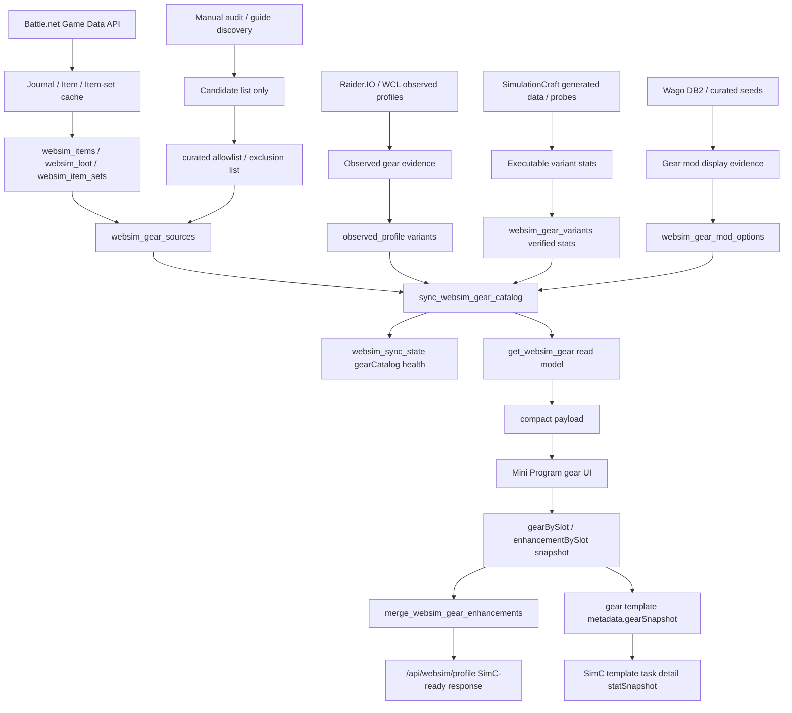

# 装备模拟全链路 Runbook

> 适用范围：`/api/websim/gear` 装备模拟读模型、装备自建数据库、装备强化配置、制造业装备、全职业专精装备适配、前端展示、SimC profile serializer、生产刷新和回滚。
> 最后更新：2026-07-11。

本文是下一次大版本或赛季装备更新的执行手册。目标不是记录某一次修复，而是把“从上游 API 到线上 UI 和可执行 SimC profile”的完整链路固化成可复用流程。任何新版本装备更新，都应先按本文确认数据入口、证据门禁、审计 SQL、健康指标、全职业专精适配和回滚边界，再做写库或部署。

## 总原则

- DB-first：装备、变体、宝石、附魔、美化、制造业属性、唯一装备标记、武器单双手、职业专精可用性都必须先在后端数据层归一，再交给前端展示。
- Evidence-first：guide、截图、社区经验只作为候选发现；写入 `verified` 必须有结构化证据。缺证据时写 `partial` / `blocked`，带 blocker，不伪装成可用装备。
- Backend-owned contract：前端只消费 `/api/websim/gear` 的结构化 payload，不按物品名、附魔名、职业名或 ID 打补丁。
- Serializer fail-closed：即使前端提交了 stale 或不兼容的 `gearBySlot` / `enhancementBySlot`，后端 `merge_websim_gear_enhancements` 也必须阻断，而不是生成错误 SimC gear line。
- 全职业覆盖：装备候选、武器栏位、护甲类型、主属性、制造业属性搭配、附魔/美化选项，都必须按 40 个职业专精矩阵验证。
- 当前公开模板合同：截至 2026-07-08，公开导入入口只展示 active `raiderio_observed_profile` / `community_best_v2` 真实玩家装备模板；`recommended_bis`、`season_recommendation`、`default_template`、`simc_preset` 和 `baseline_blocked` 可以作为内部 evidence、optimizer 输入、legacy health 或历史审计数据保留，但不得自动回流到小程序公开 `communityTemplates` / `baselineTemplates`。
- 历史 baseline 口径：2026-07-06/07 的 `season_recommendation / 当前赛季大秘境 AOE 推荐模板` 40/40 baseline 公共入口方案已被 2026-07-08 `public observed-only` 合同 superseded；后续若要重新开放系统评分推荐或 legacy baseline，必须经过新的用户确认、SimC/pairwise/anchor 门禁和小程序 runtime 验收。
- 完整状态拆分：装备模板 `status=complete` 只表示 16 个 canonical 槽位完整且 SimC serializer 可执行；宝石、附魔、美化和 `crafted_stats` readiness 必须通过独立 `enhancementReadiness` 表达。
- 可回滚：任何生产写库前必须备份实际写入的 PostgreSQL target，并保留历史 SQLite 文件备份作为迁移/审计证据。当前 runtime 必须是 `WOW_DATABASE_RUNTIME=postgres_only`；SQLite 不能作为线上 fallback 或健康判断来源。任何代码部署前必须能区分“代码回滚”和“DB 回滚”。
- 下载/写入边界：拉取远端数据、下载外部文件、生产 SSH/DB 写入、Wago/SimC 数据刷新，默认都必须先取得 owner 明确批准。例外是已知云服务器上的 SimulationCraft runtime 更新：当用户明确要求处理 SimC 更新、WebSim/SimC readiness、赛季切换阻塞，或已授权 health follow-up 自动处理 SimC runtime 时，可直接下载配置好的 SimC 源包、构建、切换 `/opt/wow-simc/current` 并执行 smoke；不得扩展到本机下载、任意第三方下载、依赖安装或修改 SimC repo/branch。

## Phase 1 / Phase 2A / Phase 2B 解析与只读适配边界（Phase 3A 已接入 runtime）

`server/gear_contracts.py`、`server/gear_result_envelope.py` 和 `server/gear_rule_matrix.py` 是可信装备配置工作台的 Phase 1 契约基础，Phase 3A 已通过单一 backend orchestrator 接入 active runtime：

- `selection-intent-v1` 只接受选择意图；客户端提交的 `itemSetId`、属性、SimC 选项、合法性、readiness、证据或 claims 一律拒绝。
- `selectionSignature`、`resolvedGearSignature` 和 `profileSignature` 分别绑定选择、解析 authority、角色/天赋/serializer/SimC/stat policy 依赖，不允许用一个模糊 hash 替代三层失效边界。
- `gear-result-envelope-v1` 的 HTTP 语义已在 Phase 3A `POST /api/websim/gear/resolve` 与 canonical Profile mode 生效；旧 Profile body 仍保持原 shape。
- `gear-rule-matrix-v1` 固定按 10 条显式纯函数规则执行，只返回 ordered legality results，不生成 Resolved Snapshot、属性、套装归属、Evidence Claims、SimC lines 或 readiness。
- Phase 2A 新增 `server/gear_resolver.py` 与 `server/gear_evidence_ledger.py`：固定执行 base item → verified variant → verified overlay → effective capabilities → legal enhancements，并输出结构化静态属性、canonical `itemSetId`、constraints、serializer input 和五组 Evidence Claims。它们不接受连接、store、route 或文件系统参数，也不生成完整 profile 字符串或 DPS。
- verified variant 缺少 `resolvedStats`、overlay 缺少 immutable source ref、overlay 与 base 的 canonical set identity 冲突、option 非法或 evidence record 缺失时必须 fail-closed；非法 enhancement 不得污染静态属性或 SimC options，dynamic effects 不得折算为静态 stats。
- Phase 2B 新增 `server/pg_gear_authority_loader.py`：在一个 PostgreSQL read-only transaction 中，用三条 static domain query 批量读取 Authority Context；1 槽与 16 槽的 cold budget 都是 3，warm cache hit 只执行 revision query，不允许 per-slot SQL。
- `AuthorityContextCache` 同时受 entry count 与 canonical serialized bytes 限制，cache key 绑定完整 Dependency Vector 与 Selection Signature；missing/unavailable/incomplete authority 不缓存。loader 只消费结构化 `itemStats`，不解析展示用 `statSummary`；source 的 `status` 或 `sourceStatus` 至少一项必须显式为 `verified`，`sourceStatus=source_reference` 作为来源类别单独保留，不能遮蔽另一字段的 verified 证据，缺失状态按 `unknown` 阻断。每件 item 最多投影 8 条显式 verified source，优先与所选 variant 同源且最近，避免历史 source 无界膨胀；非法数值类型不得静默清洗为空属性后放行。
- 公共 observed template 的 `variantKey` 是 PG 原始 key 经既有 `normalize_option_value` 得到的 public alias。loader 必须在同一条静态数组 SQL 中同时接受 exact raw key 与该 alias，仍以 itemId 绑定匹配；任何 alias 碰撞、wrong-item 记录或缺失 authority 都 fail-closed，重复 `(itemId, variantKey)` pair 在查询前去重且不增加 SQL 往返。
- item 的装备类型、护甲/武器类型、handedness 与等价槽必须复用现有 Battle.net structured payload helper，不能从名称或当前玩家选择反推。`finger1/finger2`、`trinket1/trinket2` 共用等价槽 authority；one-hand weapon 的 item authority 可进入主手/副手，最终是否允许双持仍由 Rule Matrix 的 class/spec rule 决定；two-hand weapon 必须让 profile readiness 正确免除空副手。
- canonical tier membership 只接受显式 verified tier source，或 `source_type=tier_set` 且 `authority=Battle.net Game Data API`、`setId` 非空的结构化 membership。loader 在同一 item/variant SQL 中聚合所有可信 setId；0 个表示无套装证据，1 个进入 canonical `itemSetId`，多个冲突必须把 item authority 整体阻断。source evidence 每个 source type 只保留最新一条，总数仍最多 8。
- Phase 2B 的 `PostgresCacheStore.get_gear_authority_context`、`gear_resolver_runtime_authority` 和 `build_websim_profile_response_from_resolved_snapshot` 已由 Phase 3A `server/gear_runtime.py` 统一编排。resolved-snapshot facade 仍只消费后端 Resolver 生成的 `serializerInput.gearItems`，委托现有 serializer，并以 golden parity 锁住兼容输出；不得出现第二套规则或客户端 snapshot 快捷路径。
- loader 返回的 `compatibility-pg-live-v1` 明确是当前 PG live state 的过渡兼容视图，`formalActiveManifest=false`；不可冒充 Phase 4 才拥有的 immutable Active Season Manifest。
- 既有 `server/websim_payload.py`、PostgreSQL selectors 和 observed-only public read model 继续提供 browse 事实；Phase 3A 只增加 backend-owned `resolverContext`、`/resolve` 和带 `selectionIntent` 的 canonical Profile strangler mode。旧 `/profile` body、`/gear/stats`、frontend page、Worker、migration/write、job、sync/backfill、cleanup 和公开模板合同均未改变。
- Catalyst 继续要求 verified capability 与 revision；当前保持 fail-closed，Phase 6 的 12.1 保留绿字转换仍是外部依赖型 TODO。
- 2026-07-11 PR #63 候选硬门禁：cold 1/16 槽都执行 `SET TRANSACTION READ ONLY + revision/items/options`，warm 16 槽只执行 `SET TRANSACTION READ ONLY + revision`；真实 Mage/Arcane 15 槽与 DK/Frost 16 槽 authority 都是 `missingFields=[]`。Mage Resolver/五组 Ledger/Facade 全绿，cold 30 次 `p95=201.275ms`、warm 100 次 `p95=105.726ms` 且 cache hit `100/100`，低于 `500ms/200ms` 阈值；四类 fail-closed、`/profile=200`、`/resolve=404`、40/40 observed-only/baseline=0、slot payload、单线程 backend 和零 backend error 都通过。
- 候选 timer/backflow 证据必须区分代码部署与自然外部任务：本次 `WOW_DEPLOY_START_ASYNC_SYNCS=0` 没有启动任何装备 sync/write/backflow；自然 `data-health-followup` 在候选 backend 激活前 1 秒完成，随后独立 SimC updater 因既有 GitHub proxy TLS EOF 失败。恢复探针未切换 binary，`/opt/wow-simc/.commit` 仍为可用的 `1e357922af363f3d87cc0758863c2bb6d7701b72`；该外部下载链路异常要单独记录，不能删掉失败事实，也不能把它解释成 Phase 2B Resolver/loader 回归或借机开启 Catalyst。

## Phase 3 Resolve/Profile 与前端工作台切换边界

- Phase 3 按 3A backend API、3B structured transport + pure state、3C active page cutover 三个 Strict Slice 推进，不允许把 route、transport 和 UI 一次性混成不可回滚大改。
- 3A 在 gear browse payload 增加 backend-owned `resolverContext`，其 `authoredAgainst` 与 Dependency Revisions 必须来自 Phase 2 loader 的同一 revision authority；它仍是 `formalActiveManifest=false` 的过渡身份，不替代 Phase 4 Manifest。
- `POST /api/websim/gear/resolve` 只接受 Selection Intent，返回 `gear-result-envelope-v1`：合法或业务阻断为 200，结构错误 400，revision 冲突 409，authority 不可用 503。它不运行 SimC、不返回 DPS、不推荐装备。
- `/api/websim/profile` 仅在 body 带 `selectionIntent` 时进入 canonical mode，服务端重新加载 Authority、重新 Resolve，再把 server snapshot 交给 serializer facade；旧 body 保留原 200 shape。客户端提交的 snapshot、serializer input、合法性、属性、套装或 Evidence 一律不能复用。
- 3B 的 `requestJson(..., {responseMode: 'structured-problem'})` 只作为 opt-in；有效 409/503/202 envelope 不进入 generic fallback，网络/超时/非法 body 才标 offline。`gear-workbench-state.js` 必须无 `wx`、storage、network、clock 依赖，并按 serial + intentVersion 丢弃旧响应。
- 3C 页面对 confirmed Intent 与 draft 分层；409 只更新 revisions 并最多自动重试一次，503 与 offline 分开显示。last verified snapshot 可只读展示，但 dirty/stale/blocked/read-only 状态不得保存为 verified、生成 profile 或进入 SimC。
- 前端可保留 candidate/source/variant 的浏览与格式化，但最终合法性、Tier identity、set count、确定性总属性、constraints 与 profile readiness 只能来自匹配当前 Intent 的 Resolved Snapshot。legacy stat snapshot 在 Phase 5 前保持独立，不能覆盖 Resolver readiness。
- Phase 3 不新增 migration/write/sync/backfill/cleanup/job/Worker，不改变 public observed-only/baseline-empty，不创建正式 release registry，不开放 Catalyst。
- 2026-07-11 Phase 3A live acceptance：PR #65 合入 `1b87bd6`，merge/candidate tree 同为 `c323141a`，clean-main 等价树已重部署。40/40 public Intent Resolve，11 个 verified talent import Profile resolved、29 个缺导入 Profile truthful blocked；负向 HTTP 为 malformed 400、stale 409、wrong-slot 200 blocked、missing authority 503、unknown Catalyst 503。on-host production Nginx warm 100 为 `p50=97.470ms / p95=112.334ms / p99=115.604ms`，cold→warm statement budget 为 `4→2`（含 `SET TRANSACTION READ ONLY`），cache 为 `1 entry / 73,917 bytes / limit 32 entries + 4 MiB`。公网 client path warm p95 `367.412ms` 要单独报告为 RTT 路径事实；额外 5 并发大 slot payload 压测造成的 Python RSS 保留已通过 backend restart 恢复，不能归因于 Authority cache，也不能冒充通过项。candidate 与 post-merge deploy 都使用 `WOW_DEPLOY_START_ASYNC_SYNCS=0`；11:14 的 observed/WebSim/stat sync 是既有 health-followup timer 自然触发，不是 deploy backflow。
- 2026-07-11 Slice 3B merge acceptance：PR #67 最终头 `7642ad0` 通过 GitHub Harness 并合入 `8afebbf`。opt-in structured-problem mode 保留有效 200/202/409/503 envelope；malformed/network/timeout 才 fallback，默认 transport/auth/analytics headers 不变。canonical wrappers 固定 Resolve raw Intent 与 Profile `{selectionIntent, profileContext}`；纯状态覆盖 confirmed/draft、serial/version、一次 409 rebase、503/offline、current/last verified 与 stat snapshot 分离。targeted `45/45`、frontend `377 tests / 123 commands`、full `129 commands` 通过；active import=0，因此没有 deployment 或真实微信证据，最高证据保持 local/CI。
- 2026-07-11 Slice 3C live acceptance：PR #69 exact evidence head `b9f568e` 通过 GitHub Harness 并 squash 合入 `869372d`。initial/candidate/variant/enhancement/community/saved/reset 七条确认流已统一到 serial+intentVersion Resolve；最终属性、Tier/set、legality、constraints 与 readiness 只来自匹配 snapshot，save/Profile/SimC 绑定 current verified signature。真实微信 captured pending→verified、15/15 effective slots 与 signature change；候选与 clean-main post-merge 40/40 Resolve、400/409/200-blocked/503 负向、旧接口、PG-only、timer/log/rollback 通过。候选 QA 发现并修复 eager 16-slot detail fan-out 与 UUID/`optionKey` authority mismatch；现在 drawer 只 lazy-load selected slot，提交稳定 optionKey，并由 Resolver constraints 隐藏无权威能力的强化选项。七个 runtime 文件 main/remote hash 一致；恢复重启后 `/health` ok、约 49 MiB、单任务、`NRestarts=0`、无 fatal 日志。Phase 3 已归档，Catalyst 仍 disabled/fail-closed。

## Phase 4 Release Train 与 Community Migration 边界

- Phase 4 按 4A pure release contracts、4B immutable PG registry + `legacy-import-r0`、4C shadow readers、4D atomic Active Manifest cutover、4E scheduled candidate refresh 五个 Strict Slice 推进；不得把 migration、reader、pointer cutover 与 timer 混成一个不可回滚 PR。
- 当前 `cache.websim_items`、gear source/variant/mod option 和 community template 表继续是 mutable staging。Phase 4B 已创建独立 immutable release-scoped 表并封存 inactive Gear/Community Releases，但 public reader 仍为 `compatibility-pg-live-v1`、`formalActiveManifest=false`，Manifest/Pointer 都是 0；不能把 inactive registry 写成已 cutover 能力。
- 不可变 Gear/Community Release 必须以 canonical content hash 生成 release ID；sealed content 不 update/delete。Active Retail Season Manifest 原子绑定 Gear Release、可空 Community Release 与 Dependency Revisions；promotion/rollback 只 compare-and-swap 一个 pointer，不逐表回写。
- 第一轮 Community Release 标记 `legacy-import-r0`，但每个模板必须重新生成 exact Selection Intent，并对目标 Gear Release 运行 current Resolver。legacy 只表示来源，不能 grandfather 合法性、freshness、source evidence 或 signature。
- 每专精选举最多一个 public winner；合法低排名项仅为 internal standby，非法/stale/source-invalid/binding mismatch 为 rejected。缺合法 winner 时该 spec 公开为空并标 degraded，禁止用 `season_recommendation`、default、SimC preset 或 baseline 补齐。
- Shadow compare 必须覆盖 40 专精的 winner presence、Intent、resolved signature、legality、provenance、baseline=0、browse identity 与 Profile Dependency Vector。任何 illegal winner、mixed release、baseline leak、integrity error 或非 observed public source 都阻断 promotion。
- Existing sync 只写 staging；Phase 4E release refresh 必须 candidate-first。相同 Gear Release 的 community winner 更新在完整 gate 后可自动发布；新赛季、rule、serializer、schema、capability 和高风险 gear 变化必须 controlled cutover。deploy 继续 `WOW_DEPLOY_START_ASYNC_SYNCS=0`，不得触发 refresh。
- 2026-07-11 Slice 4A live acceptance：PR #71 exact head `69ece3d` 通过 GitHub Harness 并 squash 合入 `e8bfda9`，PR/merge tree 同为 `98167bbd`。`server/gear_release.py` 只拥有 pure Release/Manifest identity、observed election、shadow、promotion 与 pointer-command contract；22 focused、86 related、backend 1213、full 386 Node + 1213 Python / 130 commands 通过。candidate 与 clean-merge-equivalent 远端 hash 同为 `c135530...1a2401d`，remote 22/22、40/40 public、Resolve/Profile/health/Catalyst/timer/log 通过；没有 schema/write/reader/pointer/timer，`formalActiveManifest=false`。
- 2026-07-11 Slice 4B live acceptance：PR #73 evidence head `4fe300e` 通过 GitHub Harness 并 squash 合入 `48aa44e`，PR/merge tree 同为 `54d43c54`。migration 0013、`server/gear_release_store.py` 与显式 tool 只拥有 immutable registry/inactive import；PG 管理员以单事务应用 migration，备份位于 `/opt/wow-mini-program-candidate-backups/phase4b-pre-2be5938-20260711T065905Z`。inactive Gear Release `342e3918...` 与 Community Release `923ccd05...` 已封存，40 winners / 319 rejected / 0 missing，40/40 winner ID/public observed parity；Manifest/Pointer 都是 0。focused 129、full 386 Node + 1235 Python / 130 commands、candidate/post-merge Resolve/Profile/health/Catalyst/timer/log 通过。一次性 import 为 73.29s / 1,598,864 KiB 峰值，只能作为 operator evidence，不能当成 4E scheduled budget。
- 详细 schema、任务、验证、candidate/rollback 门禁见 `docs/plans/2026-07-11-equipment-simulator-phase4-release-train-plan.md`；Slice 4C 已由 PR #75 合入并完成 40-spec bounded shadow。当前只授权 Slice 4D atomic formal Manifest cutover、release-scoped public readers、monotonic pointer CAS 与显式首切回滚；不能增加 scheduled refresh、提前做 Phase 5 或启用 Catalyst。

### Slice 4D 原子首切与回滚操作

Slice 4D 使用 `server/migrations/postgres/0014_websim_active_manifest_pointer_state.sql` 增加显式 `active / transitional` pointer mode。`retail` 行一旦创建就不能删除：首次 promote 从 generation 0 写入 generation 1；首切回滚把同一行更新为 transitional generation 2；重新 promote 更新为 active generation 3。禁止删除 pointer、重置 generation 或重新开放 `expectedGeneration=0`。

候选部署前必须备份目标 PostgreSQL、记录候选 commit/tree 和 0014 前的 Manifest/Pointer 行数，然后以 migration owner 在一个失败即终止的事务中应用 0014。部署仍固定 `WOW_DEPLOY_START_ASYNC_SYNCS=0`。应用后检查：`pointer_mode` 约束存在、active 必须有 Manifest FK、transitional 必须没有 Manifest、`wow_app` 只有 pointer 的 `SELECT/INSERT/UPDATE` 且没有 `DELETE`。

首次 promote 命令必须显式携带当前已封存的 Gear/Community Release、season、talent、SimC 和 expected generation；tool 会重新验证 release/dependency 组合，在一个事务中 seal/reuse Manifest 并 CAS pointer：

```bash
python3 -m server.gear_release_tool promote \
  --season-revision "$SEASON_REVISION" \
  --simc-runtime-revision "$SIMC_RUNTIME_REVISION" \
  --gear-release-id "$GEAR_RELEASE_ID" \
  --community-release-id "$COMMUNITY_RELEASE_ID" \
  --talent-catalog-revision "$TALENT_CATALOG_REVISION" \
  --expected-generation 0 \
  --updated-by "$CUTOVER_ACTOR"
```

首次回滚不伪造另一个相同 Manifest，也不恢复 staging 表。它只把 formal pointer 推进到显式 transitional 状态；公开读取随后按允许的 rollback 路径恢复 staging compatibility，但保留 generation 历史：

```bash
python3 -m server.gear_release_tool rollback \
  --target-mode transitional \
  --expected-generation 1 \
  --updated-by "$CUTOVER_ACTOR"
```

重新 promote 使用同一个已封存 Manifest 内容重新构建相同 revision，并以当前 generation 2 CAS 到 generation 3。若以后已有旧 formal Manifest，可用 `rollback --target-mode active --manifest-revision ...` 做 active-to-active rollback；仍必须提供当前 generation，且 FK/Manifest 校验失败时不得降级 staging。

每次状态变化后都要核对 pointer 单行、generation、Manifest/Release IDs、`/api/data/health` 的 `active_manifest` component、admin summary、40-spec initial browse/Resolve/Profile、observed-only + baseline-empty、未知 Catalyst 503、一次旧 Intent 409 rebase、service/timer/backflow/log。formal active 中任何 pointer、Manifest、Release 或 runtime dependency 损坏都必须 503；只有 zero-row pre-cutover 和显式 transitional rollback 允许 staging reader。代码回滚不能删除已创建的 pointer 行；若退回不认识 0014 的代码，必须先按记录的 generation 切到 transitional，并使用候选前备份作为最后的数据恢复路径。

## 当前公开装备模板事实快照

| 链路 | 当前用户侧状态 | 内部/研发状态 | 不能误读成 |
| --- | --- | --- | --- |
| `community_best_v2` / `raiderio_observed_profile` | 全职业公开导入唯一允许来源；每个 spec 只展示满足 source/hash/slot/legality gate 的 active 真实玩家模板 | 仍需后续 election job、winner ledger、stale winner 和切换记录提升长期治理 | 不能因为是 observed 就绕过后端 weapon/slot legality gate |
| `recommended_bis_v1` / `recommended_bis` | 当前不进入公开导入入口 | 可保留 `projected_bis`、SimC evidence、pairwise/anchor blockers 和 optimizer 研发状态 | 不能包装成已验证 BiS，不能自动塞回 `baselineTemplates` |
| `season_recommendation` | 当前不进入公开导入入口 | 只作为 legacy / provisional fallback、历史基线和 health 审计证据 | 不能继续按 40/40 public baseline 目标驱动小程序验收 |
| `default_template` / `simc_preset` / `baseline_blocked` | 当前不进入公开导入入口 | 只可作为诊断、迁移或历史兼容输入 | 不能用来填补公开入口，制造“看起来完整”的模板 |
| destructive cleanup | 仍按 pilot-safe 策略处理，当前代码的破坏性清理范围只覆盖 `shaman:elemental` | 全职业 public observed-only 主要由 read model 过滤实现；内部 rows 可先保留 | 不能把展示层全职业隐藏理解成可以批量删除全库 legacy/recommended rows |

## 端到端链路



关键点：

- 上游数据只负责生产候选和证据，不能直接绕过 DB 进入 UI。
- `websim_sync_state` 是发布和巡检的健康快照，但 `/api/data/health` 必须能重审当前 PostgreSQL runtime 事实，不能被旧快照遮蔽。历史 SQLite 与 PostgreSQL read-model 状态不一致时，交付说明必须以 PG 为线上事实，并把差异作为迁移/清理问题记录。
- `/api/websim/gear?...compact=1` 是小程序主消费口，必须只返回 display-ready、当前职业专精适用、当前装备类型可用的候选和强化项。
- `/api/websim/profile` 是最终 serializer gate；所有 UI 裁剪都只是体验优化，不是信任边界。
- SimC 任务详情展示的角色属性来自 verified `statSnapshot` 或 stored `gearSnapshot` 的后端回放，不来自任务列表临时计算。

## 上游数据源与可信边界

| 来源 | 用途 | 可作为 verified 的条件 | 不可做的事 |
| --- | --- | --- | --- |
| Battle.net Game Data API：journal instance / encounter / loot | 当前赛季地城、团本、首领、掉落物品候选 | journal 全量无截断；item metadata 已缓存；source 属于当前 active season | 不能把低等级 preview stats 当成当前赛季可模拟属性 |
| Battle.net item metadata / preview item | 物品名、图标、inventory type、护甲/武器 subclass、unique / limit category、插槽能力、部分 item-set refs | metadata verified，槽位/类型可解析，和 source/variant 对账无 mismatch | 不能单独证明当前难度/装等变体可执行 |
| Battle.net item-set API | 套装名称、套装件 membership | active season 期望集合全部可同步，set item source 对账完整 | membership 不是装备变体，仍需 `websim_gear_variants` |
| SimulationCraft generated data / JSON probe | 当前可执行装备属性、item-level 轨道、crafted_stats 组合、pre-embellished fixed stats | SimC JSON 返回目标 item 的目标装等属性；probe 来源和参数可追溯 | 不能把 SimC 没返回目标 item stats 的结果包装成 verified |
| Raider.IO / WCL observed gear | 真实玩家装备实例、bonus/gem/enchant 样本、partial 反哺 | observed profile 归一化后可作为 evidence；需要 Battle.net metadata + SimC 可执行属性才能提升官方 readiness | 不能让 observed-only Unknown 装备直接变成官方 catalog verified |
| Wago DB2 / SimC enchant evidence | 附魔中文名、enchant id、可读 display label | 单一 enchant id、中文名已同步、槽位/装备类型规则已分类 | 不能把职业专属/临时武器强化塞进普通装备附魔 |
| Curated allowlist / exclusion list | 制造业目录、特殊固定属性装备、blocked/unsupported 清单 | 每条带 itemId、slot、证据类型、轨道支持和排除原因 | 不能扩大成“人工真理库”；缺证据时必须 blocked |
| Wowhead / Method / guide / 截图 | 候选发现、人工交叉校验、tooltip 差异提醒 | 只能触发审计；最终仍需结构化证据或 server-owned override 说明 | 不能作为自动写库 verified 的唯一来源 |

## 核心代码入口

| 层级 | 文件 / 函数 | 职责 |
| --- | --- | --- |
| DB schema | `server/websim_payload.py::ensure_websim_tables` | 创建 `websim_items`、`websim_gear_sources`、`websim_gear_variants`、`websim_gear_mod_options`、`websim_item_sets`、`websim_sync_state` 等表 |
| Blizzard sync | `sync_blizzard_journal`、`sync_blizzard_item_sets`、`save_websim_item_metadata` | 同步 journal、loot、item metadata、item set，并记录截断/blocker |
| SimC generated sync | `sync_simc_generated_data` | 生成 WebSim/SimC 基础数据、profile preset、候选装备证据 |
| Item metadata refresh | `sync_blizzard_build_gear_item_metadata`、`sync_blizzard_preset_item_metadata`、`sync_blizzard_observed_item_metadata` | 补齐装备候选、preset、observed 装备的 Battle.net metadata |
| Source / variant writes | `upsert_gear_source`、`upsert_gear_variant` | 写入 accepted source 和 verified/partial/blocked variant |
| Official variant probes | `backfill_official_item_level_variants_for_instance`、`backfill_official_item_level_variants_for_tier_sets` | 按当前赛季轨道跑 SimC item-level probe |
| Crafted backfill | `server/crafted_gear_backfill.py`、`backfill_crafted_item_level_variants` | 普通制造业和自带美化固定属性制造业入库 |
| Observed promotion | `sync_observed_gear_variants`、`promote_official_gear_variants_from_observed`、`promote_official_gear_variants_from_battle_net_preview` | 用真实实例和可信 preview 反哺官方 source |
| Mod options | `sync_websim_gear_mod_options`、`sync_wago_gear_mod_option_display_names`、`sync_blizzard_gear_mod_option_metadata` | 宝石、附魔、美化、crafted_stats option 入库和展示名同步 |
| Catalog health | `sync_websim_gear_catalog`、`build_gear_catalog_sync_state`、`gear_catalog_health_payload` | 统一重建 catalog，生成 coverage/readiness/blocker |
| Read model | `get_websim_gear`、`get_websim_gear_catalog_items` | 按职业专精、槽位、装备类型、主属性、来源筛选 compact payload |
| Compact payload | `compact_gear_candidate`、`compact_crafted_gear_variants`、`display_ready_gear_mod_options_by_slot` | 输出小程序显示字段，折叠制造业属性选项，过滤不可展示强化项 |
| Serializer | `merge_websim_gear_enhancements`、`build_websim_profile_response` | 校验 saved snapshot，生成 SimC-ready profile 或 blockers |
| Stat snapshot | `build_websim_gear_stats_response`、`backfill_simcraft_template_detail_stat_snapshot` | 用结构化 gear/talent 上下文生成 verified 角色属性快照，供 SimC 模板确认页和任务详情展示 |
| Season recommended templates | `server/season_recommended_gear_sync.py`、`sync_season_recommended_gear_postgres`、`build_season_recommended_gear_templates` | 生成内部 `season_recommendation` legacy / provisional baseline 证据，并在 health 暴露 `seasonRecommendation` / `communityImportTemplates` 历史覆盖率；当前公开入口不得消费它 |
| Default templates | `sync_community_gear_templates`、`build_default_community_gear_template` | legacy fallback：用 verified 当前赛季候选和 verified `mplus_mixed_route` 绿字权重生成 `默认模板` 兜底，并把缺证据专精写入 sync run / health |
| Health follow-up | `server/data_health_followup.py`、`wow-data-health-followup.timer` | 根据 `/api/data/health` 续跑可安全自动处理的阻塞；SimC runtime `updateAvailable=true` 时先触发 `wow-simc-runtime-update.service` 自动下载、构建、切换 runtime |
| API | `server/news_backend.py` | `/api/websim/gear`、`/api/websim/profile`、`/api/data/health` |
| Frontend | `pages/builds/detail.*` | 装备栏、候选 sheet、详情、强化配置、保存模板；只消费后端结构化字段 |

## DB 表职责

| 表 | 写入来源 | 发布前必须确认 |
| --- | --- | --- |
| `websim_items` | Battle.net item metadata、observed metadata refresh、crafted metadata refresh | `metadataStatus=verified`；slot、armorType、weaponType、inventoryType、icon/name 可解析 |
| `websim_loot` / `websim_instances` / `websim_encounters` | Battle.net journal cache | 当前赛季 dungeon / raid coverage 无截断；journal loot expected/cached/source 对账完整 |
| `websim_item_sets` / `websim_item_set_items` | Battle.net item-set API | active season expected set 全部有 detail；套装件都有 catalog source |
| `websim_gear_sources` | journal、tier set、crafted allowlist、observed evidence | 只保留当前赛季 accepted / governed source；旧 source、legacy bucket、ungoverned crafted 不得进入候选 |
| `websim_gear_variants` | SimC probe、observed promotion、Battle.net trusted preview、crafted backfill | `verified` 必须有 `itemStats` 或 `statSummary`；`partial` / `blocked` 必须有 blocker |
| `websim_gear_mod_options` | socket/enchant/embellishment/crafted_stats sync | display-ready、单一 ID、槽位和装备类型规则正确；职业专属/临时效果默认 excluded |
| `websim_sync_state` | full sync / catalog sync | 存 coverage 和 blocker 快照；发布报告读取 `/api/data/health` 复核当前事实 |
| template tables | 用户保存/社区模板 | 保存结构化 `gearBySlot` / `enhancementBySlot`；装备模板 metadata 可保存 compact `gearSnapshot` 和 verified `statSnapshot`；最终可执行性以后端 serializer 为准 |

## 数据生产流程

### 1. 版本范围确认

每次版本更新先确认：

- 当前资料片 / 赛季 key。
- 当前赛季 M+ dungeon 列表、raid 列表、tier set 列表。
- 普通装备轨道：如 champion / hero / myth / void_upgrade 的装等。
- 制造业轨道：如 crafted_myth / crafted_void_upgrade 的装等。
- 新职业、新专精、职业装备限制、武器规则或主属性规则是否变化。
- 新宝石、附魔、美化、optional reagent、职业专属强化是否变化。
- SimulationCraft 版本和游戏 build 是否支持目标物品。

没有确认范围前，不跑生产写库。

### 2. 只读审计

生产或本地 DB 先只读审计，不直接修：

```sql
select source_type, status, count(*)
from websim_gear_sources
group by source_type, status
order by source_type, status;

select source_type, status, count(*)
from websim_gear_variants
group by source_type, status
order by source_type, status;

select item_id, slot, source_type, difficulty_key, item_level, status, blockers_json
from websim_gear_variants
where status = 'verified'
  and (payload_json is null
       or (json_extract(payload_json, '$.itemStats') is null
           and json_extract(payload_json, '$.statSummary') is null))
limit 50;

select option_type, status, count(*)
from websim_gear_mod_options
group by option_type, status
order by option_type, status;
```

审计目标：

- 找出旧赛季 source、legacy source、`needs-variant`、preview placeholder。
- 找出 verified 但缺属性的 variant。
- 找出制造业错误 itemId、unsupported item、缺 `crafted_stats` 映射或错误装等轨道。
- 找出宝石/附魔/美化中多 ID、英文兜底、职业专属、临时强化、装备类型不匹配的 option。
- 找出职业专精武器栏位异常，例如增强萨副手盾牌、酒仙副手缺单手武器、狂暴战副手缺双手武器、冰 DK 单手/双手互斥处理错误。

### 3. 备份和刷新顺序

生产写库前先备份实际写入的 PostgreSQL target，并在发布记录里写出路径。当前 runtime 使用 `WOW_DATABASE_RUNTIME=postgres_only`；历史 SQLite 文件只可作为迁移/审计输入。推荐刷新顺序：

1. `sync_simc_generated_data`：更新 SimC generated/preset 基线。
2. `sync_blizzard_journal`：同步当前赛季 journal loot，确保 limits 无截断。
3. `sync_blizzard_item_sets`：同步 active season item-set detail。
4. `sync_blizzard_*_item_metadata`：补齐 build/preset/observed/crafted 相关 item metadata。
5. `backfill_official_item_level_variants_for_instance`：按实例切片生成 M+ / raid item-level 变体。
6. `backfill_official_item_level_variants_for_tier_sets`：生成套装变体。
7. `sync_observed_gear_variants`：导入 Raider.IO / WCL 真实玩家实例。
8. `promote_official_gear_variants_from_observed` / `promote_official_gear_variants_from_battle_net_preview`：只在门禁满足时反哺 official source。
9. `server/crafted_gear_backfill.py` + `backfill_crafted_item_level_variants`：生成普通制造业和自带美化固定属性制造业。
10. `sync_websim_gear_mod_options`：刷新 socket/enchant/embellishment/crafted_stats。
11. `sync_wago_gear_mod_option_display_names`：补齐附魔中文 display name。
12. `sync_blizzard_gear_mod_option_metadata`：补齐宝石等 option 的 item metadata。
13. `sync_websim_gear_catalog`：重建 catalog 健康快照。
14. `sync_community_gear_templates`：归档真实装备样本 / SimC preset 后生成默认装备模板；缺证据时只写 blocker，不落库兜底模板。
15. `server/season_recommended_gear_sync.py` 或 `wow-season-recommended-gear-sync.service`：刷新内部 `season_recommendation` legacy / provisional baseline 证据；历史目标曾是 40/40 个公开 `baseline` 子类模板，但当前公开入口已被 `public observed-only` 合同取代。
16. `/api/data/health`：发布前最终审计。

除非在事故修复中明确隔离范围，否则不要跳过最后的 catalog rebuild 和 health 复核。

### 自动续跑边界

生产部署会安装并启用 `wow-data-health-followup.timer`，默认每 2 小时调用 `/api/data/health`。它触发已经存在、可串行续跑的安全任务：

- `news_refresh`：新闻有 retryable/queued 时执行 `/opt/wow-mini-program/server/refresh_cron.sh`；默认只处理 1 条 queue/retryable backlog，超过 `WOW_NEWS_RETRY_MAX_ATTEMPTS` 的翻译失败会转为 blocked/report。
- `gear_observed_backfill`：装备库 partial/stale/blocked 时先跑 `wow-gear-observed-backfill.service`，用已有 Raider.IO/Battle.net/SimC 证据补 observed variant。
- `websim_sync`：`websim_sync` 被 gear catalog 阻塞时异步触发 `wow-websim-sync.service`，在回填后重建 catalog。
- `stat_weights_sync`：权重有 blocked scenarios 时异步触发 `wow-stat-weights-sync.service`。
- `simc_runtime_update`：`template_simc_bridge` 或 `season_cutover_readiness` 报告配置好的 SimC runtime 有新 commit 时，启动 `wow-simc-runtime-update.service` 下载配置源、构建并切换 `/opt/wow-simc/current`。该 service 使用 `/run/lock/wow-mini-program-sync.lock` 串行化长任务；同一轮 follow-up 会优先跑 SimC runtime update，依赖 SimC 的 WebSim/stat/gear 重建留到下一轮 health follow-up。

这些任务必须继续 fail-closed：没有 verified 证据就保留 partial/blocked 并在 health 中报告。SimC runtime 自动更新只允许使用配置好的 `SIMC_GITHUB_REPO` / `SIMC_BRANCH` 和已知云服务器路径；修改源仓库、分支、本机下载或安装依赖仍需单独批准。

### 历史/内部：当前赛季推荐装备模板生成门禁

> Superseded public-entry note（2026-07-09）：本节记录 2026-07-06/07 `season_recommendation` 作为公开 baseline 子类时的生成门禁和生产验收。当前公开导入合同已经在 2026-07-08 切换为全职业 `public observed-only`：用户侧只展示 active `raiderio_observed_profile` 真实玩家模板，公开 `baselineTemplates` 为空。以下覆盖率和历史 smoke 只能用于内部 legacy fallback、health 审计和 optimizer 研发背景，不能再作为小程序公开入口验收标准。

`season_recommendation` 曾是装备导入中“社区模板”分组下的兜底基线子类，和真实社区装备 winner 分开计数；在当前实现中，它只允许作为内部 legacy / provisional baseline 证据保留：

- 真实社区装备 `community_best` 必须达到 `40/40`。
- 历史推荐基线 `baseline` 曾要求达到 `40/40`；当前这不再是公开入口要求。
- 历史 `/api/data/health` 的 `communityImportTemplates.coveredTemplateSlotCount=80/80` 只能解释旧 public baseline 时代，不代表当前用户侧应看到 80 个公开模板槽。
- `/api/data/health` 和 `/api/websim/gear` 的 `communityTemplateSync.templateChains` 必须同时区分 `communityObserved`、`recommendedBis` 与 `legacyFallback`：source-less / sampleCount=0 / 无 profileHash 的 observed 只能进入 `observed_blocked`，`season_recommendation` 只能作为 `starter_baseline` legacy fallback，不能计入 `recommendedBis`、`verified_bis` 或当前公开 `baselineTemplates`。当 `recommended_bis_v1` optimizer 尚未产出某 spec 的 winner 时，`recommendedBis` 必须按 expected spec 暴露 `optimizerRequiredSpecCount` / `fullOptimizerRunRequiredSpecCount` 和 `optimizer_blocked` blocker，而不是静默只报 `total=0`。

推荐基线生成器只消费当前生产 PostgreSQL read model，不触发外部下载：

- 输入：`cache.websim_community_gear_templates` 中当前可用、完整、非 baseline-like 的真实社区装备样本；`cache.websim_community_talent_templates` 中 verified Raider.IO / WCL 天赋锚点；当前后端装备 read model 中可 display/SimC 的同槽替代候选；官方 metadata hydration 后的 16 槽装备 display/SimC 字段。
- 评分：`scoringVersion=season-rec-score-v1`，固定首个场景为 `mplus_aoe`。评分按职业/专精处理装等、主属性、绿字权重、低收益属性强惩罚、套装 2/4 件收益、5 件套与散件替代、武器/饰品/美化/特殊效果等规则；低收益属性不是硬禁，只有总分明显更高时才保留，并必须在 evidence 中解释。
- SimC 复核门禁：当带低收益属性的第一名与无低收益替代方案分差低于约 `2%`，或套装、饰品、武器、特殊效果等规则无法自信裁决时，`templateEvidence.simcReview.status` 必须为 `required` 或记录失败原因；只有 `simcReview.status=passed` 才允许把具体模板的 `recommendationConfidence` 从 `provisional` 升级为 `verified`。
- 内部输出：`sourceKey=season_recommendation`、`sourceName=当前赛季大秘境 AOE 推荐模板`、`templateSlot=baseline`、`scenarioKey=mplus_aoe`、`status=complete`、`readySlotCount=16`、`canApplyGear=true`。在当前 `public observed-only` 合同下，这些 rows 不得自动进入公开 `baselineTemplates`。
- evidence：必须保留 `scoringVersion`、`scenarioKey`、`candidateCount`、`statWeights`、`slotDecisions`、`lowYieldStatPenalty`、`alternatives`、`tierSetDecision`、`combinationScore`、`simcReview`、`finalConfidence` 等可审计字段。`season_recommendation` 是当前赛季可导入起点，不是绝对 BiS；证据不足时只能保持 `provisional`。
- 失败处理：缺真实社区 winner、缺 verified 天赋锚点、缺槽、serializer 无法生成 16 行或 metadata 不 display-ready 时，不写 complete `season_recommendation`，必须在 sync run / health blocker 中暴露 class/spec 和缺口。
- 运行入口：`wow-season-recommended-gear-sync.timer` 每天 07:30 左右自动触发 `wow-season-recommended-gear-sync.service`，用于刷新内部 `season_recommendation` 基线证据；需要临时补跑时可手动执行 `sudo systemctl start wow-season-recommended-gear-sync.service`。CLI 入口为 `WOW_DATABASE_RUNTIME=postgres_only python3 server/season_recommended_gear_sync.py`。重跑不得改变当前公开 observed-only 合同。

2026-07-06 首版生产验收（历史 public baseline 口径）：

- `wow-season-recommended-gear-sync.service` 执行成功，`scanRunId=season-recommended-gear-20260706T100215Z`。
- 生产 PG active row：`season_recommendation|complete|40 rows|40 specs`，`ready_slot_count=16`。
- `/api/data/health`：`communityImportTemplates=80/80 missing=0`，`seasonRecommendation=40/40 provisional=40 blocked=0`。
- 线上 40 专精 `/api/websim/gear?compact=1&mode=initial` 巡检：`checkedSpecs=40`、`failureCount=0`；每个专精都有真实社区模板 + `season_recommendation` 基线模板，16 槽可导入，未发现缺中文名或图标。

2026-07-07 评分目标函数生产验收（历史 public baseline 口径）：

- 部署：`WOW_DEPLOY_SKIP_BOOTSTRAP=1 WOW_DEPLOY_START_ASYNC_SYNCS=0 ./server/deploy_lighthouse.sh` 热部署成功，公网 `/health=200`、`/api/data/health=200`。
- 社区采集：手动触发 `wow-community-template-sync.service`，本轮 `scanRunId=pg-community-template-2026-07-07T082004z0000`，summary 为 `promoted=80`、`blocked=0`、`needs_review=0`、`rejected_regression=0`、`stale_winner=0`；Warcraft Logs 排名提取无目标槽属于非阻断 partial 来源状态。
- 推荐基线生成：首次实现调用完整 `get_websim_gear(... compact=False)` 会把 `wow-season-recommended-gear-sync.service` 推到 `2.2G` RSS；已改为直接读取 PG catalog/source/variant 轻量候选池并复用 catalog compatibility helper。线上复核又修复三类退化：catalog metadata trust 字段只在 payload 内导致候选池被误滤；生成器只消费 `complete` 社区样本导致 legality gate partial 后不重建 baseline；戒指/饰品重复同 itemId、双手主手+副手组合未在评分器后处理导致模板构建失败或 API 降级。最终重跑 `scanRunId=season-recommended-gear-20260707T091748Z` 成功，`errors=[]`。
- `/api/data/health`：`realCommunityTemplates=40/40`、`seasonRecommendation.completeSpecCount=40`、`seasonRecommendation.verifiedSpecCount=0`、`seasonRecommendation.provisionalSpecCount=40`、`communityImportTemplates.coveredTemplateSlotCount=80`、`missingTemplateSlotCount=0`。
- 线上 40 专精 `/api/websim/gear?compact=1&mode=initial` 巡检：`checkedSpecs=40`、`failureCount=0`；每个专精都有 1 个真实社区模板和 1 个 `season_recommendation`/`baseline` 模板；baseline API 状态 `complete=40`，confidence 为 `provisional=40`，无 `verified`。baseline 与 community 没有任何完全相同专精，差异槽位最少 6、最多 14。
- 元素萨回归：线上元素萨 community observed 保留事实样本但因 `Two-Handed Mace + Held In Off-hand` 被 legality gate 降级为 `partial`，`readySlotCount=14`；baseline 为 `season_recommendation_shaman_elemental_04419443c1c7e5c3`，`status=complete`、`readySlotCount=16`、`missingSlots=[]`、`candidateCount=143`，主手为合法 `Dagger`、副手为 `Held In Off-hand`，与 community 差异槽位为 `feet/finger1/finger2/legs/main_hand/neck/off_hand/trinket1/trinket2`。
- 元素萨 evidence：`recommendationConfidence=provisional`、`simcReview.status=required`，触发原因包含 `low_yield_stat_gray_zone`、`main_hand_special_rule_review`、`off_hand_special_rule_review`、`trinket1_special_rule_review`、`trinket2_special_rule_review`、`tier_set_four_of_five_replacement`；套装 evidence 显示 4 件套，腿部第 5 件低收益套装候选被散件替代评估，未包装成 `verified`。
- API 出口合法性：community observed API 状态 `complete=22 / partial=18`，这些 partial 是真实社区样本违反当前武器规则后的 fail-closed 降级；baseline 已全部由评分器修成 API `complete=40`。`communityImportTemplates=80/80` 是覆盖口径，不等于所有事实社区样本都可完整导入。

2026-07-07 17:52 元素萨属性优先级纠偏：

- 用户以高分元素萨样本指出旧 baseline 副属性方向仍不合理，实际优先级应按 `精通 > 暴击 > 急速 > 全能` 处理；复核确认 `server/season_recommended_gear.py` 的元素萨默认权重错误地接近急速优先，并且 PG stat weight cache 没有被 `build_season_recommended_gear_templates()` 传入评分器。
- 修正后 `season-rec-score-v1` 对元素萨默认权重改为 `mastery=1.08 / crit=0.96 / haste=0.74 / versatility=0.18`，`mplus_aoe` 优先读取 `mplus_aoe_pack`、再回退 `mplus_mixed_route`；`blocked` stat weight payload 只写入 evidence，不参与推荐评分。
- 低收益绿字灰区改为 fail-closed：如果含低收益属性候选只在约 `2%` 内领先无低收益替代，评分器先选择无低收益替代，并写入 `lowYieldGrayZoneFallback` 与 `simcReview.required`，避免把灰区全能装备直接放进推荐基线。
- 已重新部署并补跑 `wow-community-template-sync.service` 与 `wow-season-recommended-gear-sync.service`，最新推荐基线为 `scanRunId=season-recommended-gear-20260707T095101Z`。线上元素萨 baseline 属性轮廓从旧的 `crit=430 / haste=1041 / mastery=758 / versatility=68` 变为 `crit=629 / haste=738 / mastery=862 / versatility=68`，戒指 2 从急速堆叠项替换为 `白金星辰指环`。
- 当前元素萨 stat weight cache 仍为 `blocked`：`mplus_aoe_pack` 与 `mplus_mixed_route` 都没有可用 CN Raider.IO 代表样本或同时具备 talent loadout 与 SimC-ready gear 的 profile，所以本轮使用 fail-closed 专精默认权重，不伪造 SimC 权重。该 baseline 仍是 `provisional`，`simcReview.status=required`，原因包含低收益灰区、4/5 套装散件替代、武器与饰品特殊规则；未通过 SimC 复核前不能展示为 BiS 或 `verified`。
- 线上复核：`/health=200`，`/api/data/health` 显示 `communityImportTemplates.coveredTemplateSlotCount=80`、`missingTemplateSlotCount=0`、`seasonRecommendation.completeSpecCount=40`、`verifiedSpecCount=0`、`provisionalSpecCount=40`。40 专精 initial gear 巡检结果为 `checked=40`、`failureCount=0`、`baselineComplete=40`、`community=40`、`sameSignature=0`。

2026-07-07 20:15 双链路读模型门禁验收：

- 部署：`WOW_DEPLOY_SKIP_BOOTSTRAP=1 WOW_DEPLOY_START_ASYNC_SYNCS=0 ./server/deploy_lighthouse.sh` 热部署成功；本轮没有触发 bootstrap、下载或依赖安装。
- 触发：完整 `wow-community-template-sync.service` 因 `wow-stat-weights-sync.service` 正在持有 `/run/lock/wow-mini-program-sync.lock` 只排队等待，已停止等待中的 community sync，未中断正在运行的 stat weights。随后用 `systemd-run --wait --pipe --collect -p EnvironmentFile=/etc/wow-backend.env -p Environment=WOW_DATABASE_RUNTIME=postgres_only` 执行 PG-only 模板重建，只消费已有 `cache.websim_gear_variants` / `cache.websim_community_gear_templates`，不抓外部数据；`scanRunId=pg-community-template-source-evidence-20260707T121521Z`。
- 代码口径：`communityTemplateSync.templateChains` 同时出现在 `/api/data/health` 和 `/api/websim/gear`，并拆分 `communityObserved`、`recommendedBis`、`legacyFallback`。observed 模板必须保留 `sourceUrl`、`sampleCount` 和 `gearHash/profileHash`；source-less、`sampleCount=0` 或无 hash 的模板只能进入 `observed_blocked`。`season_recommendation` 只进入 `legacyFallback.starter_baseline`，不计入 `recommendedBis` 或 `verified_bis`。
- 线上 `/api/data/health`：`communityObserved covered=26 verified=0 partial=0 blocked=14`，`recommendedBis total=0`，`legacyFallback total=40 starterBaseline=40`；`communityImportTemplates.coveredTemplateSlotCount=80`、`missingTemplateSlotCount=0`；`seasonRecommendation.completeSpecCount=40`、`verifiedSpecCount=0`、`provisionalSpecCount=40`。
- 线上 40 专精 `/api/websim/gear?compact=1&mode=initial` 巡检：`checkedSpecs=40`、`failureCount=0`、`dataStatus.verified=40`；每个专精都有 1 个 community template 和 1 个 baseline template；`observedConfidence` 分布为 `observed_provisional=16`、`observed_partial=10`、`observed_blocked=14`，与 health 的 covered=26 / blocked=14 口径一致；`legacyStarterSpecs=40`、`recommendedBisSpecs=0`。
- 边界：当前仓库只有 `wow-community-template-sync.service`、`wow-gear-observed-backfill.service`、`wow-season-recommended-gear-sync.service`，没有独立 full `recommended_bis_v1` optimizer/service。`recommendedBis.totalSpecCount=0` 是当前真实 winner 状态，不能在 UI、health 或文案中包装为 optimizer 已完成。

2026-07-07 20:25 `recommended_bis_v1` readiness gate 验收：

- 部署：`WOW_DEPLOY_SKIP_BOOTSTRAP=1 WOW_DEPLOY_START_ASYNC_SYNCS=0 ./server/deploy_lighthouse.sh` 热部署成功；本轮无 bootstrap、依赖安装或外部下载。
- 代码口径：`websim_gear_template_chain_state()` 增加 expected spec 输入；`/api/data/health` 的 40 spec 矩阵和每个 `/api/websim/gear` 单 spec payload 都会把缺失的 `recommended_bis_v1` winner 报成 `optimizer_blocked`。新增字段包括 `guardMode=readiness_only`、`guardPolicy`、`expectedSpecCount`、`missingSpecCount`、`optimizerRequiredSpecCount`、`fullOptimizerRunRequiredSpecCount`、`missingSpecs` 和 `blockedExamples`。
- 线上 `/api/data/health`：`recommendedBis expected=40 total=0 missing=40 blocked=40 optimizerRequired=40 fullOptimizerRunRequired=40 guardMode=readiness_only`；`legacyFallback starterBaseline=40`，`communityObserved covered=26 blocked=14`，`communityImportTemplates.coveredTemplateSlotCount=80 / missingTemplateSlotCount=0`。
- 线上 40 专精 `/api/websim/gear?compact=1&mode=initial` 巡检：`checkedSpecs=40`、`failureCount=0`、`dataStatus.verified=40`；每个单页 payload 都有 `recommendedExpected=1`、`recommendedFullOptimizerRequired=1`、`recommendedGuardMode=readiness_only`；每个专精仍有 1 个 community template 和 1 个 baseline template，`legacyStarterSpecsSum=40`。
- 边界：`readiness_only` 只报告缺口，不执行 SimC optimizer、不入队、不生成 `projected_bis` / `candidate_bis` / `verified_bis`。完整 `community_best_v2` ledger、SimC replay、`recommended_bis_v1` optimizer、anchor validation 和 full daily guard 仍未完成。

2026-07-07 20:35 `recommended_bis_v1` persisted guard control plane 验收：

- 部署与定时：新增 `server/recommended_bis_guard_sync.py`、`wow-recommended-bis-guard-sync.service`、`wow-recommended-bis-guard-sync.timer`，deploy 会复制 unit 并 `enable --now wow-recommended-bis-guard-sync.timer`。service 使用 `WOW_DATABASE_RUNTIME=postgres_only`，执行 `/usr/bin/python3 /opt/wow-mini-program/server/recommended_bis_guard_sync.py`，并用独立短锁 `/run/lock/wow-mini-program-bis-guard.lock`，避免和长时间 SimC/stat weights 同一把锁互相排队。
- 运行边界：guard 只读取 `community_gear_template_live_health_summary()`，把 `recommendedBis` readiness 写入 `cache.websim_sync_state.id=recommended_bis_v1_guard`；不下载文件、不访问外部 API、不执行 SimC、不触发 optimizer queue。
- 线上触发：手动执行 `sudo systemctl start wow-recommended-bis-guard-sync.service`，`status=0/SUCCESS`，timer 为 `active`。远端 PG sync state 显示 `schemaRevision=recommended-bis-v1-guard-state-v1`、`status=blocked`、`guardMode=readiness_only`、`expectedSpecCount=40`、`totalSpecCount=0`、`missingSpecCount=40`、`blockedSpecCount=40`、`optimizerRequiredSpecCount=40`、`fullOptimizerRunRequiredSpecCount=40`、`errors=[]`。
- API 验收：公网 `/api/data/health` 的 `community_templates.details.recommendedBisGuard` 已显示同一持久 guard state，`lastGuardCheckAt=2026-07-07T12:34:37+00:00`、`updatedAt=2026-07-07 20:34:37+08:00`；`templateChains.recommendedBis` 同时保留即时 readiness 口径。
- 线上 40 专精 `/api/websim/gear?compact=1&mode=initial` 巡检：`checkedSpecs=40`、`failureCount=0`、`dataStatus.verified=40`；每个专精仍有 1 个 community template 和 1 个 baseline template，per-payload `recommendedExpected=1`、`recommendedFullOptimizerRequired=1`、`recommendedGuardMode=readiness_only`。
- 边界：这是 full optimizer 前的持久守卫，不是 candidate ledger、SimC replay、pairwise compare、observed anchor validation 或 `verified_bis` 生产链。

2026-07-07 20:50 `community_best_v2` persisted observed guard control plane 验收：

- 部署与定时：新增 `server/community_best_guard_sync.py`、`wow-community-best-guard-sync.service`、`wow-community-best-guard-sync.timer`，deploy 会复制 unit 并 `enable --now wow-community-best-guard-sync.timer`。service 使用 `WOW_DATABASE_RUNTIME=postgres_only`，执行 `/usr/bin/python3 /opt/wow-mini-program/server/community_best_guard_sync.py`，并用独立短锁 `/run/lock/wow-mini-program-community-best-guard.lock`；它不与长时间 community/stat/WebSim 同步共用 `/run/lock/wow-mini-program-sync.lock`。
- 运行边界：guard 只读取 `community_gear_template_live_health_summary()` 的 `templateChains.communityObserved`，把 observed readiness 写入 `cache.websim_sync_state.id=community_best_v2_guard`；不抓角色、不下载文件、不执行 SimC replay、不覆盖 winner。
- 线上触发：`WOW_DEPLOY_SKIP_BOOTSTRAP=1 WOW_DEPLOY_START_ASYNC_SYNCS=0 ./server/deploy_lighthouse.sh` 热部署成功，无 bootstrap/依赖安装/外部下载；随后触发 `wow-community-template-sync.service`、`wow-community-best-guard-sync.service`、`wow-recommended-bis-guard-sync.service`。community template refresh `status=0/SUCCESS`，observed guard `status=0/SUCCESS`，recommended guard `status=0/SUCCESS`，两个 guard timer 均为 `active`。
- API 验收：公网 `/api/data/health` 的 `community_templates.details.communityObservedGuard` 显示 `schemaRevision=community-best-v2-guard-state-v1`、`status=partial`、`guardMode=readiness_only`、`expectedSpecCount=40`、`coveredSpecCount=26`、`verifiedSpecCount=0`、`provisionalSpecCount=26`、`partialSpecCount=0`、`blockedSpecCount=14`、`missingSpecCount=0`、`simcReplayRequiredSpecCount=26`、`errors=[]`、`sourceScanRunId=pg-community-template-2026-07-07T124822z0000`、`lastGuardCheckAt=2026-07-07T12:50:06+00:00`、`updatedAt=2026-07-07 20:50:06+08:00`。同页 `recommendedBisGuard` 仍为 `status=blocked expected=40 missing=40 optimizerRequired=40 fullOptimizerRunRequired=40`。
- 线上 smoke：`/health=200`、`/api/data/health=200`；元素萨 `/api/websim/gear?class=shaman&spec=elemental&compact=1&mode=initial` 返回 `dataStatus=verified`，但 community observed 为 `observed_blocked`（缺 `sourceUrl/sampleCount/hash`），recommended_bis 为 `optimizer_blocked`，legacy fallback 为 `starter_baseline/provisional`。
- 线上 40 专精 `/api/websim/gear?compact=1&mode=initial` 巡检：`checkedSpecs=40`、`failureCount=0`；每个 spec 都有 1 个 community template 和 1 个 baseline template；observed 状态分布 `observed_provisional=16`、`observed_partial=10`、`observed_blocked=14`；`simcReplayRequiredSpecs=26`；`recommendedStatus.optimizer_blocked=40`，`fullOptimizerRequiredSpecs=40`；`legacyFallbackSpecs=40`。
- 角色边界：DPS 代表 `mage:frost`、`warrior:fury` 当前是 `observed_provisional + optimizer_blocked + legacyFallback`；元素萨是 `observed_blocked + optimizer_blocked + legacyFallback`，不能展示为 BiS；坦克/治疗/增辉代表 `warrior:protection`、`priest:holy`、`evoker:augmentation` 也只暴露 observed/provisional/blocked 与 optimizer_required 状态，不强行用 DPS 目标函数包装 verified。
- 边界：这是 observed guard，不是完整 `community_best_v2` ledger、真实角色 hash diff、SimC replay、winner history、stale winner 保守保留，也不是 `recommended_bis_v1` optimizer 或 role-specific objective。下一步需要把 26 个 replay-required observed spec 接入 SimC replay 写回，把 14 个 blocked observed spec 的来源证据补齐或明确长期 blocker，再启动 DPS 优先的 recommended_bis optimizer。

2026-07-07 21:18 observed profile SimC replay evidence bridge 验收：

- 代码口径：`gear_observed_backfill` 会从角色 profile SimC JSON 提取 `observedProfileSimcReplay`，并写入 `cache.websim_gear_variants.payload_json`；`gear_community_template_from_observed_items()` 会把 replay 证据传播到 observed community template 的 `templateEvidence/profileHash/gearHash/sampleCount`。只有满足同一角色来源、16 槽无缺口、每个选中槽都有 replay、且所有槽 replay summary 的 `source/scenarioKey/dps/iterations` 一致时，才写入 `scenarioResults`；混合角色、缺 replay 或 replay summary 不一致时保持 `observed_provisional`，不包装为 verified。
- 部署：两次 `WOW_DEPLOY_SKIP_BOOTSTRAP=1 WOW_DEPLOY_START_ASYNC_SYNCS=0 ./server/deploy_lighthouse.sh` 热部署成功；第一次线上 backfill 发现旧 verified observed variants 因已有 stat payload 被跳过，修复后第二次 backfill 成功更新既有 verified rows。
- observed backfill：`wow-gear-observed-backfill.service` 最新 run 成功，`targetLimit=80`、`profileLimit=40`、`itemCount=47`、`sourceCount=47`、`variantCount=47`、`verifiedCount=47`、`partialCount=0`、`blockedCount=3`、`observedProfileCount=6`、`processedProfileCount=6`、`processedItemCount=80`、`simcProfileCount=6`、`simcResolvedProfileCount=6`、`simcResolvedSlotCount=90`、`skippedExistingVerifiedVariants=0`、`simcErrors=[]`、`stopReason=target_limit_reached`。
- PG-only 模板重建：完整 `wow-community-template-sync.service` 当时排在 `/run/lock/wow-mini-program-sync.lock` 后面等待，已停止等待中的 community sync，未中断正在运行的长同步；随后用 `systemd-run --wait --pipe --collect -p EnvironmentFile=/etc/wow-backend.env -p Environment=WOW_DATABASE_RUNTIME=postgres_only` 执行 `sync_community_template_cache_postgres(mode="pg_observed_replay_refresh", refresh_raiderio=False)`，只消费 PG read model，不抓外部数据。返回 `status=completed`、`scanRunId=pg-community-template-2026-07-07T131607z0000`、`gear.templates.total=210`、`gear.templates.verified=210`，health live summary 后续显示 `communityImportTemplates=80/80`、`realCommunityGearTemplates=40/40`。
- guard 与 health：`wow-community-best-guard-sync.service` 和 `wow-recommended-bis-guard-sync.service` 均 `Result=success / ExecMainStatus=0`。`/health=200`；`/api/data/health` 仍按真实依赖显示 `overallStatus=partial`。`communityObservedGuard` 为 `expectedSpecCount=40`、`coveredSpecCount=27`、`provisionalSpecCount=27`、`blockedSpecCount=13`、`verifiedSpecCount=0`、`simcReplayRequiredSpecCount=27`；`recommendedBisGuard` 仍为 `blocked`、`missingSpecCount=40`、`optimizerRequiredSpecCount=40`、`fullOptimizerRunRequiredSpecCount=40`。
- 持久化证据计数：`cache.websim_gear_variants` 中 `source_type=observed_profile` 总数 `10744`，其中 `47` 条已有 `observedProfileSimcReplay`。`cache.websim_community_gear_templates` 中 observed templates `40` 条、`complete_observed=40`、带 `templateEvidence=3`、带 `scenarioResults=0`；示例为 DK 三系模板，均保持 `evidence_status=observed_provisional`。`scenarioResults=0` 是预期 fail-closed 结果：当前还没有任何 observed 模板同时满足 16 槽全量 replay 和一致 replay summary。
- 线上 40 专精 smoke：远端本机 `/api/websim/gear?compact=1&mode=initial` 巡检 `total=40`、`httpOk=40`、`failures=[]`、`dataStatus.verified=40`、`coveredBaseline=40`、`coveredObserved=27`、`communitySourceStatus.partial=18 / synced=22`、`observedStatuses.observed_provisional=16 / observed_partial=11`、`recommendedStatuses.optimizer_blocked=40`、最大单请求约 `0.464s`。
- 边界：本轮完成 replay evidence 写入、旧 verified row 补写、模板 evidence 传播和线上 guard 可见性；尚未完成 full `community_best_v2` winner ledger、全 27 个 replay-required observed spec 的 16 槽 replay 升格、winner history diff、stale winner 保守保留，也未启动 `recommended_bis_v1` optimizer。

2026-07-07 21:27 `recommended_bis_v1` observed-anchor validation gate 验收：

- 代码口径：`recommended_bis` 模板进入 `communityTemplateSync.templateChains.recommendedBis` 前会读取 `templateEvidence.anchorValidation`。任何 `verified_bis` 必须有 `anchorValidation.status=passed`；如果 `winnerDps` 相对 `bestObservedDps` 的 `deltaPctVsBestObserved` 低于 `-blockThresholdPct`（默认 `2%`），即使模板自称 `verified_bis` 也会被降为 `anchor_failed`，进入 `blockedExamples` 和 `anchorFailedSpecCount`。`fullOptimizerRunRequiredSpecCount` 现在会统计缺 winner、`anchor_failed` 和 `optimizer_failed` 的去重 spec。
- 回归样本：新增 Mandur/元素萨形态测试，`recommended_bis` 自称 `verified_bis`、`winnerDps=211177`、observed anchor `bestObservedDps=237956`、`deltaPctVsBestObserved=-12.68` 时，链路输出 `status=anchor_failed`、`verifiedSpecCount=0`、`anchorFailedSpecCount=1`、`fullOptimizerRunRequiredSpecCount=1`。另一个测试覆盖缺 passed anchor validation 的 `verified_bis`，同样 fail-closed 到 `anchor_failed`。
- 本地验证：`python3 -m unittest tests.websim_payload_test tests.postgres_cache_store_test tests.postgres_cache_sync_test tests.news_backend_test` 为 `701 tests OK`；`python3 -m py_compile server/websim_payload.py server/postgres_cache_store.py server/postgres_cache_sync.py server/news_backend.py server/community_best_guard_sync.py server/recommended_bis_guard_sync.py` 通过；`node --test tests/deploy-script.test.js tests/builds-page.test.js` 为 `122 pass`；`python3 -m unittest discover -s tests -p '*_test.py'` 为 `951 tests OK (skipped=1)`；`git diff --check` 通过。
- 部署：`WOW_DEPLOY_SKIP_BOOTSTRAP=1 WOW_DEPLOY_START_ASYNC_SYNCS=0 ./server/deploy_lighthouse.sh` 热部署成功，无 bootstrap/依赖安装/外部下载；部署后 `/health=200`。
- 远端只读 synthetic smoke：在云服务器用 `systemd-run --wait --pipe --collect -p EnvironmentFile=/etc/wow-backend.env -p Environment=WOW_DATABASE_RUNTIME=postgres_only` 执行同一 Mandur/元素萨形态 `websim_gear_template_chain_state()`，返回 `anchorFailedSpecCount=1`、`verifiedSpecCount=0`、`blockedSpecCount=1`、`fullOptimizerRunRequiredSpecCount=1`，blocker 为 `winnerDps 211177.0 is 12.68% below observed anchor 237956.0`。
- 线上 guard 与 smoke：触发 `wow-recommended-bis-guard-sync.service` 成功，`Result=success / ExecMainStatus=0`。真实线上当前仍无 recommended winner，`/api/data/health` 显示 `overallStatus=partial`、`recommendedBisGuard.status=blocked`、`expectedSpecCount=40`、`missingSpecCount=40`、`optimizerRequiredSpecCount=40`、`fullOptimizerRunRequiredSpecCount=40`、`anchorFailedSpecCount=0`。40 专精 `/api/websim/gear?compact=1&mode=initial` 巡检 `total=40`、`httpOk=40`、`failures=[]`、`dataStatus.verified=40`、`coveredBaseline=40`、`coveredObserved=27`、`observedStatuses.observed_provisional=16 / observed_partial=11`、`recommendedStatuses.optimizer_blocked=40`、最大单请求约 `0.502s`。
- 边界：这不是 optimizer 搜索、candidate ledger、pairwise compare 或 verified BiS 产出；它只是把 design 中“推荐低于 observed anchor 不能升级为 verified_bis”的门禁固定到 API/health 读模型入口，防止后续 optimizer 输出绕过真实玩家 anchor 反证。

2026-07-07 22:00 `recommended_bis_v1` projected DPS prototype sync 验收：

- 代码口径：新增 `server/recommended_bis_prototype_sync.py` 和 `wow-recommended-bis-prototype-sync.service`，手动/事件触发，不启用 timer。同步入口只消费 PG read model 的真实社区装备模板与当前 gear catalog 候选池，写 `sourceKey=recommended_bis` projected 模板；不下载、不抓外部 API、不执行 SimC、不入队 full optimizer。`projected_bis` 会显式保留 `candidatePool`、`statPriorPolicy.role=candidate_recall_only`、`simc.status=required`、`highIterationRuns=0`、`pairwiseCompares=0`、`anchorValidation.status=pending` 和 blockers。
- 修复的线上回归：首次部署后只有 5 个 DPS projected，原因是缺 `verified` talent anchor 的 DPS 被 prototype sync 直接跳过；已改为仍产出 `projected_bis`，把 `missing verified community talent anchor` 写入 evidence blocker，不能 verified。第二个回归是 `recommended_bis` baseline 优先级高于 `season_recommendation` 后挤掉 legacy fallback；已改为 baseline selector 和 admin/live health summary 保留 `recommended_bis + season_recommendation` 两条链，只有缺 season fallback 时才回落 default/simc。
- 本地验证：新增红灯覆盖缺 talent anchor 仍产出 projected blocker、`recommended_bis` 不挤掉 legacy fallback、live health summary 保留 season fallback。最终 `python3 -m unittest discover -s tests -p '*_test.py'` 为 `958 tests OK (skipped=1)`；`node --test tests/*.test.js` 为 `293 pass`；`python3 -m py_compile server/websim_payload.py server/postgres_cache_store.py server/postgres_cache_sync.py server/season_recommended_gear.py server/news_backend.py server/recommended_bis_prototype_sync.py` 通过；`git diff --check` 通过。
- 部署与刷新：`WOW_DEPLOY_SKIP_BOOTSTRAP=1 WOW_DEPLOY_START_ASYNC_SYNCS=0 ./server/deploy_lighthouse.sh` 热部署成功；随后触发 `wow-recommended-bis-prototype-sync.service`、`wow-recommended-bis-guard-sync.service`、`wow-community-best-guard-sync.service` 均 `Result=success / ExecMainStatus=0`。最终 prototype run 为 `scanRunId=recommended-bis-prototype-20260707T135759Z`、`projectedSpecCount=26`、`missingDpsSpecCount=0`、`verifiedSpecCount=0`、`fullOptimizerRunRequiredSpecCount=26`。
- 线上 health：`/health=200`、`/api/data/health=200`，`overallStatus=partial` 是真实 fail-closed 状态。`recommendedBisGuard` 为 `status=partial expected=40 total=26 missing=14 blocked=14 projected=26 verified=0 optimizerRequired=26 fullOptimizerRunRequired=26 anchorFailed=0`；`templateChains.recommendedBis` 为 `projectedSpecCount=26`、`simcReviewRequiredSpecCount=26`、`pairwiseRequiredSpecCount=26`、`anchorPendingSpecCount=26`、`roleObjectiveBlockedSpecCount=14`；`legacyFallback starterBaselineSpecCount=40`，`seasonRecommendation completeSpecCount=40 provisionalSpecCount=40 verifiedSpecCount=0`，`communityImportTemplates=80/80 missing=0`。
- 线上 40 专精 smoke：公网 `/api/websim/gear?compact=1&mode=initial` 巡检 `checked=40`、`failureCount=0`、`dataStatus.verified=40`、`recommendedStatuses.projected_bis=26 / role_objective_blocked=14`、`observedStatuses.observed_provisional=16 / observed_partial=11 / observed_blocked=13`、`baselineTemplateCounts.2=26 / 1=14`。代表样本：`shaman:elemental`、`mage:frost`、`deathknight:frost` 均为 `recommendedStatus=projected_bis`、`simcStatus=required`、`anchorStatus=pending`、`fullOptimizerRequired=1` 且 `legacyFallback=1`；`warrior:protection`、`priest:holy`、`evoker:augmentation` 分别为 tank/healer/support `role_objective_blocked`，`fullOptimizerRequired=0`，`legacyFallback=1`。
- 边界：本轮是 projected DPS prototype 和 control-plane 可见性，不是 `verified_bis`、`candidate_bis`、高迭代 SimC、pairwise compare、observed anchor pass 或 role-specific objective。26 个 DPS 仍必须跑 full optimizer/SimC/pairwise/anchor validation；坦克、治疗、增辉需要单独定义目标函数，不能借 DPS 最大化包装为 BiS。

2026-07-07 22:10 装备合法性 authority evaluator 抽层验收：

- 代码口径：新增 `server/gear_legality.py`，提供 `gear_legality_for_item()` 与 `gear_legality_for_template()`，输出结构化 `status`、`reasons`、`blockedSlots`、`warningSlots`、`ruleVersion=2026-07-07-live-manual-overrides`、`ruleSource=manual_override`。本阶段只把现有 manual override 的职业/专精 weapon rule、职业 armor type 和双手主手占用副手规则收敛到后端 evaluator；不引入 Battle.net/SimC 自动规则生成，不下载外部数据。
- 接入口径：`apply_gear_template_legality_gate()` 和保存/模拟前的 selected gear blocker 改为消费 evaluator 结果，再映射回旧 blocker 文案，例如 `main_hand gear incompatible with shaman/elemental weapon rule: Two-Handed Mace`、`off_hand gear incompatible with selected two-hand main hand`。新增 armor gate 文案 `head gear incompatible with shaman/elemental armor rule: Cloth`，错误 armor 槽会像非法武器一样被跳过并降级为 partial。
- 本地验证：TDD 红灯先覆盖缺 `server.gear_legality` 模块、错误 armor 不会被旧 gate 降级；最终 `python3 -m unittest discover -s tests -p '*_test.py'` 为 `963 tests OK (skipped=1)`，`node --test tests/*.test.js` 为 `293 pass`，`python3 -m py_compile server/gear_legality.py server/websim_payload.py` 通过，`git diff --check` 通过。
- 部署与 guard：`WOW_DEPLOY_SKIP_BOOTSTRAP=1 WOW_DEPLOY_START_ASYNC_SYNCS=0 ./server/deploy_lighthouse.sh` 热部署成功；部署后手动触发 `wow-community-best-guard-sync.service` 与 `wow-recommended-bis-guard-sync.service`，两者均 `ExecMainStatus=0/SUCCESS`，`/health=200`、`/api/data/health=200`，`community_templates.status=partial` 仍为真实 fail-closed 状态。
- 远端 evaluator smoke：云服务器直接调用 `gear_legality_for_item("shaman", "elemental", "head", {"armorType": "Cloth"})` 返回 `status=blocked blockedSlots=["head"] reason=armor_type_not_allowed_for_class`；`Fist Weapon` 元素萨主手返回 `status=legal`；`Staff + Held In Off-hand` 模板返回 `status=blocked blockedSlots=["off_hand"] reason=two_hand_main_hand_occupies_offhand`。
- 线上 40 专精 smoke：公网 `/api/websim/gear?compact=1&mode=initial` 巡检 `checked=40`、`failureCount=0`、`dataStatus.verified=40`、`communityTemplateCounts.1=40`、`baselineTemplateCounts.2=26 / 1=14`。代表样本保持预期：`shaman:elemental` 为 2 个 baseline、1 个 community template，`weaponRule.mainHandTypes` 含 `Dagger / Fist Weapon / One-Handed Axe / One-Handed Mace / Staff`；`shaman:enhancement` 保持双持 1H；`warrior:fury` 保持双持 2H；`priest:holy`、`evoker:augmentation` 仍无 recommended_bis baseline。
- 边界：这是 legality authority Phase 2 的 evaluator 抽层和读时 gate 收敛，不是 Phase 1 source spike 结论、自动生成 40 专精规则、replacementCandidates 的完整 `legalityStatus/sourceTrust` 标注、template save 全字段校验，也不是 `/api/data/health` 的 `gear_legality_authority` component。后续仍需推进 source map、candidate library 应用、import/save 全门禁和 health/admin audit。

2026-07-07 22:26 `replacementCandidates` candidate legality audit 验收：

- 代码口径：`get_websim_gear()` 的 SQLite 路径和 PG `PostgresCacheStore.get_websim_gear()` 都在候选分组前按请求 `class/spec/slot` 调用 `apply_gear_candidate_legality()`。`blocked` 或旧 `compatibility=incompatible` 的候选不会进入 `replacementCandidates`；full payload 写 `candidateLegalityAudit`，样例按 item/slot/reason/sourceTrust 去重计数；compact payload 继续只保留展示字段，不输出 `legalityReasons` / `sourceTrust`。
- sourceTrust 口径：当前只做 read model debug/audit 分类，官方 dungeon/raid/tier set 为 `official_current_season`，crafted 为 `crafted_current_season`，真实角色为 `observed_profile`，SimC preset 为 `simc_preset`，source reference 为 `source_reference`，其余为 `unknown`；这不是最终数据权威 source map。
- 本地回归：新增 `test_websim_gear_candidate_library_reports_legality_audit_for_excluded_items`，覆盖元素萨 SimC preset 中布甲头被排除并进入 audit、合法项链保留 `legalityStatus=legal/sourceTrust=simc_preset`；新增 `test_gear_read_model_attaches_candidate_legality_debug_fields_to_full_payload`，覆盖 PG full payload debug 字段与 compact payload 清洁。最终 `python3 -m unittest discover -s tests -p '*_test.py'` 为 `965 tests OK (skipped=1)`，`node --test tests/*.test.js` 为 `293 pass`，`python3 -m py_compile server/gear_legality.py server/websim_payload.py server/postgres_cache_store.py` 与 `git diff --check` 均通过。
- 部署与 guard：`WOW_DEPLOY_SKIP_BOOTSTRAP=1 WOW_DEPLOY_START_ASYNC_SYNCS=0 ./server/deploy_lighthouse.sh` 成功；手动触发 `wow-community-best-guard-sync.service` 与 `wow-recommended-bis-guard-sync.service`，两者 `status=0/SUCCESS`。
- 线上 smoke：`/health=200`；`/api/data/health overallStatus=partial`，gear catalog `3565 verified / 294 partial`；元素萨 full `/api/websim/gear?class=shaman&spec=elemental` 返回 `candidateLegalityAudit.schemaRevision=gear-candidate-legality-audit-v1`，compact `/api/websim/gear?class=shaman&spec=elemental&compact=1&mode=initial` 返回 16 个 slot group、无 `legalityReasons/sourceTrust`。全 40 专精 compact 巡检 `checked=40 failureCount=0 catalogStatus.partial=40`，`recommendedStateCounts.projected=26 / role_objective_blocked=14`。
- 当前覆盖：`communityImportTemplates=80/80`；`communityObservedGuard expected=40 covered=27 provisional=27 blocked=13 missing=0 simcReplayRequired=27 verified=0`；`recommendedBisGuard expected=40 projected=26 blocked=14 optimizerRequired=26 fullOptimizerRunRequired=26 verified=0`；`recommendedBisPrototype scanRunId=recommended-bis-prototype-20260707T135759Z projected=26 verified=0`。
- 边界：本轮完成 candidate library 读模型过滤、full payload audit 与 compact 清洁，不是完整 authority source spike、自动生成职业规则、`gear_legality_authority` health component、template save 全字段校验、admin audit 页面或 full `recommended_bis_v1` optimizer。DPS 26 个仍是 `projected_bis` 并需要 full optimizer/SimC/pairwise/anchor validation；14 个坦克/治疗/增辉继续 `role_objective_blocked`，不能包装为 BiS。

2026-07-07 22:45 装备模板 import/save legality gate 验收：

- 代码口径：`parse_simcraft_template_gear_raw()` 的 structured/JSON `gearBySlot` 路径不再因为一个非法槽清空全部 legal items；它会保留合法 `simcItems` 并返回 legality errors。`prepare_simcraft_template_request()` 继续把 errors 放入 `templateValidation`，`analyze_simcraft_template_request()` 因 `templateValidation.errors` 返回 `template_blocked`，因此非法槽不会进入 draft SimC profile 或最终 submit。
- 保存/list readiness：用户保存的 build template 会通过 `simcraft_template_gear_readiness()` 暴露后端门禁。元素萨 structured snapshot 中布甲头会得到 `parsedSlotCount=15`、`missing gear slots: head` 和 `head gear incompatible with shaman/elemental armor rule: Cloth`，不会被包装成 complete 可执行模板。
- PG read model：`PostgresCacheStore.get_websim_gear()` 对 `communityTemplates` 与 `baselineTemplates` 统一调用 `apply_gear_template_legality_gate()`；PG direct read model、SQLite/runtime wrapper 与 compact/full API 使用同一 legality gate，非法 baseline/import 模板会降级为 partial 或 blocked。
- PG-only confirm 修复：生产发现 `/api/simulator/analyze` 在 `WOW_DATABASE_RUNTIME=postgres_only` 下仍进入 SQLite `db_connection()`，导致非法模板 smoke 返回 502。已修复 `prepare_simcraft_template_request()`：PG-only 路径用 `conn=None` 做 talent/gear validation；不能在 PG-only 解析的 native/raw 输入 fail-closed 为 validation blocker，structured import/save 场景返回受控 blocked payload。
- 本地回归：新增 structured snapshot partial-preserve、PG baseline template gate、user-saved readiness block、PG-only confirm degrade 红灯覆盖。最终 `python3 -m unittest discover -s tests -p '*_test.py'` 为 `969 tests OK (skipped=1)`；`node --test tests/*.test.js` 为 `293 pass`；`python3 -m py_compile server/news_backend.py server/postgres_cache_store.py server/websim_payload.py server/gear_legality.py` 与 `git diff --check` 均通过。
- 部署与 guard：`WOW_DEPLOY_SKIP_BOOTSTRAP=1 WOW_DEPLOY_START_ASYNC_SYNCS=0 ./server/deploy_lighthouse.sh` 热部署成功，无 bootstrap/依赖安装/外部下载；部署后 `/health=200`。手动触发 `wow-community-best-guard-sync.service` 与 `wow-recommended-bis-guard-sync.service`，两者均 `Result=success / ExecMainStatus=0`。
- 线上 smoke：`/health=200`，`/api/data/health overallStatus=partial`。元素萨 compact `/api/websim/gear?class=shaman&spec=elemental&compact=1&mode=initial` 返回 `slotGroups=16`、`gearLegalityBlockers=[]`、无 debug candidate fields。远端非法 gear confirm POST 返回 `httpStatus=200`、`agentStatus=template_blocked`、`canSubmitTask=false`、`simcItemCount=15`、`hasHeadItem=false`，同时包含 missing head 与 armor blocker；重启后 journal 未再出现同类 traceback。
- 线上 40 专精 smoke：compact 巡检 `expected=40`、`failureCount=0`、`catalogStatus.partial=40`；`communityObservedCounts.observed_simc_replay_required=27 / observed_blocked=13`；`recommendedBisCounts.recommended_projected=26 / recommended_role_objective_blocked=14`；`legacyFallbackCounts.legacy_starter_baseline=40`。
- 边界：本轮收口 import/save/profile 转换入口和 PG template read model 的 legality gate，不是完整 authority source spike、`gear_legality_authority` health/admin audit、slot detail enhancement contract、full optimizer 或 verified BiS。26 个 DPS 仍为 projected，需要 full optimizer/SimC/pairwise/anchor validation；14 个非 DPS 仍等待 role-specific objective。

2026-07-07 23:05 slot detail enhancement legality cleanup 验收：

- 代码口径：`mode=initial` 继续是轻量首包；强化面板打开时只对已选且缺少完整 `socketOptions`、`enchantOptions`、`embellishmentOptions` 的槽位补拉 `mode=slot`。前端只消费后端 `equippedSet`、`slotReadiness`、`gearLegalityBlockers`，不自行推断武器/附魔/美化合法性。
- stale cleanup：当 slot detail 返回当前同槽同 itemId 的已选装备为后端 `legalityStatus=blocked` 时，`openGearEnhancementSheet()` 会同步清理 `selectedGearBySlot[slot]`、`enhancementBySlot[slot]` 和 sheet draft，并把后端 blocker 显示到装备槽行与强化面板。`buildGearEnhancementSheet()` 仍是 draft 编辑边界，最终写入仍由 `confirmGearEnhancementSheet()` 完成。
- 本地验证：新增 `gear enhancement sheet clears stale enhancement when slot detail marks selected gear illegal` 红灯覆盖；本阶段代码完成后全量验证 `python3 -m unittest discover -s tests -p '*_test.py'` 为 `969 tests OK (skipped=1)`，`node --test tests/*.test.js` 为 `294 pass`，`python3 -m py_compile server/news_backend.py server/postgres_cache_store.py server/websim_payload.py server/gear_legality.py` 与 `git diff --check` 通过。部署前复核 `node --test tests/builds-page.test.js --test-name-pattern "gear enhancement sheet clears stale enhancement"` 返回 `111 pass`，`git diff --check` 通过。
- 部署与 guard：`WOW_DEPLOY_SKIP_BOOTSTRAP=1 WOW_DEPLOY_START_ASYNC_SYNCS=0 ./server/deploy_lighthouse.sh` 热部署成功，无 bootstrap/依赖安装/外部下载。手动触发 `wow-community-best-guard-sync.service` 与 `wow-recommended-bis-guard-sync.service`，两者均 `Result=success / ExecMainStatus=0`；guard 日志继续把 source-less observed 模板 fail-closed 为 `observed_blocked`。
- 线上 smoke：`/health=200`，`/api/data/health=200 overallStatus=partial`。元素萨 compact initial 返回 `gearPayloadMode=initial`、`replacementGroups=16`、`heavyCandidateLeakCount=0`、`gearLegalityBlockerCount=0`；`main_hand/off_hand/neck/finger1/legs` slot detail 均 `http=200`、`gearPayloadMode=slot`、`detailMode=complete`，对应 itemCount 为 `15/14/14/12/12`，slot readiness 均 `verified`。
- 线上 40 专精 smoke：initial compact 巡检 `totalSpecs=40`、`failureCount=0`、`catalogStatus.partial=40`、`dataStatus.verified=40`、`communityTemplateStatus complete=22 / partial=18`、`baselineTemplateStatus complete=66`。代表样本 `shaman:elemental`、`mage:arcane`、`paladin:protection`、`priest:holy`、`evoker:augmentation` 均无 `gearLegalityBlockers`。
- 边界：本轮只收口 slot detail / enhancement sheet 前端合同，不是 `gear_legality_authority` health/admin audit、authority source map、full optimizer、pairwise compare 或 verified BiS。DPS 26 个仍需要 SimC optimizer / anchor validation；坦克、治疗、增辉仍需要 role-specific objective。

2026-07-07 23:12 `gear_legality_authority` health/admin audit output 验收：

- 代码口径：新增 `gear_legality_authority_health_payload()` 和 `/api/data/health` 独立 component。输出包含 `schemaRevision=gear-legality-authority-health-v1`、`ruleVersion`、`ruleSource`、`sourceAuthorityStatus`、`totalSpecs`、`verifiedSpecs`、`manualOverrideSpecs`、`blockedTemplateCount`、`warningTemplateCount`、`excludedCandidateCount`、`examples` 与 blockers。后台治理总览通过 `ADMIN_GATE_MODULE_LABELS` 显示为“装备合法性权威层”。
- 规则语义：当前 evaluator 的 `RULE_SOURCE=manual_override`，因此 component 必须是 `partial`，`verifiedSpecs=0`、`manualOverrideSpecs=40`，blocker 为 `gear legality authority uses manual_override rules; verified source authority is missing`。manual override 可以支撑用户侧 fail-closed 运行，但不能被包装成 verified source authority。若 promoted template 带 `legalitySkippedSlots` 或 legality blocker，component 变为 `blocked`；warning-only template 只有超过阈值才使 component partial。
- 本地回归：新增 PG-only health 红灯，要求 `WOW_DATABASE_RUNTIME=postgres_only` 下不打开 SQLite 也能返回 `gear_legality_authority`；新增 helper 红灯，覆盖 manual override 披露、illegal template 计数和 candidate audit example。`python3 -m unittest tests.news_backend_test tests.websim_payload_test -q` 为 `597 tests OK`。
- 本地最终验证：`python3 -m unittest discover -s tests -p '*_test.py'` 为 `970 tests OK (skipped=1)`；`node --test tests/*.test.js` 为 `294 pass`；`python3 -m py_compile server/news_backend.py server/postgres_cache_store.py server/websim_payload.py server/gear_legality.py` 与 `git diff --check` 通过。
- 部署与 guard：`WOW_DEPLOY_SKIP_BOOTSTRAP=1 WOW_DEPLOY_START_ASYNC_SYNCS=0 ./server/deploy_lighthouse.sh` 热部署成功，无 bootstrap/依赖安装/外部下载。手动触发 `wow-community-best-guard-sync.service` 与 `wow-recommended-bis-guard-sync.service`，两者均 `Result=success / ExecMainStatus=0`。
- 线上 health smoke：公网 `/health=200`；`/api/data/health=200 overallStatus=partial`，`gear_legality_authority.status=partial`、`ruleSource=manual_override`、`sourceAuthorityStatus=manual_override`、`totalSpecs=40`、`verifiedSpecs=0`、`manualOverrideSpecs=40`、`blockedTemplateCount=0`、`warningTemplateCount=0`、`excludedCandidateCount=0`；`/api/data/health?audit=1=200` 且同样包含该 component。
- 线上 admin smoke：远端通过 `systemd-run --wait --pipe --collect -p EnvironmentFile=/etc/wow-backend.env -p Environment=WOW_DATABASE_RUNTIME=postgres_only` 调用 `admin_gate_summary_payload()`，返回 `hasModule=true`、`key=gear_legality_authority`、`title=装备合法性权威层`、`status=partial`、`statusLabel=部分通过`，blocker 与 health 一致。
- 线上 40 专精 smoke：initial compact 巡检 `totalSpecs=40`、`failureCount=0`、`catalogStatus.partial=40`、`dataStatus.verified=40`。代表样本 `shaman:elemental` 为 community partial / baseline complete；`mage:arcane`、`paladin:protection`、`priest:holy`、`evoker:augmentation` 为 community complete / baseline complete；五个代表均无 `gearLegalityBlockers`。
- 边界：本轮完成 health/admin/audit 输出面，不是完整 Battle.net/SimC source map、自动生成 40 专精规则、专门 admin drilldown 页面、full optimizer、pairwise compare 或 verified BiS。DPS 26 个仍需要 SimC optimizer / anchor validation；坦克、治疗、增辉仍需要 role-specific objective。

2026-07-08 `gear_legality_authority` source map v1 实施口径：

- 代码口径：`gear_legality_authority_health_payload()` 现在内嵌 `sourceMap.schemaRevision=gear-legality-source-map-v1`，并为每个 expected spec 输出 `official`、`simc`、`observed`、`manual_override` source entries。`official` 当前代表 Battle.net / Armory / 官方可装备数据接入位，`simc` 当前代表 SimC profile parser / class module 接入位；二者状态仍为 `missing`，不会给任何 spec 计入 verified。
- 观测证据语义：Raider.IO observed 只作为 `source=observed,status=supporting,verified=false` 的反例和回归样本。已确认的生存猎 `哈哈丶帅猎猎` 记录了 Crossbow main hand / Dagger off hand；狂徒贼 `Zacrebleu` 记录了 off-hand Dagger，但仓库当前没有该角色 sourceUrl，因此标记 `sourceUrlStatus=pending_backfill`，不伪造链接。线上 health 若传入完整 active `raiderio_observed_profile` admin records，会额外聚合 `sourceUrl/sampleCount=1/profileHash/gearHash/scanRunId/readySlotCount=16` 的动态 observed evidence。
- authority 结论：`manual_override` 仍是当前实际 gate 规则源，所以 `gear_legality_authority.status=partial`、`verifiedSpecs=0`、`manualOverrideSpecs=40` 不变。observed evidence 不能绕过 backend legality gate，不能把 rule-scoring prototype、`recommended_bis`、`season_recommendation`、`simc_preset` 或 source-less observed 包装成 verified BiS。
- 后续缺口：要让 `verifiedSpecs` 上升，必须补 Battle.net/Armory 或官方可装备数据的 primary source map，以及 SimC parser/class-module acceptance matrix；manual override 即使被 observed 反证修补，也只能保持 partial。
- 2026-07-08 线上验收：`WOW_DEPLOY_SKIP_BOOTSTRAP=1 WOW_DEPLOY_START_ASYNC_SYNCS=0 ./server/deploy_lighthouse.sh` 热部署成功；`wow-community-best-guard-sync.service` 与 `wow-recommended-bis-guard-sync.service` 均 `Result=success / ExecMainStatus=0`。公网 `/health=200`、`/api/data/health=200`，`gear_legality_authority.sourceMap` 为 `expectedSpecCount=40`、`verifiedSpecCount=0`、`manualOverrideSpecCount=40`、`officialVerifiedSpecCount=0`、`simcVerifiedSpecCount=0`、`observedSupportedSpecCount=40`。40 专精公开 `/api/websim/gear?compact=1&mode=initial` 巡检 `checked=40`、`failure=0`、`communityTemplates=1*40`、`baselineTemplates=0*40`、`communitySourceKeys={'raiderio_observed_profile':40}`，没有 `recommended_bis`、`season_recommendation`、`default_template`、`simc_preset` 或 `baseline_blocked` 回流。PG row 汇总显示 active `raiderio_observed_profile complete/synced=40`，均有 `sourceUrl/sampleCount=1/profileHash/gearHash` 且 `readySlotCount=16`；内部 `recommended_bis`、`season_recommendation`、`simc_preset` rows 保留为非公开证据/legacy。

2026-07-08 全职业真实玩家装备模板公开入口收口：

- 产品口径：公开导入入口当前只展示 `community_best_v2` 真实玩家装备模板。`recommended_bis_v1` / 系统评分推荐、`season_recommendation`、`default_template`、`simc_preset` 与 `baseline_blocked` 均不得作为公开主模板或 fallback 被自动塞回 `communityTemplates` / `baselineTemplates`。
- 后端 read model：`REAL_PLAYER_GEAR_TEMPLATE_PUBLIC_POLICY=all_specs` 后，`public_gear_templates_for_spec()` 只允许 active `raiderio_observed_profile`；模板必须具备 `sourceUrl`、角色身份、`sampleCount=1`、`profileHash/gearHash`、`scanRunId/fetchedAt`、16 canonical 槽或合法双手武器占位，并通过 `apply_gear_template_legality_gate()`。`public_baseline_fallback_templates_for_spec()` 对公开入口返回空列表，避免推荐/legacy 占位伪装成“可导入完整模板”。
- PG 与 sync 防回流：PG 可以保留内部 `recommended_bis`、`season_recommendation`、`simc_preset` rows 供 optimizer、历史基线和调试审计使用，但 `PostgresCacheStore.get_websim_gear()` 的 `mode=initial` 与 full/slot read model 必须在输出前统一走公开过滤。community template sync、season recommendation sync、recommended prototype sync 和 guard sync 重跑后只能更新内部 evidence / health，不得改变公开入口的真实玩家 only 合同。
- 前端 consumer-only：`pages/builds/detail.js` 只合并后端返回的 `communityTemplates + baselineTemplates`；`applyGearCommunityTemplate()` 继续只应用 `canApplyGear=true` 的后端合法模板，并保留模板内嵌宝石、附魔、美化。前端不重新拼接 `recommended_bis`、`season_recommendation`、本地评分模板或 baseline 占位。
- 回归验证：本地全量 `python3 -m unittest discover -s tests -p '*_test.py'` 为 `1004 tests OK (skipped=1)`，`node --test tests/*.test.js` 为 `295 pass`，`python3 -m py_compile server/websim_payload.py server/news_backend.py server/gear_legality.py` 与 `git diff --check` 通过。线上 `/health=200`、`/api/data/health=200`；40 专精公开 API `communityTemplates=1*40`、`baselineTemplates=0*40`、`communitySourceKeys={'raiderio_observed_profile':40}`、`failure=0`。PG active observed `complete/synced=40` 且 source/hash/slot 全齐；内部 legacy/recommended rows 未删除，但公开入口不消费。

2026-07-08 `shaman:elemental` 公开导入真实玩家 only 回滚：

- 产品决策：线上小程序复核后，元素萨“系统评分推荐模板”暂不作为用户可导入推荐展示；导入社区入口只保留 `community_best_v2` 真实玩家角色装备，也就是 `听凭风引（元素萨）· 真实高分玩家角色模板`。
- 角色选举口径 v0：当前元素萨试点是“已确认候选的固定锚点”，不是自动日更 election job。候选发现从 Raider.IO `shaman/elemental` 专精榜和高层 M+ 记录开始；硬门槛是角色身份明确（region/realm/character）、`sourceUrl` 可打开、当前装备快照可采集、`sampleCount=1`、写入 `profileHash/gearHash`、16 个 canonical 槽位完整或双手武器正确占用副手、宝石/附魔/美化可随装备快照保留、并通过后端 legality gate。排序口径先按 Raider.IO 当前专精分数/排名与高层记录选择代表样本；在 WCL/Archon/SimC replay 证据接入前只能说明“高分玩家样本”，不能声称“DPS 最高”。本轮绑定 `听凭风引`，原因是其作为元素萨高分榜候选满足上述硬门槛，并有可复查的 Raider.IO profile、排名/分数 evidence、完整装备与合法性校验。
- 未来自动选举边界：后续若要每天按分数、DPS、完整度重新选举，必须新增独立 election job，把候选列表、winner reason、rejected/blocker、gearHash/profileHash diff、切换记录和 stale winner 保守保留写入 PG / sync state；不能让普通 community sync 直接静默替换 active winner。
- 当前数据事实：active observed row 是 `cache.websim_community_gear_templates.id=observed_profile_shaman_elemental`，来源为 Raider.IO 角色 `https://raider.io/characters/cn/sylvanas/听凭风引`，`sampleCount=1`，`profileHash/gearHash` 存在，`readySlotCount=16`，`templateEvidence.status=observed_verified`。这个 row 是公开导入的唯一事实样本。
- 数据入口与防回流：`PostgresCacheStore.cleanup_real_player_gear_template_pilot_residue()` 只对 `REAL_PLAYER_GEAR_TEMPLATE_PILOT_SPECS={('shaman','elemental')}` 生效，清理元素萨 legacy baseline rows、重复 observed/recommended rows、非 `听凭风引` profile 的 observed variants，并规范化 observed 名称/sourceName。`sync_community_template_cache_postgres()`、`sync_season_recommended_gear_postgres()`、`sync_recommended_bis_prototype_postgres()` 写入后都会调用该 cleanup，并把结果写到 `realPlayerTemplateCleanup`，防止定时 sync 又把 `season_recommendation`、旧 `simc_preset` 或多条 projected 产物带回元素萨公开入口。
- 后端公开过滤：`public_gear_templates_for_spec()` 对 `shaman:elemental` pilot 只允许 active `raiderio_observed_profile`；`recommended_bis`、`season_recommendation`、`default_template`、`simc_preset`、`baseline_blocked` 和 source-less observed 都不进入公开模板列表。`public_baseline_fallback_templates_for_spec()` 允许该 pilot 的公开 baseline 为空，避免隐藏 `recommended_bis` 后又自动补一个 blocked baseline 占位。
- PG/runtime 读模型：`PostgresCacheStore.get_websim_gear()` 的 `mode=initial` 与 full/slot read model 使用同一公开过滤口径，再统一走 `apply_gear_template_legality_gate()`。元素萨公开 API 预期为 `communityTemplates.sourceKey == ['raiderio_observed_profile']`、`baselineTemplates == []`，公开 `communityTemplateSync.templateChains.recommendedBis.totalSpecCount == 0`、`legacyFallback.totalSpecCount == 0`。如果 active observed 缺 source、缺 hash、缺槽或被 legality gate 阻断，就只能降级/不可导入，不能用系统推荐或 legacy baseline 填补成“看起来完整”的公开推荐。
- API 到前端合同：小程序 `pages/builds/detail.js` 的 `gearCommunityTemplatesForPayload(payload)` 只把 `payload.communityTemplates + payload.baselineTemplates` 合并、按 id 去重并装饰展示字段；前端不再额外判断“系统评分推荐是否可展示”。因此后端返回 `baselineTemplates=[]` 后，`activeGearCommunityTemplates` 天然只剩真实玩家模板。
- 前端展示与应用：`pages/builds/detail.wxml` 的“装备模板 / 导入 / 社区推荐”区域展示 `activeGearCommunityTemplates.length` 和每张卡的 `displayName`、`displaySourceName`、`slotCoverageLabel`、`statusLabel`、`missingSlotLabel`、`actionLabel`。`applyGearCommunityTemplate()` 只允许 `template.canApplyGear=true` 的模板应用；应用时从 `communityTemplateBaseGearSelection()` 生成装备选择，读取模板内嵌宝石/附魔/美化，经 `repairedGearSelectionForSkippedWeapons()` 与 `prunedEnhancementBySlot()` 按后端 weapon rule/slot rule 清理后写入页面状态。前端只消费后端事实与门禁，不把 `recommended_bis`、`season_recommendation` 或本地评分结果重新拼成公开模板。
- 内部证据边界：PG 中 `recommended_bis_v1` row、enhancement pilot、manual SimC evidence、pairwise/anchor blockers 可以保留给后续优化，但不得通过小程序导入入口展示，也不得包装成 `verified_bis`。后续只有在候选策略、UI 标签、pairwise compare、observed anchor validation 和用户验收通过后，才能重新开放系统评分推荐入口。
- 回归要求：至少覆盖 helper 过滤与 PG initial payload 两层，防止定时 sync、prototype 重跑或 fallback 占位把 `recommended_bis` / legacy baseline 再带回元素萨公开导入列表。
- 2026-07-08 线上验收：`WOW_DEPLOY_SKIP_BOOTSTRAP=1 WOW_DEPLOY_START_ASYNC_SYNCS=0 ./server/deploy_lighthouse.sh` 热部署成功；`wow-community-best-guard-sync.service` 与 `wow-recommended-bis-guard-sync.service` 均 `Result=success / ExecMainStatus=0`。公网 `/health=200`、`/api/data/health overallStatus=partial`、`community_templates.status=partial`；元素萨 initial API `dataStatus=verified`、`communityTemplates=[observed_profile_shaman_elemental / raiderio_observed_profile / complete / readySlotCount=16]`、`baselineTemplates=[]`、`templateChains.recommendedBis.totalSpecCount=0`、`legacyFallback.totalSpecCount=0`。PG 仍有内部 `recommended_bis_shaman_elemental_179f9a4c75e89ebf` row，`templateStatus=projected_bis`、`simc.status=passed`、`highIterationRuns=1`、`pairwiseCompares=0`、`anchorValidation.status=pending`，但不进入公开导入列表。

2026-07-08 元素萨已确认决策与全职业推广前清单（历史 pilot 语境）：

- 作用域：本节记录元素萨 pilot 时代的已确认决策和“推广前”检查清单；全职业/全专精公开入口已在上一节收口为 `public observed-only`。本节中关于真实玩家 winner、legacy 边界、后端 ownership、推荐认证门槛和非 DPS 边界的原则仍有效；关于“尚未迁移全职业”的措辞只能作为历史背景。
- 公开产品口径：元素萨公开导入当前只保留一条 `community_best_v2` 真实玩家装备模板；`recommended_bis_v1` / “系统评分推荐”先从小程序公开入口移除，保留为内部证据和后续研发对象。后续系统评分推荐重新上线前，需要重新做候选策略、标签表达、pairwise compare、observed anchor validation、SimC evidence 和用户验收。
- 双链路语义：`community_best_v2` 是真实角色快照链，回答“高分真实玩家当前穿了什么”；`recommended_bis_v1` 是毕业推荐/optimizer 链，回答“系统在给定场景和证据下推荐什么”。两者不能混成同一模板，也不能用真实玩家样本冒充毕业推荐。
- legacy 边界：`season_recommendation` 只允许作为 legacy / provisional fallback 或历史基线，不得再作为毕业推荐主语义，不得被前端或 sync 回流包装成当前推荐模板。
- 真实玩家 winner 门禁：active observed 必须绑定明确 `region/realm/character`、`sourceUrl`、`sampleCount=1`、`profileHash/gearHash`、`fetchedAt/scanRunId`、16 个 canonical 槽或合法双手武器占位，并保留真实快照中的宝石、附魔、美化。Raider.IO 角色页面实际已装备的物品组合是修正本地 weapon/armor 规则的重要证据：如果真实快照可追溯且能稳定采集，优先补全 `SPEC_WEAPON_EQUIPMENT_RULES` / legality authority 的可装备集合，而不是给 observed 模板开绕过 gate 的特权。source-less、`sampleCount=0`、缺 `profileHash/gearHash`、缺槽、非 observed、不可追溯或补全规则后仍被 legality gate 阻断的 observed 都不能成为 active seed。
- 角色选举 v0：当前 `听凭风引` 是已确认的固定试点锚点，依据是 Raider.IO 元素萨专精榜/高层 M+ 分数排名、装备完整度、source/hash 证据和后端合法性门禁；在 WCL/Archon/SimC replay 证据接入前，只能称“高分玩家样本”，不能称“DPS 最高”。
- 后续 election job：全职业推广前应新增独立真实玩家选举 job，按 Raider.IO 分数/排名、DPS 证据、装备完整度、宝石/附魔/美化完整度、合法性、hash diff、stale winner 窗口和人工 override 产出候选 ledger、winner reason、rejected/blocker 和切换记录。普通 community sync 不得静默替换 winner。
- 后端 ownership：模板合法性、source/hash 门禁、宝石/附魔/美化解析、slot/weapon rule、cleanup、防回流和 PG/API read model 都由后端负责；前端只消费 `communityTemplates + baselineTemplates` 和 `canApplyGear`，不重新拼接 `recommended_bis`、`season_recommendation`、本地评分结果或 source-less row。
- 污染清理：定时 sync、season recommendation sync、recommended prototype sync 重跑后都必须继续防止旧 `season_recommendation`、`simc_preset`、`default_template`、`baseline_blocked`、多条 projected row、非目标真实角色 variants 或 source-less observed 回到元素萨公开导入列表。迁移全职业时需要先定义 per-spec cleanup 策略和保留/删除清单。
- `recommended_bis` 认证门槛：`projected_bis` 可以作为内部研发状态；只有 `simc.status=passed`、高迭代结果可追溯、pairwise compare passed、observed anchor validation passed、talent anchor active/verified 且 blockers 清空后，才允许升级 `verified_bis`。规则评分 prototype、人工对比或单次 SimC 胜出都不足以单独证明 verified。
- 非 DPS 边界：坦克、治疗、增辉不能直接套 DPS 最大化推荐口径。全职业推广时 DPS 可以先沿用 DPS optimizer/SimC 目标，非 DPS 需要独立 role objective 或明确保持 provisional / blocked。
- 回归与发布 gate：推广前每个 spec 至少要覆盖 source-less observed 拦截、Raider.IO observed 暴露的可装备组合已补入后端 weapon/armor rule、完整 observed 仍必须通过 legality gate、非 observed 或不可追溯非法武器/护甲组合不能 complete、`projected_bis` 不可 verified、`season_recommendation` 只能 legacy fallback、公开列表只显示允许链路、宝石/附魔/美化可随真实模板导入、PG/API/frontend 三层一致。部署后必须做线上 API、PG row、health/templateChains 和小程序导入 smoke，不能为了 health 变绿降低 fail-closed 标准。

2026-07-08 `shaman:elemental` 真实玩家角色模板试点收口：

- 历史边界：本节记录当时“真实玩家 + 系统评分推荐”双模板试点的清理与验收；当前公开导入口径已被上一节覆盖为“只展示真实玩家装备”。本节中的 cleanup、source-less observed 拦截、真实角色 source/hash/variant 约束仍然有效。
- 公开读模型：元素萨分析页先固定为两条模板：`community_best_v2` 真实高分玩家角色模板，以及 `recommended_bis_v1` 系统评分推荐模板。`season_recommendation`、`default_template`、`simc_preset` 和 source-less observed 不再进入元素萨公开导入列表；`recommended_bis` 在 SimC high-iteration、pairwise compare 和 observed anchor validation 通过前只能保持 `projected_bis`。
- 代码入口：`public_gear_templates_for_spec()` 只对 `shaman:elemental` pilot 生效；PG `mode=initial` 和 full/slot read model 都使用同一公开模板过滤和 `apply_gear_template_legality_gate()`。`build_season_recommended_gear_templates()` 对元素萨直接跳过，防止 `wow-season-recommended-gear-sync.service` 再生成元素萨 legacy baseline。
- 数据清理入口：`PostgresCacheStore.cleanup_real_player_gear_template_pilot_residue()` 删除元素萨 legacy baseline rows、重复 observed/recommended_bis rows，以及非 `听凭风引` profile 的元素萨 observed variants；同时规范化两个保留 row 的 `name/sourceName`，并从 active observed row 回填缺失 observed variants，避免后续重建因 variant 表少槽而把真实角色模板降级。`sync_community_template_cache_postgres()`、`sync_season_recommended_gear_postgres()`、`sync_recommended_bis_prototype_postgres()` 都会在写入后调用该清理入口，并把结果写入 sync payload 的 `realPlayerTemplateCleanup`。
- 推荐状态边界：元素萨 `recommended_bis_v1` 可以显示“系统评分推荐模板”，但 evidence 中必须继续保留 `simc.status=required`、`highIterationRuns=0`、`pairwiseCompares=0`、`anchorValidation.status=pending` 和 blockers；只有 `simc passed + pairwise passed + anchorValidation passed` 后才允许升级 `verified_bis`。
- 验证口径：元素萨线上 PG/API smoke 必须同时检查 `communityTemplates.sourceKey == ['raiderio_observed_profile']`、`baselineTemplates.sourceKey == ['recommended_bis']`、`communityTemplateSync.templateChains.legacyFallback.totalSpecCount == 0`、PG `cache.websim_community_gear_templates` 只剩 `raiderio_observed_profile/recommended_bis` 两类 source、PG observed variants 只保留 `听凭风引` profile。`/api/data/health` 仍可保持 `overallStatus=partial`，不能为了页面两条模板而隐藏 optimizer/anchor blockers。
- 2026-07-08 线上验收：`WOW_DEPLOY_SKIP_BOOTSTRAP=1 WOW_DEPLOY_START_ASYNC_SYNCS=0 ./server/deploy_lighthouse.sh` 热部署成功；`cleanup_real_player_gear_template_pilot_residue(scanRunId=manual-elemental-real-player-variant-backfill)` 返回 `observedVariantRowsBackfilled=2`，补回 `neck/trinket2` observed variants；两个 guard service 均 `Result=success / ExecMainStatus=0`。最终 smoke `/health=200`、`/api/data/health overallStatus=partial`、元素萨 initial `dataStatus=verified`；公开 API 只返回 `communityTemplates=['听凭风引（元素萨）· 真实高分玩家角色模板']` 和 `baselineTemplates=['元素萨 · 系统评分推荐模板（待 SimC 验证）']`，`legacyFallback.totalSpecCount=0`。PG 只剩两条模板：`observed_profile_shaman_elemental` 为 `sourceUrl=https://raider.io/characters/cn/sylvanas/听凭风引`、`sampleCount=1`、`profileHash/gearHash` 存在、`readySlotCount=16`；`recommended_bis_shaman_elemental_527d50619d5fb7e3` 为 `projected_bis`、`simc.status=required`、`highIterationRuns=0`、`pairwiseCompares=0`、`anchorValidation.status=pending`、`verifiedSpecCount=0`、`fullOptimizerRunRequiredSpecCount=1`。PG observed variants 为 16 槽、无缺槽，角色和 profile URL 只指向 `听凭风引`。
- 推广边界：本节只覆盖 `shaman:elemental`。元素萨确认 OK 后，再把 policy 扩展为可配置 spec allowlist 或全 DPS 策略；不要在未验证前改全职业 `season_recommendation` 生成口径。

2026-07-08 `shaman:elemental` 系统评分推荐模板增强项 pilot：

- 代码口径：`build_recommended_bis_prototype_templates()` 只对 `shaman:elemental` 调用 enhancement pilot。评分候选仍来自 PG catalog 和 `season-rec-score-v1`；增强项以 active `community_best_v2` 真实角色模板为锚点，同 itemId 复制缺失 `bonus_id/gem_id/gem_bonus_id/gem_ilevel/enchant_id/crafted_stats/embellishment`，不同 item 只复制同槽 `enchant_id`。当系统评分推荐少于 observed anchor 的美化槽数时，允许用 observed 的同槽美化装备替换评分候选，但必须再过后端 legality gate。
- Evidence：`templateEvidence.enhancementOptimization` 必须记录 `status=pilot_applied`、anchor template/sourceUrl/profileHash/gearHash、`copiedFields`、`slotReplacements`、observed/selected embellishment slots；同时追加 blocker `recommended_bis enhancement optimization still requires SimC validation`。该 blocker 不允许被 UI 或 health 隐藏。
- 线上数据：写库前备份 `/opt/wow-mini-program/.codex-backups/20260708T052235Z-elemental-recommended-bis-enhancement-pilot-backup.json`；热部署后重跑 `wow-recommended-bis-prototype-sync.service`，当前推荐 row 为 `recommended_bis_shaman_elemental_7f3418ed18692093` / `scanRunId=recommended-bis-prototype-20260708T052240Z`，rawString 已包含头部宝石/附魔、肩/胸/腿/戒指附魔，以及披风 + 护腕两件 `arcanoweave_lining`。
- SimC 对比：云上用 SimC `1205-01`、`HecticAddCleave` 5 目标、`10000` iterations、同一套最新可用但已过期的 Sugarsm/Farseer 天赋行对比，听凭风引真实装备 `187783.46 DPS`，增强后的系统评分推荐 `188418.99 DPS`，推荐高 `+635.54 DPS / +0.34%`。该结果只作为人工对比证据；因为天赋锚点已过期，不能写成 active verified anchor。
- 线上 API：元素萨公开 gear API 仍只展示两条模板：`raiderio_observed_profile` 和 `recommended_bis`。`communityTemplateSync.templateChains.recommendedBis` 为 `projectedSpecCount=1`、`verifiedSpecCount=0`、`fullOptimizerRunRequiredSpecCount=1`，并保留 `high-iteration SimC compare has not run`、`pairwise gear compare has not run`、`observed anchor validation is pending`、`missing verified community talent anchor` 和 enhancement SimC blocker。
- 推广边界：本节只覆盖 `shaman:elemental`。在 full optimizer、pairwise compare、active verified talent anchor 和 observed anchor validation 写回前，不能把它升级为 `verified_bis`，也不能迁移到全职业。

2026-07-08 `shaman:elemental` 人工 SimC evidence 写回：

- 代码口径：`cache.websim_sync_state.id=recommended_bis_v1_simc_evidence` 是 `recommended_bis_v1` 的持久 evidence overlay。`build_recommended_bis_prototype_templates()` 重跑时先生成 projected 模板，再按 spec/template 匹配 overlay；匹配成功时把 `manual_cloud_simc_compare` 写入 `templateEvidence.simc.manualCompare`，并把 `simc.status` 设为 `passed`、`highIterationRuns=1`。`build_recommended_bis_gear_template()` 只有在 `simc.status != passed` 时才补 `high-iteration SimC compare has not run` blocker。
- 线上数据：写库前备份 `/opt/wow-mini-program/.codex-backups/20260708T054628Z-elemental-recommended-bis-simc-evidence-backup.json`；写入 overlay 后重跑 `wow-recommended-bis-prototype-sync.service`，当前推荐 row 为 `recommended_bis_shaman_elemental_179f9a4c75e89ebf` / `scanRunId=recommended-bis-prototype-20260708T054637Z`。
- Evidence：PG row 当前为 `templateStatus=projected_bis`、`simc.status=passed`、`highIterationRuns=1`、`winnerDps=188418.99492534876`、`manualCompare.deltaPctVsObserved=0.3384418331016453`、`manualCompare.talentAnchorStatus=stale`、`pairwiseCompares=0`、`anchorValidation.status=pending`、`enhancementOptimization.status=pilot_applied`。
- 线上 API：元素萨 `recommendedBis.simcReviewRequiredSpecCount=0`，但 `pairwiseRequiredSpecCount=1`、`anchorPendingSpecCount=1`、`verifiedSpecCount=0`、`fullOptimizerRunRequiredSpecCount=1`。blockers 只剩 `missing verified community talent anchor`、`pairwise gear compare has not run`、`observed anchor validation is pending`。
- 推广边界：这一步只表示已认可的人工 10k SimC 对比进入证据链，不代表 full optimizer 完成。天赋锚点仍是 stale，pairwise 与 observed anchor validation 未完成，所以不能升 `verified_bis`，也不能迁移到全职业。

### 默认装备模板生成门禁

默认装备模板 builder 只消费当前 runtime read model 已有证据，不触发外部下载或生产 backfill：

- 输入：verified 当前赛季 gear catalog、verified `build_stat_weight_cache(class_key, spec_key, mplus_mixed_route)`、武器规则、mod option catalog。
- 候选池：当前赛季、当前 class/spec compatible、SimC-ready、verified variant，且不能是 `source_reference`、partial、blocked、错季或 observed-only 未提升候选。
- 评分：先按 `DEFAULT_GEAR_TEMPLATE_ILEVEL_GUARDRAIL` 保护装等大档，再在同档或接近装等内按副属性权重排序。
- 饰品：补满 `trinket1/trinket2`，但 `templateEvidence.warnings` 固定说明饰品特效未优化。
- 非纯 DPS：坦克、治疗、增辉使用 M+ mixed-route 副属性权重，只能作为通用可执行起点，不得声称生存、治疗量或团队收益最优。
- 输出：`sourceKey=default_template`、`sourceName=默认模板`、`scenarioKey`、`enhancementReadiness`、`statWeightRevision`、`gearCatalogRevision`、`templateEvidence`。
- 失败：缺权重、缺槽、武器规则不兼容、唯一装备超限或 serializer 无法生成 16 行时，`sync_community_gear_templates` 在 `defaultTemplates.blockers` 报告 class/spec、原因、缺失槽位和补齐路径，不生成模板。

## 入库门禁

### 官方掉落 / 套装

可进入玩家候选的 source 必须满足：

- 来自当前赛季 accepted M+ / raid / tier set。
- `source_status` 不是 legacy、excluded、inactive、stale placeholder。
- item metadata 已 verified，且 slot / armor type / weapon type 无 mismatch。
- 对可执行装备，必须有 `verified` variant；若只有 source 或缺 SimC 可执行参数，保留 `partial` 并展示详情，不允许保存为可执行模板。

官方变体 `verified` 必须满足：

- 有确定 `item_id + slot + difficulty_key + item_level`。
- 有 SimC JSON 或等价可信来源返回的目标装备属性。
- `payload_json.derivedVariantSource` 明确，例如 `simulationcraft_item_level_probe`、`battle_net_preview`、`simulationcraft_preembellished_item_probe`。
- `payload_json.statSource` 明确，当前以 `simulationcraft` 为主。

### 制造业

制造业只允许 governed catalog source，不恢复旧 ungoverned seed。

普通可选属性制造装备：

- 来源必须来自 Battle.net metadata 中的制造业标记、SimC preset 证据或小范围 curated allowlist。
- 标准 `crafted_stats` 组合必须有 SimC 映射和目标装备属性。
- 变体按 `crafted_stats` 维度保存并在 compact payload 折叠为“装等轨道 + 属性搭配”。
- 当前普通制造业轨道是 `crafted_myth=285`；仅武器、盾牌或有证据支持虚空晋升的装备可生成 `crafted_void_upgrade=295`。

自带美化固定属性制造装备：

- 需要 Battle.net `preview_item.limit_category=装备唯一：美化（2）` 或等价 unique embellishment 证据。
- 需要 fixed-stat SimC probe 返回目标装备属性。
- 可以没有 `crafted_stats`；compact payload 必须明确 `hasBuiltInEmbellishment`、`builtInEmbellishmentLabel=美化`。
- 同槽不能再叠加独立美化，且自动计入 `美化 1/2`。

Unsupported / excluded：

- 已知错误或非本轮链路支持的物品必须留在 exclusion / unsupported 清单，不能临时伪造 option。
- 单副属性工程制造、随机属性 BoE、旧赛季制造、被误判来源的副本掉落，都应 blocked，直到有新链路支持。

### 宝石、附魔、美化和制造属性 option

`websim_gear_mod_options` 写入 display-ready option 之前必须分类：

- `socket`：只保留当前 PVE 可用、等级/品质正确、单颗宝石、metadata 和属性展示可信的选项。
- `enchant`：必须是普通装备行附魔；职业专属 precombat、临时武器强化、药剂/战斗准备效果默认 excluded。
- `embellishment`：必须是当前赛季 optional reagent，且按装备类型规则限制护甲、武器、盾牌、Held In Off-hand 等。
- `crafted_stats`：必须是 SimC 支持的属性组合；显示时按职业专精主属性裁剪。

附魔准确性特别规则：

- `唤潮者的护卫` 一类奶萨专属特殊灌魔，不进入普通装备附魔 UI；如果未来支持，应走 `combatPreparation/profilePreparationPolicy`，不是装备槽位附魔。
- `朗多雷之锐` 一类普通武器附魔可以保留，但按装备类型过滤：主手武器可显示；`off_hand` 只有可附魔副手武器时显示；`INVTYPE_HOLDABLE` 和盾牌默认不显示，除非新的结构化证据明确反证。
- 后端 `display_ready_gear_mod_options_by_slot` 先过滤，前端只镜像同一结构做即时交互。
- serializer 必须重新验证 option catalog，不能信任前端提交。

## 强化机制复核：宝石 / 附魔 / 美化 / 套装

本节和天赋模拟 runbook 保持同一边界：上游证据与可执行字段先进入后端读模型，前端只消费结构化 payload；前端可以做交互镜像和旧载荷兼容，但不能成为规则来源。

### 宝石

- 上游入口是 `websim_gear_mod_options.option_type='socket'`、Battle.net 宝石 metadata / tooltip 证据和服务端维护的当前 PVE 二星宝石 seed。Observed profile 中的 `gem_id` 只作为实例证据，不反推 socket catalog；多宝石组合不进入玩家可选项。
- 当前可配置槽位由后端 `SOCKET_OPTION_GEAR_SLOT_CAPACITY` 给出：`neck=1`、`finger1=1`、`finger2=1`。对外仍显示 3 个宝石槽，但底层是三件装备各自的 `socketCount=1`，不是前端写死总数 3。
- `item_mod_capabilities` 在 compact item 上输出 `hasSocket/socketCount`；`display_ready_gear_mod_options_by_slot` 只下发 display-ready 的单颗宝石选项。宝石 metadata 或属性展示未验证时，option 保持 blocked/不可见。
- 前端 `gearItemSocketCapacity` 读取 `modCapabilities.socketCount`、socket 数组等显式容量证据；仅在旧 payload 明确 `hasSocket=true` 但缺少容量字段时按 1 做兼容兜底。属性概览和金色 tag 都按当前装备 + 已确认 `enhancementBySlot` 统计。
- 主属性宝石按 `primary_stat_gem` 唯一组处理：前端禁用超额选择，后端 serializer 继续把超过 1 颗的快照判为 blocker。

### 附魔

- 上游入口是 Wago DB2 / SimC enchant evidence 与服务端分类规则。普通装备行附魔进入 `websim_gear_mod_options.option_type='enchant'`；职业专属 precombat、临时武器强化、药剂/战斗准备效果默认 blocked/excluded。
- 腿部护甲片归入附魔链路，最终同样写 `enchant_id`，因此属性概览和强化配置 sheet 都把腿部护甲片计入“附魔”。
- 后端 `ENCHANTABLE_GEAR_SLOTS` 是候选能力范围，不等于 UI 固定上限；`item_can_enchant_slot` 还会按装备类型排除 Held In Off-hand、盾牌等不能附武器附魔的副手。
- Read model 只把 display-ready 且适用于当前 item 的 `enchantOptions` 下发给前端。前端 `gearItemEnchantCapacity` / `gearEnhancementMetricUsage` 按当前已选装备、实际可配置行和受控兜底统计上限，避免把不存在 option 的槽位算进概览。
- Serializer 在 `merge_websim_gear_enhancements` 里重新附加 catalog option 并验证；stale enchant、错误副手类型、盾牌武器附魔等都必须 blocker。

### 美化

- 上游入口包括 SimC embellishment key、Wago/DB2 optional reagent 证据、Battle.net 物品 metadata，以及制造业装备自带美化的 unique / limit-category 证据。
- 独立美化走 `websim_gear_mod_options.option_type='embellishment'` 和 slot group；自带美化不进入二次选择，而是在装备 item 上输出 `builtInEmbellishment` / `builtInEmbellishmentLabel=美化`。
- 前端 `buildGearEnhancementSheet` 同时统计自带美化和玩家已选独立美化，最大值固定为 2；达到上限后禁用其他独立美化。同一装备已自带美化时，不展示该槽位的独立美化选择。
- 同一槽位可以同时展示宝石、附魔、美化三组，前提是该 item 的三类 option 都有后端 display-ready 证据；不要因为同槽存在某一类强化就隐藏另外两类。
- Serializer 重新计算自带美化 + 独立美化总数，超过 2 或同槽叠加自带/独立美化都必须 blocker。

### 套装

- 套装不属于 `enhancementBySlot`，不进入“配置宝石、附魔”sheet。上游从 Battle.net item-set API 和当前赛季 source/variant 证据进入 `websim_item_sets` / `websim_item_set_items` 与装备候选 metadata。
- Read model 在装备 item 上保留 `itemSetName`、`sourceType='tier_set'` 等结构化信息。前端 `gearTierSetCountForPanel` 只按当前已选装备自动统计同一套装件数，展示上限为 5，不提供普通玩家手工开关。
- v1 不显式写 SimC `set_bonus` token；如果后续需要，需要新增已验证 set membership 到 SimC token 的映射。缺映射时应 profile blocked，而不是让前端伪造套装效果。

### 复核证据

- 后端测试重点：socket 不从 observed gem 反推、宝石 metadata/stat display 门禁、腿部护甲片作为 enchant、职业专属/临时附魔过滤、副手/盾牌过滤、美化 slot group 和自带美化计数、套装 item-set backfill。
- 前端测试重点：属性概览按 `socketCount` 统计宝石上限、腿部护甲片计入附魔上限、同槽宝石/附魔/美化三组共存、确认后才显示装备卡金色 tag、主属性宝石唯一、套装 5 件上限。

## 全职业专精适配

### 规则来源

职业专精适配由后端统一维护：

- `SPEC_WEAPON_EQUIPMENT_RULES`：每个职业专精的主手/副手装备模式。
- `primary_stat_key_for_spec`：每个职业专精的主属性。
- `gear_compatibility_from_payload`：根据 Battle.net inventory type、armor subclass、weapon subclass、class/spec 规则判定候选是否可用。
- `gear_candidate_slots` / `gear_candidate_incompatible`：把一件装备映射到可用 canonical slot，或排除候选。
- `apply_spec_primary_stat_display_fields`：按专精裁剪装备属性展示。

### 武器栏位规则

下一次版本更新必须全量核对 40 个职业专精，不只修截图案例。重点规则：

- 双手专精：副手应不可选择；已穿双手武器时 off_hand 为空或被规则阻断。
- 双持单手专精：main_hand 和 off_hand 都应出现适用单手武器，不应出现盾牌或 Held In Off-hand，除非该专精确实可用。
- 狂暴战：main_hand / off_hand 都可出现双手武器。
- 冰 DK：同时支持双手武器路线和双持单手武器路线；read model 和 serializer 都不能把另一条路线误删。
- 增强萨：main_hand / off_hand 都显示适用单手武器；off_hand 不展示盾牌。
- 酒仙武僧：若当前规则允许双持，应展示副手单手武器，不被默认双手推荐锁死。
- 盾牌：只对允许盾牌的职业专精开放，并且与普通 off-hand weapon / holdable 区分。
- Held In Off-hand：法系副手，不等于副手武器；不能附武器附魔，也不能被双持职业误用。

### 护甲和装备类型

- 板甲、锁甲、皮甲、布甲按职业/专精过滤。
- 项链、披风、戒指、饰品是通用槽位，但仍需按唯一装备、职业限制、主属性展示裁剪。
- 职业专属装备或 metadata 中带 class restriction 的物品必须按 restriction 过滤。
- 制造业 source 也要走同一套装备类型规则，不能因为 `source_type='crafted'` 绕过职业专精选项。

### 主属性和属性展示

- 装备明细只展示当前职业专精 relevant primary stat：战士只展示力量，不展示同一装备上的敏捷分支；法系只展示智力。
- `craftedStatOptions` 中的 `+力量 / +敏捷 / +智力` 也按当前主属性折叠为当前专精需要的主属性文案。
- 不高亮主属性到压过整体信息；按现有装备明细样式展示即可。
- 属性裁剪只影响展示，不应删除 SimC 所需原始 payload。

### 装备标签

装备详情和候选行应展示后端结构化标签：

- 武器单双手：`handednessLabel=单手/双手`。
- 唯一装备：`uniqueEquippedLabel=唯一` 或 `equipmentBadges` 中的唯一标签。
- 自带美化：`builtInEmbellishmentLabel=美化`。
- 其他限制：只在后端已有结构化字段时展示，前端不从名字猜。

## Read Model 合同

`get_websim_gear` 的输出是小程序唯一装备模拟读合同。核心要求：

- 接收 `class` / `spec` / `compact=1`，按当前职业专精生成结果。
- 只输出 16 个 canonical slot 及适用候选。
- 候选必须先过 metadata/source/variant readiness，再过 class/spec compatibility。
- compact payload 必须保留 UI 所需字段：`itemId`、`name`、`iconUrl`、`slot`、`itemLevel`、`difficultyLabel`、`sourceTypes`、`sourceLabel`、`statSummary`、`primaryStatKey`、`handedness`、`handednessLabel`、`uniqueEquipped`、`uniqueEquippedLabel`、`equipmentBadges`、`socketOptions`、`enchantOptions`、`embellishmentOptions`、`craftedStatOptions`。
- 制造业多变体折叠到同一候选，玩家在 sheet 内选择装等轨道和属性搭配。
- 同一装备不能因为有多个 source/variant 造成重复候选；source filter 计数要与可见候选一致。
- `slotReadiness`、`catalogHealthSummary`、`weaponRule` 要帮助前端和 smoke 判断是否有规则缺口。
- read model 可以保留 partial 候选详情，但不能让 partial 成为可保存/可执行配置。
- 后台门禁治理台 `装备库` 主视图必须与本读模型对齐：按 `itemId + slot` 聚合、以 verified / SimC-ready 代表变体决定主状态，partial / needs-variant / observed 技术行只作为诊断证据或去重后的装等轨道展示。

## 前端 UI 合同

`pages/builds/detail.*` 只做展示和交互状态管理：

- 已选装备卡片展示装备名、图标、装等、装备标签、强化状态。
- 候选 sheet 按后端 sourceTypes/source counts 展示来源筛选，不自行推断装备来源。
- 装备详情展示后端提供的属性、武器单双手、唯一、美化等标签。
- 强化配置 sheet 按后端返回的 `socketOptions` / `enchantOptions` / `embellishmentOptions` 展示；换装备后裁剪 stale draft。
- 保存模板只保存结构化 `gearBySlot` / `enhancementBySlot` 快照；不要在前端拼 SimC profile 字符串。
- 保存装备模板时可以写入 `metadata.gearSnapshot`，以及与当前 class/spec/race/scenario/talents/gear 签名匹配的 verified `metadata.statSnapshot`。不要保存 raw SimC stdout、完整 profile 或用于展示以外的临时计算字段。
- 前端可以做即时交互镜像，例如美化上限、同槽自带美化裁剪、装备切换后移除不兼容强化项；但这些都必须以后端 serializer 再校验为准。
- 不新增按名称或 ID 的临时特判。若 UI 需要新标签，先让后端 compact payload 输出结构化字段。

## SimC 属性快照复用

装备模拟链路会被 SimC 模板页和任务详情复用来展示“这次模拟对应的角色属性”。这不是列表 UI 字段，而是一条独立的 compact snapshot 合同：

- `pages/simulator/simc.js` 在模板确认页请求 `/api/websim/gear/stats`，成功后只把 verified `statSnapshot` 写回装备模板 metadata。请求签名变化时，例如换种族、场景、天赋或装备，旧快照必须失效。
- 旧 `/api/websim/gear/stats` 在 Phase 5 Worker 切换前继续同步返回原有字段，但只通过后端 `stat_snapshot_v1` flavor 运行 `iterations=1`、`calculate_scale_factors=0`，并由进程级单 permit 串行执行；普通 `/profile` 与 `/simulate` 仍使用默认 `standard_profile`，不得被降为一轮。
- 2026-07-10 Phase 0C 线上收口：PR #59 候选与合入后 smoke 均验证 legacy HTTP `statStatus=verified` 且 10 个旧字段齐全、live-module `stat_snapshot_v1 iterations=1`、`standard_profile iterations=1000`、两线程 `maxActive=1`；Phase 0A forged enhancement 与 Phase 0B Catalyst blocker 继续通过。40 专精公开 initial 巡检为 HTTP 40/40、observed winner 40、baseline 0、正式 source/hash/identity/scan/slot/canApply 合同失败 0；运行环境保持 `postgres_only`，未触发 async sync/backfill。
- 最终提交 `mode=simcraft_template` 时，前端只携带结构化 `gearSnapshot` 和当前仍匹配的 compact `statSnapshot`。大体积 profile/rawString 不应靠前端 setData 长期保存。
- 后端 `simcraft_template_report_stat_snapshot_from_request` 只接受 `statStatus=verified` 的快照，并裁剪为主属性 + 暴击/急速/精通/全能四项副属性。
- 历史任务详情如果缺少 `simcReport.build.statSnapshot`，但 `request_json.templateContext.gear.metadata.gearSnapshot` 和天赋 rawString 仍完整，`backfill_simcraft_template_detail_stat_snapshot` 会用 `build_websim_gear_stats_response` 回放一次，并把 compact snapshot 写回 `analysis_json`。
- 如果任务没有足够的 `gearSnapshot` 或天赋上下文，详情页应隐藏属性区，不显示 `待补`、不从 DPS 或装备名反推属性。
- 任务列表只读 `simulator_tasks.summary_json`，不能为了 tag 或完成时间触发属性计算；属性快照只属于确认页和详情页。

## Serializer 合同

`merge_websim_gear_enhancements` 是最终兜底：

- 读取已选 `gearBySlot` 和 `enhancementBySlot`。
- 按当前职业专精重新验证武器/护甲/槽位兼容性。
- 重新附加 catalog enhancement options，验证 gem/enchant/embellishment/crafted_stats 是否仍在当前 DB 允许列表。
- 计算自带美化 + 独立美化数量，超过 2 阻断。
- 同槽自带美化装备禁止再叠加独立美化。
- 不兼容武器附魔、Held In Off-hand 附武器 enchant、盾牌附普通武器 enchant 都必须产生 blocker。
- 缺装等、缺 variant、缺 crafted_stats、partial source、无 SimC 参数的装备不得写入 SimC gear line。
- 最终返回 `simcReady`、`missingFields`、`blockers` 和可执行 profile；失败时返回原因，不沉默降级。

## Health 和审计指标

发布前必须检查 `/api/data/health` 的 `gear_catalog`：

- `dataReadiness`：metadata、属性、护甲/武器类型、槽位、source coverage。
- `simulationReadiness`：可执行 variant coverage，partial/blocked examples。
- `sourceCoverage`：dungeon、raid、tier_set、crafted 计数。
- `seasonSourceCoverage`：当前赛季 dungeon/raid/item-set/journal loot 完整性。
- `variantReadiness`：verified/partial/blocked 数量。
- `slotCoverage`：16 个 canonical slot 是否覆盖。
- `itemMetadata`：missing verified metadata、missing stat、armor type、weapon type、slot mismatch。
- `modOptionCoverage`：socket/enchant/embellishment/crafted_stats option count、excluded examples、status。
- `weaponRuleCoverage`：40 个职业专精规则覆盖，missing 必须为 0。

典型 blocker 处理：

- `missing deterministic SimC variant preset`：source 有了，但缺可执行实例化变体；需要 observed 样本或 SimC probe。
- `SimC JSON did not include target item stats`：不能写 verified，保持 partial。
- `Battle.net journal truncated`：同步预算不足，不能把 catalog 标完整。
- `missing Battle.net item metadata`：先补 metadata，不要用名字/ID 猜 slot。
- `item set pieces missing gear catalog source`：item-set detail 已有，但装备 source 缺失。
- `mod option excluded`：确认 exclusionReason 是否合理；合理则记录，不合理再修分类。
- `weaponRuleCoverage missing`：新增/改动职业专精后必须补规则和测试。

### 定向物品 metadata 缺口补齐

当线上装备模板或替换候选出现物品英文 slug、无中文名、无图标，且 `cache.websim_items` 里对应 item 行缺少 `displayName/localizedName/iconUrl/inventory_type/item_class` 或 `_metadata.source=Battle.net Game Data API` 时，不要手工 UPDATE，也不要重跑整条 WebSim 大同步。使用定向刷新入口只补缺口 item。

社区装备模板缺口优先用模板扫描：

```bash
cd /opt/wow-mini-program
sudo env PGPASSFILE=/home/ubuntu/.pgpass python3 server/item_metadata_refresh.py \
  --env-file /etc/wow-backend.env \
  --from-community-template-gaps \
  --limit 50 \
  --dry-run

sudo env PGPASSFILE=/home/ubuntu/.pgpass python3 server/item_metadata_refresh.py \
  --env-file /etc/wow-backend.env \
  --from-community-template-gaps \
  --limit 50
```

替换候选或制造业候选里仍有缺口时，用候选物品池扫描。该入口只扫描被 `websim_gear_variants` / `websim_gear_sources` 引用且缺官方物品结构、显示名或图标的 `websim_items` 行：

```bash
sudo env PGPASSFILE=/home/ubuntu/.pgpass python3 server/item_metadata_refresh.py \
  --env-file /etc/wow-backend.env \
  --from-websim-item-gaps \
  --limit 250 \
  --dry-run

sudo env PGPASSFILE=/home/ubuntu/.pgpass python3 server/item_metadata_refresh.py \
  --env-file /etc/wow-backend.env \
  --from-websim-item-gaps \
  --limit 250
```

也可以只补指定 item：

```bash
sudo env PGPASSFILE=/home/ubuntu/.pgpass python3 server/item_metadata_refresh.py \
  --env-file /etc/wow-backend.env \
  --item-id 249919 \
  --item-id 249343 \
  --item-id 249346
```

执行前仍要备份实际写入的 PostgreSQL target。脚本会使用 Battle.net 凭据按 `zh_CN` 拉 `/data/wow/item/{id}` 和 `/data/wow/media/item/{id}`，写回 `cache.websim_items.payload_json`，并记录 `item_metadata_refresh` sync state。刷新后至少复核：

```bash
curl -fsS "$BASE_URL/api/websim/gear?class=mage&spec=frost&compact=1&mode=initial"
curl -fsS "$BASE_URL/api/websim/gear?class=mage&spec=frost&compact=1&mode=slot&slot=legs"
curl -fsS "$BASE_URL/api/data/health"
```

验收口径：

- 模板 `gearItems` 不再出现空名称或 SimC slug。
- `iconUrl` 缺口归零；若 Battle.net 本身没有 media，需要在输出 `errors` / `missingIcon` 中保留 itemId。
- 附魔/宝石/美化中文展示仍来自 mod option display catalog，不用该脚本补。
- 定向 metadata 只能证明物品名称、图标、slot、类型等官方元数据，不证明某个装等/bonus/gem/enchant 变体 SimC-ready。

## 生产更新快路径

下一次大版本更新按以下顺序执行。生产 SSH、远端 DB 写入、下载/刷新外部数据前先请求 owner 明确批准。已知云服务器上的 SimC runtime 更新按仓库 Cloud Deployment Approval 例外处理：用户明确要求处理 SimC 更新、WebSim/SimC readiness、赛季切换阻塞，或已授权 health follow-up 自动处理 SimC runtime 时可直接执行。

### A. 准备

- 读 `docs/roadmap.md`、本文、`docs/gear-database-governance.md`、最近一次版本 plan。
- 确认当前 git 状态，保留无关用户改动。
- 确认版本范围：赛季、实例、团本、套装、制造业、强化项、职业规则。
- 列出需要刷新或新增的上游证据源。
- 如果需要下载或远端数据刷新，先拿批准；已知云服务器上的 SimC runtime 更新属于上述例外，health follow-up 可在报告 `updateAvailable=true` 时自动触发，但仍需记录下载源、commit、构建结果、切换路径和 smoke 证据。

### B. 本地/只读审计

```bash
python3 -m unittest tests.websim_payload_test
node --test tests/builds-page.test.js
git diff --check
```

只读 SQL：

```sql
select option_type, status, count(*) from websim_gear_mod_options group by option_type, status;
select source_type, status, count(*) from websim_gear_variants group by source_type, status;
select json_extract(payload_json, '$.exclusionReason') as reason, count(*)
from websim_gear_mod_options
where status = 'blocked'
group by reason
order by count(*) desc;
```

### C. 生产写库

- 备份实际写入的 PostgreSQL target，记录完整路径；如本轮需要读取历史 SQLite 迁移源，也要先复制该文件并记录路径。
- 按“数据生产流程”顺序刷新。
- 每个阶段输出 counts 和 examples，不只看成功/失败。
- 发现 partial 时先分类：真实上游缺口、规则缺口、metadata 缺口、SimC 缺口、误入库残留。
- 只修本轮 scope；无关历史数据不顺手改。

### D. 读模型和 UI smoke

至少抽样：

- 增强萨：main/off hand 都是单手武器，副手无盾牌。
- 酒仙武僧：若双持规则允许，副手可选单手武器。
- 狂暴战：main/off hand 都可双手武器。
- 冰 DK：双手与双持路线都可见且不互相误删。
- 法师冰霜：off_hand 只显示 Held In Off-hand，不显示盾牌和武器附魔。
- 奶萨/元素/增强萨：盾牌规则、职业专属附魔、武器附魔分层正确。
- 战士/圣骑士/DK：力量主属性展示；不展示敏捷制造属性。
- 猎人/盗贼/武僧/DH/野德：敏捷主属性展示；不展示力量/智力制造属性。
- 法师/术士/牧师/奶德/鸟德/奶萨/元素/奶骑/奶僧/唤魔师：智力主属性展示。
- 自带美化装备：候选和已选卡片显示“美化”，并计入 `美化 1/2`。
- 唯一装备：候选详情和已选卡片显示“唯一”标签。

### E. API smoke

```bash
curl -fsS "$BASE_URL/health"
curl -fsS "$BASE_URL/api/data/health"
curl -fsS "$BASE_URL/api/websim/gear?class=shaman&spec=enhancement&compact=1"
curl -fsS "$BASE_URL/api/websim/gear?class=monk&spec=brewmaster&compact=1"
curl -fsS "$BASE_URL/api/websim/gear?class=warrior&spec=fury&compact=1"
curl -fsS "$BASE_URL/api/websim/gear?class=death_knight&spec=frost&compact=1"
curl -fsS "$BASE_URL/api/websim/gear?class=mage&spec=frost&compact=1"
```

全职业 traversal 要覆盖 `WOW_CLASSES` 中全部 40 个职业专精，请求失败数为 0；若某些专精因双手/无副手导致 off_hand 不可选，必须由 `weaponRule` 解释，而不是缺数据。

### F. 部署和记录

- 部署前跑本地测试和 `git diff --check`。
- 部署后复核 `/health`、`/api/data/health`、关键 compact payload。
- 记录生产备份路径、刷新命令摘要、health counts、sample specs、已知 partial/blocker。
- 更新 `docs/roadmap.md` 近期落地证据。
- 如有新长期规则，更新本文或 `docs/gear-database-governance.md`。

## 回滚

### 代码回滚

适用：UI 展示、read model、serializer 逻辑错误，但 DB 数据仍可信。

- 回滚代码版本或重新部署上一版。
- 不动数据库。
- 复核 `/health`、`/api/data/health` 和关键 compact payload。

### DB 回滚

适用：错误写库污染 source/variant/mod option，或大批 verified 错误。

- 停止会继续写库的同步 job。
- 备份当前坏库以便事后分析。
- 恢复本轮写库前的 PostgreSQL target 备份，按实际写入落点处理。历史 SQLite 备份只能用于重新迁移或离线比对，不能恢复成线上 runtime fallback。
- 重启服务或 reload DB 连接。
- 复核 `/api/data/health` 和关键 compact payload。
- 在 roadmap / plan 记录坏库原因和恢复路径。

### 局部修正

适用：少量 option 分类、单个 item source、单个 exclusion 误判。

- 仍需先备份。
- 写最小 SQL 或脚本修正。
- 立即跑 catalog rebuild 和 health。
- 若是规则问题，补测试和代码，不只改 DB。

## 测试矩阵

### 后端

必须覆盖：

- 全职业专精 gear payload smoke。
- 武器规则：双手、双持、狂暴战双持双手、冰 DK 双路线、盾牌、Held In Off-hand。
- 护甲类型和职业限制。
- 主属性裁剪：装备 stat summary、craftedStatOptions、候选详情。
- 唯一装备和自带美化 badge。
- `websim_gear_mod_options` display-ready 规则：socket/enchant/embellishment/crafted_stats。
- 附魔 blocked：职业专属、临时强化、off-hand holdable / shield 不兼容。
- serializer blockers：stale enchant、stale embellishment、过量美化、不兼容武器、partial variant。
- health coverage：source、variant、mod option、weapon rule。

当前主测试入口：

```bash
python3 -m unittest tests.websim_payload_test
```

### 前端

必须覆盖：

- 候选 sheet 来源筛选和计数。
- 装备详情展示 weapon handedness、unique、美化标签、主属性裁剪。
- 强化配置不展示 blocked option。
- 换装备后裁剪 stale draft，确认按钮不保存旧 option。
- 保存模板使用 `gearBySlot` / `enhancementBySlot`，不拼 profile。

当前主测试入口：

```bash
node --test tests/builds-page.test.js
```

### 静态检查

```bash
git diff --check
```

## 常见事故和处理

| 现象 | 首先检查 | 修复方向 |
| --- | --- | --- |
| 某职业看到错误护甲 | `websim_items.payload_json.inventory_type`、`armorType`、`gear_compatibility_from_payload` | 补 metadata 解析或职业护甲规则，不能前端隐藏 |
| 副手出现盾牌/法系副手/武器错位 | `SPEC_WEAPON_EQUIPMENT_RULES`、weaponType、inventoryType | 更新专精武器规则和 serializer blocker |
| 制造业出现非本职业主属性 | `primary_stat_key_for_spec`、`compact_crafted_stat_option` | 后端裁剪展示，保留原始 payload |
| 附魔出现职业专属/临时效果 | `websim_gear_mod_options.payload_json.configCategory`、`exclusionReason` | 改分类规则，blocked 后不进入 compact payload |
| UI 看得到但保存失败 | serializer blocker | 若 blocker 正确，优化 UI stale 裁剪；若 blocker 错误，修后端 catalog option |
| `/api/data/health` partial 上升 | `simulationReadiness.partialExamples`、`itemMetadata`、`seasonSourceCoverage` | 先分类真实缺口还是代码/数据回归，再决定补 SimC、补 metadata 或回滚 |
| verified 缺属性 | SQL 查 `itemStats/statSummary` | 立即改为 partial/blocked，补 probe 后再 verified |
| 旧赛季装备混入 | `source_reference`、season fields、source status | 清理 inactive/legacy source，补 season coverage gate |

## 新版本更新清单

每次版本更新完成前，在发布记录中逐项确认：

- [ ] 当前赛季 dungeon / raid / item-set 期望集合已更新。
- [ ] Battle.net journal sync limits 无截断。
- [ ] Battle.net item metadata missing / mismatch 为 0，或 blocker 明确。
- [ ] 官方 source 与 variant verified/partial/blocked counts 已记录。
- [ ] verified variant 缺属性数为 0。
- [ ] 制造业 allowlist、unsupported/excluded 清单已更新。
- [ ] 普通制造业轨道和自带美化固定属性轨道已分别验证。
- [ ] socket/enchant/embellishment/crafted_stats option coverage 已验证。
- [ ] 附魔职业专属/临时效果 blocked examples 合理。
- [ ] `weaponRuleCoverage` 40/40，missing 为 0。
- [ ] 全职业专精 compact traversal 通过。
- [ ] 重点专精 smoke 通过：增强萨、酒仙、狂暴战、冰 DK、法师、奶萨、力量/敏捷/智力代表专精。
- [ ] 前端装备详情显示单双手、唯一、美化、主属性裁剪。
- [ ] serializer 对 stale / incompatible snapshot fail-closed。
- [ ] `/health`、`/api/data/health`、关键 `/api/websim/gear?...compact=1` 通过。
- [ ] 生产 DB 备份路径、刷新命令、health counts、已知 blockers 已写入 roadmap 或 plan。
