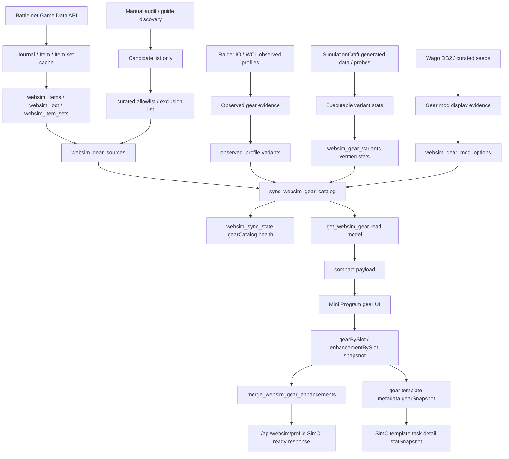

# 装备模拟全链路 Runbook

> 适用范围：`/api/websim/gear` 装备模拟读模型、装备自建数据库、装备强化配置、制造业装备、全职业专精装备适配、前端展示、SimC profile serializer、生产刷新和回滚。
> 最后更新：2026-06-29。

本文是下一次大版本或赛季装备更新的执行手册。目标不是记录某一次修复，而是把“从上游 API 到线上 UI 和可执行 SimC profile”的完整链路固化成可复用流程。任何新版本装备更新，都应先按本文确认数据入口、证据门禁、审计 SQL、健康指标、全职业专精适配和回滚边界，再做写库或部署。

## 总原则

- DB-first：装备、变体、宝石、附魔、美化、制造业属性、唯一装备标记、武器单双手、职业专精可用性都必须先在后端数据层归一，再交给前端展示。
- Evidence-first：guide、截图、社区经验只作为候选发现；写入 `verified` 必须有结构化证据。缺证据时写 `partial` / `blocked`，带 blocker，不伪装成可用装备。
- Backend-owned contract：前端只消费 `/api/websim/gear` 的结构化 payload，不按物品名、附魔名、职业名或 ID 打补丁。
- Serializer fail-closed：即使前端提交了 stale 或不兼容的 `gearBySlot` / `enhancementBySlot`，后端 `merge_websim_gear_enhancements` 也必须阻断，而不是生成错误 SimC gear line。
- 全职业覆盖：装备候选、武器栏位、护甲类型、主属性、制造业属性搭配、附魔/美化选项，都必须按 40 个职业专精矩阵验证。
- 默认模板诚实展示：`default_template / 默认模板` 只能作为社区装备样本不足时的兜底导入入口，不是 Raider.IO/WCL 玩家样本，不是 BiS，不输出强度结论。
- 完整状态拆分：装备模板 `status=complete` 只表示 16 个 canonical 槽位完整且 SimC serializer 可执行；宝石、附魔、美化和 `crafted_stats` readiness 必须通过独立 `enhancementReadiness` 表达。
- 可回滚：任何生产写库前必须备份实际写入的数据库。当前 `WOW_DATABASE_RUNTIME=postgres_personal` 下通常需要同时考虑 SQLite fallback 和 PostgreSQL target；任何代码部署前必须能区分“代码回滚”和“DB 回滚”。
- 不下载不写入：拉取远端数据、下载外部文件、生产 SSH/DB 写入、Wago/SimC 数据刷新，都必须先取得 owner 明确批准。

## 端到端链路



关键点：

- 上游数据只负责生产候选和证据，不能直接绕过 DB 进入 UI。
- `websim_sync_state` 是发布和巡检的健康快照，但 `/api/data/health` 必须能重审当前 runtime 事实，不能被旧快照遮蔽。SQLite fallback 与 PostgreSQL read-model seam 的状态不一致时，文档和交付说明必须写清楚实际消费的是哪一个 target。
- `/api/websim/gear?...compact=1` 是小程序主消费口，必须只返回 display-ready、当前职业专精适用、当前装备类型可用的候选和强化项。
- `/api/websim/profile` 是最终 serializer gate；所有 UI 裁剪都只是体验优化，不是信任边界。
- SimC 任务详情展示的角色属性来自 verified `statSnapshot` 或 stored `gearSnapshot` 的后端回放，不来自任务列表临时计算。

## 上游数据源与可信边界

| 来源 | 用途 | 可作为 verified 的条件 | 不可做的事 |
| --- | --- | --- | --- |
| Battle.net Game Data API：journal instance / encounter / loot | 当前赛季地城、团本、首领、掉落物品候选 | journal 全量无截断；item metadata 已缓存；source 属于当前 active season | 不能把低等级 preview stats 当成当前赛季可模拟属性 |
| Battle.net item metadata / preview item | 物品名、图标、inventory type、护甲/武器 subclass、unique / limit category、插槽能力、部分 item-set refs | metadata verified，槽位/类型可解析，和 source/variant 对账无 mismatch | 不能单独证明当前难度/装等变体可执行 |
| Battle.net item-set API | 套装名称、套装件 membership | active season 期望集合全部可同步，set item source 对账完整 | membership 不是装备变体，仍需 `websim_gear_variants` |
| SimulationCraft generated data / JSON probe | 当前可执行装备属性、item-level 轨道、crafted_stats 组合、pre-embellished fixed stats | SimC JSON 返回目标 item 的目标装等属性；probe 来源和参数可追溯 | 不能把 SimC 没返回目标 item stats 的结果包装成 verified |
| Raider.IO / WCL observed gear | 真实玩家装备实例、bonus/gem/enchant 样本、partial 反哺 | observed profile 归一化后可作为 evidence；需要 Battle.net metadata + SimC 可执行属性才能提升官方 readiness | 不能让 observed-only Unknown 装备直接变成官方 catalog verified |
| Wago DB2 / SimC enchant evidence | 附魔中文名、enchant id、可读 display label | 单一 enchant id、中文名已同步、槽位/装备类型规则已分类 | 不能把职业专属/临时武器强化塞进普通装备附魔 |
| Curated allowlist / exclusion list | 制造业目录、特殊固定属性装备、blocked/unsupported 清单 | 每条带 itemId、slot、证据类型、轨道支持和排除原因 | 不能扩大成“人工真理库”；缺证据时必须 blocked |
| Wowhead / Method / guide / 截图 | 候选发现、人工交叉校验、tooltip 差异提醒 | 只能触发审计；最终仍需结构化证据或 server-owned override 说明 | 不能作为自动写库 verified 的唯一来源 |

## 核心代码入口

| 层级 | 文件 / 函数 | 职责 |
| --- | --- | --- |
| DB schema | `server/websim_payload.py::ensure_websim_tables` | 创建 `websim_items`、`websim_gear_sources`、`websim_gear_variants`、`websim_gear_mod_options`、`websim_item_sets`、`websim_sync_state` 等表 |
| Blizzard sync | `sync_blizzard_journal`、`sync_blizzard_item_sets`、`save_websim_item_metadata` | 同步 journal、loot、item metadata、item set，并记录截断/blocker |
| SimC generated sync | `sync_simc_generated_data` | 生成 WebSim/SimC 基础数据、profile preset、候选装备证据 |
| Item metadata refresh | `sync_blizzard_build_gear_item_metadata`、`sync_blizzard_preset_item_metadata`、`sync_blizzard_observed_item_metadata` | 补齐装备候选、preset、observed 装备的 Battle.net metadata |
| Source / variant writes | `upsert_gear_source`、`upsert_gear_variant` | 写入 accepted source 和 verified/partial/blocked variant |
| Official variant probes | `backfill_official_item_level_variants_for_instance`、`backfill_official_item_level_variants_for_tier_sets` | 按当前赛季轨道跑 SimC item-level probe |
| Crafted backfill | `server/crafted_gear_backfill.py`、`backfill_crafted_item_level_variants` | 普通制造业和自带美化固定属性制造业入库 |
| Observed promotion | `sync_observed_gear_variants`、`promote_official_gear_variants_from_observed`、`promote_official_gear_variants_from_battle_net_preview` | 用真实实例和可信 preview 反哺官方 source |
| Mod options | `sync_websim_gear_mod_options`、`sync_wago_gear_mod_option_display_names`、`sync_blizzard_gear_mod_option_metadata` | 宝石、附魔、美化、crafted_stats option 入库和展示名同步 |
| Catalog health | `sync_websim_gear_catalog`、`build_gear_catalog_sync_state`、`gear_catalog_health_payload` | 统一重建 catalog，生成 coverage/readiness/blocker |
| Read model | `get_websim_gear`、`get_websim_gear_catalog_items` | 按职业专精、槽位、装备类型、主属性、来源筛选 compact payload |
| Compact payload | `compact_gear_candidate`、`compact_crafted_gear_variants`、`display_ready_gear_mod_options_by_slot` | 输出小程序显示字段，折叠制造业属性选项，过滤不可展示强化项 |
| Serializer | `merge_websim_gear_enhancements`、`build_websim_profile_response` | 校验 saved snapshot，生成 SimC-ready profile 或 blockers |
| Stat snapshot | `build_websim_gear_stats_response`、`backfill_simcraft_template_detail_stat_snapshot` | 用结构化 gear/talent 上下文生成 verified 角色属性快照，供 SimC 模板确认页和任务详情展示 |
| Default templates | `sync_community_gear_templates`、`build_default_community_gear_template` | 用 verified 当前赛季候选和 verified `mplus_mixed_route` 绿字权重生成 `默认模板` 兜底，并把缺证据专精写入 sync run / health |
| API | `server/news_backend.py` | `/api/websim/gear`、`/api/websim/profile`、`/api/data/health` |
| Frontend | `pages/builds/detail.*` | 装备栏、候选 sheet、详情、强化配置、保存模板；只消费后端结构化字段 |

## DB 表职责

| 表 | 写入来源 | 发布前必须确认 |
| --- | --- | --- |
| `websim_items` | Battle.net item metadata、observed metadata refresh、crafted metadata refresh | `metadataStatus=verified`；slot、armorType、weaponType、inventoryType、icon/name 可解析 |
| `websim_loot` / `websim_instances` / `websim_encounters` | Battle.net journal cache | 当前赛季 dungeon / raid coverage 无截断；journal loot expected/cached/source 对账完整 |
| `websim_item_sets` / `websim_item_set_items` | Battle.net item-set API | active season expected set 全部有 detail；套装件都有 catalog source |
| `websim_gear_sources` | journal、tier set、crafted allowlist、observed evidence | 只保留当前赛季 accepted / governed source；旧 source、legacy bucket、ungoverned crafted 不得进入候选 |
| `websim_gear_variants` | SimC probe、observed promotion、Battle.net trusted preview、crafted backfill | `verified` 必须有 `itemStats` 或 `statSummary`；`partial` / `blocked` 必须有 blocker |
| `websim_gear_mod_options` | socket/enchant/embellishment/crafted_stats sync | display-ready、单一 ID、槽位和装备类型规则正确；职业专属/临时效果默认 excluded |
| `websim_sync_state` | full sync / catalog sync | 存 coverage 和 blocker 快照；发布报告读取 `/api/data/health` 复核当前事实 |
| template tables | 用户保存/社区模板 | 保存结构化 `gearBySlot` / `enhancementBySlot`；装备模板 metadata 可保存 compact `gearSnapshot` 和 verified `statSnapshot`；最终可执行性以后端 serializer 为准 |

## 数据生产流程

### 1. 版本范围确认

每次版本更新先确认：

- 当前资料片 / 赛季 key。
- 当前赛季 M+ dungeon 列表、raid 列表、tier set 列表。
- 普通装备轨道：如 champion / hero / myth / void_upgrade 的装等。
- 制造业轨道：如 crafted_myth / crafted_void_upgrade 的装等。
- 新职业、新专精、职业装备限制、武器规则或主属性规则是否变化。
- 新宝石、附魔、美化、optional reagent、职业专属强化是否变化。
- SimulationCraft 版本和游戏 build 是否支持目标物品。

没有确认范围前，不跑生产写库。

### 2. 只读审计

生产或本地 DB 先只读审计，不直接修：

```sql
select source_type, status, count(*)
from websim_gear_sources
group by source_type, status
order by source_type, status;

select source_type, status, count(*)
from websim_gear_variants
group by source_type, status
order by source_type, status;

select item_id, slot, source_type, difficulty_key, item_level, status, blockers_json
from websim_gear_variants
where status = 'verified'
  and (payload_json is null
       or (json_extract(payload_json, '$.itemStats') is null
           and json_extract(payload_json, '$.statSummary') is null))
limit 50;

select option_type, status, count(*)
from websim_gear_mod_options
group by option_type, status
order by option_type, status;
```

审计目标：

- 找出旧赛季 source、legacy source、`needs-variant`、preview placeholder。
- 找出 verified 但缺属性的 variant。
- 找出制造业错误 itemId、unsupported item、缺 `crafted_stats` 映射或错误装等轨道。
- 找出宝石/附魔/美化中多 ID、英文兜底、职业专属、临时强化、装备类型不匹配的 option。
- 找出职业专精武器栏位异常，例如增强萨副手盾牌、酒仙副手缺单手武器、狂暴战副手缺双手武器、冰 DK 单手/双手互斥处理错误。

### 3. 备份和刷新顺序

生产写库前先备份实际写入的数据库，并在发布记录里写出路径。当前开发工具阶段的 PG hybrid runtime 通常写 `wow_test`；正式发布 cutover 后才写 `wow_prod`。推荐刷新顺序：

1. `sync_simc_generated_data`：更新 SimC generated/preset 基线。
2. `sync_blizzard_journal`：同步当前赛季 journal loot，确保 limits 无截断。
3. `sync_blizzard_item_sets`：同步 active season item-set detail。
4. `sync_blizzard_*_item_metadata`：补齐 build/preset/observed/crafted 相关 item metadata。
5. `backfill_official_item_level_variants_for_instance`：按实例切片生成 M+ / raid item-level 变体。
6. `backfill_official_item_level_variants_for_tier_sets`：生成套装变体。
7. `sync_observed_gear_variants`：导入 Raider.IO / WCL 真实玩家实例。
8. `promote_official_gear_variants_from_observed` / `promote_official_gear_variants_from_battle_net_preview`：只在门禁满足时反哺 official source。
9. `server/crafted_gear_backfill.py` + `backfill_crafted_item_level_variants`：生成普通制造业和自带美化固定属性制造业。
10. `sync_websim_gear_mod_options`：刷新 socket/enchant/embellishment/crafted_stats。
11. `sync_wago_gear_mod_option_display_names`：补齐附魔中文 display name。
12. `sync_blizzard_gear_mod_option_metadata`：补齐宝石等 option 的 item metadata。
13. `sync_websim_gear_catalog`：重建 catalog 健康快照。
14. `sync_community_gear_templates`：归档真实装备样本 / SimC preset 后生成默认装备模板；缺证据时只写 blocker，不落库兜底模板。
15. `/api/data/health`：发布前最终审计。

除非在事故修复中明确隔离范围，否则不要跳过最后的 catalog rebuild 和 health 复核。

### 默认装备模板生成门禁

默认装备模板 builder 只消费当前 runtime read model 已有证据，不触发外部下载或生产 backfill：

- 输入：verified 当前赛季 gear catalog、verified `build_stat_weight_cache(class_key, spec_key, mplus_mixed_route)`、武器规则、mod option catalog。
- 候选池：当前赛季、当前 class/spec compatible、SimC-ready、verified variant，且不能是 `source_reference`、partial、blocked、错季或 observed-only 未提升候选。
- 评分：先按 `DEFAULT_GEAR_TEMPLATE_ILEVEL_GUARDRAIL` 保护装等大档，再在同档或接近装等内按副属性权重排序。
- 饰品：补满 `trinket1/trinket2`，但 `templateEvidence.warnings` 固定说明饰品特效未优化。
- 非纯 DPS：坦克、治疗、增辉使用 M+ mixed-route 副属性权重，只能作为通用可执行起点，不得声称生存、治疗量或团队收益最优。
- 输出：`sourceKey=default_template`、`sourceName=默认模板`、`scenarioKey`、`enhancementReadiness`、`statWeightRevision`、`gearCatalogRevision`、`templateEvidence`。
- 失败：缺权重、缺槽、武器规则不兼容、唯一装备超限或 serializer 无法生成 16 行时，`sync_community_gear_templates` 在 `defaultTemplates.blockers` 报告 class/spec、原因、缺失槽位和补齐路径，不生成模板。

## 入库门禁

### 官方掉落 / 套装

可进入玩家候选的 source 必须满足：

- 来自当前赛季 accepted M+ / raid / tier set。
- `source_status` 不是 legacy、excluded、inactive、stale placeholder。
- item metadata 已 verified，且 slot / armor type / weapon type 无 mismatch。
- 对可执行装备，必须有 `verified` variant；若只有 source 或缺 SimC 可执行参数，保留 `partial` 并展示详情，不允许保存为可执行模板。

官方变体 `verified` 必须满足：

- 有确定 `item_id + slot + difficulty_key + item_level`。
- 有 SimC JSON 或等价可信来源返回的目标装备属性。
- `payload_json.derivedVariantSource` 明确，例如 `simulationcraft_item_level_probe`、`battle_net_preview`、`simulationcraft_preembellished_item_probe`。
- `payload_json.statSource` 明确，当前以 `simulationcraft` 为主。

### 制造业

制造业只允许 governed catalog source，不恢复旧 ungoverned seed。

普通可选属性制造装备：

- 来源必须来自 Battle.net metadata 中的制造业标记、SimC preset 证据或小范围 curated allowlist。
- 标准 `crafted_stats` 组合必须有 SimC 映射和目标装备属性。
- 变体按 `crafted_stats` 维度保存并在 compact payload 折叠为“装等轨道 + 属性搭配”。
- 当前普通制造业轨道是 `crafted_myth=285`；仅武器、盾牌或有证据支持虚空晋升的装备可生成 `crafted_void_upgrade=295`。

自带美化固定属性制造装备：

- 需要 Battle.net `preview_item.limit_category=装备唯一：美化（2）` 或等价 unique embellishment 证据。
- 需要 fixed-stat SimC probe 返回目标装备属性。
- 可以没有 `crafted_stats`；compact payload 必须明确 `hasBuiltInEmbellishment`、`builtInEmbellishmentLabel=美化`。
- 同槽不能再叠加独立美化，且自动计入 `美化 1/2`。

Unsupported / excluded：

- 已知错误或非本轮链路支持的物品必须留在 exclusion / unsupported 清单，不能临时伪造 option。
- 单副属性工程制造、随机属性 BoE、旧赛季制造、被误判来源的副本掉落，都应 blocked，直到有新链路支持。

### 宝石、附魔、美化和制造属性 option

`websim_gear_mod_options` 写入 display-ready option 之前必须分类：

- `socket`：只保留当前 PVE 可用、等级/品质正确、单颗宝石、metadata 和属性展示可信的选项。
- `enchant`：必须是普通装备行附魔；职业专属 precombat、临时武器强化、药剂/战斗准备效果默认 excluded。
- `embellishment`：必须是当前赛季 optional reagent，且按装备类型规则限制护甲、武器、盾牌、Held In Off-hand 等。
- `crafted_stats`：必须是 SimC 支持的属性组合；显示时按职业专精主属性裁剪。

附魔准确性特别规则：

- `唤潮者的护卫` 一类奶萨专属特殊灌魔，不进入普通装备附魔 UI；如果未来支持，应走 `combatPreparation/profilePreparationPolicy`，不是装备槽位附魔。
- `朗多雷之锐` 一类普通武器附魔可以保留，但按装备类型过滤：主手武器可显示；`off_hand` 只有可附魔副手武器时显示；`INVTYPE_HOLDABLE` 和盾牌默认不显示，除非新的结构化证据明确反证。
- 后端 `display_ready_gear_mod_options_by_slot` 先过滤，前端只镜像同一结构做即时交互。
- serializer 必须重新验证 option catalog，不能信任前端提交。

## 强化机制复核：宝石 / 附魔 / 美化 / 套装

本节和天赋模拟 runbook 保持同一边界：上游证据与可执行字段先进入后端读模型，前端只消费结构化 payload；前端可以做交互镜像和旧载荷兼容，但不能成为规则来源。

### 宝石

- 上游入口是 `websim_gear_mod_options.option_type='socket'`、Battle.net 宝石 metadata / tooltip 证据和服务端维护的当前 PVE 二星宝石 seed。Observed profile 中的 `gem_id` 只作为实例证据，不反推 socket catalog；多宝石组合不进入玩家可选项。
- 当前可配置槽位由后端 `SOCKET_OPTION_GEAR_SLOT_CAPACITY` 给出：`neck=1`、`finger1=1`、`finger2=1`。对外仍显示 3 个宝石槽，但底层是三件装备各自的 `socketCount=1`，不是前端写死总数 3。
- `item_mod_capabilities` 在 compact item 上输出 `hasSocket/socketCount`；`display_ready_gear_mod_options_by_slot` 只下发 display-ready 的单颗宝石选项。宝石 metadata 或属性展示未验证时，option 保持 blocked/不可见。
- 前端 `gearItemSocketCapacity` 读取 `modCapabilities.socketCount`、socket 数组等显式容量证据；仅在旧 payload 明确 `hasSocket=true` 但缺少容量字段时按 1 做兼容兜底。属性概览和金色 tag 都按当前装备 + 已确认 `enhancementBySlot` 统计。
- 主属性宝石按 `primary_stat_gem` 唯一组处理：前端禁用超额选择，后端 serializer 继续把超过 1 颗的快照判为 blocker。

### 附魔

- 上游入口是 Wago DB2 / SimC enchant evidence 与服务端分类规则。普通装备行附魔进入 `websim_gear_mod_options.option_type='enchant'`；职业专属 precombat、临时武器强化、药剂/战斗准备效果默认 blocked/excluded。
- 腿部护甲片归入附魔链路，最终同样写 `enchant_id`，因此属性概览和强化配置 sheet 都把腿部护甲片计入“附魔”。
- 后端 `ENCHANTABLE_GEAR_SLOTS` 是候选能力范围，不等于 UI 固定上限；`item_can_enchant_slot` 还会按装备类型排除 Held In Off-hand、盾牌等不能附武器附魔的副手。
- Read model 只把 display-ready 且适用于当前 item 的 `enchantOptions` 下发给前端。前端 `gearItemEnchantCapacity` / `gearEnhancementMetricUsage` 按当前已选装备、实际可配置行和受控兜底统计上限，避免把不存在 option 的槽位算进概览。
- Serializer 在 `merge_websim_gear_enhancements` 里重新附加 catalog option 并验证；stale enchant、错误副手类型、盾牌武器附魔等都必须 blocker。

### 美化

- 上游入口包括 SimC embellishment key、Wago/DB2 optional reagent 证据、Battle.net 物品 metadata，以及制造业装备自带美化的 unique / limit-category 证据。
- 独立美化走 `websim_gear_mod_options.option_type='embellishment'` 和 slot group；自带美化不进入二次选择，而是在装备 item 上输出 `builtInEmbellishment` / `builtInEmbellishmentLabel=美化`。
- 前端 `buildGearEnhancementSheet` 同时统计自带美化和玩家已选独立美化，最大值固定为 2；达到上限后禁用其他独立美化。同一装备已自带美化时，不展示该槽位的独立美化选择。
- 同一槽位可以同时展示宝石、附魔、美化三组，前提是该 item 的三类 option 都有后端 display-ready 证据；不要因为同槽存在某一类强化就隐藏另外两类。
- Serializer 重新计算自带美化 + 独立美化总数，超过 2 或同槽叠加自带/独立美化都必须 blocker。

### 套装

- 套装不属于 `enhancementBySlot`，不进入“配置宝石、附魔”sheet。上游从 Battle.net item-set API 和当前赛季 source/variant 证据进入 `websim_item_sets` / `websim_item_set_items` 与装备候选 metadata。
- Read model 在装备 item 上保留 `itemSetName`、`sourceType='tier_set'` 等结构化信息。前端 `gearTierSetCountForPanel` 只按当前已选装备自动统计同一套装件数，展示上限为 5，不提供普通玩家手工开关。
- v1 不显式写 SimC `set_bonus` token；如果后续需要，需要新增已验证 set membership 到 SimC token 的映射。缺映射时应 profile blocked，而不是让前端伪造套装效果。

### 复核证据

- 后端测试重点：socket 不从 observed gem 反推、宝石 metadata/stat display 门禁、腿部护甲片作为 enchant、职业专属/临时附魔过滤、副手/盾牌过滤、美化 slot group 和自带美化计数、套装 item-set backfill。
- 前端测试重点：属性概览按 `socketCount` 统计宝石上限、腿部护甲片计入附魔上限、同槽宝石/附魔/美化三组共存、确认后才显示装备卡金色 tag、主属性宝石唯一、套装 5 件上限。

## 全职业专精适配

### 规则来源

职业专精适配由后端统一维护：

- `SPEC_WEAPON_EQUIPMENT_RULES`：每个职业专精的主手/副手装备模式。
- `primary_stat_key_for_spec`：每个职业专精的主属性。
- `gear_compatibility_from_payload`：根据 Battle.net inventory type、armor subclass、weapon subclass、class/spec 规则判定候选是否可用。
- `gear_candidate_slots` / `gear_candidate_incompatible`：把一件装备映射到可用 canonical slot，或排除候选。
- `apply_spec_primary_stat_display_fields`：按专精裁剪装备属性展示。

### 武器栏位规则

下一次版本更新必须全量核对 40 个职业专精，不只修截图案例。重点规则：

- 双手专精：副手应不可选择；已穿双手武器时 off_hand 为空或被规则阻断。
- 双持单手专精：main_hand 和 off_hand 都应出现适用单手武器，不应出现盾牌或 Held In Off-hand，除非该专精确实可用。
- 狂暴战：main_hand / off_hand 都可出现双手武器。
- 冰 DK：同时支持双手武器路线和双持单手武器路线；read model 和 serializer 都不能把另一条路线误删。
- 增强萨：main_hand / off_hand 都显示适用单手武器；off_hand 不展示盾牌。
- 酒仙武僧：若当前规则允许双持，应展示副手单手武器，不被默认双手推荐锁死。
- 盾牌：只对允许盾牌的职业专精开放，并且与普通 off-hand weapon / holdable 区分。
- Held In Off-hand：法系副手，不等于副手武器；不能附武器附魔，也不能被双持职业误用。

### 护甲和装备类型

- 板甲、锁甲、皮甲、布甲按职业/专精过滤。
- 项链、披风、戒指、饰品是通用槽位，但仍需按唯一装备、职业限制、主属性展示裁剪。
- 职业专属装备或 metadata 中带 class restriction 的物品必须按 restriction 过滤。
- 制造业 source 也要走同一套装备类型规则，不能因为 `source_type='crafted'` 绕过职业专精选项。

### 主属性和属性展示

- 装备明细只展示当前职业专精 relevant primary stat：战士只展示力量，不展示同一装备上的敏捷分支；法系只展示智力。
- `craftedStatOptions` 中的 `+力量 / +敏捷 / +智力` 也按当前主属性折叠为当前专精需要的主属性文案。
- 不高亮主属性到压过整体信息；按现有装备明细样式展示即可。
- 属性裁剪只影响展示，不应删除 SimC 所需原始 payload。

### 装备标签

装备详情和候选行应展示后端结构化标签：

- 武器单双手：`handednessLabel=单手/双手`。
- 唯一装备：`uniqueEquippedLabel=唯一` 或 `equipmentBadges` 中的唯一标签。
- 自带美化：`builtInEmbellishmentLabel=美化`。
- 其他限制：只在后端已有结构化字段时展示，前端不从名字猜。

## Read Model 合同

`get_websim_gear` 的输出是小程序唯一装备模拟读合同。核心要求：

- 接收 `class` / `spec` / `compact=1`，按当前职业专精生成结果。
- 只输出 16 个 canonical slot 及适用候选。
- 候选必须先过 metadata/source/variant readiness，再过 class/spec compatibility。
- compact payload 必须保留 UI 所需字段：`itemId`、`name`、`iconUrl`、`slot`、`itemLevel`、`difficultyLabel`、`sourceTypes`、`sourceLabel`、`statSummary`、`primaryStatKey`、`handedness`、`handednessLabel`、`uniqueEquipped`、`uniqueEquippedLabel`、`equipmentBadges`、`socketOptions`、`enchantOptions`、`embellishmentOptions`、`craftedStatOptions`。
- 制造业多变体折叠到同一候选，玩家在 sheet 内选择装等轨道和属性搭配。
- 同一装备不能因为有多个 source/variant 造成重复候选；source filter 计数要与可见候选一致。
- `slotReadiness`、`catalogHealthSummary`、`weaponRule` 要帮助前端和 smoke 判断是否有规则缺口。
- read model 可以保留 partial 候选详情，但不能让 partial 成为可保存/可执行配置。
- 后台门禁治理台 `装备库` 主视图必须与本读模型对齐：按 `itemId + slot` 聚合、以 verified / SimC-ready 代表变体决定主状态，partial / needs-variant / observed 技术行只作为诊断证据或去重后的装等轨道展示。

## 前端 UI 合同

`pages/builds/detail.*` 只做展示和交互状态管理：

- 已选装备卡片展示装备名、图标、装等、装备标签、强化状态。
- 候选 sheet 按后端 sourceTypes/source counts 展示来源筛选，不自行推断装备来源。
- 装备详情展示后端提供的属性、武器单双手、唯一、美化等标签。
- 强化配置 sheet 按后端返回的 `socketOptions` / `enchantOptions` / `embellishmentOptions` 展示；换装备后裁剪 stale draft。
- 保存模板只保存结构化 `gearBySlot` / `enhancementBySlot` 快照；不要在前端拼 SimC profile 字符串。
- 保存装备模板时可以写入 `metadata.gearSnapshot`，以及与当前 class/spec/race/scenario/talents/gear 签名匹配的 verified `metadata.statSnapshot`。不要保存 raw SimC stdout、完整 profile 或用于展示以外的临时计算字段。
- 前端可以做即时交互镜像，例如美化上限、同槽自带美化裁剪、装备切换后移除不兼容强化项；但这些都必须以后端 serializer 再校验为准。
- 不新增按名称或 ID 的临时特判。若 UI 需要新标签，先让后端 compact payload 输出结构化字段。

## SimC 属性快照复用

装备模拟链路会被 SimC 模板页和任务详情复用来展示“这次模拟对应的角色属性”。这不是列表 UI 字段，而是一条独立的 compact snapshot 合同：

- `pages/simulator/simc.js` 在模板确认页请求 `/api/websim/gear/stats`，成功后只把 verified `statSnapshot` 写回装备模板 metadata。请求签名变化时，例如换种族、场景、天赋或装备，旧快照必须失效。
- 最终提交 `mode=simcraft_template` 时，前端只携带结构化 `gearSnapshot` 和当前仍匹配的 compact `statSnapshot`。大体积 profile/rawString 不应靠前端 setData 长期保存。
- 后端 `simcraft_template_report_stat_snapshot_from_request` 只接受 `statStatus=verified` 的快照，并裁剪为主属性 + 暴击/急速/精通/全能四项副属性。
- 历史任务详情如果缺少 `simcReport.build.statSnapshot`，但 `request_json.templateContext.gear.metadata.gearSnapshot` 和天赋 rawString 仍完整，`backfill_simcraft_template_detail_stat_snapshot` 会用 `build_websim_gear_stats_response` 回放一次，并把 compact snapshot 写回 `analysis_json`。
- 如果任务没有足够的 `gearSnapshot` 或天赋上下文，详情页应隐藏属性区，不显示 `待补`、不从 DPS 或装备名反推属性。
- 任务列表只读 `simulator_tasks.summary_json`，不能为了 tag 或完成时间触发属性计算；属性快照只属于确认页和详情页。

## Serializer 合同

`merge_websim_gear_enhancements` 是最终兜底：

- 读取已选 `gearBySlot` 和 `enhancementBySlot`。
- 按当前职业专精重新验证武器/护甲/槽位兼容性。
- 重新附加 catalog enhancement options，验证 gem/enchant/embellishment/crafted_stats 是否仍在当前 DB 允许列表。
- 计算自带美化 + 独立美化数量，超过 2 阻断。
- 同槽自带美化装备禁止再叠加独立美化。
- 不兼容武器附魔、Held In Off-hand 附武器 enchant、盾牌附普通武器 enchant 都必须产生 blocker。
- 缺装等、缺 variant、缺 crafted_stats、partial source、无 SimC 参数的装备不得写入 SimC gear line。
- 最终返回 `simcReady`、`missingFields`、`blockers` 和可执行 profile；失败时返回原因，不沉默降级。

## Health 和审计指标

发布前必须检查 `/api/data/health` 的 `gear_catalog`：

- `dataReadiness`：metadata、属性、护甲/武器类型、槽位、source coverage。
- `simulationReadiness`：可执行 variant coverage，partial/blocked examples。
- `sourceCoverage`：dungeon、raid、tier_set、crafted 计数。
- `seasonSourceCoverage`：当前赛季 dungeon/raid/item-set/journal loot 完整性。
- `variantReadiness`：verified/partial/blocked 数量。
- `slotCoverage`：16 个 canonical slot 是否覆盖。
- `itemMetadata`：missing verified metadata、missing stat、armor type、weapon type、slot mismatch。
- `modOptionCoverage`：socket/enchant/embellishment/crafted_stats option count、excluded examples、status。
- `weaponRuleCoverage`：40 个职业专精规则覆盖，missing 必须为 0。

典型 blocker 处理：

- `missing deterministic SimC variant preset`：source 有了，但缺可执行实例化变体；需要 observed 样本或 SimC probe。
- `SimC JSON did not include target item stats`：不能写 verified，保持 partial。
- `Battle.net journal truncated`：同步预算不足，不能把 catalog 标完整。
- `missing Battle.net item metadata`：先补 metadata，不要用名字/ID 猜 slot。
- `item set pieces missing gear catalog source`：item-set detail 已有，但装备 source 缺失。
- `mod option excluded`：确认 exclusionReason 是否合理；合理则记录，不合理再修分类。
- `weaponRuleCoverage missing`：新增/改动职业专精后必须补规则和测试。

## 生产更新快路径

下一次大版本更新按以下顺序执行。生产 SSH、远端 DB 写入、下载/刷新外部数据前先请求 owner 明确批准。

### A. 准备

- 读 `docs/roadmap.md`、本文、`docs/gear-database-governance.md`、最近一次版本 plan。
- 确认当前 git 状态，保留无关用户改动。
- 确认版本范围：赛季、实例、团本、套装、制造业、强化项、职业规则。
- 列出需要刷新或新增的上游证据源。
- 如果需要下载或远端数据刷新，先拿批准。

### B. 本地/只读审计

```bash
python3 -m unittest tests.websim_payload_test
node --test tests/builds-page.test.js
git diff --check
```

只读 SQL：

```sql
select option_type, status, count(*) from websim_gear_mod_options group by option_type, status;
select source_type, status, count(*) from websim_gear_variants group by source_type, status;
select json_extract(payload_json, '$.exclusionReason') as reason, count(*)
from websim_gear_mod_options
where status = 'blocked'
group by reason
order by count(*) desc;
```

### C. 生产写库

- 备份实际写入的 SQLite / PostgreSQL target，记录完整路径。
- 按“数据生产流程”顺序刷新。
- 每个阶段输出 counts 和 examples，不只看成功/失败。
- 发现 partial 时先分类：真实上游缺口、规则缺口、metadata 缺口、SimC 缺口、误入库残留。
- 只修本轮 scope；无关历史数据不顺手改。

### D. 读模型和 UI smoke

至少抽样：

- 增强萨：main/off hand 都是单手武器，副手无盾牌。
- 酒仙武僧：若双持规则允许，副手可选单手武器。
- 狂暴战：main/off hand 都可双手武器。
- 冰 DK：双手与双持路线都可见且不互相误删。
- 法师冰霜：off_hand 只显示 Held In Off-hand，不显示盾牌和武器附魔。
- 奶萨/元素/增强萨：盾牌规则、职业专属附魔、武器附魔分层正确。
- 战士/圣骑士/DK：力量主属性展示；不展示敏捷制造属性。
- 猎人/盗贼/武僧/DH/野德：敏捷主属性展示；不展示力量/智力制造属性。
- 法师/术士/牧师/奶德/鸟德/奶萨/元素/奶骑/奶僧/唤魔师：智力主属性展示。
- 自带美化装备：候选和已选卡片显示“美化”，并计入 `美化 1/2`。
- 唯一装备：候选详情和已选卡片显示“唯一”标签。

### E. API smoke

```bash
curl -fsS "$BASE_URL/health"
curl -fsS "$BASE_URL/api/data/health"
curl -fsS "$BASE_URL/api/websim/gear?class=shaman&spec=enhancement&compact=1"
curl -fsS "$BASE_URL/api/websim/gear?class=monk&spec=brewmaster&compact=1"
curl -fsS "$BASE_URL/api/websim/gear?class=warrior&spec=fury&compact=1"
curl -fsS "$BASE_URL/api/websim/gear?class=death_knight&spec=frost&compact=1"
curl -fsS "$BASE_URL/api/websim/gear?class=mage&spec=frost&compact=1"
```

全职业 traversal 要覆盖 `WOW_CLASSES` 中全部 40 个职业专精，请求失败数为 0；若某些专精因双手/无副手导致 off_hand 不可选，必须由 `weaponRule` 解释，而不是缺数据。

### F. 部署和记录

- 部署前跑本地测试和 `git diff --check`。
- 部署后复核 `/health`、`/api/data/health`、关键 compact payload。
- 记录生产备份路径、刷新命令摘要、health counts、sample specs、已知 partial/blocker。
- 更新 `docs/roadmap.md` 近期落地证据。
- 如有新长期规则，更新本文或 `docs/gear-database-governance.md`。

## 回滚

### 代码回滚

适用：UI 展示、read model、serializer 逻辑错误，但 DB 数据仍可信。

- 回滚代码版本或重新部署上一版。
- 不动数据库。
- 复核 `/health`、`/api/data/health` 和关键 compact payload。

### DB 回滚

适用：错误写库污染 source/variant/mod option，或大批 verified 错误。

- 停止会继续写库的同步 job。
- 备份当前坏库以便事后分析。
- 恢复本轮写库前的 SQLite / PostgreSQL target 备份，按实际写入落点处理。
- 重启服务或 reload DB 连接。
- 复核 `/api/data/health` 和关键 compact payload。
- 在 roadmap / plan 记录坏库原因和恢复路径。

### 局部修正

适用：少量 option 分类、单个 item source、单个 exclusion 误判。

- 仍需先备份。
- 写最小 SQL 或脚本修正。
- 立即跑 catalog rebuild 和 health。
- 若是规则问题，补测试和代码，不只改 DB。

## 测试矩阵

### 后端

必须覆盖：

- 全职业专精 gear payload smoke。
- 武器规则：双手、双持、狂暴战双持双手、冰 DK 双路线、盾牌、Held In Off-hand。
- 护甲类型和职业限制。
- 主属性裁剪：装备 stat summary、craftedStatOptions、候选详情。
- 唯一装备和自带美化 badge。
- `websim_gear_mod_options` display-ready 规则：socket/enchant/embellishment/crafted_stats。
- 附魔 blocked：职业专属、临时强化、off-hand holdable / shield 不兼容。
- serializer blockers：stale enchant、stale embellishment、过量美化、不兼容武器、partial variant。
- health coverage：source、variant、mod option、weapon rule。

当前主测试入口：

```bash
python3 -m unittest tests.websim_payload_test
```

### 前端

必须覆盖：

- 候选 sheet 来源筛选和计数。
- 装备详情展示 weapon handedness、unique、美化标签、主属性裁剪。
- 强化配置不展示 blocked option。
- 换装备后裁剪 stale draft，确认按钮不保存旧 option。
- 保存模板使用 `gearBySlot` / `enhancementBySlot`，不拼 profile。

当前主测试入口：

```bash
node --test tests/builds-page.test.js
```

### 静态检查

```bash
git diff --check
```

## 常见事故和处理

| 现象 | 首先检查 | 修复方向 |
| --- | --- | --- |
| 某职业看到错误护甲 | `websim_items.payload_json.inventory_type`、`armorType`、`gear_compatibility_from_payload` | 补 metadata 解析或职业护甲规则，不能前端隐藏 |
| 副手出现盾牌/法系副手/武器错位 | `SPEC_WEAPON_EQUIPMENT_RULES`、weaponType、inventoryType | 更新专精武器规则和 serializer blocker |
| 制造业出现非本职业主属性 | `primary_stat_key_for_spec`、`compact_crafted_stat_option` | 后端裁剪展示，保留原始 payload |
| 附魔出现职业专属/临时效果 | `websim_gear_mod_options.payload_json.configCategory`、`exclusionReason` | 改分类规则，blocked 后不进入 compact payload |
| UI 看得到但保存失败 | serializer blocker | 若 blocker 正确，优化 UI stale 裁剪；若 blocker 错误，修后端 catalog option |
| `/api/data/health` partial 上升 | `simulationReadiness.partialExamples`、`itemMetadata`、`seasonSourceCoverage` | 先分类真实缺口还是代码/数据回归，再决定补 SimC、补 metadata 或回滚 |
| verified 缺属性 | SQL 查 `itemStats/statSummary` | 立即改为 partial/blocked，补 probe 后再 verified |
| 旧赛季装备混入 | `source_reference`、season fields、source status | 清理 inactive/legacy source，补 season coverage gate |

## 新版本更新清单

每次版本更新完成前，在发布记录中逐项确认：

- [ ] 当前赛季 dungeon / raid / item-set 期望集合已更新。
- [ ] Battle.net journal sync limits 无截断。
- [ ] Battle.net item metadata missing / mismatch 为 0，或 blocker 明确。
- [ ] 官方 source 与 variant verified/partial/blocked counts 已记录。
- [ ] verified variant 缺属性数为 0。
- [ ] 制造业 allowlist、unsupported/excluded 清单已更新。
- [ ] 普通制造业轨道和自带美化固定属性轨道已分别验证。
- [ ] socket/enchant/embellishment/crafted_stats option coverage 已验证。
- [ ] 附魔职业专属/临时效果 blocked examples 合理。
- [ ] `weaponRuleCoverage` 40/40，missing 为 0。
- [ ] 全职业专精 compact traversal 通过。
- [ ] 重点专精 smoke 通过：增强萨、酒仙、狂暴战、冰 DK、法师、奶萨、力量/敏捷/智力代表专精。
- [ ] 前端装备详情显示单双手、唯一、美化、主属性裁剪。
- [ ] serializer 对 stale / incompatible snapshot fail-closed。
- [ ] `/health`、`/api/data/health`、关键 `/api/websim/gear?...compact=1` 通过。
- [ ] 生产 DB 备份路径、刷新命令、health counts、已知 blockers 已写入 roadmap 或 plan。
