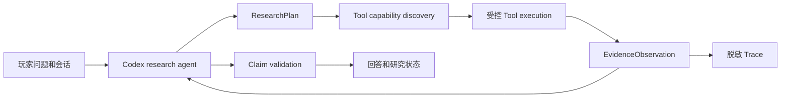

# 炸鸡队长 Codex 自主研究循环设计

状态：`已确认方向；待用户审阅设计；未授权实施`

确认日期：2026-08-04

## 结论

炸鸡队长不再以“问题分类器命中一个预设 capability”为主要智能来源。Codex 是研究
主体：它理解玩家的自然语言目标、提出并修正研究假设、选择和组合 ToolBox、评估返回
证据，再把结论与不确定性讲给玩家。ToolBox 只负责高效、受控地执行原子动作；它不决定
问题的答案，也不把职业、补丁、内容或固定问法编码为后端回答路由。

这不是开放模型任意联网或执行任意代码。约束从“规定 Codex 如何思考”收缩为通用的
执行和事实合同：Tool 有明确能力与输入输出；每一个玩家可见强结论可回指实际观察；
敏感数据、写操作、任意 URL/SQL/Shell 仍不交给模型。

## 玩家体验

玩家问“血 DK 的 PTR 强度如何”或“哪个坦克大秘境最厉害”时，不需要知道来源站点、
Tool ID 或评估公式。队长应：

1. 先理解玩家想得到的是预测、当前高层竞争力、团本输出、个人表现，还是可操作的配装；
2. 只在缺少一个会实质改变答案的条件时追问；否则先自行研究；
3. 展示已经研究过什么、适用范围、样本和更新时间；
4. 对有证据的部分直接给结论，对未验证的部分说明不确定性和下一次可验证的路径；
5. 让自然语言续问延续同一研究目标，或在玩家转题时由 Codex 自行重建目标，绝不因为
   `15/27`、PTR、职业简称等词面分支而卡死。

“最强”可以有相对客观答案，但它必须先成为一个可复现的研究目标，例如“正式服、全球、
高层、全地下城、近 14 天的限时 key 竞争力”。它不是某个专精的固定回答，也不是把单条
最高记录、DPS 或出场率单独冒充总榜。

## 架构选择

| 方案 | 结果 | 判断 |
| --- | --- | --- |
| 扩大 `QuestionFrame → EvidencePlan → capability` 规则树 | 继续为每类问题添加来源和 facet，模型仍只是受限解释器 | 不采用 |
| 让模型自由浏览、选择任意网页或执行任意命令 | 表面通用，但来源、隐私、成本、复现和 prompt injection 不可控 | 不采用 |
| **Codex 自主研究循环 + 受控原子 ToolBox + 通用证据合同** | Codex 自主规划和迭代；ToolBox 只加速查询、比较和计算；结论仍可验证 | **采用** |



`QuestionFrame` 和第一切片 `EvidencePlan` 可作为迁移期的兼容输入或离线对照，但不再
拥有“选择哪一个 Tool、能否继续研究、如何回答”的最终权力。

## Codex 研究循环

### 1. 研究计划

每个用户回合由 Codex 生成结构化、可审计但非问题专用的 `ResearchPlan`。它包含：

```json
{
  "goal": "玩家希望验证的结论",
  "workingHypotheses": ["可被证据推翻的候选解释"],
  "dimensions": {"phase": "", "content": "", "population": "", "timeWindow": ""},
  "informationGaps": ["哪些缺口会改变结论"],
  "toolCalls": [{"capability": "", "arguments": {}}],
  "stopCondition": "何时证据已经足够或必须降级"
}
```

这些字段是通用研究语言，不是 `blood_dk`、`12.1`、`mythic_plus` 或某个站点的枚举路由。
Codex 可在 Tool 返回后重写假设、继续调用另一项能力、比较同口径快照，或在证据充分时
停止。一次回合最多只提出一个真正会改变结论的澄清问题；不会因为没有命中固定分类而让
玩家手工搜资料。

### 2. ToolBox

Tool 的 manifest 面向 Codex 描述能力，而非面向后端描述问题分支：

```text
toolId, version, naturalLanguageCapability, inputSchema, outputSchema,
readWriteClass, sourceScope, freshnessPolicy, costBudget, timeoutBudget,
privacyPolicy, implementationRef
```

第一批能力可以复用现有后端 adapter，只改为真正可供 Codex 编排的原子 Tool：

| 能力 | 作用 | 不负责的事 |
| --- | --- | --- |
| `official.search` | 按 Codex 给出的受限研究维度查询已批准官方来源 | 推导职业排名 |
| `community.query` | 读取一个已签约社区来源的原始、带范围的快照 | 替 Codex 选择研究目标 |
| `ranking.aggregate` | 对同口径候选集计算分位、覆盖、差距和置信区间 | 自行抓取网页或定义玩家意图 |
| `simulation.run` | 在明确的输入和场景下执行 SimC 或同类 runner | 把预测冒充实战排名 |
| `source.inspect` | 判断某个 Tool 返回是否覆盖当前研究目标 | 调用未签约来源 |

新增 Archon、拓宽 Raider.IO 或 WCL 查询口径仍须独立 `SourceContract`。不同之处是：
完成合同后它成为 Codex 可发现的能力，而不是再新增“如果问 X 就调用 Y”的代码分支。

### 3. 通用证据判断

每次 Tool 调用返回 `EvidenceObservation`：来源、查询时间、输入范围、样本定义、数据
新鲜度、事实、限制和失败语义。Codex 基于这些观察组织结论；一个通用 validator 只校验：

1. 可见强结论是否链接到至少一项实际 observation；
2. observation 的阶段、内容、总体、时间窗是否覆盖该结论声明；
3. 聚合结论是否来自 `ranking.aggregate` 的同口径候选集，而不是一个专精样本；
4. 数字、引用和不确定性是否来自 Tool 输出或由可复现聚合计算产生。

validator 不解析“血 DK”“PTR”“元素萨”等特定词，也不指定结论模板。它只拒绝超出
证据范围的声明，并把拒绝原因作为 Codex 的下一轮观察，让 Codex 选择补证、缩小结论或
诚实地给出 `partial`。

### 4. 真实研究状态

当 Codex 的计划需要超过同步预算时，后端创建 owner-bound `ResearchRun`，保存计划版本、
已执行步骤、取消令牌、Tool 状态和可安全展示的进度。只有这种真实任务存在时，聊天才显示
`researching`；短请求仍在当前流式响应中完成。`answered`、`partial`、`blocked` 和
`failed` 仍是业务状态，不能被 HTTP 200、服务存活或模型输出替代。

会话保存的是上一次可安全复用的研究目标、已验证 observations 和它们的范围，不保存模型
思维链、原始来源正文或玩家隐私。续问由 Codex 语义地判断复用、扩展还是废弃旧计划；产品
阶段或内容改变时，validator 会令不兼容 observation 失效。

## 强度排名的通用产出方式

排名是 `ranking.aggregate` 的产物，不是聊天 Prompt 里的一段常量。Codex 先把“最强”解释
为当前问题所需的比较目标，再请求适当快照。

正式服大秘境的一个研究计划可以以“限时 key 高分位、代表性、地下城覆盖度”为指标，并把
样本窗口、区域、key 档位和候选专精集写入聚合输入。PTR 研究计划可采用相同的观察维度，
同时把样本不足、构筑漂移和 SimC 预测单独标为不确定性；它不把正式服实战结果搬到 PTR。

聚合返回的不是只有 `1..N`：还包括每个候选的原始指标、有效样本、覆盖度、误差或并列组。
当差距小于不确定性时，Codex 应回答“同一梯队”，而非捏造精确名次。这条行为由通用的
聚合结果驱动，适用于坦克、治疗、DPS、团本、PVP 和未来的任何可比较能力。

## 运行边界

Codex 可以自主决定调用哪些**已发布且只读**的 Tool、是否并行、何时停止和如何解释。它不能：

- 访问 Tool manifest 未声明的 URL、文件、Shell、SQL、凭据或用户数据；
- 执行写操作、修改 Registry、启动同步/回填、变更生产配置或绕过 owner policy；
- 把工具返回的空、超时、过期或单样本结果改写成完整结论；
- 把完整聊天、来源正文、用户身份或模型思维链写入 Trace。

这些是执行与事实边界，不是职业/版本/问法的产品规则。它们让 Codex 能自由研究，同时使
玩家可见结论仍可复现、可撤销、可回滚。

## 渐进交付

1. **设计确认（本文件）**：确定 Codex 是规划主体，ToolBox 是能力面；不改运行时。
2. **最小自主循环**：只暴露现有已签约的只读 Tool，建立 `ResearchPlan`、多次 Tool 调用、
   `EvidenceObservation` 和通用 validator；候选环境验证后才考虑切流。
3. **排名能力**：为 `community.query` 和 `ranking.aggregate` 建立同口径快照合同；新增
   Archon 或扩展数据源必须各自通过 SourceContract、fixtures、限流和回滚验证。
4. **异步研究与体验**：仅在确有长耗时任务后实现 `ResearchRun`、取消和进度 UI。

第一阶段不会删除现有 Registry、来源 adapter、owner 隔离、Trace 脱敏或候选部署门禁。
旧 `QuestionFrame/EvidencePlan` 在新循环的离线对照、回退和评估通过前不移除。

## 验收与评估

实现前需建立不依赖固定问句的评估集。每一类测试变体化实体、语言、追问顺序和来源可用性，
并验证：

1. Codex 能为未见过的比较问题选择多项互补能力，而不是依赖词面命中；
2. 单专精样本不能通过 validator 变成跨专精排名；
3. Tool 失败后 Codex 能选择已发布的替代能力、缩小结论，或创建真实研究任务；
4. PTR、正式服、团本、大秘境和个人数据的 observation 只在范围兼容时被引用；
5. 回答包含实际来源、范围、样本与不确定性，不泄露内部 Tool ID 或脱敏边界外的信息；
6. Trace 可还原“计划版本、执行能力、结果状态和 claim 判断”，但没有聊天原文、来源正文
   或思维链；
7. 候选环境验证多轮流式聊天、取消、重复提交、超时、Tool 限流和真实微信滚动体验。

## 待进入实施计划前的决策

- `ResearchPlan` 的模型调用、Tool call 协议和成本/时限预算；
- `ranking.aggregate` 的统计合同及各游戏内容的候选集/置信度定义；
- 首个新增 SourceContract 的授权、访问方式、缓存与撤销策略；
- `ResearchRun` 的持久化 schema、取消语义和前端进度呈现；
- 与当前 Evidence Planner 候选、历史 Trace 和已发布 Registry 的并行迁移与回滚矩阵。

在这些决策和实施计划得到单独确认前，本设计不授权新的来源抓取、自由联网、数据库迁移、
运行时改动或候选部署。
