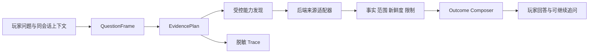

# 炸鸡队长 Evidence Planner 设计

确认日期：2026-08-04
状态：`待用户评审；非执行授权`

本设计承接 [Smart Question Chain](2026-08-03-chickenbro-smart-question-chain-design.md)。它不回退为模型自由联网，也不为某个职业、版本或固定问法编写回答；目标是让玩家的当前版本、PTR、团本或大秘境追问，在证据不足时仍能得到可继续的、可解释的结果。

## 用户问题与目标体验

当前链路能正确阻止一个 M+ 专精样本冒充全职业 DPS/Tier，也能阻止 PTR、正式服、团本和大秘境互相污染。但它把“没有同口径注册比较源”直接变成对话终点：玩家看见原始代理数字、来源能力边界或重试，而不是系统为新问题重新建立研究路径。

玩家应看到的体验是：

1. 自然语言被理解为实体、版本、场景与想要的结论维度，而不是命中某句固定回复。
2. 系统说明已经查到的事实及其来源、适用范围和时间；同时说明尚不能推出的结论。
3. 追问改变比较范围时，系统重新规划证据，绝不沿用不兼容的上一轮数字。
4. 合法且已注册的来源不可用时，显示 `partial` 或真实失败原因；只有已有可恢复任务时才显示 `researching`，绝不伪造后台检索。
5. 新来源（包括 Archon）可被逐一、安全地接入，而不是让模型自行选择网页或把一个导航链接当作实时事实。

## 设计选择

| 方案 | 结果 | 判断 |
| --- | --- | --- |
| 仅改善拒答文案、保留单次 capability 命中 | 体验略好，但广义强度问题仍会终止 | 不采用 |
| **Evidence Plan + 已有受控来源 + 可继续 outcome** | 先改善所有问题的理解、范围解释和追问；不扩大来源权限 | **第一切片采用** |
| 同时接入 Archon、更多 WCL/Raider.IO 口径和异步采集 | 覆盖面最大，但授权、指标可比性、来源失效和交互状态难以独立验收 | 拆为第二切片 |

## 第一切片：Evidence Plan

### 1. 责任边界

现有 `QuestionFrame` 继续负责把自然语言归一为实体、产品阶段、补丁、场景、问题类型和比较范围。新增的 `EvidencePlan` 只处理“要证明哪些结论、哪些已注册能力可分别支持、哪些仍缺失”，不保存原始聊天文本，不执行网络访问，也不生成答案。



`EvidencePlan` 的内部合同至少包含：

```json
{
  "schemaRevision": "chickenbro-evidence-plan-v1",
  "comparisonScope": "subject|cross_spec",
  "facets": [
    {
      "key": "official_changes|high_key_trend|raid_damage|representation|personal_performance",
      "scenario": {"productPhase": "retail|ptr", "scenarioKey": "mythic_plus|raid"},
      "requiredEvidence": ["official_current_changes", "comparative_strength_signal"],
      "claimPolicy": "fact|bounded_comparison|unsupported",
      "status": "planned|supported|partial|unavailable"
    }
  ],
  "selectedCapabilityIds": [],
  "unmetEvidenceNeeds": [],
  "continuationPolicy": "reuse_compatible_only|replan"
}
```

`facets` 是结论维度，而不是网站或固定回答。例如“正式服元素萨大秘境强度”可规划 `high_key_trend` 和可选的当前公共样本；“全职业 DPS 排名”必须规划一个同场景、同指标、跨专精可比的 `raid_damage` 或 M+ 性能维度。若没有这样的已注册来源，不能把前者的 15/27 复用于后者。

### 2. Outcome 状态

回答层必须使用下面的语义，不得用 HTTP 成功、服务启动或模型输出代替业务状态：

| Outcome | 条件 | 玩家看到什么 |
| --- | --- | --- |
| `answered` | 所需结论维度有新鲜、同口径的证据 | 结论、可比较指标、来源与限制 |
| `partial` | 有部分事实或来源缺口，不能推出玩家所问的完整结论 | 已知事实、不可推出的结论、具体缺少的证据维度及下一步 |
| `researching` | 已创建并可轮询/取消的后端 owned 受控任务 | 任务身份、正在查的维度、预计的下一次状态；没有真实任务时不得使用 |
| `blocked` | 明确的授权、owner、隐私或产品策略禁止 | 被阻断的原因及可行替代路径 |

传输、代码或上游故障仍应保留独立的 `failed`/可重试事件；它不是把比较证据缺口伪装为“系统出错”的渠道。第一切片没有新的异步收集任务，因此常规当前强度问题只会产生 `answered`、`partial` 或 `blocked`；`researching` 先作为严格合同，直到已有受控 Worker 能提供真实任务身份。

### 3. 跨轮规划

每一条新用户消息都重新构建 `QuestionFrame` 和 `EvidencePlan`。同会话仅可继承兼容的实体、阶段、场景和已验证的 evidence reference；任何一项变化都必须使不兼容 facet 失效并重新发现能力：

- “15/27 是什么”可复用同一来源事实，但必须解释样本、比较集合和它不能代表的指标。
- “排第一的是谁”可复用同一 facet 的 leader 事实，并处理并列。
- “全职业 DPS 排名”把比较范围从 `subject` 提升为 `cross_spec`，必须丢弃同职责专精样本，规划一个新 facet；没有可比来源时返回有用的 `partial`，而不是失败、重试或复述上一轮数字。
- “不是 PTR，是正式服团本”必须重设产品阶段与场景；M+ 来源绝不运行，也不能作为佐证。

### 4. 回答呈现

回答由确定性事实投影和受限自然语言组成，顺序固定为：先回答可以确认的内容；再说明范围和代理指标；最后说明缺口及下一条可继续的研究路径。来源卡使用玩家可理解的提供方、指标、时间和适用场景，不展示 Registry ID、内部 source key 或未经解释的分母/分子。

`15/27` 这类值只能作为“指定同职责高层样本中的位置”出现，必须同时带有样本定义与非结论说明；它不能单独出现在“整体 DPS 排名”或“职业 Tier”标题下。

## 第二切片：来源合同与覆盖扩展

Archon、拓宽的 WCL/Raider.IO 口径不会由模型或前端直接抓取。每个新增来源必须独立通过一个不可变 `SourceContract`，最少记录：

1. 来源身份、允许的 host/API/访问方式及授权或使用条款依据；
2. 可支持的产品阶段、区域、场景、职业/专精和结论维度；
3. 指标含义、样本窗口、比较集合和不能表达的结论；
4. 输入净化、超时、限流、缓存 TTL、退避和源端空结果语义；
5. 可引用链接、查询时间、新鲜度、隐私脱敏与不可持久化字段；
6. fixture、来源失效、指标变更和撤销时的测试及回滚策略。

来源获得合同后才能成为 Registry capability。一个来源可为某个 facet 提供补充证据，但不同场景或不同指标的数据不能被拼接成“全职业总榜”。

## 不在本轮范围

- 模型自行访问任意 URL、浏览器、SQL、Shell、文件或凭据；
- 为某职业、补丁或截图编写固定答案；
- 未完成来源合同便抓取 Archon、Wowhead、Icy Veins 或其他站点；
- 用单一 Raider.IO 高层样本或 WCL 单页构造通用 Tier、DPS、出场率、通关率或个人强度；
- 自动启动同步、回填或后台采集；
- 将原始聊天、完整来源正文、玩家身份或模型推理写入 Trace。

## 可验证验收

第一切片需要证明：

1. 三种不同中文表述能归一为同一证据维度，而不是答案模板。
2. PTR 改动事实与 PTR 强度结论分离；缺少 PTR 性能比较源时返回 `partial`，不混入正式服数据。
3. 正式服 M+ 专精问题可使用已注册的新鲜来源，并把代理指标解释为受限趋势。
4. 15/27/leader/跨专精等连续追问不会返回重试错误，不会复用不兼容事实，也不会生成伪造全职业排名。
5. 来源超时、空结果、过期和未配置目标分别呈现为其真实的 `partial` 或失败状态。
6. Trace 仅记录脱敏计划、执行来源、facet 与 outcome；不记录原文、回答正文或来源正文。
7. 长回答在真实微信聊天中完整位于 transcript 滚动区；自动化构建、API smoke 不能替代设备验收。

## 交付顺序

1. 为第一切片建立实现计划、数据/回答/跨轮/Trace/前端验收矩阵。
2. 实施通用 EvidencePlan 与 outcome 语义，先覆盖现有三个已注册来源。
3. 在候选环境用 PTR、正式服 M+、团本与跨专精连续追问验证范围隔离和恢复路径。
4. 获得真实微信验收后，单独审核并批准首个新来源的 `SourceContract`；Archon 不是默认首选，取决于可访问授权与其指标是否满足某个缺口 facet。
