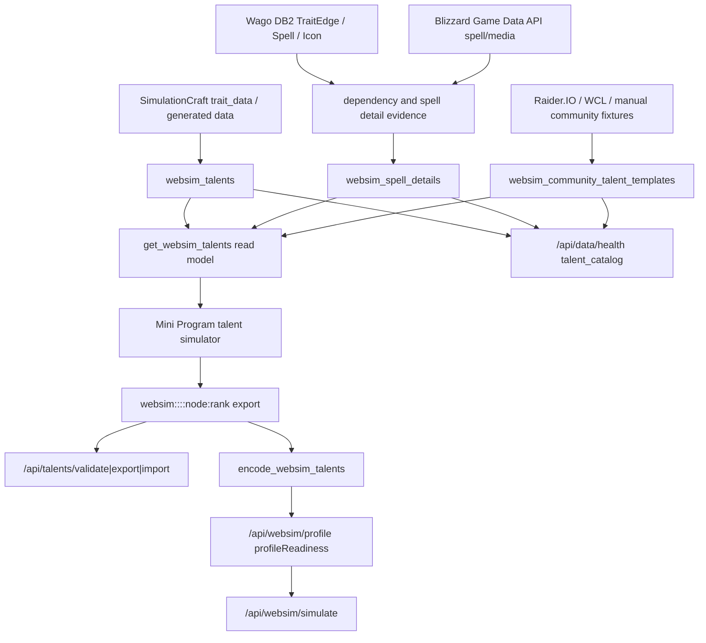

# 全职业天赋模拟全链路 Runbook

> 适用范围：`/api/websim/talents` 天赋读模型、SimC trait data、Wago trait edges、Blizzard spell/media、社区天赋模板、SQLite / PostgreSQL hybrid catalog、前端原生天赋模拟器、`/api/talents/*`、`/api/websim/profile`、`/api/websim/simulate`、health 和回滚。
> 最后更新：2026-06-29。

本文是天赋模拟器后续版本和赛季更新的执行手册。它不要求天赋侧机械复刻装备侧的 item/source/variant/mod-option 模型；天赋侧真正要对齐的是四个治理原则：后端权威读模型、证据优先、前端 consumer-only、serializer fail-closed。

## 总原则

- Backend authority：天赋树结构、父子依赖、choice 互斥、点数门槛、默认赠送点、SimC entry 编码都以后端 `websim_talents` 和 backend validator 为准。
- Read-only read model：`GET /api/websim/talents` 只能读取当前 runtime 事实，不触发社区模板同步、远端刷新或 DB 写入。`postgres_personal` 下可走 PostgreSQL cache seam，SQLite 仍是 fallback。
- Evidence-first：SimC generated trait data 是可执行编码主来源；Wago trait edges、Blizzard spell/media 和社区模板只按各自证据等级参与补充，不伪装成官方 verified。
- Frontend consumer-only：`pages/builds/talent-simulator.*` 只做交互镜像和可视化 export code，不生成 `class_talents/spec_talents/hero_talents`，不推断后端规则。
- Serializer fail-closed：`/api/websim/profile` 和 `/api/websim/simulate` 只要天赋 encoding 或装备 readiness 失败，就返回明确 blocker，不把缺天赋行的 profile 包装成 ready。
- 外部导入码保守处理：官方/第三方 import code 无法解析成 WebSim 节点时，只作为 `talents=<code>` 的 SimC-only 输入，不强行映射到可视化树。
- 全职业覆盖：任何规则或数据更新都必须覆盖 40 个职业专精和 80 个英雄树组合，失败项需要 class/spec/hero/node/reason。
- 专精身份：40 专精矩阵包含 `demonhunter/devourer`，中文主展示名为 `噬灭`；内部 key 固定使用 `devourer`。
- 不下载不写入：下载外部文件、拉取远端数据、生产 DB 写入、部署、SimC/Wago/Blizzard 刷新，都必须先取得 owner 明确批准。

## 端到端链路



关键点：

- `websim_talents` 是可视化树和 SimC encoding 的共同权威层；前端 export code 只是选中节点快照。
- `websim_spell_details` 影响展示质量和 health，不应成为 SimC encoding 的唯一硬门槛。
- 社区模板是推荐输入池，不是规则真相；导入前必须复用 `/api/talents/*` 的 backend authority。
- `/api/websim/profile` 是最终 profile readiness gate；即使 profile 字符串能拼出来，也必须暴露 `profileReadiness.simcReady=false` 和 blockers。

## 数据源与可信边界

| 来源 | 用途 | 可作为权威的条件 | 不可做的事 |
| --- | --- | --- | --- |
| SimulationCraft generated trait data | 节点、trait/entry、树类型、可执行 talent line | 当前 SimC build 可解析，class/spec/hero 归属正确，entry 可生成 `class_talents/spec_talents/hero_talents` | 不能补齐官方对账状态；不能让 fallback 节点进入 SimC-ready |
| Wago DB2 TraitEdge | 父子依赖、多父 OR/ALL、choice 和点数门槛补充 | build 与 SimC trait data 对齐，edge source 可追踪 | 不能绕过 SimC entry 编码；缺 edge 时必须暴露 rule blocker |
| Blizzard Game Data API spell/media | 法术名、描述、图标、rank tooltip、官方素材 | spell/media 与 talent spell id 对齐，locale/source 可追踪 | 没有完整官方树对账前不能把 `officialAuditStatus` 标为 verified |
| Raider.IO / WCL 社区模板 | 玩家常用 build 样本、场景标签、外部导入码 | visual loadout 可解析到当前 WebSim 节点，signature 去重，source status 可追踪 | 不能在 GET 读模型里隐式刷新；不能把 raw import code 强行映射成节点 |
| Manual fixtures | 本地开发和低风险 smoke | 显式 sync job 写入，带 source/status/checkedAt | 不能由 `/api/websim/talents` 自动 bootstrap |
| 前端交互状态 | 选择、预览、点数 UI | 仅作为待校验输入提交 | 不能作为可执行 SimC lines 或最终规则结果 |

## 核心代码入口

| 层级 | 文件 / 函数 | 职责 |
| --- | --- | --- |
| DB schema | `server/websim_payload.py::ensure_websim_tables` | 创建 `websim_talents`、`websim_spell_details`、`websim_profile_presets`、`websim_community_talent_templates`、`websim_sync_state` |
| SimC sync | `sync_simc_generated_data` | 解析 SimC generated data，写入 talent nodes、profile presets 和相关 sync state |
| Wago/Spell sync | `attach_wago_spell_icons_to_data`、spell detail upsert 链路 | 补齐法术描述、图标、tooltip 和素材来源 |
| Community sync | `sync_community_talent_templates` | 显式刷新社区模板，校验 visual loadout，写入去重 signature 和 source refs |
| Read model | `get_websim_talents` | 纯只读返回 nodes、treeSections、talentAuthority、talentReadiness、blockers、communityTemplates |
| Validator | `validate_talent_api_payload`、`export_talent_api_payload`、`import_talent_api_payload` | 复用同一套 backend authority 校验导入/导出，不信任前端裁剪状态 |
| Encoder | `encode_websim_talents` | 把已校验节点编码为 `class_talents/spec_talents/hero_talents`，fallback/unknown/overrank/choice/gate fail-closed |
| Profile gate | `build_websim_profile_response` | 合并 talent encoding 与 gear readiness，输出 `profileReadiness` |
| Health | `talent_catalog_health_payload` | 输出 catalog coverage、rule/source/readiness、official audit status、top blockers |
| API | `server/news_backend.py` | `/api/websim/talents`、`/api/talents/*`、`/api/websim/profile`、`/api/websim/simulate`、`/api/data/health` |
| Frontend | `pages/builds/talent-simulator.*` | 只做交互、预览、保存门禁和可视化模板管理 |

## Public Contract

### `GET /api/websim/talents`

必须返回：

- `nodes`
- `treeSections`
- `talentAuthority`
- `talentReadiness`
- `blockers`
- `communityTemplates`
- `communityTemplateSync`
- `talentStatus`

必须保证：

- GET 不调用 `sync_community_talent_templates`。
- GET 不写 `websim_sync_state`。
- fallback 树可展示，但 `talentReadiness.encodingReady=false`、`talentReadiness.simcReady=false`。
- `talentAuthority.diffStatus=blocked` 时，`blockers` 必须能解释阻断原因。

`talentReadiness` 维度：

| 字段 | 含义 |
| --- | --- |
| `treeReady` | class/spec/hero 三树都有 section 和节点 |
| `ruleReady` | parent、choice、point gate、granted rank 等规则字段有 backend authority |
| `spellReady` | 描述、图标、tooltip 等展示素材覆盖 |
| `encodingReady` | 当前 catalog 可生成三类 SimC talent line |
| `simcReady` | 非 fallback、三树完整、规则完整、可编码，且 authority 未 blocked |

### `/api/talents/validate|export|import`

- 必须复用 `get_websim_talents` 和 `encode_websim_talents`。
- 必须返回同源 `talentAuthority`、`talentReadiness` 和 `blockers`。
- 不接受前端传来的已裁剪状态作为可信结果。
- raw official import code 无法解析成可视化节点时，仅作为 `external` / `talents=<code>` 路径。

### `POST /api/websim/profile`

必须返回 `profileReadiness`：

- `talentReady`：`talentEncoding.status in {encoded, external}`。
- `gearReady`：装备 readiness `fullReady=true`。
- `simcReady`：`talentReady && gearReady`。
- `missingFields`：包含 `talents` / `gear`。
- `blockers`：合并 talent encoding errors 和 gear readiness warnings。

即使返回了 `profile` 字符串，只要 talent encoding 失败或 gear 不完整，也必须 `profileReadiness.simcReady=false`。

### `/api/data/health`

`talent_catalog.details` 至少暴露：

- `expectedSpecCount` / `coveredExpectedSpecCount` / `missingSpecCount`
- `expectedHeroTreeCount` / `coveredExpectedHeroTreeCount` / `missingHeroTreeCount`
- `spellDetailCoverage`
- `ruleReadiness`
- `sourceReadiness`
- `readiness`
- `officialAuditStatus=pending_official_audit`
- `topBlockers`
- `catalogContract`

## 前端门禁

`pages/builds/talent-simulator.*` 可以：

- 展示 fallback 树。
- 允许玩家预览、点选、重置和查看 export code。
- 导入可视化社区模板。

但以下状态必须禁止保存为可执行模板：

- `talentStatus === 'fallback'`
- `talentAuthority.diffStatus === 'blocked'`
- `talentReadiness.simcReady === false`
- 点数未达到对应 tree `pointCap`
- 缺少 WebSim export code

前端阻断只负责体验；最终可执行性仍由 `/api/talents/*`、`/api/websim/profile` 和 `/api/websim/simulate` 兜底。

## 只读审计

生产或本地 DB 先只读审计，不直接修：

```sql
select count(*) as talent_count
from websim_talents;

select json_extract(payload_json, '$.treeType') as tree_type, count(*)
from websim_talents
where spell_id > 0
group by tree_type
order by tree_type;

select class_key, spec_key, count(*) as node_count
from websim_talents
where spell_id > 0
group by class_key, spec_key
order by class_key, spec_key;

select count(distinct class_key || ':' || spec_key || ':' || json_extract(payload_json, '$.heroKey')) as hero_tree_count
from websim_talents
where json_extract(payload_json, '$.treeType') = 'hero';

select count(distinct t.spell_id) as talent_spell_count,
       count(distinct s.spell_id) as covered_spell_count
from websim_talents t
left join websim_spell_details s on s.spell_id = t.spell_id
where t.spell_id > 0;

select status, source_status, count(*)
from websim_community_talent_templates
group by status, source_status
order by status, source_status;
```

审计目标：

- 是否有 40 个 expected spec 覆盖，并包含 `demonhunter:devourer` / `恶魔猎手 · 噬灭`。
- 是否有 80 个 expected class/spec/hero 覆盖。
- class/spec/hero 三类 tree type 是否都有节点。
- 是否有 spell detail、description、icon 缺口。
- 社区模板是否只保留 visual loadout 可解析的可视化模板；raw import-only 模板不得强行展示为可编辑。
- `websim_sync_state` 是否和当前 runtime 事实一致；health 必须能重审事实，不只信旧快照。

## 刷新和发布顺序

任何刷新前先确认版本范围、备份路径和 owner 批准。推荐顺序：

1. 备份实际写入的 SQLite / PostgreSQL target。
2. `sync_simc_generated_data` 更新 trait data、profile presets 和 SimC build。
3. Wago/Spell detail 同步补齐 trait edge、spell text、icon。
4. 显式运行 `sync_community_talent_templates`，不得靠 GET 自动触发。
5. 只读跑 `/api/data/health`，确认 `talent_catalog.details`。
6. 抽样 `/api/websim/talents?class=mage&spec=frost&hero=spellslinger`。
7. 抽样 `/api/talents/validate`，确认 fallback/unknown/choice/gate blockers。
8. 抽样 `/api/websim/profile`，确认 `profileReadiness`。
9. 抽样 `/api/websim/simulate`，确认失败时 fail-closed，成功时有 SimC-ready profile。
10. 跑全职业矩阵测试，再部署。

## 测试矩阵

本地基础命令：

```bash
node --test tests/talent-simulator-core.test.js
node --test tests/builds-page.test.js
python3 -m unittest tests.websim_payload_test.WebSimPayloadTest.test_fallback_talent_trees_cover_every_class_and_spec tests.websim_payload_test.WebSimPayloadTest.test_talent_authority_matrix_covers_every_spec_and_hero_tree tests.websim_payload_test.WebSimPayloadTest.test_websim_talent_encoding_rejects_invalid_or_fallback_nodes tests.websim_payload_test.WebSimPayloadTest.test_websim_talent_encoding_uses_purchased_points_for_gates -v
python3 -m unittest tests.news_backend_test.NewsBackendTest.test_data_health_payload_includes_talent_catalog_component_without_syncing tests.news_backend_test.NewsBackendTest.test_data_health_payload_exposes_catalog_contract_for_core_catalogs -v
```

必须覆盖：

- `GET /api/websim/talents` 不触发 community sync 或 DB 写入。
- fallback tree 可展示但不能 encoded / simc-ready。
- unknown node、overrank、choice 冲突、parent gate、point gate 都由后端 validator 拦截。
- profile 在 talent encoding 失败时 `profileReadiness.simcReady=false`。
- 前端在 fallback / blocked / `talentReadiness.simcReady=false` 时允许预览但禁止保存。
- `/api/data/health` 输出 spec coverage、hero tree coverage、edge source coverage、spell detail coverage、preset coverage、official audit status 和 top blockers。
- 40 specs x 80 hero tree 矩阵不仅检查 payload 存在，还检查 readiness/authority。

## 回滚

代码回滚：

- 回滚 `server/websim_payload.py`、`server/news_backend.py`、`pages/builds/talent-simulator.*` 的逻辑变更。
- 重新跑 `/api/websim/talents`、`/api/talents/validate`、`/api/websim/profile` smoke。

DB 回滚：

- 使用刷新前 SQLite 备份恢复。
- 恢复后立即只读检查 `websim_talents`、`websim_spell_details`、`websim_profile_presets`、`websim_community_talent_templates` 和 `websim_sync_state`。
- 重新跑 `/api/data/health`，确认 catalog revision 和 blockers 与恢复状态一致。

事故降级：

- 如果 talent catalog 缺失或漂移，保留 fallback 树作为交互预览。
- 保存和 SimC 提交必须保持 blocked。
- 对外说明只说“天赋目录不可执行 / 需要同步 SimulationCraft 数据”，不输出任何真实玩家强结论。
